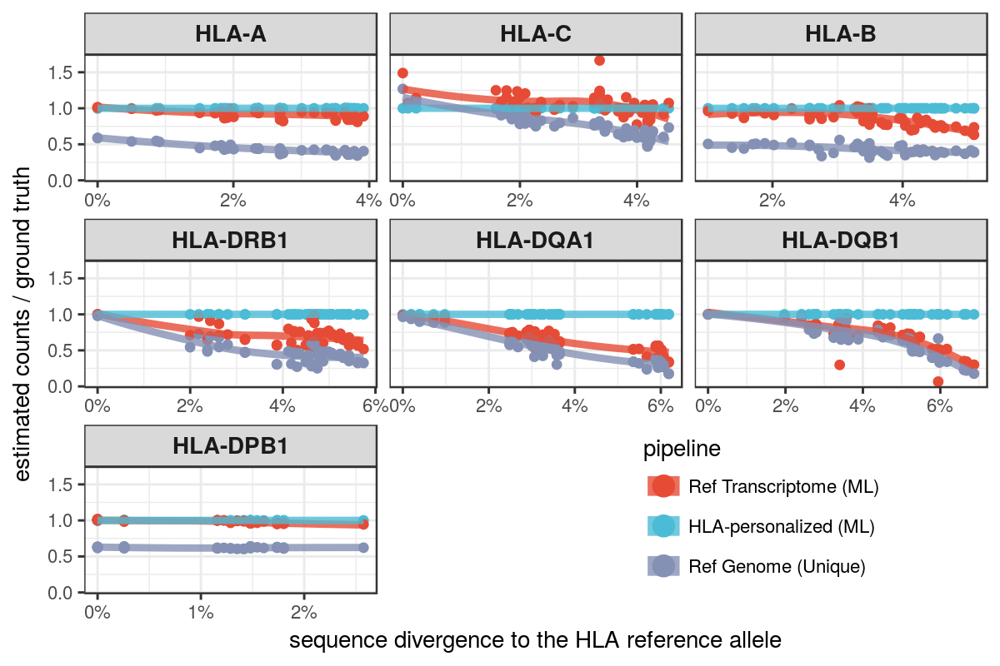
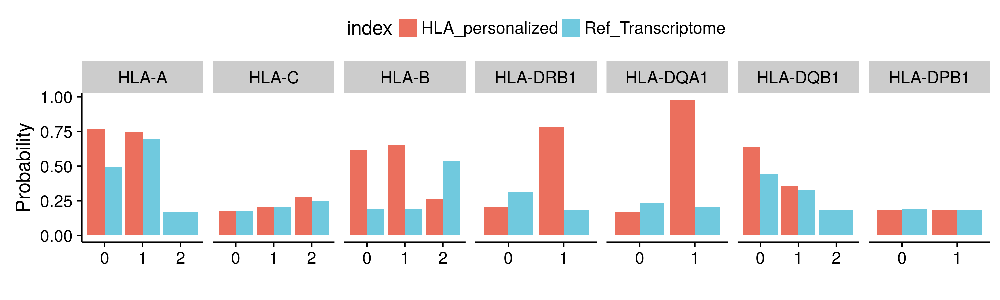

```{r setup, include=FALSE}
knitr::opts_chunk$set(echo = FALSE, message = FALSE, warning = FALSE, comment = "")
```

```{r pkgs, echo = FALSE}
library(knitr)
library(tidyverse)
```

# Methods outline

## Sample

- 358 European individuals in Geuvadis and 1000G Phase 3

## HLA-personalized pipeline

Reads mapped to the MHC region and unmapped reads are extracted from a
conventional mapping to the genome (*Extract reads*). We align these reads to
the IMGT panel (*Alignment 1*) to perform *HLA typing*. Finaly, *Alignment 2* is
performed with a personalized index to obtain the expression estimates.


```{r}
include_graphics("./method.png")
```

### Details on HLA typing

1. MHC-mapped and unmapped reads were extracted from conventional mapping.

2. These reads were mapped to the IMGT panel with STAR. Expression was estimated with Salmon.

3. The top 5 alleles were selected for further analysis. A zigosity threshold of 0.25 was applied intra-lineage, meaning that only alleles which had at least 25% of the total expression in their lineage were considered for further steps.

4. Quasi-mapping and quantification was performed for these top alleles with Salmon. In this step, a threshold of 0.15 was applied at the lineage-level, meaning that genotypes were considered heterozygous at the lineage-level if more than 1 lineage had at least 15% of the locus read counts. Lead alleles from each lineage were chosen to compose the genotype. A zigosity threshold of 0.15 was again applied to decide whether the genotype was heterozygous at the allele-level.

5. For each locus, the reads mapped to the overall lead allele were removed, and another step of quasi-mapping was performed in order to determine if the second allele was real, or just noise due to extensive similarity to the lead allele. If the second allele had at least 1% of the locus read counts, it was kept, otherwise the genotype was considered homozygous for the lead allele.

The thesholds described above were determined after evaluation of different values, and were chosen because they maximized the concordance with the Sanger sequencing typings, while also minimizing the rate of false homozygotes and heterozygotes.

### Quantification

*Alignment 2* may be performed via 2 options:

1. **Personalized**: mapping to the personalized index with STAR, quantification with Salmon *alignment mode*.

2. **Personalized\_quasi**: Quasi-mapping to the personalized index and quantification with Salmon *quasi-mapping mode*.


# Simulation

Here we compare estimates from:

1. Ref Transcriptome: Map to transcriptome with STAR, quantify with Salmon
2. Personalized: Map to personalized index with STAR, quantify with Salmon
3. Ref Genome: Map to genome and count uniquely mapped reads per gene with STAR

```{r}

```


# GEUVADIS

## Typing concordance with Gold Standard

\*Concordance: the proportion of the called alleles that are concordant with the
Gourraud et al (2014) typings.

```{r}
read_tsv("./geuvadis_reanalysis/expression/2-hla_typing/genotyping_concordance.tsv") %>%
    select(locus, accuracy) %>%
    mutate(accuracy = accuracy * 100) %>%
    rename(`accuracy (%)` = accuracy) %>%
    kable(digits = 1)
```

## Expression estimates

HLA genes with average TPM > 100.

```{r}
include_graphics("./geuvadis_reanalysis/expression/plots/expression_boxplot_pipelines.png")
```

```{r}
include_graphics("./geuvadis_reanalysis/expression/plots/tpm_distributions.png")
```


### HLA diversity vs reference transcriptome 

#### Mapping to transcriptome pipeline

Here we see higher expression for HLA-C for the reference, which may be overestimation.

```{r}
include_graphics("./geuvadis_reanalysis/expression/plots/pers_vs_ref_mapping.png")
```

#### Quasi-mapping to transcriptome pipeline

Here we see a massive read loss for the reference, except for DQB1, that shows
a pattern which is difficult to explain. It looks like the axes are swapped for 
that locus.

```{r}
include_graphics("./geuvadis_reanalysis/expression/plots/pers_vs_ref_quasi.png")
```

### Mapping vs. Pseudomapping to transcriptome

High correlation with estimated counts. Correlation drops for Class I genes with TPM estimates, possibly due to different bias correction in Salmon and kallisto.

```{r}
include_graphics("./geuvadis_reanalysis/expression/plots/comparison_pseudoalignment.png")
```

### ASE

The genotype with extreme ASE for HLA-A is not a typing error. The genotype is 
concordant with the Sanger sequencing typings.

```{r}
include_graphics("./geuvadis_reanalysis/expression/plots/ase.png")
```

### Correlation of expression

#### Drop in correlation as number of PCs increase

We need to explore why global factors affect correlation among close genes. 
Why does the correlation DQA1xDQB1 become zero? Why DRB1xDQB1 becomes negative?

```{r}
include_graphics("./geuvadis_reanalysis/expression/plots/correlation_decrease.png")
```

#### Correlation among the HLA genes (uncorrected estimates)
```{r}
include_graphics("./geuvadis_reanalysis/expression/plots/correlations.png")
```

#### Location of HLA genes within CRDs

*CRDs are defined in http://dx.doi.org/10.1101/171694* 

```{r}
include_graphics("./geuvadis_reanalysis/expression/plots/crd.png")
```

#### Correlation between Class II genes and CIITA
```{r}
include_graphics("./geuvadis_reanalysis/expression/plots/trans_activ_corrs.png")
```


## eQTLs

### PCA of genotypes

PCs 1-3 were used as covariates to account for population structure.

```{r}
include_graphics("./geuvadis_reanalysis/eqtl_mapping/plots/genotype_pca.png")
```

### Number of eGenes
```{r}
include_graphics("./geuvadis_reanalysis/eqtl_mapping/plots/n_of_egenes.png")
```

### Distribution of eQTLs around the TSS
```{r}
include_graphics("./geuvadis_reanalysis/eqtl_mapping/plots/qtls_landscape.png")
```

### Causal probabilities

**old version, waiting for analysis running on cluster to update**

```{r}

```

### HLA lineages and eQTLs
```{r}
include_graphics("./geuvadis_reanalysis/eqtl_mapping/plots/lineage_and_effects.png")
```

#### F-test: is there a difference among lineages?

##### Welch ANOVA
```{r}
read_tsv("./geuvadis_reanalysis/eqtl_mapping/f_onewaytest_lineages.tsv") %>%
    mutate(p.value = format(p.value, digits = 3)) %>%
    kable(digits = 3)
```


### Presence within Encode Elements

#### HLA-personalized pipeline
```{r}
"./geuvadis_reanalysis/eqtl_mapping/transcriptomemapping/hla_personalized/functional_features/results.tsv" %>%
    read_tsv()%>%
    kable(digits = 2)
```

#### Ref Transcriptome pipeline
```{r}
"./geuvadis_reanalysis/eqtl_mapping/transcriptomemapping/reference/functional_features/results.tsv" %>%
    read_tsv() %>%
    kable(digits = 2)
```

#### Conventional mapping

Conventional mapping seems to provide better eQTLs

```{r}
"./geuvadis_reanalysis/eqtl_mapping/genomemapping/functional_features/results.tsv" %>%
    read_tsv() %>%
    kable(digits = 2)
```


### RTC

*Variants with RTC ≥ 0.95 likely mark the same biological signal.*

#### eQTLs from HLA-personalized vs...

##### eQTLs from Reference transcriptome pipeline
```{r}
read_tsv("./geuvadis_reanalysis/eqtl_mapping/transcriptomemapping/hla_personalized/rtc/reference_qtls/results.tsv") %>%
    kable(digits = 2)
```

##### Previously reported eQTLs
```{r}
read_tsv("./geuvadis_reanalysis/eqtl_mapping/transcriptomemapping/hla_personalized/rtc/previous_qtls/results.tsv") %>%
    kable(digits = 2)
```

##### CRD-QTLs
```{r}
read_tsv("./geuvadis_reanalysis/eqtl_mapping/transcriptomemapping/hla_personalized/rtc/crd/results.tsv") %>%
    kable()
```

##### GWAS variants
```{r}
read_tsv("./geuvadis_reanalysis/eqtl_mapping/transcriptomemapping/hla_personalized/rtc/gwas/results.tsv") %>%
    kable()
```
