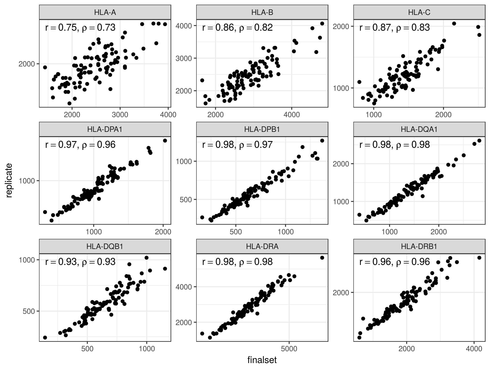
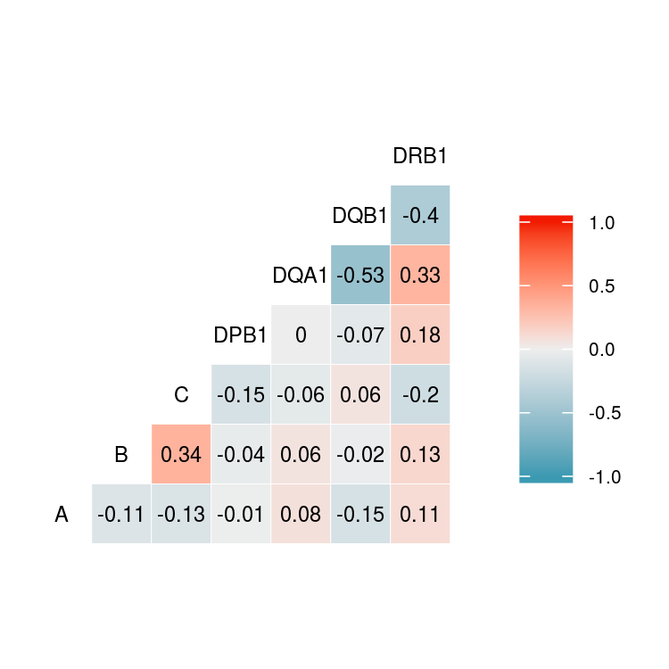

Report
================

Methods outline
===============

Sample
------

-   358 European individuals in Geuvadis and 1000G Phase 3

HLA-personalized pipeline
-------------------------

Reads mapped to the MHC region and unmapped reads are extracted from a conventional mapping to the genome (*Extract reads*). We align these reads to the IMGT panel (*Alignment 1*) to perform *HLA typing*. Finaly, *Alignment 2* is performed with a personalized index to obtain the expression estimates.

### Details on HLA typing

1.  MHC-mapped and unmapped reads were extracted from conventional mapping.

2.  These reads were mapped to the IMGT panel with STAR. Expression was estimated with Salmon.

3.  The top 5 alleles were selected for further analysis. A zigosity threshold of 0.25 was applied intra-lineage, meaning that only alleles which had at least 25% of the total expression in their lineage were considered for further steps.

4.  Quasi-mapping and quantification was performed for these top alleles with Salmon. In this step, a threshold of 0.15 was applied at the lineage-level, meaning that genotypes were considered heterozygous at the lineage-level if more than 1 lineage had at least 15% of the locus read counts. Lead alleles from each lineage were chosen to compose the genotype. A zigosity threshold of 0.15 was again applied to decide whether the genotype was heterozygous at the allele-level.

5.  For each locus, the reads mapped to the overall lead allele were removed, and another step of quasi-mapping was performed in order to determine if the second allele was real, or just noise due to extensive similarity to the lead allele. If the second allele had at least 1% of the locus read counts, it was kept, otherwise the genotype was considered homozygous for the lead allele.

The thesholds described above were determined after evaluation of different values, and were chosen because they maximized the concordance with the Sanger sequencing typings, while also minimizing the rate of false homozygotes and heterozygotes.

### Quantification

*Alignment 2* may be performed via 2 options:

1.  **Personalized**: mapping to the personalized index with STAR, quantification with Salmon *alignment mode*.

2.  **Personalized\_quasi**: Quasi-mapping to the personalized index and quantification with Salmon *quasi-mapping mode*.

Simulation
==========

Here we compare estimates from:

1.  Ref Transcriptome: Map to transcriptome with STAR, quantify with Salmon
2.  Personalized: Map to personalized index with STAR, quantify with Salmon
3.  Ref Genome: Map to genome and count uniquely mapped reads per gene with STAR

GEUVADIS
========

Typing concordance with Gold Standard
-------------------------------------

\*Concordance: the proportion of the called alleles that are concordant with the Gourraud et al (2014) typings.

| locus |  accuracy (%)|
|:------|-------------:|
| A     |          98.5|
| B     |          98.7|
| C     |          97.5|
| DQB1  |          98.5|
| DRB1  |          99.5|

Expression estimates
--------------------

HLA genes with average TPM &gt; 100.

### HLA diversity vs reference transcriptome

#### Mapping to transcriptome pipeline

Here we see higher expression for HLA-C for the reference, which may be overestimation.

#### Quasi-mapping to transcriptome pipeline

Here we see a massive read loss for the reference, except for DQB1, that shows a pattern which is difficult to explain. It looks like the axes are swapped for that locus.

### Mapping vs. Pseudomapping to transcriptome

High correlation with estimated counts. Correlation drops for Class I genes with TPM estimates, possibly due to different bias correction in Salmon and kallisto.

Replicates
----------

We assessed the correlation of expression between Geuvadis replicates for 97 European individuals.

### ASE

The genotype with extreme ASE for HLA-A is not a typing error. The genotype is concordant with the Sanger sequencing typings.

### Correlation of expression

#### Drop in correlation as number of PCs increase

We need to explore why global factors affect correlation among close genes. Why does the correlation DQA1xDQB1 become zero? Why DRB1xDQB1 becomes negative?

#### Correlation among the HLA genes (uncorrected estimates)

#### Correlation of eQTLs

Here we evaluate whether a pair of alleles within the same haplotypes are associated with eQTLs alleles in the same direction of regulation, i.e. upper-upper regulation, down-down, or upper-down.

#### Location of HLA genes within CRDs

\*CRDs are defined in <http://dx.doi.org/10.1101/171694*>

#### Correlation between Class II genes and CIITA

eQTLs
-----

### PCA of genotypes

PCs 1-3 were used as covariates to account for population structure.

### Number of eGenes

### Distribution of eQTLs around the TSS

### Causal probabilities

### HLA lineages and eQTLs

#### F-test: is there a difference among lineages?

##### Welch ANOVA

| locus    |  num.df|  denom.df|        F| p.value  |
|:---------|-------:|---------:|--------:|:---------|
| HLA-A    |      12|   111.374|   12.224| 1.75e-15 |
| HLA-B    |      14|   147.798|    9.497| 9.42e-15 |
| HLA-C    |      11|   139.796|   35.384| 4.65e-35 |
| HLA-DPB1 |       7|    62.396|    9.775| 3.71e-08 |
| HLA-DQA1 |       4|   215.272|  110.181| 6.00e-51 |
| HLA-DQB1 |       4|   257.388|   54.055| 4.95e-33 |
| HLA-DRB1 |       9|   167.674|   48.246| 4.82e-42 |

### Presence within Encode Elements

#### HLA-personalized pipeline

| locus    |  rank| rsid       |    dist| regulome\_score | tfbs                                                                                                              | dhs | histone\_marks                                                    |
|:---------|-----:|:-----------|-------:|:----------------|:------------------------------------------------------------------------------------------------------------------|:----|:------------------------------------------------------------------|
| HLA-A    |     0| rs3823342  |    0.00| 4               | POL2-4/POL2                                                                                                       | NA  | H3k27ac/H3k9ac/H3k4me2/H3k4me3/H3k79me2/H4k20me1/H3k36me3         |
| HLA-A    |     1| rs1655924  |   -3.92| 6               | NA                                                                                                                | NA  | NA                                                                |
| HLA-B    |     0| rs1265081  |  209.97| 7               | NA                                                                                                                | NA  | H3k36me3                                                          |
| HLA-B    |     1| rs9380240  |   52.82| 4               | NA                                                                                                                | NA  | H3k27me3                                                          |
| HLA-B    |     2| rs2523616  |    1.09| 3a              | POL2-4/MTA3/STAT5/BCL3/POL2                                                                                       | NA  | H4k20me1/H3k4me1/H3k36me3/H3k4me2/H3k79me2                        |
| HLA-C    |     0| rs41561715 |    0.00| 4               | POL2-4                                                                                                            | NA  | H4k20me1/H3k36me3/H3k4me3/H3k4me2/H3k79me2/H3k4me1/H3k9ac/H3k27ac |
| HLA-C    |     1| rs12199223 |   -2.82| 6               | NA                                                                                                                | NA  | NA                                                                |
| HLA-C    |     2| rs2074491  |    0.00| 4               | POL2-4/NRSF/BCL11A/TCF3/TCF12/MXI1/EBF1/POU2F2/TBP/TAF1/POL2/NF-YA/CHD2/BHLHE40/CFOS/RFX5/NFKB/NF-YB/IRF4/PU1/SP1 | DHS | H3k4me3/H3k4me2/H3k79me2/H3k9ac/H3k27ac/H2az/H3k4me1              |
| HLA-DPB1 |     0| rs9277449  |    0.00| 7               | NA                                                                                                                | NA  | H3k36me3                                                          |
| HLA-DPB1 |     1| rs9296068  |  -55.01| 6               | NA                                                                                                                | NA  | H3k4me1/H2az                                                      |
| HLA-DQA1 |     0| rs75170544 |  -82.67| 7               | NA                                                                                                                | NA  | NA                                                                |
| HLA-DQA1 |     1| rs9271375  |   -8.89| 7               | NA                                                                                                                | NA  | H3k9me3                                                           |
| HLA-DQB1 |     0| rs9274688  |   -0.74| 5               | POL2-4                                                                                                            | NA  | H3k79me2/H3k4me2/H3k4me3/H3k27ac/H3k9ac/H3k4me1                   |
| HLA-DQB1 |     1| rs3134978  |  -15.32| 7               | NA                                                                                                                | NA  | NA                                                                |
| HLA-DRB1 |     0| rs9271108  |  -19.01| 6               | NA                                                                                                                | NA  | H3k27ac/H3k4me1/H3k4me2/H3k9ac/H3k4me3/H3k79me2/H2az              |
| HLA-DRB1 |     1| rs9271377  |  -29.54| 6               | NA                                                                                                                | NA  | H3k9me3                                                           |

#### Ref Transcriptome pipeline

| locus    |  rank| rsid       |    dist| tfbs   | dhs | histone\_marks                                   |
|:---------|-----:|:-----------|-------:|:-------|:----|:-------------------------------------------------|
| HLA-A    |     0| rs2975044  |    4.01| NA     | DHS | NA                                               |
| HLA-A    |     1| rs1111180  |  156.32| NA     | NA  | H3k27me3/H3k4me1/H3k4me2/H2az/H3k4me3            |
| HLA-A    |     2| rs9259835  |  -13.37| NA     | NA  | H3k4me2/H3k4me3/H2az                             |
| HLA-B    |     0| rs1265159  |  181.60| NA     | NA  | NA                                               |
| HLA-B    |     1| rs72443738 |   47.99| NA     | NA  | NA                                               |
| HLA-B    |     2| rs2844623  |   89.11| NA     | NA  | NA                                               |
| HLA-C    |     0| rs67394384 |   -6.77| NA     | NA  | NA                                               |
| HLA-C    |     1| rs28397289 |   39.12| NA     | NA  | NA                                               |
| HLA-C    |     2| rs9264185  |   16.55| NA     | NA  | NA                                               |
| HLA-DPB1 |     0| rs9277449  |    0.00| NA     | NA  | H3k36me3                                         |
| HLA-DPB1 |     1| rs9296068  |  -55.01| NA     | NA  | H3k4me1/H2az                                     |
| HLA-DQA1 |     0| rs35675330 |  -41.30| CHD1   | DHS | H3k79me2/H3k9ac/H3k4me2/H3k4me3/H3k27ac/H3k36me3 |
| HLA-DQA1 |     1| rs9275553  |   62.15| NA     | NA  | NA                                               |
| HLA-DQB1 |     0| rs9273595  |    0.00| POL2-4 | DHS | H3k4me1/H3k27ac/H3k4me2/H3k36me3/H3k79me2        |
| HLA-DQB1 |     1| rs1064173  |    0.00| POL2-4 | NA  | H3k4me1/H3k27ac/H3k4me2/H3k36me3/H3k79me2        |
| HLA-DQB1 |     2| rs9274712  |   -1.14| POL2-4 | NA  | H3k79me2/H3k27ac/H3k9ac/H3k4me1                  |
| HLA-DRB1 |     0| rs9269749  |    0.00| NA     | NA  | H3k36me3                                         |
| HLA-DRB1 |     1| rs9271365  |  -29.17| NA     | NA  | H3k9me3                                          |

#### Conventional mapping

Conventional mapping seems to provide better eQTLs

| locus    |  rank| rsid        |     dist| regulome\_score | tfbs                                                                                                              | dhs | histone\_marks                                       |
|:---------|-----:|:------------|--------:|:----------------|:------------------------------------------------------------------------------------------------------------------|:----|:-----------------------------------------------------|
| HLA-A    |     0| rs2523764   |   -91.42| 2b              | NA                                                                                                                | NA  | NA                                                   |
| HLA-A    |     1| rs2975046   |     1.49| 1f              | POL2-4/NFATC1/BCL3                                                                                                | NA  | H4k20me1/H3k36me3                                    |
| HLA-A    |     2| rs9259825   |   -14.19| 2b              | POL2-4/SIN3A/IRF4/POU2F2                                                                                          | DHS | H3k4me2/H3k4me3/H3k79me2/H2az/H3k9ac/H3k27ac         |
| HLA-B    |     0| rs2853926   |    58.60| 6               | NA                                                                                                                | NA  | NA                                                   |
| HLA-B    |     1| rs1265109   |   202.06| 6               | NA                                                                                                                | NA  | NA                                                   |
| HLA-B    |     2| rs36057735  |     1.73| 4               | POL2-4/NFATC1/MTA3/POL2/NFIC                                                                                      | NA  | H4k20me1/H3k4me1/H3k36me3                            |
| HLA-C    |     0| rs4947308   |   -62.38| 6               | NA                                                                                                                | NA  | H3k9me3                                              |
| HLA-C    |     1| rs2074491   |     0.00| 4               | POL2-4/NRSF/BCL11A/TCF3/TCF12/MXI1/EBF1/POU2F2/TBP/TAF1/POL2/NF-YA/CHD2/BHLHE40/CFOS/RFX5/NFKB/NF-YB/IRF4/PU1/SP1 | DHS | H3k4me3/H3k4me2/H3k79me2/H3k9ac/H3k27ac/H2az/H3k4me1 |
| HLA-C    |     2| rs1064627   |   537.99| 1f              | STAT3                                                                                                             | NA  | H3k36me3/H3k4me2                                     |
| HLA-C    |     3| rs9501587   |  -107.03| 6               | NA                                                                                                                | NA  | H3k27me3                                             |
| HLA-DPB1 |     0| rs9277538   |     0.07| 4               | NA                                                                                                                | NA  | NA                                                   |
| HLA-DPB1 |     1| rs9296068   |   -55.01| 6               | NA                                                                                                                | NA  | H3k4me1/H2az                                         |
| HLA-DPB1 |     2| rs688209    |   645.40| 4               | NA                                                                                                                | NA  | NA                                                   |
| HLA-DQA1 |     0| rs9270521   |   -36.43| 6               | NA                                                                                                                | NA  | NA                                                   |
| HLA-DQA1 |     1| rs3129758   |   -11.33| 5               | NA                                                                                                                | NA  | H3k9me3                                              |
| HLA-DQB1 |     0| rs1770      |     0.00| 1f              | POL2-4/CHD2/TBP/TAF1/EBF1/ELF1/TCF12/POL2                                                                         | DHS | H3k4me1/H3k27ac/H3k4me2/H3k36me3/H3k79me2            |
| HLA-DQB1 |     1| rs9274622   |     0.00| 1f              | POL2-4/IKZF1/AFT2                                                                                                 | NA  | H3k79me2/H3k4me2/H3k4me3/H3k27ac/H3k9ac/H2az/H3k4me1 |
| HLA-DQB1 |     2| rs28891461  |    -5.86| 7               | NA                                                                                                                | NA  | NA                                                   |
| HLA-DQB1 |     3| rs116102092 |    88.57| 6               | NA                                                                                                                | NA  | NA                                                   |
| HLA-DQB1 |     4| rs139547197 |  -408.00| 4               | POL2-4/MTA3                                                                                                       | NA  | H3k79me2/H3k4me3/H3k4me2/H3k9ac/H3k27ac/H2az         |
| HLA-DRB1 |     0| rs73729140  |     0.00| 6               | NA                                                                                                                | NA  | NA                                                   |
| HLA-DRB1 |     1| rs28383307  |   -29.13| 7               | NA                                                                                                                | NA  | H3k9me3                                              |

### RTC

*Variants with RTC ≥ 0.95 likely mark the same biological signal.*

#### eQTLs from HLA-personalized vs...

##### eQTLs from Reference transcriptome pipeline

| gene     | variant\_personalized |  rank\_personalized| variant\_ref |  rank\_ref|  d\_prime|   rtc|
|:---------|:----------------------|-------------------:|:-------------|----------:|---------:|-----:|
| HLA-A    | rs3823342             |                   0| rs2975044    |          0|      1.00|  1.00|
| HLA-A    | rs1655924             |                   1| rs1111180    |          1|      0.91|  0.99|
| HLA-C    | rs41561715            |                   0| rs67394384   |          0|      0.99|  0.99|
| HLA-C    | rs12199223            |                   1| rs9264185    |          2|      1.00|  0.98|
| HLA-C    | rs2074491             |                   2| rs28397289   |          1|      0.95|  0.99|
| HLA-B    | rs1265081             |                   0| rs1265159    |          0|      0.99|  0.97|
| HLA-B    | rs9380240             |                   1| rs1265159    |          0|      0.92|  0.95|
| HLA-B    | rs2523616             |                   2| rs72443738   |          1|      0.06|  0.42|
| HLA-DRB1 | rs9271108             |                   0| rs9271365    |          1|      0.96|  0.77|
| HLA-DRB1 | rs9271377             |                   1| rs9269749    |          0|      0.31|  0.72|
| HLA-DQA1 | rs75170544            |                   0| rs35675330   |          0|      0.62|  0.98|
| HLA-DQA1 | rs9271375             |                   1| rs35675330   |          0|      0.21|  0.24|
| HLA-DQB1 | rs9274688             |                   0| rs9274712    |          2|      0.93|  1.00|
| HLA-DQB1 | rs3134978             |                   1| rs9273595    |          0|      0.96|  0.99|
| HLA-DPB1 | rs9277449             |                   0| rs9277449    |          0|      1.00|  1.00|
| HLA-DPB1 | rs9296068             |                   1| rs9296068    |          1|      1.00|  1.00|

##### Previously reported eQTLs

| gene     |  rank| rsid       | qtl\_previous |  d\_prime|   rtc| study\_pval                                                 |
|:---------|-----:|:-----------|:--------------|---------:|-----:|:------------------------------------------------------------|
| HLA-A    |     0| rs3823342  | rs3823342     |      1.00|  1.00| geuvadis\_exon (82.9)                                       |
| HLA-A    |     1| rs1655924  | rs1655924     |      1.00|  1.00| geuvadis\_gene (16.1)/geuvadis\_exon (38.5)                 |
| HLA-C    |     0| rs41561715 | rs41561715    |      1.00|  1.00| geuvadis\_gene (31.9)/geuvadis\_exon (37.2)                 |
| HLA-C    |     1| rs12199223 | rs12199223    |      1.00|  1.00| geuvadis\_exon (6.8)                                        |
| HLA-C    |     2| rs2074491  | rs2074491     |      1.00|  1.00| geuvadis\_exon (26.3)/gtex\_v7 (8.5)                        |
| HLA-B    |     0| rs1265081  | rs1265081     |      1.00|  1.00| geuvadis\_exon (15.2)                                       |
| HLA-B    |     1| rs9380240  | rs9380240     |      1.00|  1.00| geuvadis\_gene (6.2)/geuvadis\_exon (24.8)                  |
| HLA-B    |     2| rs2523616  | rs2523616     |      1.00|  1.00| geuvadis\_exon (41.5)                                       |
| HLA-DRB1 |     0| rs9271108  | rs9271108     |      1.00|  1.00| geuvadis\_exon (80.1)                                       |
| HLA-DRB1 |     1| rs9271377  | rs9271377     |      1.00|  1.00| geuvadis\_gene (9.8)/geuvadis\_exon (13.8)/gtex\_v7 (6.4)   |
| HLA-DQA1 |     0| rs75170544 | rs75170544    |      1.00|  1.00| geuvadis\_gene (28.4)/geuvadis\_exon (48.3)/gtex\_v7 (17.3) |
| HLA-DQA1 |     1| rs9271375  | rs9271375     |      1.00|  1.00| geuvadis\_exon (13.4)                                       |
| HLA-DQB1 |     0| rs9274688  | rs9274688     |      1.00|  1.00| geuvadis\_gene (28.3)/geuvadis\_exon (54)                   |
| HLA-DQB1 |     1| rs3134978  | rs3134978     |      1.00|  1.00| geuvadis\_gene (11)/geuvadis\_exon (5.9)                    |
| HLA-DPB1 |     0| rs9277449  | rs9277538     |      0.99|  1.00| geuvadis\_exon (57.9)                                       |
| HLA-DPB1 |     1| rs9296068  | rs112540072   |      0.57|  0.98| NA (NA)                                                     |

##### Previous top eQTLs

| gene     |  rank| qtl\_personalized | qtl\_previous |  d\_prime|   rtc| study                                          |
|:---------|-----:|:------------------|:--------------|---------:|-----:|:-----------------------------------------------|
| HLA-A    |     0| rs3823342         | rs9260036     |      1.00|  0.98| geuvadis\_exon (124.48)                        |
| HLA-A    |     1| rs1655924         | rs2734971     |      0.86|  1.00| geuvadis\_gene (19.4)                          |
| HLA-A    |     1| rs1655924         | rs1111180     |      0.91|  0.99| gtex\_v7 (9.59)                                |
| HLA-C    |     0| rs41561715        | rs9265628     |      0.90|  0.96| geuvadis\_gene (34.33)                         |
| HLA-C    |     1| rs12199223        | rs2395471     |      1.00|  0.94| vince2017 (NA)                                 |
| HLA-C    |     2| rs2074491         | rs9264666     |      1.00|  0.84| delaneau2018 (48.2)                            |
| HLA-B    |     0| rs1265081         | rs9266207     |      0.26|  0.58| geuvadis\_exon (74.3)                          |
| HLA-B    |     1| rs9380240         | rs9266216     |      0.89|  0.96| geuvadis\_gene (13.08)                         |
| HLA-B    |     2| rs2523616         | rs2523598     |      0.80|  0.94| delaneau2018 (23.93)                           |
| HLA-DRB1 |     0| rs9271108         | rs35399335    |      0.95|  0.60| delaneau2018 (35.94)                           |
| HLA-DRB1 |     1| rs9271377         | rs9271593     |      0.45|  0.83| xl9\_raj2016 (NA)                              |
| HLA-DQA1 |     0| rs75170544        | rs9274660     |      0.72|  0.82| geuvadis\_gene (55.76)/geuvadis\_exon (111.8)  |
| HLA-DQA1 |     1| rs9271375         | rs9274660     |      0.67|  0.87| geuvadis\_gene (55.76)/geuvadis\_exon (111.8)  |
| HLA-DQB1 |     0| rs9274688         | rs9274660     |      1.00|  0.93| geuvadis\_gene (60.56)/geuvadis\_exon (102.51) |
| HLA-DQB1 |     1| rs3134978         | rs9271593     |      1.00|  0.84| xl9\_raj2016 (NA)                              |
| HLA-DPB1 |     0| rs9277449         | rs3128964     |      1.00|  0.99| geuvadis\_exon (59.86)                         |
| HLA-DPB1 |     1| rs9296068         | rs34885310    |      0.96|  0.94| delaneau2018 (3.71)                            |

##### CRD-QTLs

| gene     | variant    |  rank| crd\_var  |  d\_prime|       rtc| info                           |
|:---------|:-----------|-----:|:----------|---------:|---------:|:-------------------------------|
| HLA-A    | rs3823342  |     0| rs1611324 |  1.000000|  0.980763| CRDactiv:chr6\_internal\_20803 |
| HLA-A    | rs1655924  |     1| rs9260092 |  0.619061|  0.810493| CRDactiv:chr6\_internal\_22883 |
| HLA-C    | rs41561715 |     0| rs2249742 |  1.000000|  0.840334| CRDactiv:chr6\_internal\_25274 |
| HLA-C    | rs12199223 |     1| rs2249742 |  1.000000|  0.767684| CRDactiv:chr6\_internal\_25274 |
| HLA-C    | rs2074491  |     2| rs2428516 |  0.723967|  0.838652| CRDactiv:chr6\_internal\_26296 |
| HLA-B    | rs1265081  |     0| rs2428516 |  0.868382|  0.989879| CRDactiv:chr6\_internal\_26296 |
| HLA-B    | rs9380240  |     1| rs2524080 |  0.756405|  0.757833| CRDactiv:chr6\_internal\_23085 |
| HLA-B    | rs2523616  |     2| rs9265517 |  0.825823|  0.990560| CRDactiv:chr6\_internal\_22007 |
| HLA-DRB1 | rs9271108  |     0| rs2395517 |  0.974490|  0.913385| CRDactiv:chr6\_internal\_27324 |
| HLA-DRB1 | rs9271377  |     1| rs9272214 |  0.961031|  0.982593| CRDactiv:chr6\_internal\_29568 |
| HLA-DQA1 | rs75170544 |     0| rs9272214 |  0.564117|  0.854636| CRDactiv:chr6\_internal\_29568 |
| HLA-DQA1 | rs9271375  |     1| rs3104412 |  0.718277|  0.999438| CRDactiv:chr6\_internal\_28837 |
| HLA-DQB1 | rs9274688  |     0| rs9272779 |  0.327068|  0.627641| CRDactiv:chr6\_internal\_19083 |
| HLA-DQB1 | rs3134978  |     1| rs9272779 |  0.975739|  0.911560| CRDactiv:chr6\_internal\_19083 |
| HLA-DPB1 | rs9277449  |     0| rs9277630 |  0.843641|  0.139647| CRDactiv:chr6\_internal\_24649 |
| HLA-DPB1 | rs9296068  |     1| rs6935846 |  0.963111|  0.985401| CRDactiv:chr6\_internal\_24851 |

##### GWAS variants

| gene     |  rank| variant    | trait (GWAS variant)                                                                                                                                                                                                                                                                                                                                                                                                                                                                                                                                                                                                                                                                                                                                                                                                                                                                                                                                                                                                                                                                    |
|:---------|-----:|:-----------|:----------------------------------------------------------------------------------------------------------------------------------------------------------------------------------------------------------------------------------------------------------------------------------------------------------------------------------------------------------------------------------------------------------------------------------------------------------------------------------------------------------------------------------------------------------------------------------------------------------------------------------------------------------------------------------------------------------------------------------------------------------------------------------------------------------------------------------------------------------------------------------------------------------------------------------------------------------------------------------------------------------------------------------------------------------------------------------------|
| HLA-A    |     0| rs3823342  | age at menarche (rs16896742); beta-2 microglobulin measurement (rs9260489); IGA glomerulonephritis (rs2523946); multiple sclerosis (rs2523393, rs9260489); nasopharyngeal neoplasm (rs2517713)                                                                                                                                                                                                                                                                                                                                                                                                                                                                                                                                                                                                                                                                                                                                                                                                                                                                                          |
| HLA-A    |     1| rs1655924  | NA (NA)                                                                                                                                                                                                                                                                                                                                                                                                                                                                                                                                                                                                                                                                                                                                                                                                                                                                                                                                                                                                                                                                                 |
| HLA-B    |     0| rs1265081  | hypothyroidism (rs2517532); lymphocyte count (rs2524079); membranous glomerulonephritis (rs1265159, rs3096697); multiple myeloma (rs2285803); neoplasm of mature B-cells (rs6457327); response to reverse transcriptase inhibitor (rs1265112); systemic scleroderma (rs3130573); ulcerative colitis (rs9263739)                                                                                                                                                                                                                                                                                                                                                                                                                                                                                                                                                                                                                                                                                                                                                                         |
| HLA-B    |     1| rs9380240  | Vitiligo (rs9468925)                                                                                                                                                                                                                                                                                                                                                                                                                                                                                                                                                                                                                                                                                                                                                                                                                                                                                                                                                                                                                                                                    |
| HLA-B    |     2| rs2523616  | serum IgE measurement (rs3130941)                                                                                                                                                                                                                                                                                                                                                                                                                                                                                                                                                                                                                                                                                                                                                                                                                                                                                                                                                                                                                                                       |
| HLA-C    |     0| rs41561715 | body height (rs1265097)                                                                                                                                                                                                                                                                                                                                                                                                                                                                                                                                                                                                                                                                                                                                                                                                                                                                                                                                                                                                                                                                 |
| HLA-C    |     1| rs12199223 | chronic hepatitis B infection (rs2853953); cutaneous psoriasis measurement, psoriasis (rs10484554); membranous glomerulonephritis (rs1265159); nasopharyngeal neoplasm (rs2894207); psoriasis (rs1265181, rs12191877, rs10484554); psoriasis vulgaris (rs4406273); psoriatic arthritis (rs13191343, rs12191877); response to reverse transcriptase inhibitor (rs1265112); systemic scleroderma (rs3130573)                                                                                                                                                                                                                                                                                                                                                                                                                                                                                                                                                                                                                                                                              |
| HLA-C    |     2| rs2074491  | chronic obstructive pulmonary disease, surfactant protein D measurement (rs2074488)                                                                                                                                                                                                                                                                                                                                                                                                                                                                                                                                                                                                                                                                                                                                                                                                                                                                                                                                                                                                     |
| HLA-DPB1 |     0| rs9277449  | NA (NA)                                                                                                                                                                                                                                                                                                                                                                                                                                                                                                                                                                                                                                                                                                                                                                                                                                                                                                                                                                                                                                                                                 |
| HLA-DPB1 |     1| rs9296068  | NA (NA)                                                                                                                                                                                                                                                                                                                                                                                                                                                                                                                                                                                                                                                                                                                                                                                                                                                                                                                                                                                                                                                                                 |
| HLA-DQA1 |     0| rs75170544 | antibody measurement, Epstein-Barr virus infection (rs477515); antinuclear antibody measurement (rs2395185); Cystic fibrosis, lung disease severity measurement (rs9268947); Hodgkins lymphoma (rs2395185); inflammatory bowel disease (rs477515); lung carcinoma (rs2395185); lymphoma (rs9268853); NA (rs9268923); response to vaccine (rs477515); ulcerative colitis (rs9268853, rs9268923, rs2395185); Vogt-Koyanagi-Harada disease (rs9268838); NA (rs2516049)                                                                                                                                                                                                                                                                                                                                                                                                                                                                                                                                                                                                                     |
| HLA-DQA1 |     1| rs9271375  | Alzheimers disease (rs9271192); Crohn's disease (rs9271060); leprosy (rs9271100); multiple sclerosis (rs3135338); multiple sclerosis, oligoclonal band measurement (rs3828840); systemic lupus erythematosus (rs9271100); type I diabetes mellitus (rs9268645); ulcerative colitis (rs9271100)                                                                                                                                                                                                                                                                                                                                                                                                                                                                                                                                                                                                                                                                                                                                                                                          |
| HLA-DQB1 |     0| rs9274688  | lymphoma (rs2647045); ulcerative colitis (rs6927022)                                                                                                                                                                                                                                                                                                                                                                                                                                                                                                                                                                                                                                                                                                                                                                                                                                                                                                                                                                                                                                    |
| HLA-DQB1 |     1| rs3134978  | antibody measurement, Epstein-Barr virus infection (rs2854275); asthma (rs3129943); autoimmune hepatits type 1 (rs2187668); autoimmune thyroid disease, type I diabetes mellitus (rs1270942, rs1980493); cancer, response to pazopanib, serum alanine aminotransferase measurement (rs1800625); celiac disease (rs2187668); chronic lymphocytic leukemia (rs674313, rs9273363); complement C4 measurement (rs2071278); Crohn's disease (rs9273363); cutaneous lupus erythematosus (rs9267531, rs2187668); inflammatory bowel disease (rs9273363); leprosy (rs602875); membranous glomerulonephritis (rs3130618, rs389884, rs7775397, rs3129939, rs1980493, rs2187668, rs1480380); multiple sclerosis (rs2040406); protein measurement (rs2187668); rheumatoid arthritis (rs558702, rs615672); schizophrenia (rs622076, rs3131296, rs9274623, rs73396800); systemic lupus erythematosus (rs3131379, rs1270942, rs1150757, rs1150754, rs1150753, rs2187668, rs3129716, rs3957147); systemic scleroderma (rs3129763); type I diabetes mellitus (rs2647044); ulcerative colitis (rs9273363) |
| HLA-DRB1 |     0| rs9271108  | Alzheimers disease (rs9271192); Crohn's disease (rs9271060); leprosy (rs9271100); multiple sclerosis, oligoclonal band measurement (rs3828840); narcolepsy with cataplexy (rs9271117); systemic lupus erythematosus (rs9271100); ulcerative colitis (rs9271100, rs9271209)                                                                                                                                                                                                                                                                                                                                                                                                                                                                                                                                                                                                                                                                                                                                                                                                              |
| HLA-DRB1 |     1| rs9271377  | chronic lymphocytic leukemia (rs674313); hepatocellular carcinoma (rs9272105); leprosy (rs602875); multiple sclerosis (rs2040406); response to interferon beta (rs9272105); rheumatoid arthritis (rs13192471); squamous cell carcinoma (rs4455710); systemic scleroderma (rs3129763); Vogt-Koyanagi-Harada disease (rs3021304)                                                                                                                                                                                                                                                                                                                                                                                                                                                                                                                                                                                                                                                                                                                                                          |
