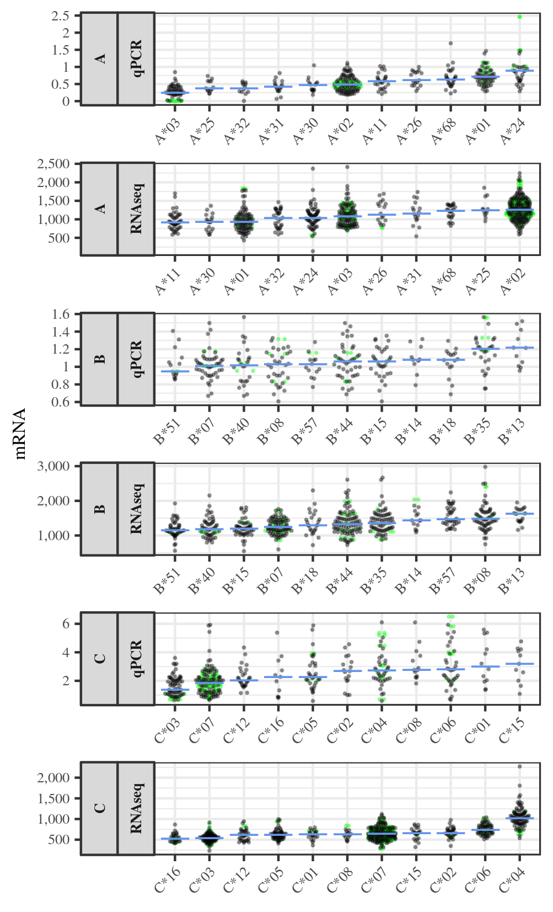

Comparison with previous qPCR findings
================

Introduction
------------

Existing qPCR findings for HLA expression and its association with regulatory SNPs and diseases provide an important reference for any study on HLA expression. Many researchers in the field consider qPCR as a golden standard for HLA expression. Here, because of the indisputable importance of placing our novel findings in the context of well established functional studies, we provide a comparison with previous qPCR studies. Of course, this comparison has limitations: when comparing across studies we often are dealing with different individuals, cell types, and techniques. Thus, our efforts to compare our RNA-seq findings to those of published papers using qPCR are at best a first approximation.

In our review of the qPCR literature on HLA expression, we found it difficult to compare results across studies because qPCR data are usually not comparable among different HLA loci, due to the different experimental techniques which are developed for each locus.

Regarding allele-level estimates, they are not obtained directly with qPCR. Although some efforts have been made to develop allele-specific primers (Pan et al, 2018), to our knowledge, these have not yet been validated and used to obtain expression levels. Allele-based expression levels from qPCR (e.g., Kulkarni et al, 2011; Ramsuram et al, 2015; Ramsuram et al, 2017) are usually imputed from the locus-level expression levels (in the graphs included in those papers, locus-level expression is plotted twice, one point for each allele). Attempts have been made to improve the imputation with the use of a linear model of expression~genotype (e.g., Ramsuram et al, 2015). Besides the technical and biological differences between studies, the imputed nature of allele-level estimates from qPCR makes us not not surprised that many differences will emerge when we compare our RNA-seq data with qPCR data at the HLA-allele level.

Methods
-------

### Data

qPCR datasets used in papers such as [Ramsuram et al, HMG, 2015](https://doi.org/10.1093/hmg/ddv158), [Ramsuram et al, JI, 2017](http://www.jimmunol.org/content/198/6/2320), and [Kulkarni et al, PNAS, 2013](https://doi.org/10.1073/pnas.1312237110), were obtained from Dr. Mary Carrington by personal communication.

### Comparison of expression levels between qPCR and RNAseq

Because we cannot directly compare expression levels for different individuals and tissues (for example, to calculate a correlation), we chose to compare the ordering of HLA alleles given their expression levels. Because this ordering is affected by the sample sizes of each allele and the degree of differentiation among alleles, we performed a comparison of our data (HLApers on GEUVADIS) with those in qPCR-based studies only for pairs of alleles with *N* ≥ 10, and with statistically different distributions of expression values according to a pairwise Mann-Whitney U test with FDR correction for multiple testing, as available in the R statistical environment.

### Association of expression with SNPs and diseases

Existing qPCR findings for the association of SNPs and HLA expression provide an important reference for any study on HLA expression.

In our Table S3, we assessed the degree of independence of the eQTLs we mapped in respect to previously reported regulatory SNPs, including those from qPCR studies, but there we showed results for the best association for each eQTL only. Here we use that same analysis, and dedicate more space for a comparison with previous SNPs with some validation support (Kulkarni et al, 2011; Petersdorf et al, 2015; Vince et al, 2016; Raj et al, 2016; Ou et al, 2018). We evaluate independence in terms of D', *r*2 and RTC score.

Results
-------

### Comparison of allelic ordering across studies

A visual inspection of the allelic ordering allows us to compare qPCR and RNA-seq, and shows a moderate to low concordance (Figure 1).

 Figure 1: Allele-level expression in previous qPCR studies and RNA-seq (HLApers) for HLA-A, -B and -C. We included only lineages present in at least 5 individuals, and those which were present both in GEUVADIS and in the qPCR data. Y-axis: Transcript per Million for RNA-seq, and 2^-∆∆Ct for qPCR.

However, this simple comparison can be misleading, because the orderings are affected by the sample sizes of each allele and the degree of differentiation among them (e.g., when we randomly remove few individuals some orderings change, data not shown).

Therefore, we chose to compare only pairs of alleles which are statistically different in both qPCR and RNA-seq. We selected all significant pairs in the qPCR dataset, we checked their status in the RNA-seq dataset. We then calculated the number of pairs with the same or different ordering in qPCR and RNAseq.

Table 1: Number of significant allelic pairs (n\_significant), and amount of significant pairs with the same ordering in qPCR and RNA-seq (same\_dir) for HLA-A, -B and -C.

| locus |  same\_dir|  n\_significant|
|:------|----------:|---------------:|
| A     |          4|              14|
| B     |          3|               4|
| C     |         13|              13|

This showed us that, overall for HLA-A, -B and -C, 20 allele pairs out of 31 tested have the same ordering in our study and in previous studies. For HLA-C, 100% of the pairs had the same ordering. For HLA-B, we have 75% (3/4) of concordance, but there is a low number of significant different pairs, which can be explained by the low differentiation of expression levels among HLA-B alleles in the qPCR data (6 pairs out of 55 were significant, whereas RNA-seq had 29). At HLA-A, the ordering in qPCR and RNA-seq was concordant in only 28% (4/14) of the pairs. This may reflect a difficulty in qPCR methods for estimating allele-level expression for HLA-A. For example, in the data which we used (Ramsuram et al, 2015) all homozygotes for A\*03 had expression close to zero.

This results highlight the extreme difficulty in comparing between tissues and populations, and with methods which do not even directly measure the expression of an HLA allele, such as qPCR.

### Independence regarding previous regulatory SNPs with validation support.

The eQTLs we mapped for HLA-C is very highly correlated at the haplotypic level with variants described by Kulkarni et al (2011) and Vince et al (2016) (0.97 ≤ D’ ≤ 1). Because the minor allele frequencies of our variants are lower than those in the previous studies, variation at our SNP is nested within that of the previously validated SNPs, i.e. the allele present in our SNPs predict the allele in the previous SNP, but the opposite is not true. The RTC test suggest that accounting for the previously validated SNP does not erase the signal represented by our SNPs, which means that, although there are strong haplotypic association, our SNPs seem to be driving the biological signal in our sample. For HLA-DP we also found strong association, both in terms of D’ and r^2, for our SNPs and those previously validated for HLA-DPB1 (Petersdorf et al, 2015) and HLA-DPA1 (Ou et al, 2018). However, the RTC test suggest that, although the allele in one SNP predicts the allele in previously validated SNP, accounting for the previous SNP does not remove the signal of the SNP we mapped.

Table 2: Relationship between our eQTLs and previous SNPs with validation support. r2: r-squared; AF: allele frequency; pval (validated SNP): the backward pass p-value from QTLtools for the validated SNP (NA when SNP did not pass to the backward stage).

| Gene     |  rank| eQTL       | Validated SNP | Study           |    r2|    D'|  AF (eQTL)|  AF (validated SNP)|   RTC|  pval (validated SNP)|
|:---------|-----:|:-----------|:--------------|:----------------|-----:|-----:|----------:|-------------------:|-----:|---------------------:|
| HLA-C    |     0| rs41561715 | rs67384697    | Kulkarni 2011   |  0.08|  0.97|       0.13|                0.37|  0.78|                    NA|
| HLA-C    |     0| rs41561715 | rs2395471     | Vince 2016      |  0.18|  0.98|       0.13|                0.44|  0.83|                  6.91|
| HLA-C    |     1| rs12199223 | rs67384697    | Kulkarni 2011   |  0.18|  1.00|       0.09|                0.37|  0.84|                    NA|
| HLA-C    |     1| rs12199223 | rs2395471     | Vince 2016      |  0.13|  1.00|       0.09|                0.44|  0.94|                    NA|
| HLA-C    |     2| rs2074491  | rs67384697    | Kulkarni 2011   |  0.10|  0.98|       0.16|                0.37|  0.61|                    NA|
| HLA-C    |     2| rs2074491  | rs2395471     | Vince 2016      |  0.15|  1.00|       0.16|                0.44|  0.78|                    NA|
| HLA-DQB1 |     1| rs3134978  | rs9271593     | Raj 2016        |  0.15|  1.00|       0.09|                0.59|  0.84|                    NA|
| HLA-DPA1 |     0| rs72870107 | rs3077        | Ou 2018         |  0.96|  1.00|       0.16|                0.17|  0.66|                  8.58|
| HLA-DPB1 |     0| rs9277449  | rs9277534     | Petersdorf 2015 |  0.98|  1.00|       0.30|                0.30|  0.87|                 32.85|
| HLA-DPB1 |     0| rs9277449  | rs2281389     | Petersdorf 2015 |  0.51|  0.99|       0.30|                0.18|  0.50|                 17.33|

Therefore, this exercise of comparing our findings on HLA regulatory SNPs with variants with some previous validation, we find some agreements and disagreements. We note however that it is plausible that previously validated variants will not have a strong effect in our sample, because different tissues have different mechanisms for regulating a gene, so a mechanism identified in a previous study may not be among the most relevant processes involved in the regulation of HLA-C in our sample/tissue. Furthermore, previous studies have not queried all the variation in the region, but only a few candidate SNPs.
