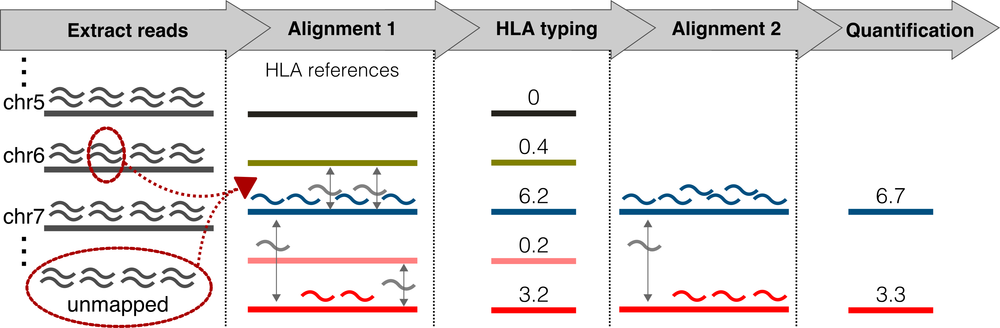
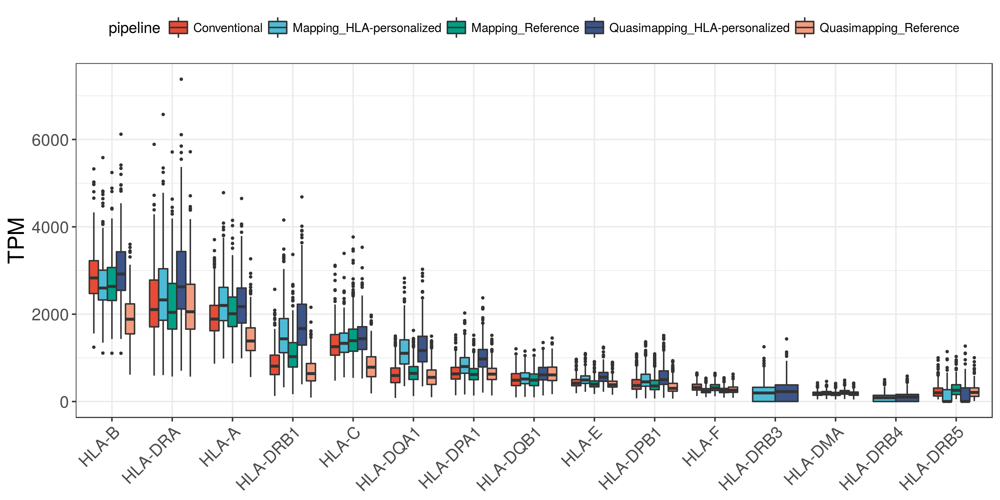
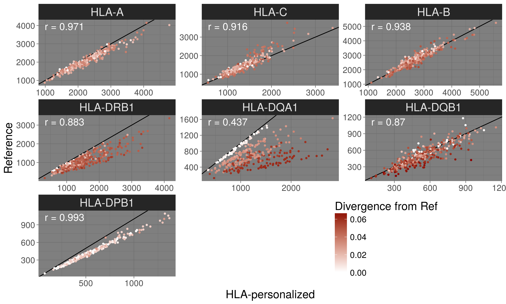
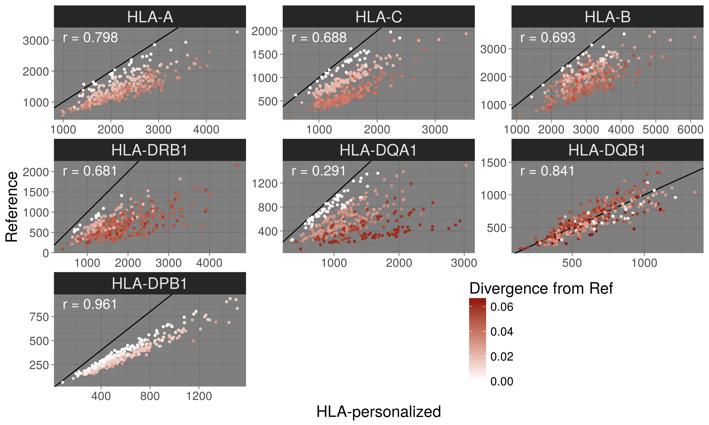
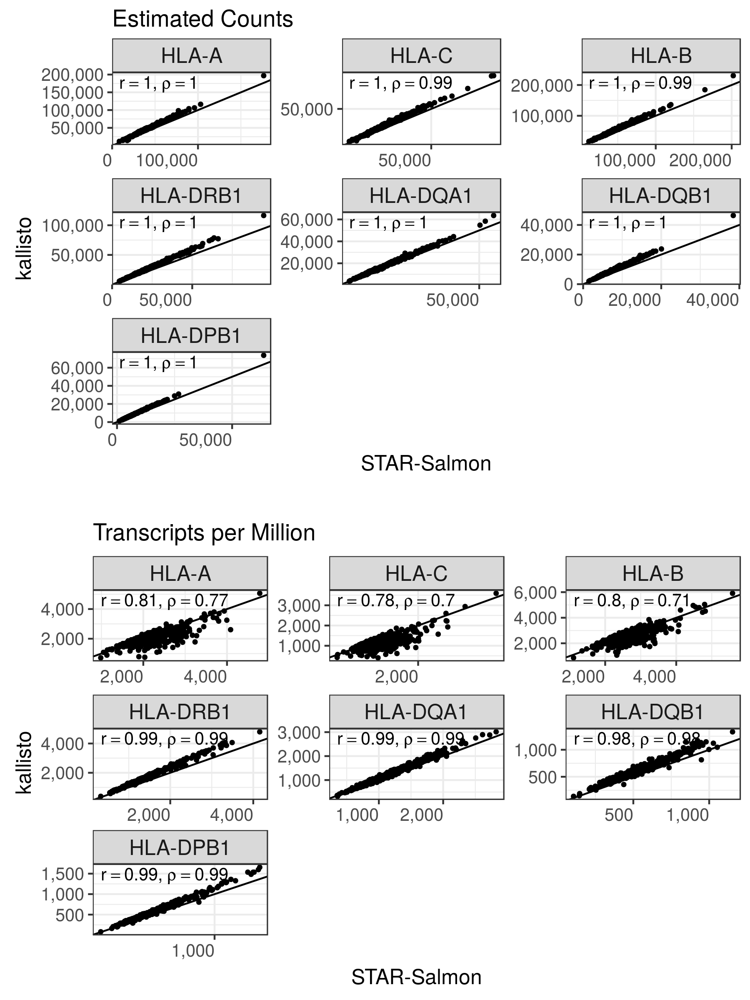
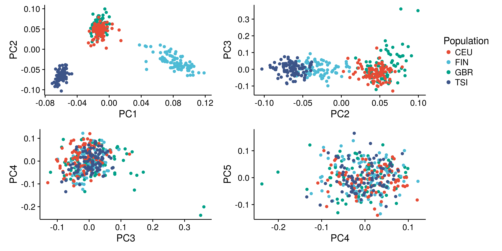
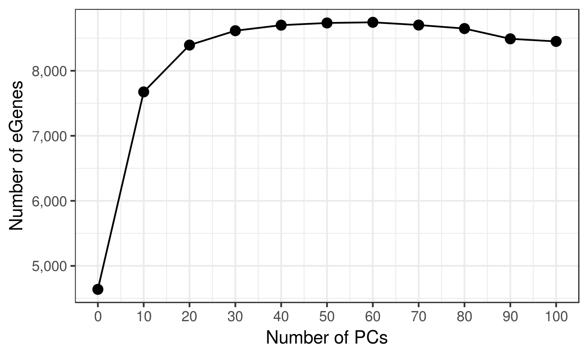
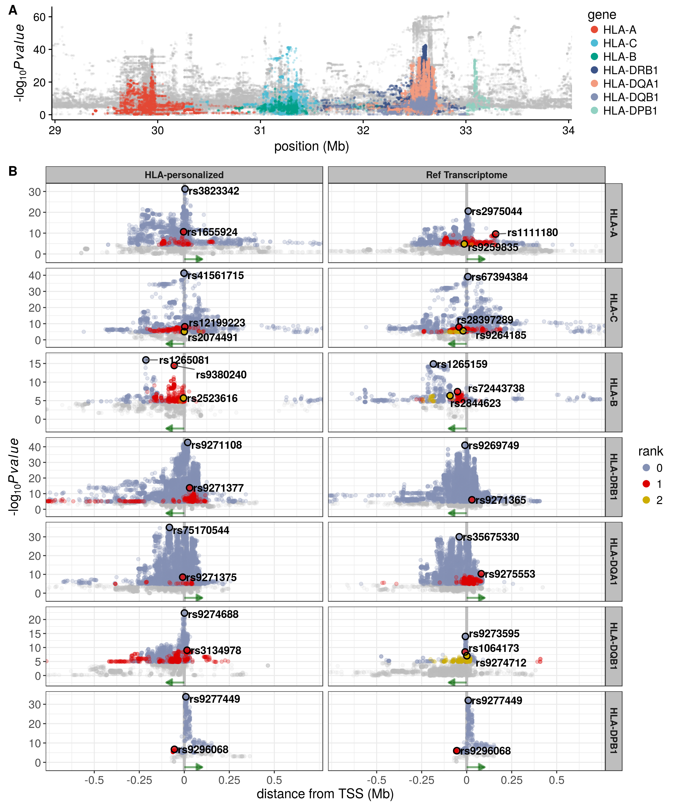
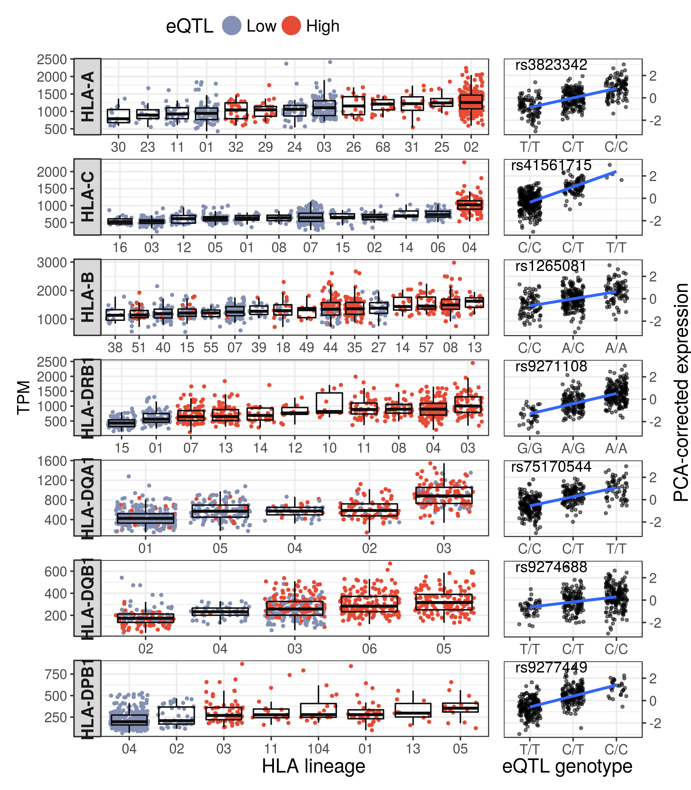

Report
================

Methods outline
===============

Sample
------

-   358 European individuals in Geuvadis and 1000G Phase 3

Pipelines
---------

1.  Conventional: Map to genome, and reflect mappings to transcriptome with STAR.

2.  Personalized pseudo-alignment: Run kallisto in 2 rounds, 1st round to HLA-type, and 2nd round with personalized index to quantify expression.

3.  Personalized quasi-mapping: Extract MHC-mapped and unmapped reads from conventional mapping, perform HLA typing, quasi-map reads to personalized index and quantify expression with Salmon `quasi-mapping mode`.

4.  Personalized Mapping: Extract MHC-mapped and unmapped reads from conventional mapping, perform HLA typing, map extracted reads to personalized index with STAR, and quantify expression with Salmon `alignment mode`.

Pipeline 4 (a.k.a. "mapping pipeline") was used as the main pipeline for the paper.

### Schematic description of Personalized pipelines (3 and 4)

### Details on HLA typing performed for pipelines 3 and 4

1.  MHC-mapped and Unmapped reads were extracted from conventional mapping.

2.  These reads were mapped to the IMGT panel with STAR. Expression was estimated with Salmon.

3.  The top 5 alleles were separated. A zigosity threshold of 0.25 was applied intra-lineage, meaning that only alleles which had at least 25% of the total expression in their lineage were considered for further steps.

4.  Quasi-mapping and quantification was performed for these top alleles with Salmon. In this step, a threshold of 0.15 was applied at the lineage-level, meaning that genotypes were considered heterozygous at the lineage-level if more than 1 lineage had at least 15% of the locus read counts. Lead alleles from each lineage were chosen to compose the genotype. A zigosity threshold of 0.15 was again applied to decide whether the genotype was heterozygous at the allele-level.

5.  For each locus, the reads mapped to the overall lead allele were removed, and another step of quasi-mapping was performed in order to determine if the second allele was real, or just noise due to extensive similarity to the lead allele. If the second allele had at least 1% of the locus read counts, it was kept, otherwise the genotype was considered homozygous for the lead allele.

The thesholds described above were determined after evaluation of different values, and were chosen because they maximized the concordance with the Sanger sequencing typings, while also minimizing the rate of false homozygotes and heterozygotes.

Results
=======

Typing concordance with Gold Standard
-------------------------------------

\*Concordance: the proportion of the called alleles that are concordant with the Gourraud et al (2014) typings.

| locus |  accuracy (%)|
|:------|-------------:|
| A     |          98.5|
| B     |          98.7|
| C     |          97.5|
| DQB1  |          98.5|
| DRB1  |          99.5|

Expression estimates
--------------------

HLA genes with average TPM &gt; 100.

### HLA diversity vs reference transcriptome

#### Mapping pipeline

Here we see higher expression for HLA-C for the reference, which may be overestimation.

#### Quasi-mapping pipeline

Here we see a massive read loss for the reference, except for DQB1, that shows a pattern which is difficult to explain. It looks like the axes are swapped for that locus.

### Mapping vs. Pseudo-alignment

**Obs: From now on, data from HLA-personalized pipeline refers to the "Mapping" pipeline.**

### ASE

The genotype with extreme ASE for HLA-A is not a typing error. The genotype is concordant with the Sanger sequencing typings.

### Correlation of expression

#### Drop in correlation as number of PCs increase

We need to explore why global factors affect correlation among close genes. Why does the correlation DQA1xDQB1 become zero? Why DRB1xDQB1 becomes negative?

#### Correlation among the HLA genes (uncorrected estimates)

#### Location of HLA genes within CRDs

\*CRDs are defined in <http://dx.doi.org/10.1101/171694*>

#### Correlation between Class II genes and CIITA

eQTLs
-----

### PCA of genotypes

PCs 1-3 were used as covariates to account for population structure.

### Number of eGenes according to index

### Distribution of eQTLs around the TSS, and a comparison with conventional mapping

### Causal probabilities

coming soon...

### HLA lineages and eQTLs

#### F-test: is there a difference among lineages?

##### Welch ANOVA

| locus    |  num.df|  denom.df|        F| p.value  |
|:---------|-------:|---------:|--------:|:---------|
| HLA-A    |      12|   111.374|   12.224| 1.75e-15 |
| HLA-B    |      14|   147.798|    9.497| 9.42e-15 |
| HLA-C    |      11|   139.796|   35.384| 4.65e-35 |
| HLA-DPB1 |       7|    62.396|    9.775| 3.71e-08 |
| HLA-DQA1 |       4|   215.272|  110.181| 6.00e-51 |
| HLA-DQB1 |       4|   257.388|   54.055| 4.95e-33 |
| HLA-DRB1 |       9|   167.674|   48.246| 4.82e-42 |

### Presence within Encode Elements

#### HLA-personalized pipeline

| locus    |  rank| rsid        |     dist| regulome\_score | tfbs                                      | dhs | histone\_marks                                                            |
|:---------|-----:|:------------|--------:|:----------------|:------------------------------------------|:----|:--------------------------------------------------------------------------|
| HLA-A    |     0| rs3823342   |     0.00| 4               | POL2-4/POL2                               | NA  | H3k27ac/H3k9ac/H3k4me2/H3k4me3/H3k79me2/H4k20me1/H3k36me3                 |
| HLA-A    |     1| rs1655924   |    -3.92| 6               | NA                                        | NA  | NA                                                                        |
| HLA-B    |     0| rs1265094   |   214.76| 4               | NA                                        | NA  | NA                                                                        |
| HLA-B    |     1| rs9264803   |    51.20| 6               | NA                                        | NA  | NA                                                                        |
| HLA-B    |     2| rs2308655   |     0.00| 4               | POL2-4                                    | DHS | H4k20me1/H3k36me3/H3k4me2/H3k79me2/H3k4me3/H3k9ac/H3k27ac/H3k4me1/H3k9me3 |
| HLA-C    |     0| rs146911342 |     0.00| 3a              | POL2-4                                    | NA  | H4k20me1/H3k36me3/H3k4me3/H3k4me2/H3k79me2/H3k4me1/H3k9ac                 |
| HLA-C    |     1| rs3134776   |    35.71| 7               | NA                                        | NA  | NA                                                                        |
| HLA-C    |     2| rs9266301   |   -89.60| 7               | NA                                        | NA  | NA                                                                        |
| HLA-DPB1 |     0| rs9277449   |     0.00| 7               | NA                                        | NA  | H3k36me3                                                                  |
| HLA-DPB1 |     1| rs9296068   |   -55.01| 6               | NA                                        | NA  | H3k4me1/H2az                                                              |
| HLA-DPB1 |     2| rs688209    |   645.40| 4               | NA                                        | NA  | NA                                                                        |
| HLA-DQA1 |     0| rs75438654  |  -136.21| 5               | NA                                        | NA  | NA                                                                        |
| HLA-DQA1 |     1| rs9271375   |    -8.89| 7               | NA                                        | NA  | H3k9me3                                                                   |
| HLA-DQB1 |     0| rs1770      |     0.00| 1f              | POL2-4/CHD2/TBP/TAF1/EBF1/ELF1/TCF12/POL2 | DHS | H3k4me1/H3k27ac/H3k4me2/H3k36me3/H3k79me2                                 |
| HLA-DQB1 |     1| rs9281986   |    25.51| NA              | NA                                        | NA  | H3k27ac/H3k79me2/H3k4me2/H3k9ac                                           |
| HLA-DRB1 |     0| rs9270698   |    -9.67| 5               | NA                                        | NA  | NA                                                                        |
| HLA-DRB1 |     1| rs1048372   |   -52.81| 3a              | POL2-4                                    | NA  | H3k4me2/H3k4me3/H3k79me2/H3k36me3                                         |
| HLA-DRB1 |     2| rs11752186  |   -11.05| 7               | NA                                        | NA  | NA                                                                        |

#### Conventional pipeline

| locus    |  rank| rsid        |     dist| regulome\_score | tfbs                                                                                                              | dhs | histone\_marks                                       |
|:---------|-----:|:------------|--------:|:----------------|:------------------------------------------------------------------------------------------------------------------|:----|:-----------------------------------------------------|
| HLA-A    |     0| rs2523764   |   -91.42| 2b              | NA                                                                                                                | NA  | NA                                                   |
| HLA-A    |     1| rs2975046   |     1.49| 1f              | POL2-4/NFATC1/BCL3                                                                                                | NA  | H4k20me1/H3k36me3                                    |
| HLA-A    |     2| rs9259825   |   -14.19| 2b              | POL2-4/SIN3A/IRF4/POU2F2                                                                                          | DHS | H3k4me2/H3k4me3/H3k79me2/H2az/H3k9ac/H3k27ac         |
| HLA-B    |     0| rs2853926   |    58.60| 6               | NA                                                                                                                | NA  | NA                                                   |
| HLA-B    |     1| rs1265109   |   202.06| 6               | NA                                                                                                                | NA  | NA                                                   |
| HLA-B    |     2| rs36057735  |     1.73| 4               | POL2-4/NFATC1/MTA3/POL2/NFIC                                                                                      | NA  | H4k20me1/H3k4me1/H3k36me3                            |
| HLA-C    |     0| rs4947308   |   -62.38| 6               | NA                                                                                                                | NA  | H3k9me3                                              |
| HLA-C    |     1| rs2074491   |     0.00| 4               | POL2-4/NRSF/BCL11A/TCF3/TCF12/MXI1/EBF1/POU2F2/TBP/TAF1/POL2/NF-YA/CHD2/BHLHE40/CFOS/RFX5/NFKB/NF-YB/IRF4/PU1/SP1 | DHS | H3k4me3/H3k4me2/H3k79me2/H3k9ac/H3k27ac/H2az/H3k4me1 |
| HLA-C    |     2| rs1064627   |   537.99| 1f              | STAT3                                                                                                             | NA  | H3k36me3/H3k4me2                                     |
| HLA-C    |     3| rs9501587   |  -107.03| 6               | NA                                                                                                                | NA  | H3k27me3                                             |
| HLA-DPB1 |     0| rs9277538   |     0.07| 4               | NA                                                                                                                | NA  | NA                                                   |
| HLA-DPB1 |     1| rs9296068   |   -55.01| 6               | NA                                                                                                                | NA  | H3k4me1/H2az                                         |
| HLA-DPB1 |     2| rs688209    |   645.40| 4               | NA                                                                                                                | NA  | NA                                                   |
| HLA-DQA1 |     0| rs9270521   |   -36.43| 6               | NA                                                                                                                | NA  | NA                                                   |
| HLA-DQA1 |     1| rs3129758   |   -11.33| 5               | NA                                                                                                                | NA  | H3k9me3                                              |
| HLA-DQB1 |     0| rs1770      |     0.00| 1f              | POL2-4/CHD2/TBP/TAF1/EBF1/ELF1/TCF12/POL2                                                                         | DHS | H3k4me1/H3k27ac/H3k4me2/H3k36me3/H3k79me2            |
| HLA-DQB1 |     1| rs9274622   |     0.00| 1f              | POL2-4/IKZF1/AFT2                                                                                                 | NA  | H3k79me2/H3k4me2/H3k4me3/H3k27ac/H3k9ac/H2az/H3k4me1 |
| HLA-DQB1 |     2| rs28891461  |    -5.86| 7               | NA                                                                                                                | NA  | NA                                                   |
| HLA-DQB1 |     3| rs116102092 |    88.57| 6               | NA                                                                                                                | NA  | NA                                                   |
| HLA-DQB1 |     4| rs139547197 |  -408.00| 4               | POL2-4/MTA3                                                                                                       | NA  | H3k79me2/H3k4me3/H3k4me2/H3k9ac/H3k27ac/H2az         |
| HLA-DRB1 |     0| rs73729140  |     0.00| 6               | NA                                                                                                                | NA  | NA                                                   |
| HLA-DRB1 |     1| rs28383307  |   -29.13| 7               | NA                                                                                                                | NA  | H3k9me3                                              |

### RTC

*Variants with RTC &gt; 0.95 likely mark the same biological signal.*

#### eQTLs from HLA-personalized vs...

##### eQTLs from Conventional pipeline

| gene     | variant\_HLA-personalized |  rank\_HLA-personalized| variant\_Conventional |  rank\_Conventional|  d\_prime|   rtc|
|:---------|:--------------------------|-----------------------:|:----------------------|-------------------:|---------:|-----:|
| HLA-A    | rs3823342                 |                       0| rs2523764             |                   0|      0.94|  0.72|
| HLA-A    | rs1655924                 |                       1| rs2523764             |                   0|      0.68|  0.92|
| HLA-C    | rs146911342               |                       0| rs4947308             |                   0|      0.97|  0.97|
| HLA-C    | rs3134776                 |                       1| rs2074491             |                   1|      0.97|  0.86|
| HLA-C    | rs9266301                 |                       2| rs2074491             |                   1|      0.59|  1.00|
| HLA-B    | rs1265094                 |                       0| rs1265109             |                   1|      0.75|  1.00|
| HLA-B    | rs9264803                 |                       1| rs2853926             |                   0|      0.98|  1.00|
| HLA-B    | rs2308655                 |                       2| rs36057735            |                   2|      0.96|  0.96|
| HLA-DRB1 | rs9270698                 |                       0| rs73729140            |                   0|      0.59|  0.59|
| HLA-DRB1 | rs1048372                 |                       1| rs28383307            |                   1|      0.85|  0.99|
| HLA-DRB1 | rs11752186                |                       2| rs28383307            |                   1|      0.29|  0.74|
| HLA-DQA1 | rs75438654                |                       0| rs3129758             |                   1|      0.94|  0.70|
| HLA-DQA1 | rs9271375                 |                       1| rs3129758             |                   1|      0.64|  0.78|
| HLA-DQB1 | rs1770                    |                       0| rs1770                |                   0|      1.00|  1.00|
| HLA-DQB1 | rs9281986                 |                       1| rs9274622             |                   1|      0.98|  0.85|
| HLA-DPB1 | rs9277449                 |                       0| rs9277538             |                   0|      0.99|  1.00|
| HLA-DPB1 | rs9296068                 |                       1| rs9296068             |                   1|      1.00|  1.00|
| HLA-DPB1 | rs688209                  |                       2| rs688209              |                   2|      1.00|  1.00|

##### Previously reported eQTLs

| gene     |  rank| rsid        | qtl\_previous |  d\_prime|   rtc| study\_pval                                                 |
|:---------|-----:|:------------|:--------------|---------:|-----:|:------------------------------------------------------------|
| HLA-A    |     0| rs3823342   | rs3823342     |      1.00|  1.00| geuvadis\_exon (82.9)                                       |
| HLA-A    |     1| rs1655924   | rs1655924     |      1.00|  1.00| geuvadis\_gene (16.1)/geuvadis\_exon (38.5)                 |
| HLA-C    |     0| rs146911342 | rs146911342   |      1.00|  1.00| geuvadis\_gene (24.1)/geuvadis\_exon (26.2)                 |
| HLA-C    |     1| rs3134776   | rs3134776     |      1.00|  1.00| geuvadis\_exon (6.5)                                        |
| HLA-C    |     2| rs9266301   | rs9266301     |      1.00|  1.00| geuvadis\_exon (7.1)                                        |
| HLA-B    |     0| rs1265094   | rs1265094     |      1.00|  1.00| geuvadis\_exon (15.4)                                       |
| HLA-B    |     1| rs9264803   | rs9264803     |      1.00|  1.00| geuvadis\_exon (11.4)                                       |
| HLA-B    |     2| rs2308655   | rs2308655     |      1.00|  1.00| geuvadis\_exon (34.6)                                       |
| HLA-DRB1 |     0| rs9270698   | rs9270704     |      0.98|  1.00| geuvadis\_exon (67.4)                                       |
| HLA-DRB1 |     1| rs1048372   | rs1048372     |      1.00|  1.00| geuvadis\_exon (13.4)                                       |
| HLA-DRB1 |     2| rs11752186  | rs11752186    |      1.00|  1.00| geuvadis\_exon (6.5)                                        |
| HLA-DQA1 |     0| rs75438654  | rs75170544    |      0.67|  1.00| geuvadis\_gene (28.4)/geuvadis\_exon (48.3)/gtex\_v7 (17.3) |
| HLA-DQA1 |     1| rs9271375   | rs9271375     |      1.00|  1.00| geuvadis\_exon (13.4)                                       |
| HLA-DQB1 |     0| rs1770      | rs1770        |      1.00|  1.00| geuvadis\_gene (43.4)/geuvadis\_exon (68.3)/gtex\_v7 (21.2) |
| HLA-DQB1 |     1| rs9281986   | rs2187668     |      1.00|  1.00| geuvadis\_gene (10.6)/geuvadis\_exon (5.6)                  |
| HLA-DQB1 |     1| rs9281986   | rs9272729     |      0.97|  1.00| geuvadis\_gene (10)/gtex\_v7 (6)                            |
| HLA-DPB1 |     0| rs9277449   | rs9277538     |      0.99|  1.00| geuvadis\_exon (57.9)                                       |
| HLA-DPB1 |     1| rs9296068   | rs34885310    |      0.96|  0.98| delaneau (3.7)                                              |
| HLA-DPB1 |     2| rs688209    | rs184379497   |      0.68|  0.94| NA (NA)                                                     |

##### CRD-QTLs

| gene     | variant     |  rank| crd\_var  |  d\_prime|       rtc| info                           |
|:---------|:------------|-----:|:----------|---------:|---------:|:-------------------------------|
| HLA-A    | rs3823342   |     0| rs1611324 |  1.000000|  0.990938| CRDactiv:chr6\_internal\_20803 |
| HLA-A    | rs1655924   |     1| rs9260092 |  0.619061|  0.826550| CRDactiv:chr6\_internal\_22883 |
| HLA-C    | rs146911342 |     0| rs2249742 |  1.000000|  0.924613| CRDactiv:chr6\_internal\_25274 |
| HLA-C    | rs3134776   |     1| rs2249742 |  0.367858|  0.832262| CRDactiv:chr6\_internal\_25274 |
| HLA-C    | rs9266301   |     2| rs2249742 |  0.502275|  0.730606| CRDactiv:chr6\_internal\_25274 |
| HLA-B    | rs1265094   |     0| rs2428516 |  0.869110|  0.964187| CRDactiv:chr6\_internal\_26296 |
| HLA-B    | rs9264803   |     1| rs2249742 |  0.957417|  0.988371| CRDactiv:chr6\_internal\_25274 |
| HLA-B    | rs2308655   |     2| rs2524080 |  0.622225|  0.973047| CRDactiv:chr6\_internal\_23085 |
| HLA-DRB1 | rs9270698   |     0| rs2395517 |  0.960744|  0.874079| CRDactiv:chr6\_internal\_27324 |
| HLA-DRB1 | rs1048372   |     1| rs3104412 |  0.918101|  0.997894| CRDactiv:chr6\_internal\_28837 |
| HLA-DRB1 | rs11752186  |     2| rs9272779 |  1.000000|  0.965747| CRDactiv:chr6\_internal\_19083 |
| HLA-DQA1 | rs75438654  |     0| rs9272214 |  0.859895|  0.852039| CRDactiv:chr6\_internal\_29568 |
| HLA-DQA1 | rs9271375   |     1| rs3104412 |  0.718277|  0.999789| CRDactiv:chr6\_internal\_28837 |
| HLA-DQB1 | rs1770      |     0| rs9272779 |  0.514066|  0.813154| CRDactiv:chr6\_internal\_19083 |
| HLA-DQB1 | rs9281986   |     1| rs9272214 |  1.000000|  0.914017| CRDactiv:chr6\_internal\_29568 |
| HLA-DPB1 | rs9277449   |     0| rs9277630 |  0.843641|  0.150883| CRDactiv:chr6\_internal\_24649 |
| HLA-DPB1 | rs9296068   |     1| rs6935846 |  0.963111|  0.985401| CRDactiv:chr6\_internal\_24851 |
| HLA-DPB1 | rs688209    |     2| rs9469583 |  1.000000|  0.753602| CRDactiv:chr6\_internal\_30623 |

##### GWAS variants

| gene     |  rank| variant     | trait (GWAS variant)                                                                                                                                                                                                                                                                                                                                                                                                                                                                                                                                                                                                                                                                                                                                                                                                                                                              |
|:---------|-----:|:------------|:----------------------------------------------------------------------------------------------------------------------------------------------------------------------------------------------------------------------------------------------------------------------------------------------------------------------------------------------------------------------------------------------------------------------------------------------------------------------------------------------------------------------------------------------------------------------------------------------------------------------------------------------------------------------------------------------------------------------------------------------------------------------------------------------------------------------------------------------------------------------------------|
| HLA-A    |     0| rs3823342   | age at menarche (rs16896742); beta-2 microglobulin measurement (rs9260489); IGA glomerulonephritis (rs2523946); multiple sclerosis (rs2523393, rs9260489); nasopharyngeal neoplasm (rs2517713)                                                                                                                                                                                                                                                                                                                                                                                                                                                                                                                                                                                                                                                                                    |
| HLA-A    |     1| rs1655924   | NA (NA)                                                                                                                                                                                                                                                                                                                                                                                                                                                                                                                                                                                                                                                                                                                                                                                                                                                                           |
| HLA-B    |     0| rs1265094   | cutaneous lupus erythematosus (rs3130564); membranous glomerulonephritis (rs3130564, rs1265159, rs3096697, rs3134945); neoplasm of mature B-cells (rs6457327); psoriasis (rs1265181); response to reverse transcriptase inhibitor (rs1265112)                                                                                                                                                                                                                                                                                                                                                                                                                                                                                                                                                                                                                                     |
| HLA-B    |     1| rs9264803   | Crohn's disease (rs9264942); cutaneous psoriasis measurement, psoriasis (rs10484554); HIV-1 infection (rs9264942, rs2523590, rs4418214); inflammatory bowel disease (rs9264942); lymphocyte count (rs2524079); psoriasis (rs12191877, rs10484554); psoriasis vulgaris (rs4406273); psoriatic arthritis (rs13191343, rs12191877)                                                                                                                                                                                                                                                                                                                                                                                                                                                                                                                                                   |
| HLA-B    |     2| rs2308655   | autoimmune thyroid disease, type I diabetes mellitus (rs886424); body height (rs2247056, rs6457374, rs2256183); CD4:CD8 lymphocyte ratio (rs2524054); cervical carcinoma (rs2516448); cutaneous lupus erythematosus (rs3131060, rs3130564); diffuse large B-cell lymphoma (rs2523607); immune system disease (rs3130544); marginal zone B-cell lymphoma (rs2922994); membranous glomerulonephritis (rs3130544, rs3130564, rs7750641, rs1265159, rs3134792); myositis (rs3131619, rs3094013, rs3131618); psoriasis (rs1265181, rs3134792); rheumatoid arthritis (rs2596565); schizophrenia (rs2596500); triglyceride measurement (rs2247056)                                                                                                                                                                                                                                       |
| HLA-C    |     0| rs146911342 | body height (rs1265097)                                                                                                                                                                                                                                                                                                                                                                                                                                                                                                                                                                                                                                                                                                                                                                                                                                                           |
| HLA-C    |     1| rs3134776   | atopic eczema (rs176095); cancer, response to pazopanib, serum alanine aminotransferase measurement (rs1800625); chronic hepatitis B infection (rs2853953); complement C4 measurement (rs2071278); coronary heart disease (rs3869109); cutaneous psoriasis measurement, psoriasis (rs10484554); membranous glomerulonephritis (rs2233956, rs1265159); psoriasis (rs1265181, rs12191877, rs10484554); psoriasis vulgaris (rs4406273); psoriatic arthritis (rs13191343, rs12191877); response to reverse transcriptase inhibitor (rs1265112); schizophrenia (rs3131296); systemic scleroderma (rs3130573)                                                                                                                                                                                                                                                                           |
| HLA-C    |     2| rs9266301   | chronic obstructive pulmonary disease, surfactant protein D measurement (rs3130559, rs2074488, rs9266629); Graves disease (rs4248154)                                                                                                                                                                                                                                                                                                                                                                                                                                                                                                                                                                                                                                                                                                                                             |
| HLA-DPB1 |     0| rs9277449   | NA (NA)                                                                                                                                                                                                                                                                                                                                                                                                                                                                                                                                                                                                                                                                                                                                                                                                                                                                           |
| HLA-DPB1 |     1| rs9296068   | NA (NA)                                                                                                                                                                                                                                                                                                                                                                                                                                                                                                                                                                                                                                                                                                                                                                                                                                                                           |
| HLA-DPB1 |     2| rs688209    | NA (NA)                                                                                                                                                                                                                                                                                                                                                                                                                                                                                                                                                                                                                                                                                                                                                                                                                                                                           |
| HLA-DQA1 |     0| rs75438654  | antibody measurement, Epstein-Barr virus infection (rs477515); antinuclear antibody measurement (rs2395185); Cystic fibrosis, lung disease severity measurement (rs9268947); Hodgkins lymphoma (rs2395185); inflammatory bowel disease (rs477515); lung carcinoma (rs2395185); lymphoma (rs9268853); NA (rs9268923); response to vaccine (rs477515); ulcerative colitis (rs9268853, rs9268923, rs2395185); Vogt-Koyanagi-Harada disease (rs9268838); NA (rs2516049)                                                                                                                                                                                                                                                                                                                                                                                                               |
| HLA-DQA1 |     1| rs9271375   | Alzheimers disease (rs9271192); Crohn's disease (rs9271060); Graves disease (rs2273017); leprosy (rs9271100); multiple sclerosis (rs3135338); multiple sclerosis, oligoclonal band measurement (rs3828840); systemic lupus erythematosus (rs9271100); systemic scleroderma (rs3129763); type I diabetes mellitus (rs9268645); ulcerative colitis (rs9271100)                                                                                                                                                                                                                                                                                                                                                                                                                                                                                                                      |
| HLA-DQB1 |     0| rs1770      | chronic lymphocytic leukemia (rs9273363); Crohn's disease (rs9273363); inflammatory bowel disease (rs9273363); lymphoma (rs2647045); seasonal allergic rhinitis, asthma (rs9273373); ulcerative colitis (rs9268877, rs6927022, rs9273363)                                                                                                                                                                                                                                                                                                                                                                                                                                                                                                                                                                                                                                         |
| HLA-DQB1 |     1| rs9281986   | antibody measurement, Epstein-Barr virus infection (rs2854275); autoimmune hepatits type 1 (rs2187668); autoimmune thyroid disease, type I diabetes mellitus (rs1270942, rs1980493); celiac disease (rs2187668); chronic lymphocytic leukemia (rs674313); cutaneous lupus erythematosus (rs9267531, rs2187668); hepatitis C induced liver cirrhosis (rs3135363); leprosy (rs602875); membranous glomerulonephritis (rs3130618, rs389884, rs7775397, rs1980493, rs2187668, rs1480380); multiple sclerosis (rs2040406); protein measurement (rs2187668); response to vaccine (rs3135363); rheumatoid arthritis (rs558702, rs615672); schizophrenia (rs622076, rs3131296, rs9274623, rs73396800); systemic lupus erythematosus (rs3131379, rs1270942, rs1150757, rs1150753, rs2187668, rs3129716, rs3957147); systemic scleroderma (rs3129763); type I diabetes mellitus (rs2647044) |
| HLA-DRB1 |     0| rs9270698   | Alzheimers disease (rs9271192); Crohn's disease (rs9271060); leprosy (rs9271100); multiple sclerosis, oligoclonal band measurement (rs3828840); narcolepsy with cataplexy (rs9271117); systemic lupus erythematosus (rs9271100); ulcerative colitis (rs9271100, rs9271209)                                                                                                                                                                                                                                                                                                                                                                                                                                                                                                                                                                                                        |
| HLA-DRB1 |     1| rs1048372   | atopic eczema (rs4713555); hepatitis C induced liver cirrhosis (rs910049); hepatocellular carcinoma (rs9272105); IGA glomerulonephritis (rs9275224); multiple sclerosis (rs3135338, rs3129871); multiple sclerosis, oligoclonal band measurement (rs3129871, rs3129720); response to interferon beta (rs9272105); rheumatoid arthritis (rs9275406); squamous cell carcinoma (rs4455710); systemic lupus erythematosus (rs9270984); systemic scleroderma (rs9275390); Vogt-Koyanagi-Harada disease (rs3021304)                                                                                                                                                                                                                                                                                                                                                                     |
| HLA-DRB1 |     2| rs11752186  | seasonal allergic rhinitis, asthma (rs9273373); squamous cell carcinoma (rs4455710)                                                                                                                                                                                                                                                                                                                                                                                                                                                                                                                                                                                                                                                                                                                                                                                               |
