```{r setup, include=FALSE}
knitr::opts_chunk$set(echo = FALSE, message = FALSE, warning = FALSE, comment = "")
```

```{r pkgs, echo = FALSE}
library(knitr)
library(tidyverse)
```

# Library Sizes and pseudoaligned reads

```{r}
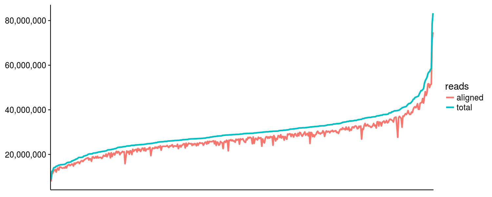
```

# Typing accuracies

*Concordance: the proportion of the called alleles that are concordant with the Gourraud et al (2014) typings

*Allele calls were compared at the maximum resolution possible at each pair

```{r}
read_tsv("./genotyping_accuracies.tsv") %>%
  filter(th_average == max(th_average)) %>%
  filter(th == min(th)) %>%
  select(locus, accuracy) %>%
  kable()
```

# Expression estimates

## GEM-based vs. kallisto

```{r}
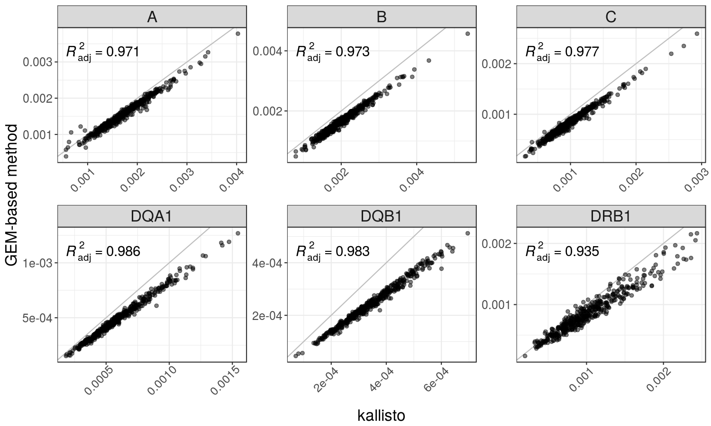
```

## Comparison to Geuvadis' published data

```{r}
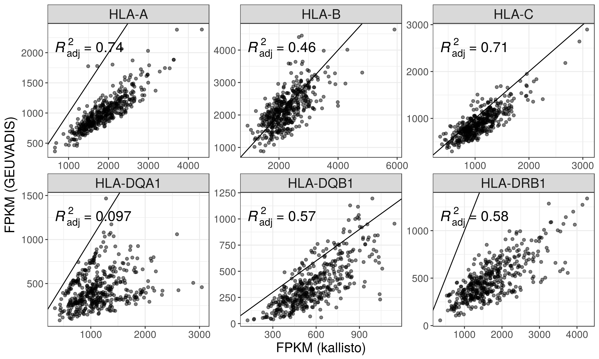
```

## Comparison of different indices

### HLA diversity vs Reference chromosomes

```{r}
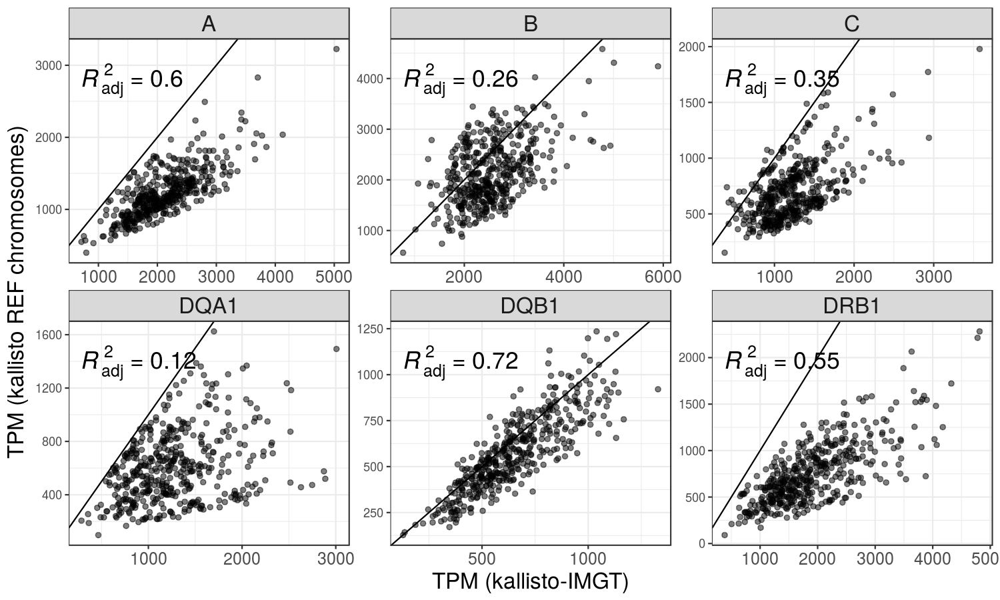
```

### HLA diversity vs Reference chromosomes + Alternate haplotypes + Patches + Scaffolds

```{r}
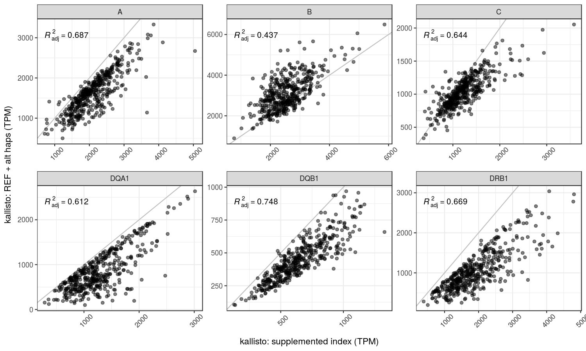
```

### Distribution of TPM values

```{r}
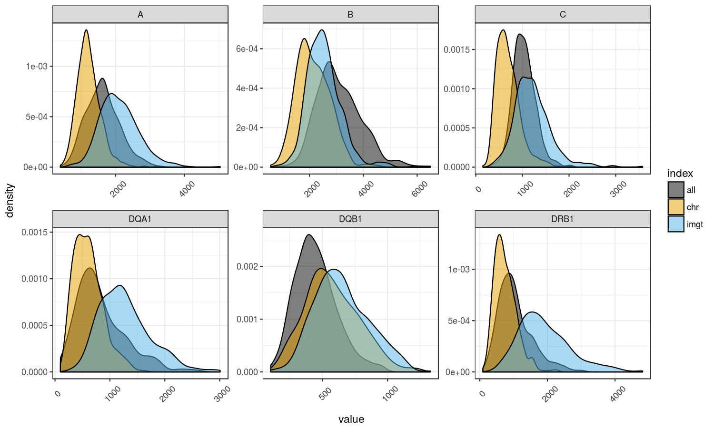
```

# ASE 

## ASE by number of genotype inference errors

*Each point represents a heterozygous genotype in the intersect with Gourraud data.

*There are more points with extreme ASE associated with genotyping errors because I'm not applying anymore a threshold of expression between 2nd allele/1st allele after the second round of the pipeline.

```{r}
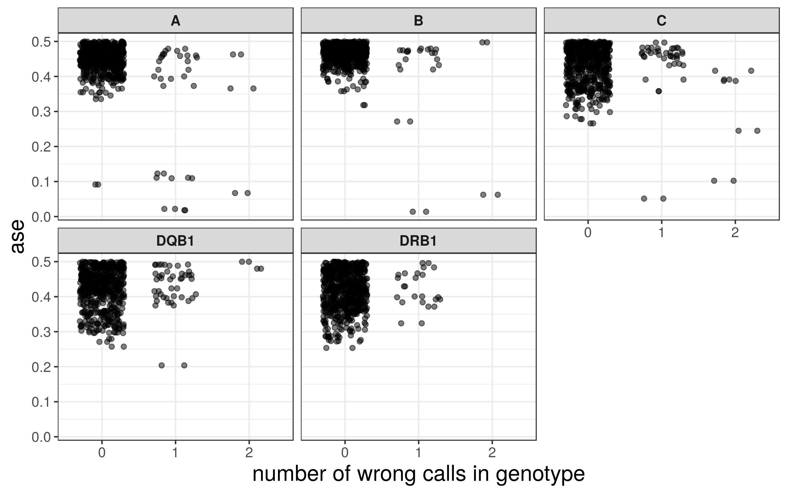
```

## ASE distribution

```{r}
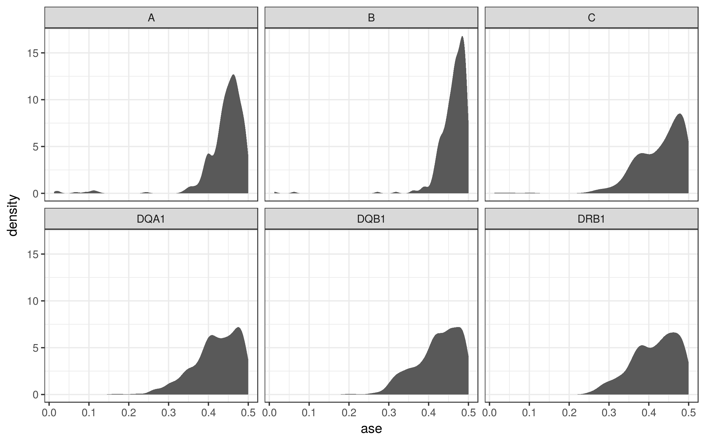
```

# Correlation of expression

## Correlation decreases with the increase in the number of PEER factors/PCs

```{r}
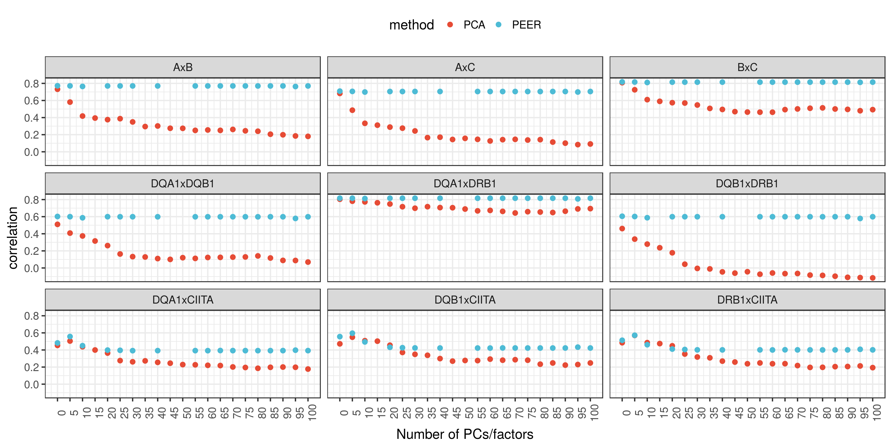
```


*Expression data in the plots below correspond to TPM values corrected by 10 PCs

## Among the HLA genes

```{r}
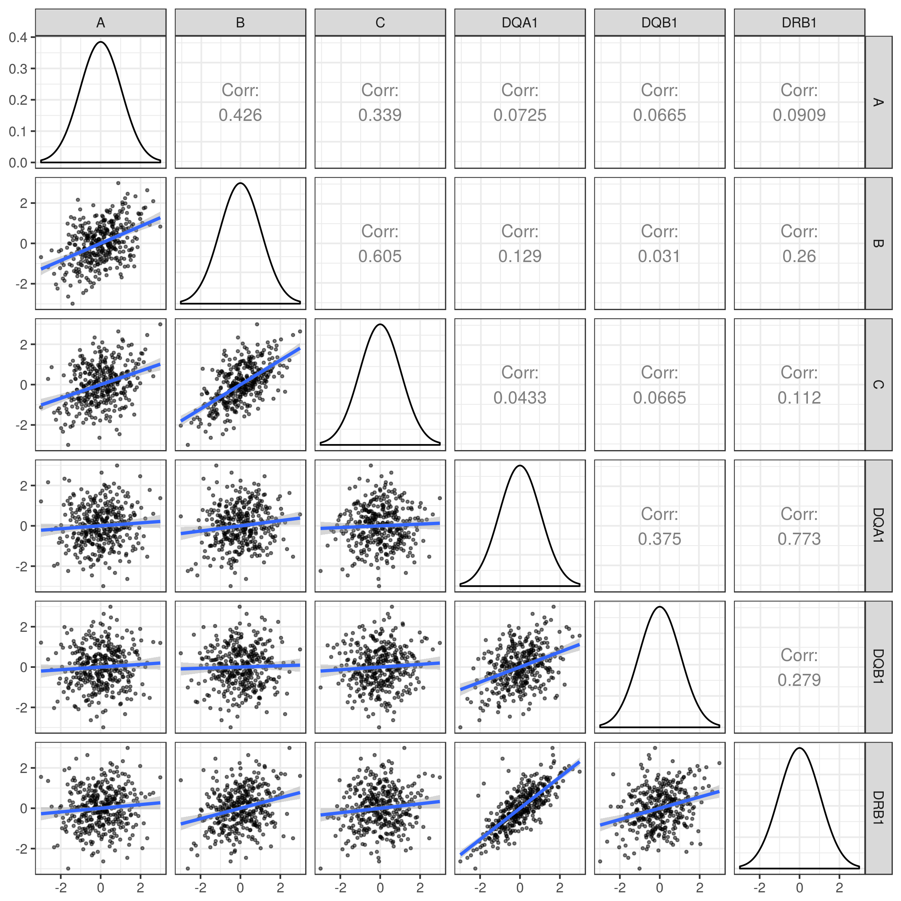
```

## Between Class II genes and CIITA

```{r}
include_graphics("./plots/trans_activ_corrs.png")
```

## Between pairs of HLA genes on the same vs on different haplotypes

### HLA-A vs HLA-B

```{r}
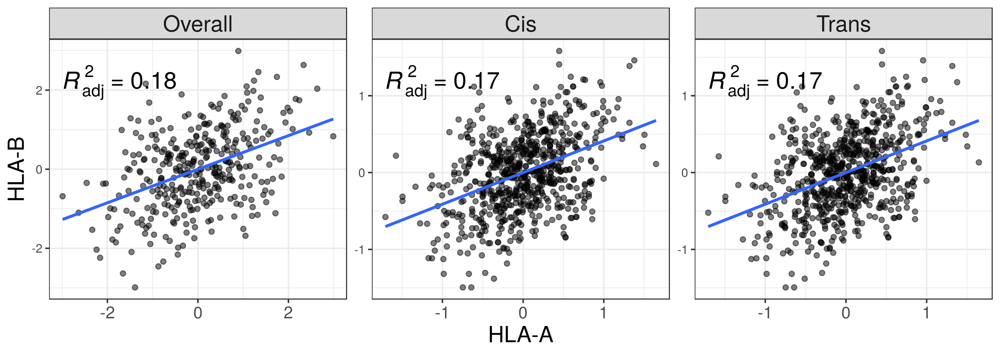
```

### HLA-A vs HLA-C

```{r}
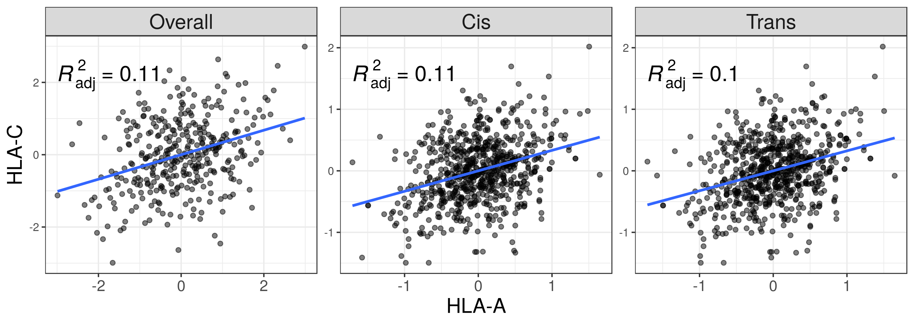
```

### HLA-B vs HLA-C

```{r}
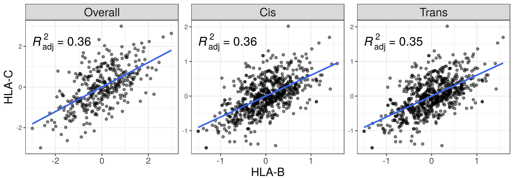
```

### HLA-DQA1 vs HLA-DQB1

```{r}
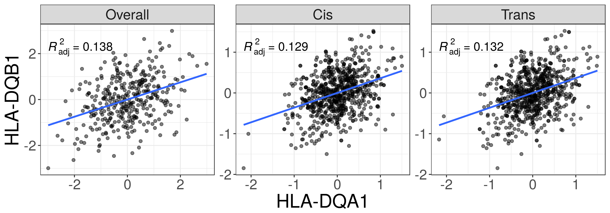
```

### HLA-DQA1 vs HLA-DRB1

```{r}
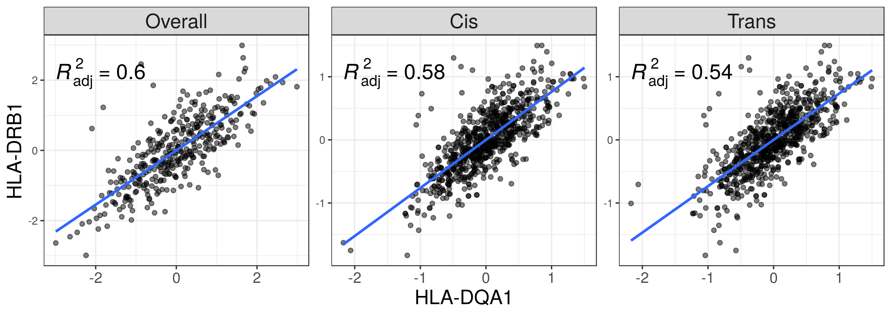
```