Report
================

Library Sizes and pseudoaligned reads
=====================================

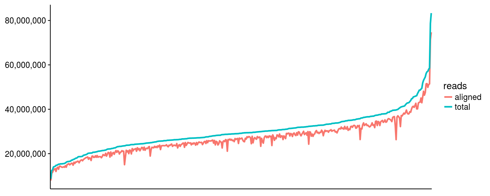

Typing accuracies
=================

\*Concordance: the proportion of the called alleles that are concordant with the Gourraud et al (2014) typings

\*Allele calls were compared at the maximum resolution possible at each pair

| locus |  accuracy|
|:------|---------:|
| A     |      0.97|
| B     |      0.97|
| C     |      0.95|
| DQB1  |      0.95|
| DRB1  |      0.98|

Expression estimates
====================

GEM-based vs. kallisto
----------------------

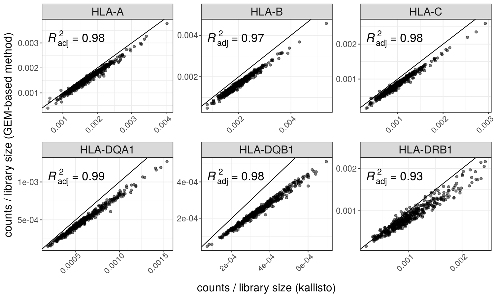

Comparison to Geuvadis' published data
--------------------------------------

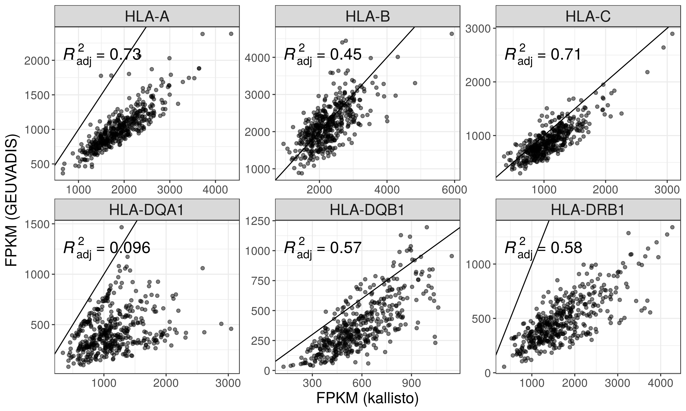

Comparison of different indices
-------------------------------

### HLA diversity vs Reference chromosomes

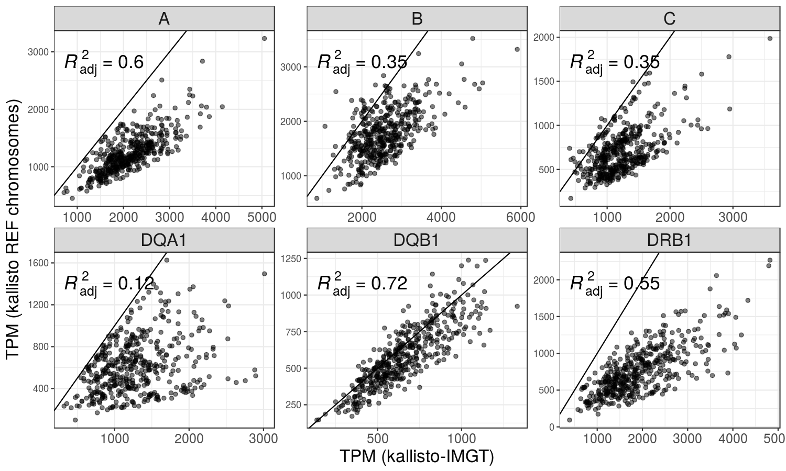

### HLA diversity vs Reference chromosomes + Alternate haplotypes + Patches + Scaffolds

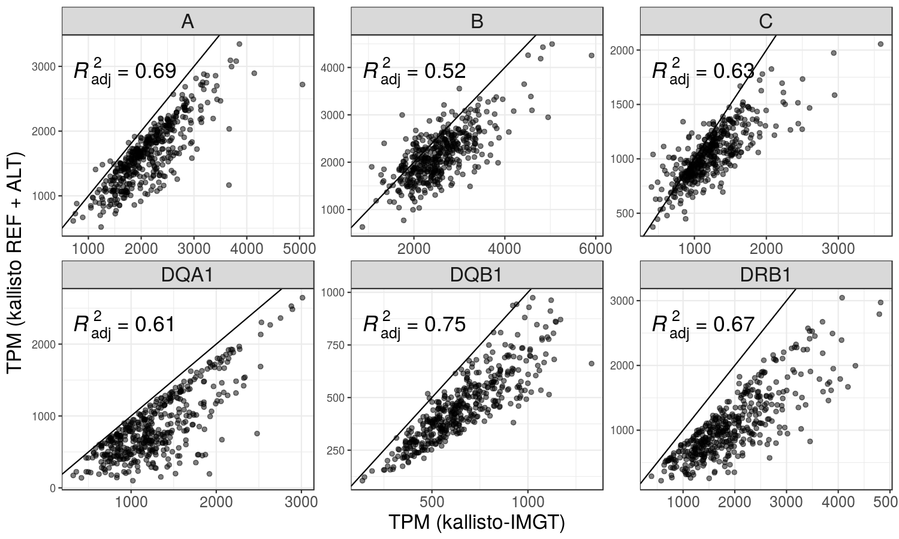

### Distribution of TPM values

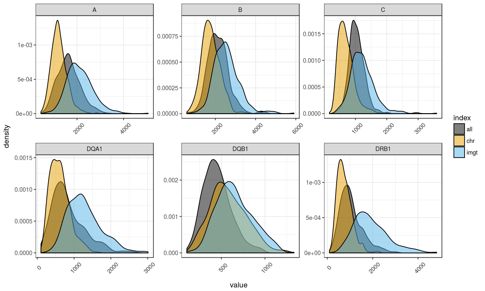

ASE
===

ASE by number of genotype inference errors
------------------------------------------

\*Each point represents a heterozygous genotype in the intersect with Gourraud data.

\*There are more points with extreme ASE associated with genotyping errors because I'm not applying anymore a threshold of expression between 2nd allele/1st allele after the second round of the pipeline.

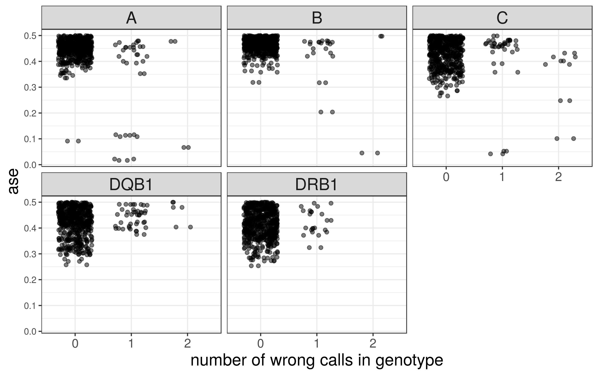

ASE distribution
----------------

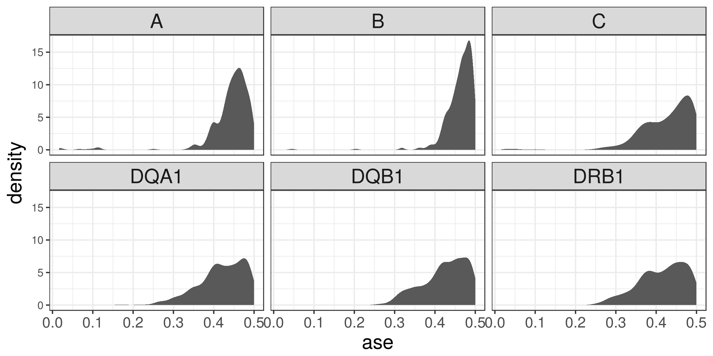

Correlation of expression
=========================

Correlation decreases with the increase in the number of PEER factors/PCs
-------------------------------------------------------------------------

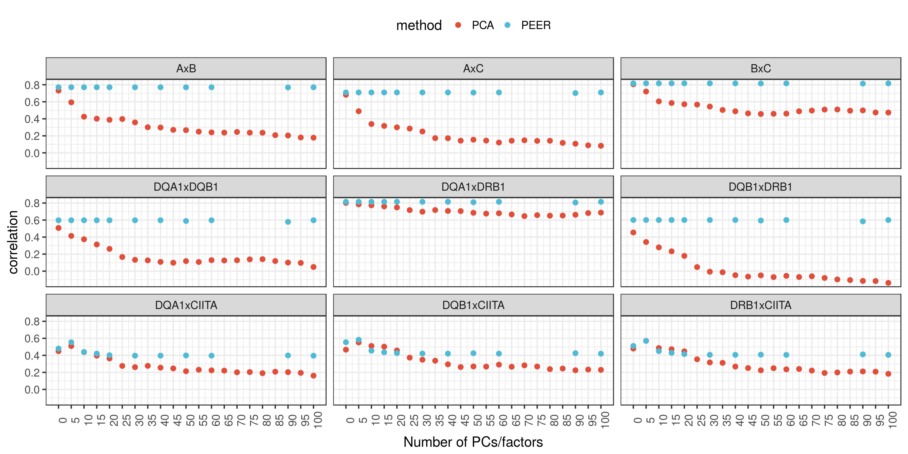

\*Expression data in the plots below correspond to TPM values corrected by 10 PCs

Among the HLA genes
-------------------

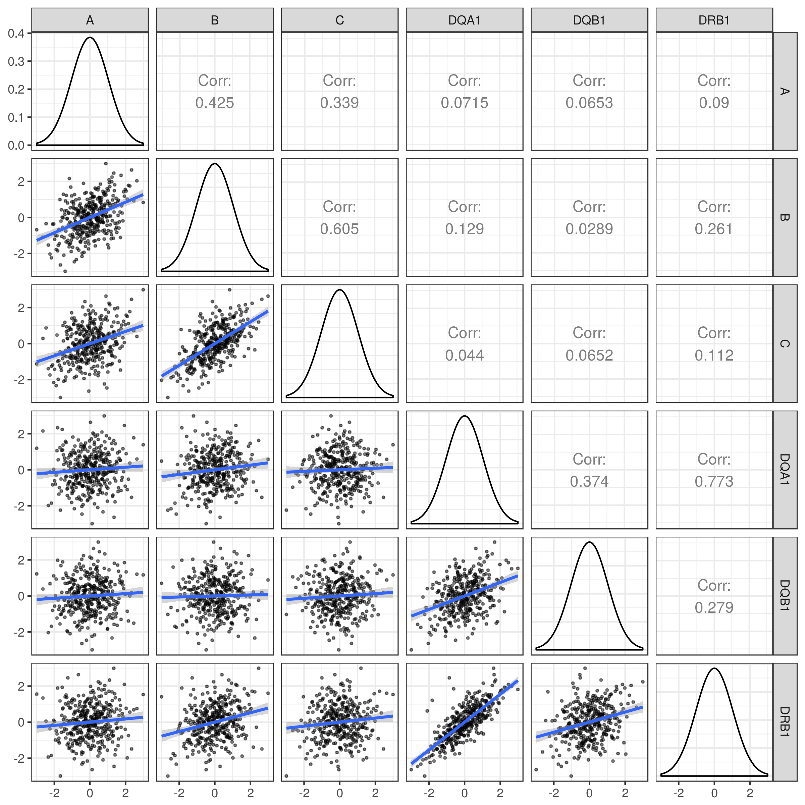

Between Class II genes and CIITA
--------------------------------

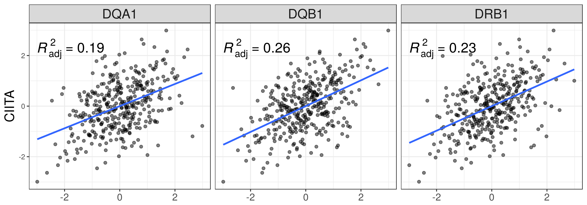

Between pairs of HLA genes on the same vs on different haplotypes
-----------------------------------------------------------------

### HLA-A vs HLA-B

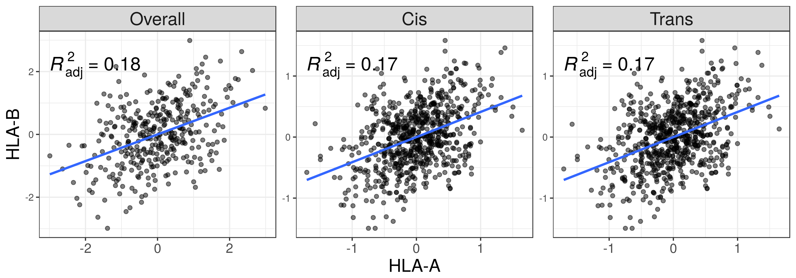

### HLA-A vs HLA-C

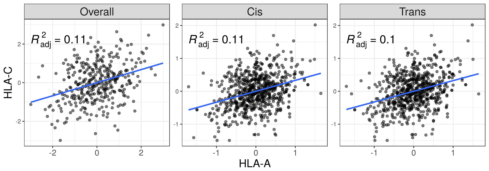

### HLA-B vs HLA-C

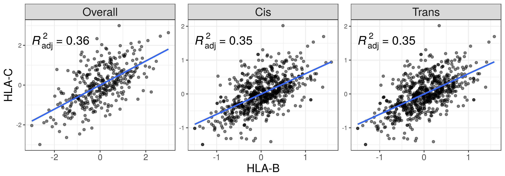

### HLA-DQA1 vs HLA-DQB1

### HLA-DQA1 vs HLA-DRB1

