```{r setup, include=FALSE}
knitr::opts_chunk$set(echo = FALSE, message = FALSE, warning = FALSE, comment = "")
```

```{r pkgs, echo = FALSE}
library(knitr)
library(tidyverse)
```

# Library Sizes and pseudoaligned reads (kallisto)

```{r}
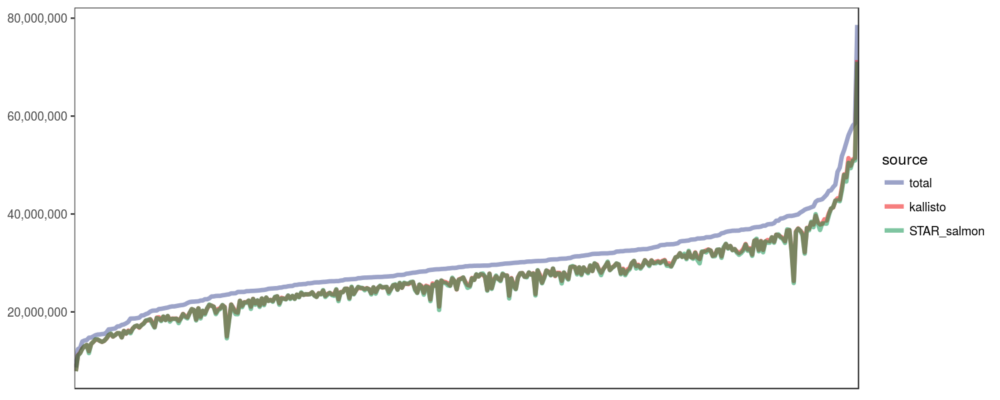
```

# Typing accuracies

\*Concordance: the proportion of the called alleles that are concordant with the Gourraud et al (2014) typings

\*Allele calls were compared at the maximum resolution possible at each pair

```{r}
kallisto_typing <-
  read_tsv("./kallisto/genotyping_accuracies.tsv") %>%
  filter(th_average == max(th_average)) %>%
  filter(th == min(th)) %>%
  select(locus, kallisto = accuracy)

star_typing <-
  read_tsv("./star/genotyping_accuracies.tsv") %>%
  filter(th_average == max(th_average)) %>%
  filter(th == min(th)) %>%
  select(locus, star = accuracy)

left_join(kallisto_typing, star_typing, by = "locus") %>%
  kable()
```

# Expression estimates

## kallisto vs STAR-Salmon

### TPM

```{r}
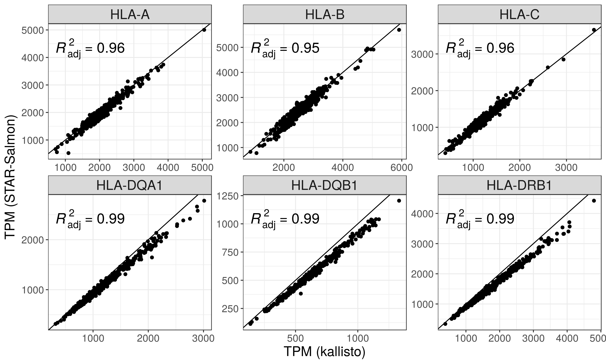
```

### PCA-corrected

```{r}
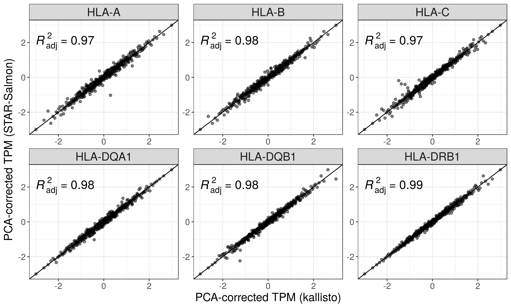
```

## kallisto vs Geuvadis (Published)

```{r}
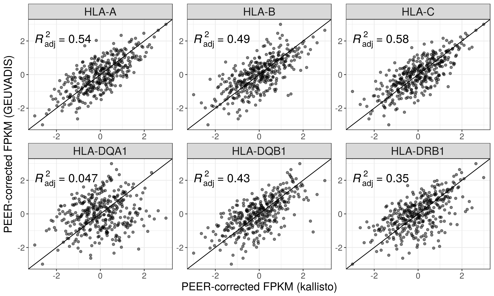
```

## STAR-Salmon vs Geuvadis (Published)

```{r}
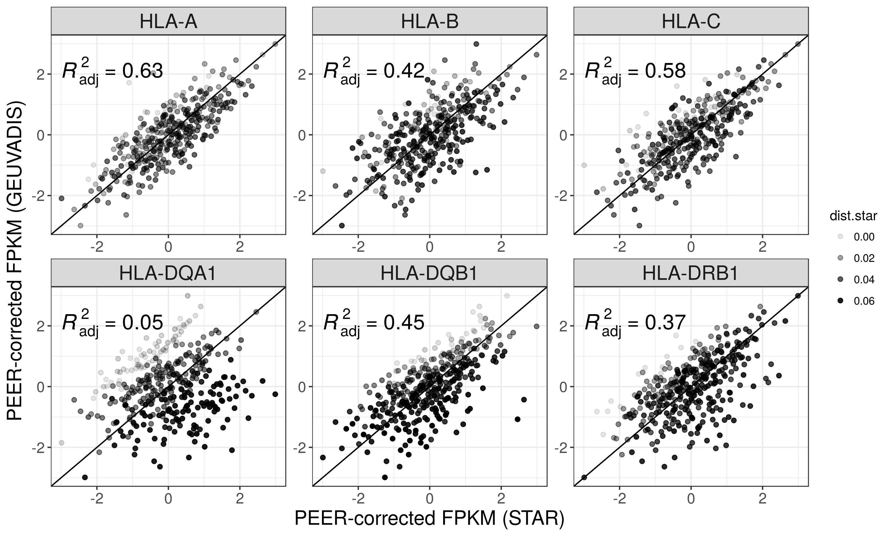
```

## kallisto vs Geuvadis (new quantifications)

```{r}
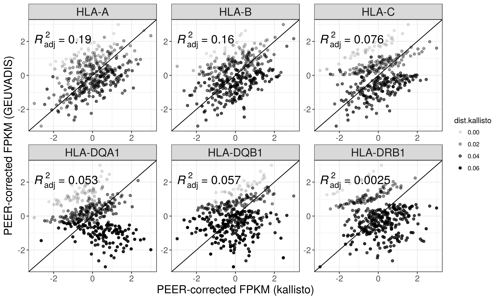
```

## STAR-Salmon vs Geuvadis (new quantifications)

```{r}
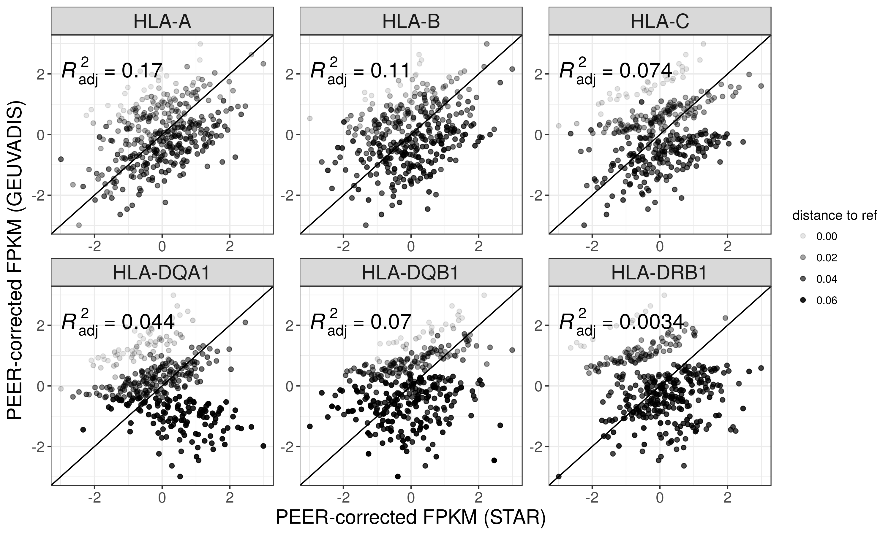
```

## kallisto: HLA diversity vs reference chromosomes only

### TPM

```{r}
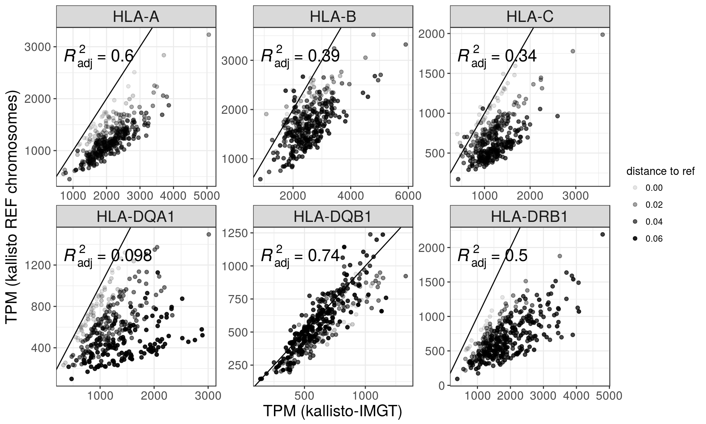
```

### PCA-corrected

```{r}
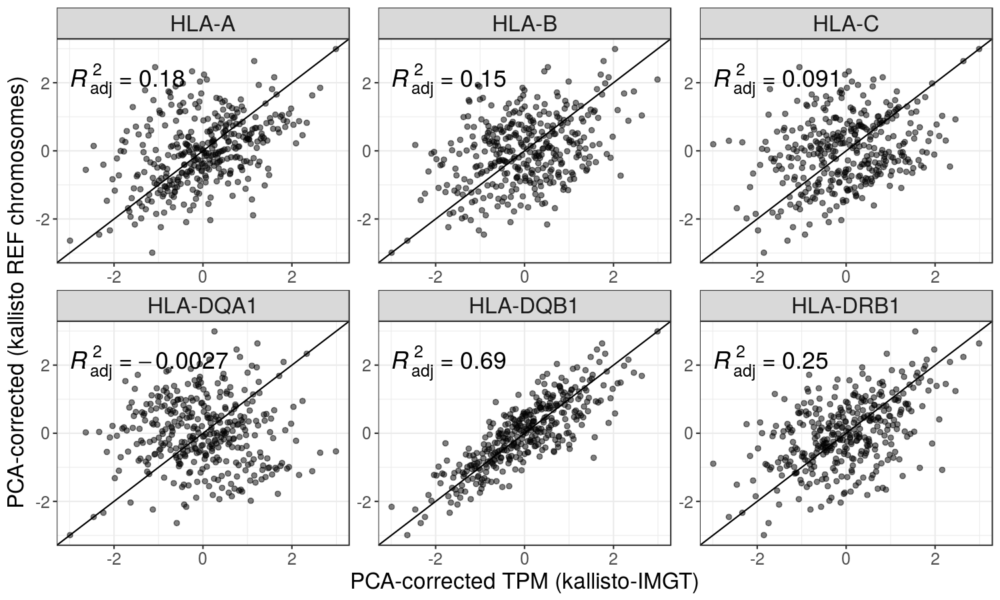
```

## STAR: HLA diversity vs reference chromosomes only

### TPM

```{r}
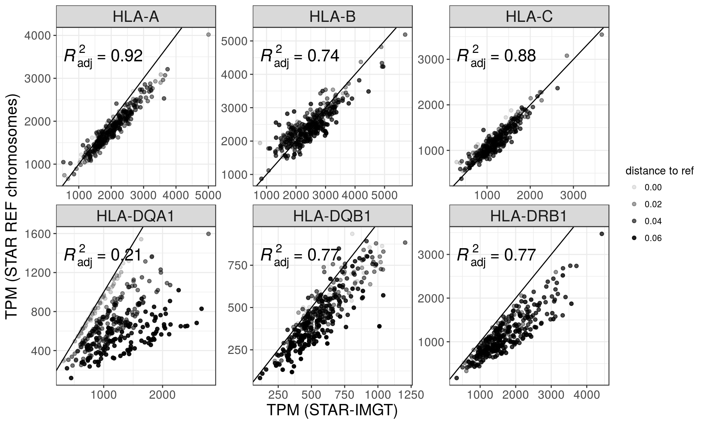
```

### PCA-corrected

```{r}
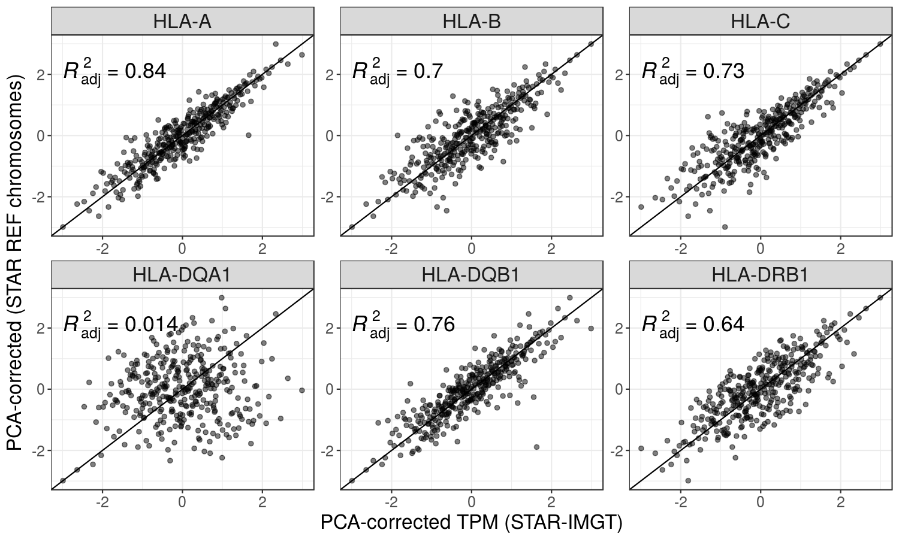
```

### HLA diversity vs reference chromosomes only: R-square by quartile of difference to the reference allele

```{r}
read_tsv("./plots/rsq_by_quartile.tsv") %>%
  rename(quartile = qt_dist) %>%
  mutate_at(vars(3:6), function(x) round(x, 2)) %>%
  kable()
```

## Distribution of TPM values

```{r}
include_graphics("./plots/tpm_distributions.png")
```

# ASE 

## ASE by number of genotyping errors

\*Each point represents a heterozygous genotype in the intersect with Gourraud data.

\*There are more points with extreme ASE associated with genotyping errors because I'm not applying anymore a threshold of expression between 2nd allele/1st allele after the second round of the pipeline.

```{r}
include_graphics("./plots/ase.png")
```

## ASE distribution

```{r}
include_graphics("./plots/ase_histogram.png")
```

# Correlation of expression

## Correlation decreases with the increase in the number of PEER factors/PCs

```{r}
include_graphics("./plots/correlation_decrease.png")
```

\*Expression data in the plots below correspond to TPM values corrected by 10 PCs

## Among the HLA genes

```{r}
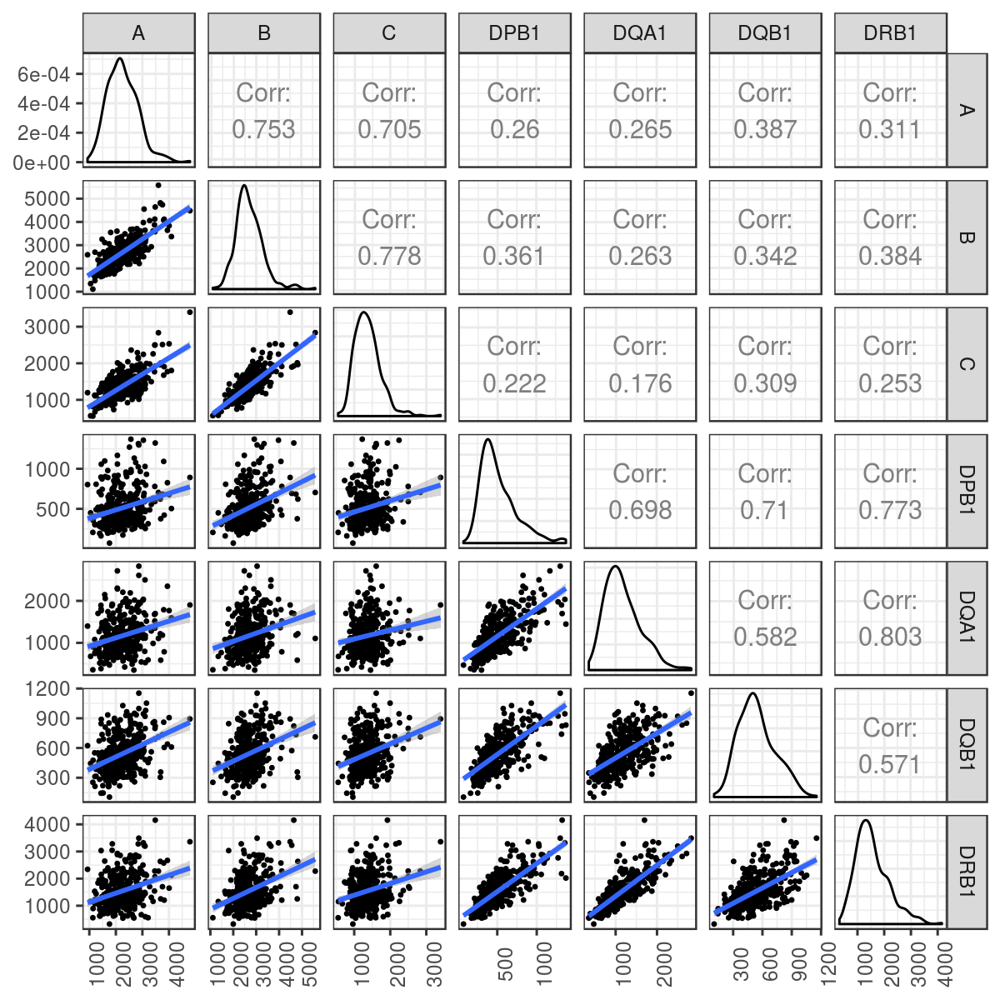
```

## Between Class II genes and CIITA

```{r}
include_graphics("./plots/trans_activ_corrs.png")
```

## Between pairs of HLA genes on the same vs on different haplotypes

### HLA-A vs HLA-B

```{r}
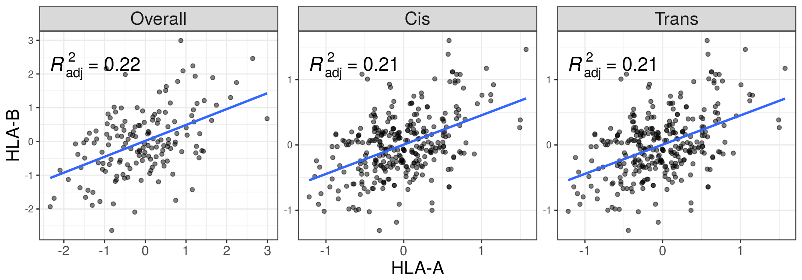
```

### HLA-A vs HLA-C

```{r}
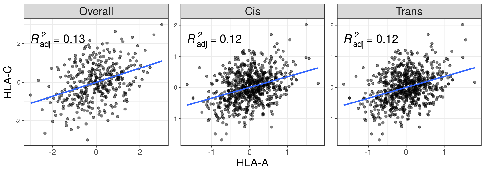
```

### HLA-B vs HLA-C

```{r}
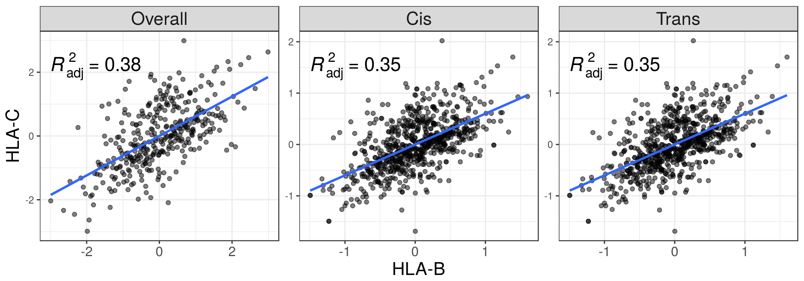
```

### HLA-DQA1 vs HLA-DQB1

```{r}
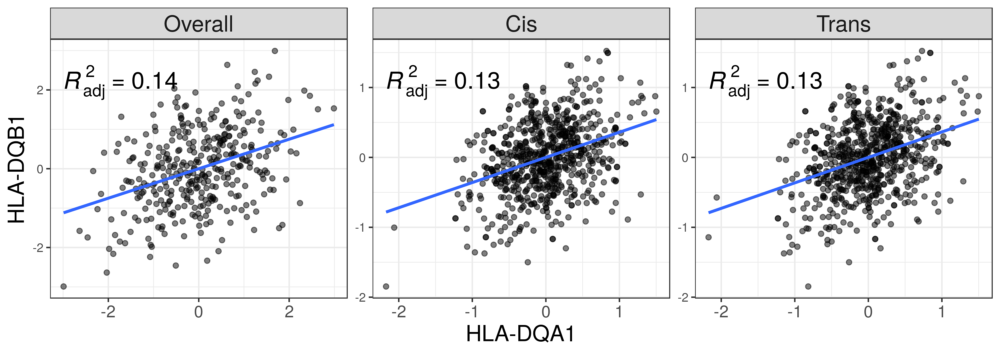
```

### HLA-DQA1 vs HLA-DRB1

```{r}
include_graphics("./plots/dqa_vs_drb.png")
```
