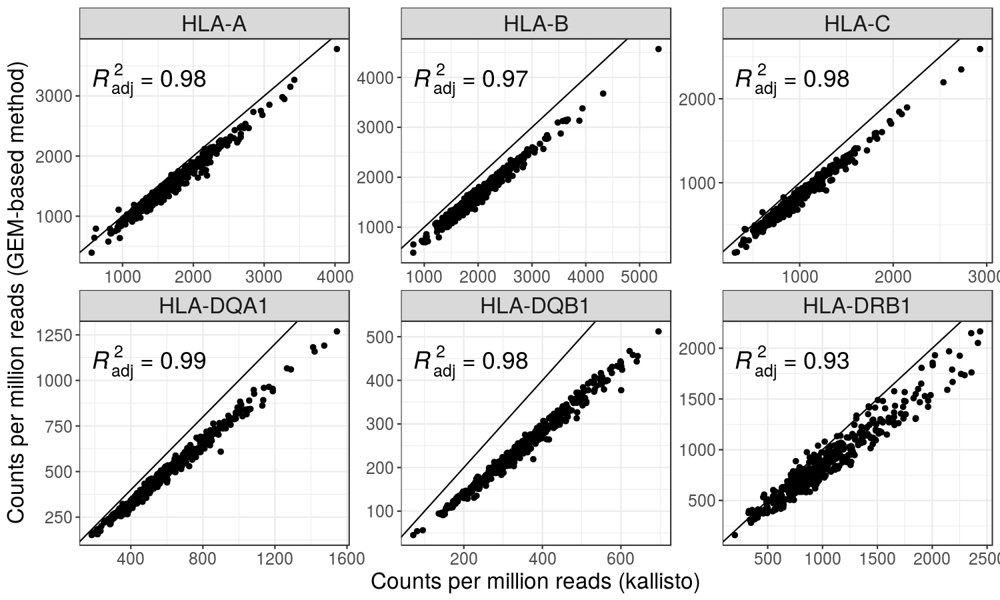
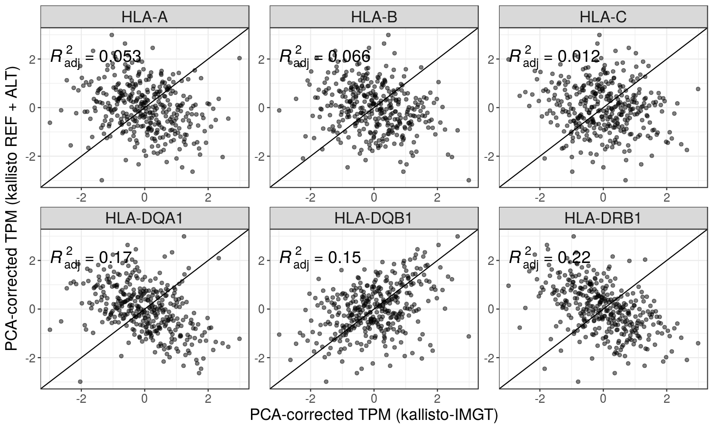

Report
================

Library Sizes and pseudoaligned reads (kallisto)
================================================

Typing accuracies
=================

\*Concordance: the proportion of the called alleles that are concordant with the Gourraud et al (2014) typings

\*Allele calls were compared at the maximum resolution possible at each pair

| locus |  kallisto|  star|
|:------|---------:|-----:|
| A     |      0.97|  0.97|
| B     |      0.98|  0.98|
| C     |      0.95|  0.96|
| DQB1  |      0.95|  0.95|
| DRB1  |      0.98|  0.98|

Expression estimates
====================

kallisto-IMGT vs...
-------------------

### GEM-based hlaTX

### STAR-Salmon

*coming soon*

### Geuvadis' published data

### kallisto – reference chromosomes only

### kallisto – reference chromosomes + alternate haplotypes + patches + scaffolds

**The rest of this document shows kallisto-IMGT data**

Distribution of TPM values
--------------------------

ASE
===

ASE by number of genotype inference errors
------------------------------------------

\*Each point represents a heterozygous genotype in the intersect with Gourraud data.

\*There are more points with extreme ASE associated with genotyping errors because I'm not applying anymore a threshold of expression between 2nd allele/1st allele after the second round of the pipeline.

ASE distribution
----------------

Correlation of expression
=========================

Correlation decreases with the increase in the number of PEER factors/PCs
-------------------------------------------------------------------------

\*Expression data in the plots below correspond to TPM values corrected by 10 PCs

Among the HLA genes
-------------------

Between Class II genes and CIITA
--------------------------------

Between pairs of HLA genes on the same vs on different haplotypes
-----------------------------------------------------------------

### HLA-A vs HLA-B

### HLA-A vs HLA-C

### HLA-B vs HLA-C

### HLA-DQA1 vs HLA-DQB1

### HLA-DQA1 vs HLA-DRB1

