Report on typing errors
================

HG00273
-------

#### Mismatch at A\*11

#### Depth at mismatch positions

    # A tibble: 2 x 7
      subject   kgp_id  locus call    allele            POS DEPTH
      <chr>     <chr>   <chr> <chr>   <chr>           <int> <int>
    1 ERR188034 HG00273 A_2   called  IMGT_A*11:01:79  1077   111
    2 ERR188034 HG00273 A_2   goldStd IMGT_A*11:01:01  1077    23

#### Mismatches to 1000G haplotypes

##### Called

    # A tibble: 4 x 6
      subject   kgp_id  locus allele       hap diffs
      <chr>     <chr>   <chr> <chr>      <int> <int>
    1 ERR188034 HG00273 HLA-A A*03:01:01     1     1
    2 ERR188034 HG00273 HLA-A A*03:01:01     2    13
    3 ERR188034 HG00273 HLA-A A*11:01:79     1    12
    4 ERR188034 HG00273 HLA-A A*11:01:79     2     2

###### Gold

    # A tibble: 4 x 6
      subject   kgp_id  locus allele       hap diffs
      <chr>     <chr>   <chr> <chr>      <int> <int>
    1 ERR188034 HG00273 HLA-A A*03:01:01     1     1
    2 ERR188034 HG00273 HLA-A A*03:01:01     2    13
    3 ERR188034 HG00273 HLA-A A*11:01:01     1    13
    4 ERR188034 HG00273 HLA-A A*11:01:01     2     1

#### Final quantifications with called or gold standard genotypes:

##### Called

    # A tibble: 0 x 5
    # ... with 5 variables: subject <chr>, kgp_id <chr>, locus <chr>,
    #   allele <chr>, est_counts <dbl>

##### Gold

    # A tibble: 0 x 5
    # ... with 5 variables: subject <chr>, kgp_id <chr>, locus <chr>,
    #   allele <chr>, est_counts <dbl>

NA12005
-------

#### Mismatch at B\*27

#### Depth at mismatch positions

    # A tibble: 2 x 7
      subject   kgp_id  locus call    allele            POS DEPTH
      <chr>     <chr>   <chr> <chr>   <chr>           <int> <int>
    1 ERR188058 NA12005 B_2   called  IMGT_B*27:05:02   247  2289
    2 ERR188058 NA12005 B_2   goldStd IMGT_B*27:03      247    29

#### Mismatches to 1000G haplotypes

##### Called

    # A tibble: 4 x 6
      subject   kgp_id  locus allele       hap diffs
      <chr>     <chr>   <chr> <chr>      <int> <int>
    1 ERR188058 NA12005 HLA-B B*07:02:01     1    35
    2 ERR188058 NA12005 HLA-B B*07:02:01     2     0
    3 ERR188058 NA12005 HLA-B B*27:05:02     1     0
    4 ERR188058 NA12005 HLA-B B*27:05:02     2    35

##### Gold

    # A tibble: 4 x 6
      subject   kgp_id  locus allele       hap diffs
      <chr>     <chr>   <chr> <chr>      <int> <int>
    1 ERR188058 NA12005 HLA-B B*07:02:01     1    35
    2 ERR188058 NA12005 HLA-B B*07:02:01     2     0
    3 ERR188058 NA12005 HLA-B B*27:03        1     1
    4 ERR188058 NA12005 HLA-B B*27:03        2    36

#### Final quantifications with called or gold standard genotypes:

##### Called

    # A tibble: 0 x 5
    # ... with 5 variables: subject <chr>, kgp_id <chr>, locus <chr>,
    #   allele <chr>, est_counts <dbl>

##### Gold

    # A tibble: 0 x 5
    # ... with 5 variables: subject <chr>, kgp_id <chr>, locus <chr>,
    #   allele <chr>, est_counts <dbl>

NA11892
-------

#### Mismatch at DQB1\*02

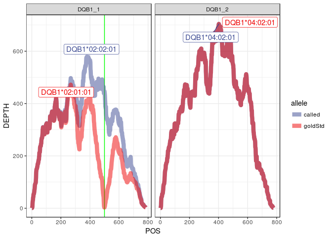

#### Depth at mismatch positions

    # A tibble: 2 x 7
      subject   kgp_id  locus  call    allele               POS DEPTH
      <chr>     <chr>   <chr>  <chr>   <chr>              <int> <int>
    1 ERR188086 NA11892 DQB1_1 called  IMGT_DQB1*02:02:01   500   447
    2 ERR188086 NA11892 DQB1_1 goldStd IMGT_DQB1*02:01:01   500     3

#### Mismatches to 1000G haplotypes

##### Called

    # A tibble: 4 x 6
      subject   kgp_id  locus    allele          hap diffs
      <chr>     <chr>   <chr>    <chr>         <int> <int>
    1 ERR188086 NA11892 HLA-DQB1 DQB1*02:02:01     1     8
    2 ERR188086 NA11892 HLA-DQB1 DQB1*02:02:01     2    22
    3 ERR188086 NA11892 HLA-DQB1 DQB1*04:02:01     1    17
    4 ERR188086 NA11892 HLA-DQB1 DQB1*04:02:01     2     1

##### Gold

    # A tibble: 4 x 6
      subject   kgp_id  locus    allele          hap diffs
      <chr>     <chr>   <chr>    <chr>         <int> <int>
    1 ERR188086 NA11892 HLA-DQB1 DQB1*02:01:01     1     9
    2 ERR188086 NA11892 HLA-DQB1 DQB1*02:01:01     2    21
    3 ERR188086 NA11892 HLA-DQB1 DQB1*04:02:01     1    17
    4 ERR188086 NA11892 HLA-DQB1 DQB1*04:02:01     2     1

#### Final quantifications with called or gold standard genotypes:

##### Called

    # A tibble: 0 x 5
    # ... with 5 variables: subject <chr>, kgp_id <chr>, locus <chr>,
    #   allele <chr>, est_counts <dbl>

##### Gold

    # A tibble: 0 x 5
    # ... with 5 variables: subject <chr>, kgp_id <chr>, locus <chr>,
    #   allele <chr>, est_counts <dbl>

### HG00256

#### Mismatch at DQB1\*02

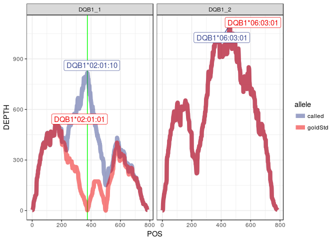

#### Depth at mismatch positions

    # A tibble: 2 x 7
      subject   kgp_id  locus  call    allele               POS DEPTH
      <chr>     <chr>   <chr>  <chr>   <chr>              <int> <int>
    1 ERR188091 HG00256 DQB1_1 called  IMGT_DQB1*02:01:10   375   815
    2 ERR188091 HG00256 DQB1_1 goldStd IMGT_DQB1*02:01:01   375     2

#### Mismatches to 1000G haplotypes

##### Called

    # A tibble: 4 x 6
      subject   kgp_id  locus    allele          hap diffs
      <chr>     <chr>   <chr>    <chr>         <int> <int>
    1 ERR188091 HG00256 HLA-DQB1 DQB1*02:01:10     1    13
    2 ERR188091 HG00256 HLA-DQB1 DQB1*02:01:10     2    13
    3 ERR188091 HG00256 HLA-DQB1 DQB1*06:03:01     1     0
    4 ERR188091 HG00256 HLA-DQB1 DQB1*06:03:01     2     0

##### Gold

    # A tibble: 4 x 6
      subject   kgp_id  locus    allele          hap diffs
      <chr>     <chr>   <chr>    <chr>         <int> <int>
    1 ERR188091 HG00256 HLA-DQB1 DQB1*02:01:01     1    26
    2 ERR188091 HG00256 HLA-DQB1 DQB1*02:01:01     2    19
    3 ERR188091 HG00256 HLA-DQB1 DQB1*06:03:01     1     0
    4 ERR188091 HG00256 HLA-DQB1 DQB1*06:03:01     2     9

#### Final quantifications with called or gold standard genotypes:

##### Called

    # A tibble: 0 x 5
    # ... with 5 variables: subject <chr>, kgp_id <chr>, locus <chr>,
    #   allele <chr>, est_counts <dbl>

##### Gold

    # A tibble: 0 x 5
    # ... with 5 variables: subject <chr>, kgp_id <chr>, locus <chr>,
    #   allele <chr>, est_counts <dbl>

NA10847
-------

#### Mismatch at C\*07

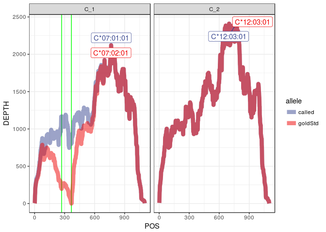

#### Depth at mismatch positions

    # A tibble: 4 x 7
      subject   kgp_id  locus call    allele            POS DEPTH
      <chr>     <chr>   <chr> <chr>   <chr>           <int> <int>
    1 ERR188101 NA10847 C_1   called  IMGT_C*07:01:01   270  1151
    2 ERR188101 NA10847 C_1   called  IMGT_C*07:01:01   368   819
    3 ERR188101 NA10847 C_1   goldStd IMGT_C*07:02:01   270   197
    4 ERR188101 NA10847 C_1   goldStd IMGT_C*07:02:01   368     0

#### Mismatches to 1000G haplotypes

##### Called

    # A tibble: 4 x 6
      subject   kgp_id  locus allele       hap diffs
      <chr>     <chr>   <chr> <chr>      <int> <int>
    1 ERR188101 NA10847 HLA-C C*07:01:01     1     1
    2 ERR188101 NA10847 HLA-C C*07:01:01     2    31
    3 ERR188101 NA10847 HLA-C C*12:03:01     1    31
    4 ERR188101 NA10847 HLA-C C*12:03:01     2     1

##### Gold

    # A tibble: 4 x 6
      subject   kgp_id  locus allele       hap diffs
      <chr>     <chr>   <chr> <chr>      <int> <int>
    1 ERR188101 NA10847 HLA-C C*07:02:01     1     3
    2 ERR188101 NA10847 HLA-C C*07:02:01     2    31
    3 ERR188101 NA10847 HLA-C C*12:03:01     1    31
    4 ERR188101 NA10847 HLA-C C*12:03:01     2     1

#### Final quantifications with called or gold standard genotypes:

##### Called

    # A tibble: 0 x 5
    # ... with 5 variables: subject <chr>, kgp_id <chr>, locus <chr>,
    #   allele <chr>, est_counts <dbl>

##### Gold

    # A tibble: 0 x 5
    # ... with 5 variables: subject <chr>, kgp_id <chr>, locus <chr>,
    #   allele <chr>, est_counts <dbl>

NA20534
-------

#### Mismatch at A\*11

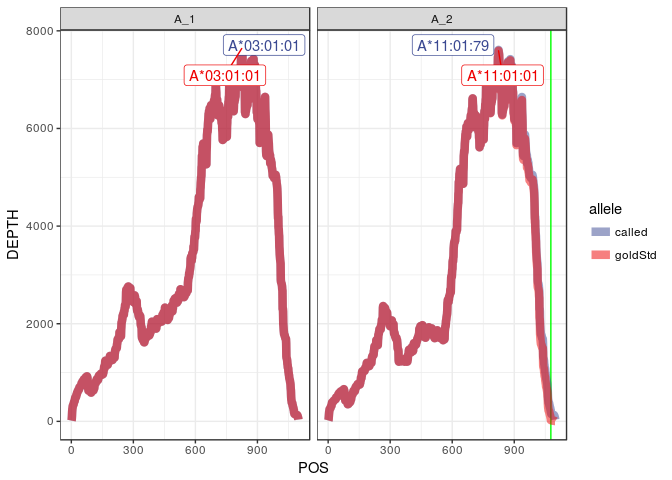

#### Depth at mismatch positions

    # A tibble: 2 x 7
      subject   kgp_id  locus call    allele            POS DEPTH
      <chr>     <chr>   <chr> <chr>   <chr>           <int> <int>
    1 ERR188114 NA20534 A_2   called  IMGT_A*11:01:79  1077   186
    2 ERR188114 NA20534 A_2   goldStd IMGT_A*11:01:01  1077    26

#### Mismatches to 1000G haplotypes

##### Called

    # A tibble: 4 x 6
      subject   kgp_id  locus allele       hap diffs
      <chr>     <chr>   <chr> <chr>      <int> <int>
    1 ERR188114 NA20534 HLA-A A*03:01:01     1    10
    2 ERR188114 NA20534 HLA-A A*03:01:01     2     1
    3 ERR188114 NA20534 HLA-A A*11:01:79     1     7
    4 ERR188114 NA20534 HLA-A A*11:01:79     2    12

##### Gold

    # A tibble: 4 x 6
      subject   kgp_id  locus allele       hap diffs
      <chr>     <chr>   <chr> <chr>      <int> <int>
    1 ERR188114 NA20534 HLA-A A*03:01:01     1    10
    2 ERR188114 NA20534 HLA-A A*03:01:01     2     1
    3 ERR188114 NA20534 HLA-A A*11:01:01     1     6
    4 ERR188114 NA20534 HLA-A A*11:01:01     2    13

#### Final quantifications with called or gold standard genotypes:

##### Called

    # A tibble: 0 x 5
    # ... with 5 variables: subject <chr>, kgp_id <chr>, locus <chr>,
    #   allele <chr>, est_counts <dbl>

##### Gold

    # A tibble: 0 x 5
    # ... with 5 variables: subject <chr>, kgp_id <chr>, locus <chr>,
    #   allele <chr>, est_counts <dbl>

HG00311
-------

Mismatch at A\*11
-----------------

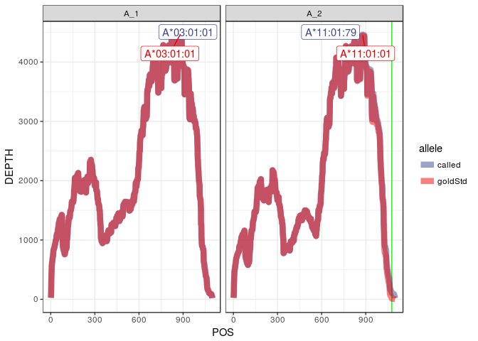

#### Depth at mismatch positions

    # A tibble: 2 x 7
      subject   kgp_id  locus call    allele            POS DEPTH
      <chr>     <chr>   <chr> <chr>   <chr>           <int> <int>
    1 ERR188121 HG00311 A_2   called  IMGT_A*11:01:79  1077   107
    2 ERR188121 HG00311 A_2   goldStd IMGT_A*11:01:01  1077    12

#### Mismatches to 1000G haplotypes

##### Called

    # A tibble: 4 x 6
      subject   kgp_id  locus allele       hap diffs
      <chr>     <chr>   <chr> <chr>      <int> <int>
    1 ERR188121 HG00311 HLA-A A*03:01:01     1     1
    2 ERR188121 HG00311 HLA-A A*03:01:01     2    11
    3 ERR188121 HG00311 HLA-A A*11:01:79     1    12
    4 ERR188121 HG00311 HLA-A A*11:01:79     2     4

##### Gold

    # A tibble: 4 x 6
      subject   kgp_id  locus allele       hap diffs
      <chr>     <chr>   <chr> <chr>      <int> <int>
    1 ERR188121 HG00311 HLA-A A*03:01:01     1     1
    2 ERR188121 HG00311 HLA-A A*03:01:01     2    11
    3 ERR188121 HG00311 HLA-A A*11:01:01     1    13
    4 ERR188121 HG00311 HLA-A A*11:01:01     2     3

#### Final quantifications with called or gold standard genotypes:

##### Called

    # A tibble: 0 x 5
    # ... with 5 variables: subject <chr>, kgp_id <chr>, locus <chr>,
    #   allele <chr>, est_counts <dbl>

##### Gold

    # A tibble: 0 x 5
    # ... with 5 variables: subject <chr>, kgp_id <chr>, locus <chr>,
    #   allele <chr>, est_counts <dbl>

HG00261
-------

#### False heterozygote DQB1\*05 in our calls

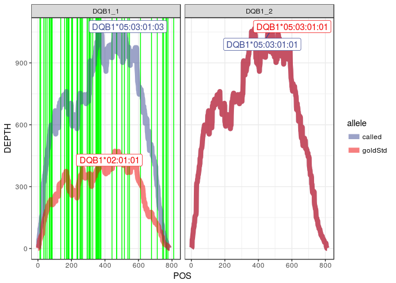

#### Depth at mismatch positions

    # A tibble: 126 x 7
       subject   kgp_id  locus  call   allele                  POS DEPTH
       <chr>     <chr>   <chr>  <chr>  <chr>                 <int> <int>
     1 ERR188130 HG00261 DQB1_1 called IMGT_DQB1*05:03:01:03    12    96
     2 ERR188130 HG00261 DQB1_1 called IMGT_DQB1*05:03:01:03    16   106
     3 ERR188130 HG00261 DQB1_1 called IMGT_DQB1*05:03:01:03    35   320
     4 ERR188130 HG00261 DQB1_1 called IMGT_DQB1*05:03:01:03    44   372
     5 ERR188130 HG00261 DQB1_1 called IMGT_DQB1*05:03:01:03    54   442
     6 ERR188130 HG00261 DQB1_1 called IMGT_DQB1*05:03:01:03    67   529
     7 ERR188130 HG00261 DQB1_1 called IMGT_DQB1*05:03:01:03    72   558
     8 ERR188130 HG00261 DQB1_1 called IMGT_DQB1*05:03:01:03    79   599
     9 ERR188130 HG00261 DQB1_1 called IMGT_DQB1*05:03:01:03    82   595
    10 ERR188130 HG00261 DQB1_1 called IMGT_DQB1*05:03:01:03    85   588
    # ... with 116 more rows

#### Mismatches to 1000G haplotypes

##### Called

    # A tibble: 2 x 6
      subject   kgp_id  locus    allele          hap diffs
      <chr>     <chr>   <chr>    <chr>         <int> <int>
    1 ERR188130 HG00261 HLA-DQB1 DQB1*05:03:01     1     0
    2 ERR188130 HG00261 HLA-DQB1 DQB1*05:03:01     2    42

##### Gold

    # A tibble: 4 x 6
      subject   kgp_id  locus    allele          hap diffs
      <chr>     <chr>   <chr>    <chr>         <int> <int>
    1 ERR188130 HG00261 HLA-DQB1 DQB1*02:01:01     1    35
    2 ERR188130 HG00261 HLA-DQB1 DQB1*02:01:01     2    14
    3 ERR188130 HG00261 HLA-DQB1 DQB1*05:03:01     1     0
    4 ERR188130 HG00261 HLA-DQB1 DQB1*05:03:01     2    21

#### Final quantifications with called or gold standard genotypes:

##### Called

    # A tibble: 0 x 5
    # ... with 5 variables: subject <chr>, kgp_id <chr>, locus <chr>,
    #   allele <chr>, est_counts <dbl>

##### Gold

    # A tibble: 0 x 5
    # ... with 5 variables: subject <chr>, kgp_id <chr>, locus <chr>,
    #   allele <chr>, est_counts <dbl>

NA12287
-------

### Mismatch at B\*51

#### Depth at mismatch positions

    # A tibble: 64 x 7
       subject   kgp_id  locus call   allele            POS DEPTH
       <chr>     <chr>   <chr> <chr>  <chr>           <int> <int>
     1 ERR188142 NA12287 B_2   called IMGT_B*51:01:01    41   228
     2 ERR188142 NA12287 B_2   called IMGT_B*51:01:01    45   256
     3 ERR188142 NA12287 B_2   called IMGT_B*51:01:01    48   266
     4 ERR188142 NA12287 B_2   called IMGT_B*51:01:01    49   278
     5 ERR188142 NA12287 B_2   called IMGT_B*51:01:01   141   475
     6 ERR188142 NA12287 B_2   called IMGT_B*51:01:01   206   586
     7 ERR188142 NA12287 B_2   called IMGT_B*51:01:01   209   599
     8 ERR188142 NA12287 B_2   called IMGT_B*51:01:01   259  1036
     9 ERR188142 NA12287 B_2   called IMGT_B*51:01:01   261  1058
    10 ERR188142 NA12287 B_2   called IMGT_B*51:01:01   272  1179
    # ... with 54 more rows

#### Mismatches to 1000G haplotypes

##### Called

    # A tibble: 4 x 6
      subject   kgp_id  locus allele       hap diffs
      <chr>     <chr>   <chr> <chr>      <int> <int>
    1 ERR188142 NA12287 HLA-B B*15:01:01     1    30
    2 ERR188142 NA12287 HLA-B B*15:01:01     2     2
    3 ERR188142 NA12287 HLA-B B*51:01:01     1     1
    4 ERR188142 NA12287 HLA-B B*51:01:01     2    30

##### Gold

    # A tibble: 2 x 6
      subject   kgp_id  locus allele       hap diffs
      <chr>     <chr>   <chr> <chr>      <int> <int>
    1 ERR188142 NA12287 HLA-B B*15:01:01     1    60
    2 ERR188142 NA12287 HLA-B B*15:01:01     2     4

#### Final quantifications with called or gold standard genotypes:

##### Called

    # A tibble: 0 x 5
    # ... with 5 variables: subject <chr>, kgp_id <chr>, locus <chr>,
    #   allele <chr>, est_counts <dbl>

##### Gold

    # A tibble: 0 x 5
    # ... with 5 variables: subject <chr>, kgp_id <chr>, locus <chr>,
    #   allele <chr>, est_counts <dbl>

NA11918
-------

#### Mismatch at A\*02

#### Depth at mismatch positions

    # A tibble: 8 x 7
      subject   kgp_id  locus call    allele            POS DEPTH
      <chr>     <chr>   <chr> <chr>   <chr>           <int> <int>
    1 ERR188161 NA11918 A_2   called  IMGT_A*02:17:01    15  1144
    2 ERR188161 NA11918 A_2   called  IMGT_A*02:17:01   355     0
    3 ERR188161 NA11918 A_2   called  IMGT_A*02:17:01   362     0
    4 ERR188161 NA11918 A_2   called  IMGT_A*02:17:01   368     1
    5 ERR188161 NA11918 A_2   goldStd IMGT_A*02:01:01    15     6
    6 ERR188161 NA11918 A_2   goldStd IMGT_A*02:01:01   355  2811
    7 ERR188161 NA11918 A_2   goldStd IMGT_A*02:01:01   362  3089
    8 ERR188161 NA11918 A_2   goldStd IMGT_A*02:01:01   368  3191

#### Mismatches to 1000G haplotypes

##### Called

    # A tibble: 4 x 6
      subject   kgp_id  locus allele       hap diffs
      <chr>     <chr>   <chr> <chr>      <int> <int>
    1 ERR188161 NA11918 HLA-A A*01:01:01     1    37
    2 ERR188161 NA11918 HLA-A A*01:01:01     2     1
    3 ERR188161 NA11918 HLA-A A*02:17:01     1     8
    4 ERR188161 NA11918 HLA-A A*02:17:01     2    38

##### Gold

    # A tibble: 4 x 6
      subject   kgp_id  locus allele       hap diffs
      <chr>     <chr>   <chr> <chr>      <int> <int>
    1 ERR188161 NA11918 HLA-A A*01:01:01     1    37
    2 ERR188161 NA11918 HLA-A A*01:01:01     2     1
    3 ERR188161 NA11918 HLA-A A*02:01:01     1     6
    4 ERR188161 NA11918 HLA-A A*02:01:01     2    37

#### Final quantifications with called or gold standard genotypes:

##### Called

    # A tibble: 0 x 5
    # ... with 5 variables: subject <chr>, kgp_id <chr>, locus <chr>,
    #   allele <chr>, est_counts <dbl>

##### Gold

    # A tibble: 0 x 5
    # ... with 5 variables: subject <chr>, kgp_id <chr>, locus <chr>,
    #   allele <chr>, est_counts <dbl>

NA07357
-------

#### Mismatch at C\*07

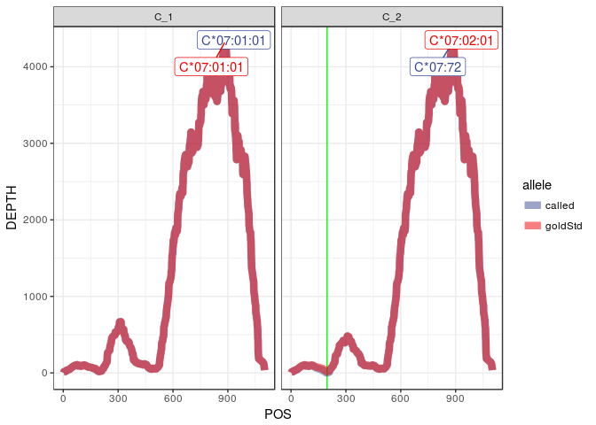

#### Depth at mismatch positions

    # A tibble: 2 x 7
      subject   kgp_id  locus call    allele            POS DEPTH
      <chr>     <chr>   <chr> <chr>   <chr>           <int> <int>
    1 ERR188176 NA07357 C_2   called  IMGT_C*07:72      197     1
    2 ERR188176 NA07357 C_2   goldStd IMGT_C*07:02:01   197    18

#### Mismatches to 1000G haplotypes

##### Called

    # A tibble: 4 x 6
      subject   kgp_id  locus allele       hap diffs
      <chr>     <chr>   <chr> <chr>      <int> <int>
    1 ERR188176 NA07357 HLA-C C*07:01:01     1     3
    2 ERR188176 NA07357 HLA-C C*07:01:01     2     2
    3 ERR188176 NA07357 HLA-C C*07:72        1     1
    4 ERR188176 NA07357 HLA-C C*07:72        2     4

##### Gold

    # A tibble: 4 x 6
      subject   kgp_id  locus allele       hap diffs
      <chr>     <chr>   <chr> <chr>      <int> <int>
    1 ERR188176 NA07357 HLA-C C*07:01:01     1     3
    2 ERR188176 NA07357 HLA-C C*07:01:01     2     2
    3 ERR188176 NA07357 HLA-C C*07:02:01     1     1
    4 ERR188176 NA07357 HLA-C C*07:02:01     2     4

#### Final quantifications with called or gold standard genotypes:

##### Called

    # A tibble: 0 x 5
    # ... with 5 variables: subject <chr>, kgp_id <chr>, locus <chr>,
    #   allele <chr>, est_counts <dbl>

##### Gold

    # A tibble: 0 x 5
    # ... with 5 variables: subject <chr>, kgp_id <chr>, locus <chr>,
    #   allele <chr>, est_counts <dbl>

NA12234
-------

#### Mismatch at DQB1\*02

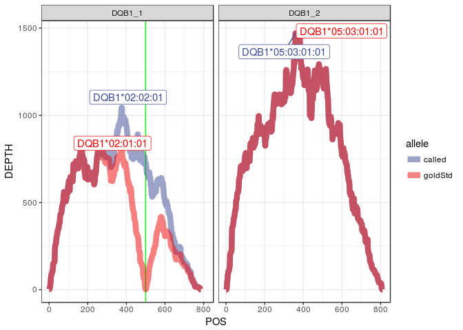

#### Depth at mismatch positions

    # A tibble: 2 x 7
      subject   kgp_id  locus  call    allele               POS DEPTH
      <chr>     <chr>   <chr>  <chr>   <chr>              <int> <int>
    1 ERR188177 NA12234 DQB1_1 called  IMGT_DQB1*02:02:01   500   730
    2 ERR188177 NA12234 DQB1_1 goldStd IMGT_DQB1*02:01:01   500     2

#### Mismatches to 1000G haplotypes

##### Called

    # A tibble: 4 x 6
      subject   kgp_id  locus    allele          hap diffs
      <chr>     <chr>   <chr>    <chr>         <int> <int>
    1 ERR188177 NA12234 HLA-DQB1 DQB1*02:02:01     1    36
    2 ERR188177 NA12234 HLA-DQB1 DQB1*02:02:01     2    14
    3 ERR188177 NA12234 HLA-DQB1 DQB1*05:03:01     1     0
    4 ERR188177 NA12234 HLA-DQB1 DQB1*05:03:01     2    22

##### Gold

    # A tibble: 4 x 6
      subject   kgp_id  locus    allele          hap diffs
      <chr>     <chr>   <chr>    <chr>         <int> <int>
    1 ERR188177 NA12234 HLA-DQB1 DQB1*02:01:01     1    35
    2 ERR188177 NA12234 HLA-DQB1 DQB1*02:01:01     2    15
    3 ERR188177 NA12234 HLA-DQB1 DQB1*05:03:01     1     0
    4 ERR188177 NA12234 HLA-DQB1 DQB1*05:03:01     2    22

#### Final quantifications with called or gold standard genotypes:

##### Called

    # A tibble: 0 x 5
    # ... with 5 variables: subject <chr>, kgp_id <chr>, locus <chr>,
    #   allele <chr>, est_counts <dbl>

##### Gold

    # A tibble: 0 x 5
    # ... with 5 variables: subject <chr>, kgp_id <chr>, locus <chr>,
    #   allele <chr>, est_counts <dbl>

HG00115
-------

#### Mismatch at A\*11

#### Depth at mismatch positions

    # A tibble: 2 x 7
      subject   kgp_id  locus call    allele            POS DEPTH
      <chr>     <chr>   <chr> <chr>   <chr>           <int> <int>
    1 ERR188186 HG00115 A_2   called  IMGT_A*11:01:79  1077   242
    2 ERR188186 HG00115 A_2   goldStd IMGT_A*11:01:01  1077    55

#### Mismatches to 1000G haplotypes

##### Called

    # A tibble: 4 x 6
      subject   kgp_id  locus allele       hap diffs
      <chr>     <chr>   <chr> <chr>      <int> <int>
    1 ERR188186 HG00115 HLA-A A*03:01:01     1    14
    2 ERR188186 HG00115 HLA-A A*03:01:01     2     1
    3 ERR188186 HG00115 HLA-A A*11:01:79     1     3
    4 ERR188186 HG00115 HLA-A A*11:01:79     2    12

##### Gold

    # A tibble: 4 x 6
      subject   kgp_id  locus allele       hap diffs
      <chr>     <chr>   <chr> <chr>      <int> <int>
    1 ERR188186 HG00115 HLA-A A*03:01:01     1    14
    2 ERR188186 HG00115 HLA-A A*03:01:01     2     1
    3 ERR188186 HG00115 HLA-A A*11:01:01     1     2
    4 ERR188186 HG00115 HLA-A A*11:01:01     2    13

#### Final quantifications with called or gold standard genotypes:

##### Called

    # A tibble: 0 x 5
    # ... with 5 variables: subject <chr>, kgp_id <chr>, locus <chr>,
    #   allele <chr>, est_counts <dbl>

##### Gold

    # A tibble: 0 x 5
    # ... with 5 variables: subject <chr>, kgp_id <chr>, locus <chr>,
    #   allele <chr>, est_counts <dbl>

HG00171
-------

#### Mismatch at C\*06

#### Depth at mismatch positions

    # A tibble: 2 x 7
      subject   kgp_id  locus call    allele            POS DEPTH
      <chr>     <chr>   <chr> <chr>   <chr>           <int> <int>
    1 ERR188190 HG00171 C_1   called  IMGT_C*06:135     190     1
    2 ERR188190 HG00171 C_1   goldStd IMGT_C*06:02:01   190     4

#### Mismatches to 1000G haplotypes

##### Called

    # A tibble: 4 x 6
      subject   kgp_id  locus allele       hap diffs
      <chr>     <chr>   <chr> <chr>      <int> <int>
    1 ERR188190 HG00171 HLA-C C*06:135       1     5
    2 ERR188190 HG00171 HLA-C C*06:135       2    17
    3 ERR188190 HG00171 HLA-C C*15:02:01     1    22
    4 ERR188190 HG00171 HLA-C C*15:02:01     2     2

##### Gold

    # A tibble: 4 x 6
      subject   kgp_id  locus allele       hap diffs
      <chr>     <chr>   <chr> <chr>      <int> <int>
    1 ERR188190 HG00171 HLA-C C*06:02:01     1     5
    2 ERR188190 HG00171 HLA-C C*06:02:01     2    18
    3 ERR188190 HG00171 HLA-C C*15:02:01     1    23
    4 ERR188190 HG00171 HLA-C C*15:02:01     2     2

#### Final quantifications with called or gold standard genotypes:

##### Called

    # A tibble: 0 x 5
    # ... with 5 variables: subject <chr>, kgp_id <chr>, locus <chr>,
    #   allele <chr>, est_counts <dbl>

##### Gold

    # A tibble: 0 x 5
    # ... with 5 variables: subject <chr>, kgp_id <chr>, locus <chr>,
    #   allele <chr>, est_counts <dbl>

NA20585
-------

#### Mismatch at A\*24 and C\*07

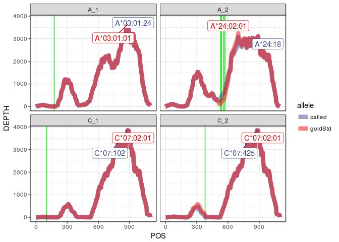

#### Depth at mismatch positions

    # A tibble: 18 x 7
       subject   kgp_id  locus call    allele            POS DEPTH
       <chr>     <chr>   <chr> <chr>   <chr>           <int> <int>
     1 ERR188199 NA20585 A_1   called  IMGT_A*03:01:24   175     1
     2 ERR188199 NA20585 A_1   goldStd IMGT_A*03:01:01   175     2
     3 ERR188199 NA20585 A_2   called  IMGT_A*24:18      527   314
     4 ERR188199 NA20585 A_2   called  IMGT_A*24:18      538   461
     5 ERR188199 NA20585 A_2   called  IMGT_A*24:18      539   485
     6 ERR188199 NA20585 A_2   called  IMGT_A*24:18      555   579
     7 ERR188199 NA20585 A_2   called  IMGT_A*24:18      570   679
     8 ERR188199 NA20585 A_2   called  IMGT_A*24:18      571   696
     9 ERR188199 NA20585 A_2   goldStd IMGT_A*24:02:01   527   123
    10 ERR188199 NA20585 A_2   goldStd IMGT_A*24:02:01   538   203
    11 ERR188199 NA20585 A_2   goldStd IMGT_A*24:02:01   539   233
    12 ERR188199 NA20585 A_2   goldStd IMGT_A*24:02:01   555   289
    13 ERR188199 NA20585 A_2   goldStd IMGT_A*24:02:01   570   499
    14 ERR188199 NA20585 A_2   goldStd IMGT_A*24:02:01   571   522
    15 ERR188199 NA20585 C_1   called  IMGT_C*07:102     103     0
    16 ERR188199 NA20585 C_1   goldStd IMGT_C*07:02:01   103    24
    17 ERR188199 NA20585 C_2   called  IMGT_C*07:425     380    13
    18 ERR188199 NA20585 C_2   goldStd IMGT_C*07:02:01   380   103

#### Mismatches to 1000G haplotypes

##### Called

    # A tibble: 8 x 6
      subject   kgp_id  locus allele       hap diffs
      <chr>     <chr>   <chr> <chr>      <int> <int>
    1 ERR188199 NA20585 HLA-A A*03:01:24     1    26
    2 ERR188199 NA20585 HLA-A A*03:01:24     2     1
    3 ERR188199 NA20585 HLA-A A*24:18        1     6
    4 ERR188199 NA20585 HLA-A A*24:18        2    21
    5 ERR188199 NA20585 HLA-C C*07:102       1     1
    6 ERR188199 NA20585 HLA-C C*07:102       2     1
    7 ERR188199 NA20585 HLA-C C*07:425       1     0
    8 ERR188199 NA20585 HLA-C C*07:425       2     0

##### Gold

    # A tibble: 6 x 6
      subject   kgp_id  locus allele       hap diffs
      <chr>     <chr>   <chr> <chr>      <int> <int>
    1 ERR188199 NA20585 HLA-A A*03:01:01     1    41
    2 ERR188199 NA20585 HLA-A A*03:01:01     2     1
    3 ERR188199 NA20585 HLA-A A*24:02:01     1     1
    4 ERR188199 NA20585 HLA-A A*24:02:01     2    40
    5 ERR188199 NA20585 HLA-C C*07:02:01     1     0
    6 ERR188199 NA20585 HLA-C C*07:02:01     2     0

#### Final quantifications with called or gold standard genotypes:

##### Called

    # A tibble: 0 x 5
    # ... with 5 variables: subject <chr>, kgp_id <chr>, locus <chr>,
    #   allele <chr>, est_counts <dbl>

##### Gold

    # A tibble: 0 x 5
    # ... with 5 variables: subject <chr>, kgp_id <chr>, locus <chr>,
    #   allele <chr>, est_counts <dbl>

NA20538
-------

#### Mismatch at C\*12

#### Depth at mismatch positions

    # A tibble: 2 x 7
      subject   kgp_id  locus call    allele            POS DEPTH
      <chr>     <chr>   <chr> <chr>   <chr>           <int> <int>
    1 ERR188208 NA20538 C_1   called  IMGT_C*12:140     134     2
    2 ERR188208 NA20538 C_1   goldStd IMGT_C*12:03:01   134     4

#### Mismatches to 1000G haplotypes

##### Called

    # A tibble: 4 x 6
      subject   kgp_id  locus allele       hap diffs
      <chr>     <chr>   <chr> <chr>      <int> <int>
    1 ERR188208 NA20538 HLA-C C*12:140       1     6
    2 ERR188208 NA20538 HLA-C C*12:140       2    12
    3 ERR188208 NA20538 HLA-C C*15:02:01     1    16
    4 ERR188208 NA20538 HLA-C C*15:02:01     2     4

##### Gold

    # A tibble: 4 x 6
      subject   kgp_id  locus allele       hap diffs
      <chr>     <chr>   <chr> <chr>      <int> <int>
    1 ERR188208 NA20538 HLA-C C*12:03:01     1     5
    2 ERR188208 NA20538 HLA-C C*12:03:01     2    13
    3 ERR188208 NA20538 HLA-C C*15:02:01     1    16
    4 ERR188208 NA20538 HLA-C C*15:02:01     2     4

#### Final quantifications with called or gold standard genotypes:

##### Called

    # A tibble: 0 x 5
    # ... with 5 variables: subject <chr>, kgp_id <chr>, locus <chr>,
    #   allele <chr>, est_counts <dbl>

##### Gold

    # A tibble: 0 x 5
    # ... with 5 variables: subject <chr>, kgp_id <chr>, locus <chr>,
    #   allele <chr>, est_counts <dbl>

NA06986
-------

#### Mismatch at DQB1\*02

#### Depth at mismatch positions

    # A tibble: 4 x 7
      subject   kgp_id  locus  call    allele               POS DEPTH
      <chr>     <chr>   <chr>  <chr>   <chr>              <int> <int>
    1 ERR188213 NA06986 DQB1_1 called  IMGT_DQB1*02:02:01   500  3762
    2 ERR188213 NA06986 DQB1_1 goldStd IMGT_DQB1*02:01:01   500     5
    3 ERR188213 NA06986 DQB1_2 called  IMGT_DQB1*02:02:01   500  3762
    4 ERR188213 NA06986 DQB1_2 goldStd IMGT_DQB1*02:01:01   500     5

#### Mismatches to 1000G haplotypes

##### Called

    # A tibble: 2 x 6
      subject   kgp_id  locus    allele          hap diffs
      <chr>     <chr>   <chr>    <chr>         <int> <int>
    1 ERR188213 NA06986 HLA-DQB1 DQB1*02:02:01     1     6
    2 ERR188213 NA06986 HLA-DQB1 DQB1*02:02:01     2     0

##### Gold

    # A tibble: 2 x 6
      subject   kgp_id  locus    allele          hap diffs
      <chr>     <chr>   <chr>    <chr>         <int> <int>
    1 ERR188213 NA06986 HLA-DQB1 DQB1*02:01:01     1     8
    2 ERR188213 NA06986 HLA-DQB1 DQB1*02:01:01     2     2

#### Final quantifications with called or gold standard genotypes:

##### Called

    # A tibble: 0 x 5
    # ... with 5 variables: subject <chr>, kgp_id <chr>, locus <chr>,
    #   allele <chr>, est_counts <dbl>

##### Gold

    # A tibble: 0 x 5
    # ... with 5 variables: subject <chr>, kgp_id <chr>, locus <chr>,
    #   allele <chr>, est_counts <dbl>

NA11832
-------

#### Mismatch at B\*27

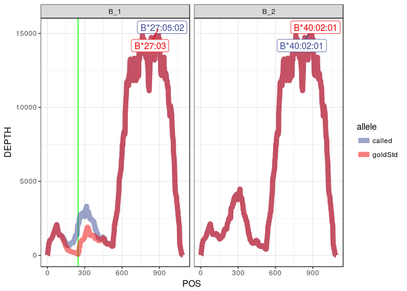

#### Depth at mismatch positions

    # A tibble: 2 x 7
      subject   kgp_id  locus call    allele            POS DEPTH
      <chr>     <chr>   <chr> <chr>   <chr>           <int> <int>
    1 ERR188217 NA11832 B_1   called  IMGT_B*27:05:02   247  2062
    2 ERR188217 NA11832 B_1   goldStd IMGT_B*27:03      247    78

#### Mismatches to 1000G haplotypes

##### Called

    # A tibble: 4 x 6
      subject   kgp_id  locus allele       hap diffs
      <chr>     <chr>   <chr> <chr>      <int> <int>
    1 ERR188217 NA11832 HLA-B B*27:05:02     1    12
    2 ERR188217 NA11832 HLA-B B*27:05:02     2     9
    3 ERR188217 NA11832 HLA-B B*40:02:01     1    10
    4 ERR188217 NA11832 HLA-B B*40:02:01     2    13

##### Gold

    # A tibble: 4 x 6
      subject   kgp_id  locus allele       hap diffs
      <chr>     <chr>   <chr> <chr>      <int> <int>
    1 ERR188217 NA11832 HLA-B B*27:03        1    13
    2 ERR188217 NA11832 HLA-B B*27:03        2    10
    3 ERR188217 NA11832 HLA-B B*40:02:01     1    10
    4 ERR188217 NA11832 HLA-B B*40:02:01     2    13

#### Final quantifications with called or gold standard genotypes:

##### Called

    # A tibble: 0 x 5
    # ... with 5 variables: subject <chr>, kgp_id <chr>, locus <chr>,
    #   allele <chr>, est_counts <dbl>

##### Gold

    # A tibble: 0 x 5
    # ... with 5 variables: subject <chr>, kgp_id <chr>, locus <chr>,
    #   allele <chr>, est_counts <dbl>

NA11930
-------

#### Mismatch at A\*02, C\*06 and DQB1\*02

#### Depth at mismatch positions

    # A tibble: 102 x 7
       subject   kgp_id  locus call   allele            POS DEPTH
       <chr>     <chr>   <chr> <chr>  <chr>           <int> <int>
     1 ERR188235 NA11930 A_1   called IMGT_A*24:02:01    48    33
     2 ERR188235 NA11930 A_1   called IMGT_A*24:02:01    72    36
     3 ERR188235 NA11930 A_1   called IMGT_A*24:02:01    78    37
     4 ERR188235 NA11930 A_1   called IMGT_A*24:02:01    98    26
     5 ERR188235 NA11930 A_1   called IMGT_A*24:02:01   144     5
     6 ERR188235 NA11930 A_1   called IMGT_A*24:02:01   240   192
     7 ERR188235 NA11930 A_1   called IMGT_A*24:02:01   257   444
     8 ERR188235 NA11930 A_1   called IMGT_A*24:02:01   265   532
     9 ERR188235 NA11930 A_1   called IMGT_A*24:02:01   292   674
    10 ERR188235 NA11930 A_1   called IMGT_A*24:02:01   299   735
    # ... with 92 more rows

#### Mismatches to 1000G haplotypes

##### Called

    # A tibble: 8 x 6
      subject   kgp_id  locus    allele          hap diffs
      <chr>     <chr>   <chr>    <chr>         <int> <int>
    1 ERR188235 NA11930 HLA-A    A*24:02:01        1     2
    2 ERR188235 NA11930 HLA-A    A*24:02:01        2    70
    3 ERR188235 NA11930 HLA-C    C*06:140          1    10
    4 ERR188235 NA11930 HLA-C    C*06:140          2     4
    5 ERR188235 NA11930 HLA-DQB1 DQB1*02:02:01     1    27
    6 ERR188235 NA11930 HLA-DQB1 DQB1*02:02:01     2    14
    7 ERR188235 NA11930 HLA-DQB1 DQB1*06:02:01     1     0
    8 ERR188235 NA11930 HLA-DQB1 DQB1*06:02:01     2    17

##### Gold

    # A tibble: 10 x 6
       subject   kgp_id  locus    allele          hap diffs
       <chr>     <chr>   <chr>    <chr>         <int> <int>
     1 ERR188235 NA11930 HLA-A    A*02:01:01        1    36
     2 ERR188235 NA11930 HLA-A    A*02:01:01        2     5
     3 ERR188235 NA11930 HLA-A    A*24:02:01        1     1
     4 ERR188235 NA11930 HLA-A    A*24:02:01        2    35
     5 ERR188235 NA11930 HLA-C    C*06:02:01        1    10
     6 ERR188235 NA11930 HLA-C    C*06:02:01        2     4
     7 ERR188235 NA11930 HLA-DQB1 DQB1*02:01:01     1    26
     8 ERR188235 NA11930 HLA-DQB1 DQB1*02:01:01     2    15
     9 ERR188235 NA11930 HLA-DQB1 DQB1*06:02:01     1     0
    10 ERR188235 NA11930 HLA-DQB1 DQB1*06:02:01     2    17

#### Final quantifications with called or gold standard genotypes:

##### Called

    # A tibble: 0 x 5
    # ... with 5 variables: subject <chr>, kgp_id <chr>, locus <chr>,
    #   allele <chr>, est_counts <dbl>

##### Gold

    # A tibble: 0 x 5
    # ... with 5 variables: subject <chr>, kgp_id <chr>, locus <chr>,
    #   allele <chr>, est_counts <dbl>

NA20520
-------

#### Mismatch at C\*05

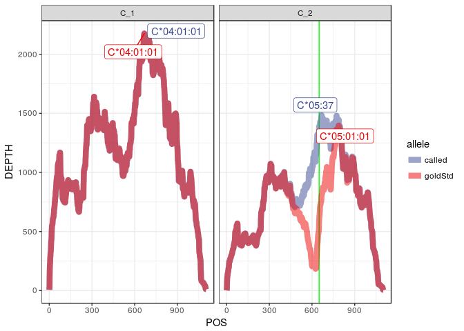

#### Depth at mismatch positions

    # A tibble: 2 x 7
      subject   kgp_id  locus call    allele            POS DEPTH
      <chr>     <chr>   <chr> <chr>   <chr>           <int> <int>
    1 ERR188239 NA20520 C_2   called  IMGT_C*05:37      650  1391
    2 ERR188239 NA20520 C_2   goldStd IMGT_C*05:01:01   650   597

#### Mismatches to 1000G haplotypes

##### Called

    # A tibble: 4 x 6
      subject   kgp_id  locus allele       hap diffs
      <chr>     <chr>   <chr> <chr>      <int> <int>
    1 ERR188239 NA20520 HLA-C C*04:01:01     1     4
    2 ERR188239 NA20520 HLA-C C*04:01:01     2    23
    3 ERR188239 NA20520 HLA-C C*05:37        1    25
    4 ERR188239 NA20520 HLA-C C*05:37        2     2

##### Gold

    # A tibble: 4 x 6
      subject   kgp_id  locus allele       hap diffs
      <chr>     <chr>   <chr> <chr>      <int> <int>
    1 ERR188239 NA20520 HLA-C C*04:01:01     1     4
    2 ERR188239 NA20520 HLA-C C*04:01:01     2    23
    3 ERR188239 NA20520 HLA-C C*05:01:01     1    24
    4 ERR188239 NA20520 HLA-C C*05:01:01     2     3

#### Final quantifications with called or gold standard genotypes:

##### Called

    # A tibble: 0 x 5
    # ... with 5 variables: subject <chr>, kgp_id <chr>, locus <chr>,
    #   allele <chr>, est_counts <dbl>

##### Gold

    # A tibble: 0 x 5
    # ... with 5 variables: subject <chr>, kgp_id <chr>, locus <chr>,
    #   allele <chr>, est_counts <dbl>

NA11840
-------

#### Mismatch at B\*27

#### Depth at mismatch positions

    # A tibble: 4 x 7
      subject   kgp_id  locus call    allele            POS DEPTH
      <chr>     <chr>   <chr> <chr>   <chr>           <int> <int>
    1 ERR188246 NA11840 B_1   called  IMGT_B*27:05:03   247  3078
    2 ERR188246 NA11840 B_1   called  IMGT_B*27:05:03   489  3483
    3 ERR188246 NA11840 B_1   goldStd IMGT_B*27:03      247    37
    4 ERR188246 NA11840 B_1   goldStd IMGT_B*27:03      489    21

#### Mismatches to 1000G haplotypes

##### Called

    # A tibble: 4 x 6
      subject   kgp_id  locus allele       hap diffs
      <chr>     <chr>   <chr> <chr>      <int> <int>
    1 ERR188246 NA11840 HLA-B B*27:05:03     1     4
    2 ERR188246 NA11840 HLA-B B*27:05:03     2    43
    3 ERR188246 NA11840 HLA-B B*57:01:01     1    49
    4 ERR188246 NA11840 HLA-B B*57:01:01     2     4

##### Gold

    # A tibble: 4 x 6
      subject   kgp_id  locus allele       hap diffs
      <chr>     <chr>   <chr> <chr>      <int> <int>
    1 ERR188246 NA11840 HLA-B B*27:03        1     4
    2 ERR188246 NA11840 HLA-B B*27:03        2    45
    3 ERR188246 NA11840 HLA-B B*57:01:01     1    49
    4 ERR188246 NA11840 HLA-B B*57:01:01     2     4

#### Final quantifications with called or gold standard genotypes:

##### Called

    # A tibble: 0 x 5
    # ... with 5 variables: subject <chr>, kgp_id <chr>, locus <chr>,
    #   allele <chr>, est_counts <dbl>

##### Gold

    # A tibble: 0 x 5
    # ... with 5 variables: subject <chr>, kgp_id <chr>, locus <chr>,
    #   allele <chr>, est_counts <dbl>

HG00246
-------

#### Mismatch at A\*11

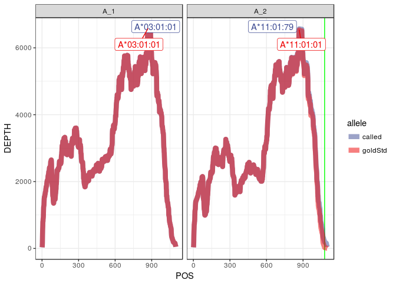

#### Depth at mismatch positions

    # A tibble: 2 x 7
      subject   kgp_id  locus call    allele            POS DEPTH
      <chr>     <chr>   <chr> <chr>   <chr>           <int> <int>
    1 ERR188271 HG00246 A_2   called  IMGT_A*11:01:79  1077   197
    2 ERR188271 HG00246 A_2   goldStd IMGT_A*11:01:01  1077    24

#### Mismatches to 1000G haplotypes

##### Called

    # A tibble: 4 x 6
      subject   kgp_id  locus allele       hap diffs
      <chr>     <chr>   <chr> <chr>      <int> <int>
    1 ERR188271 HG00246 HLA-A A*03:01:01     1     1
    2 ERR188271 HG00246 HLA-A A*03:01:01     2    13
    3 ERR188271 HG00246 HLA-A A*11:01:79     1    12
    4 ERR188271 HG00246 HLA-A A*11:01:79     2     2

##### Gold

    # A tibble: 4 x 6
      subject   kgp_id  locus allele       hap diffs
      <chr>     <chr>   <chr> <chr>      <int> <int>
    1 ERR188271 HG00246 HLA-A A*03:01:01     1     1
    2 ERR188271 HG00246 HLA-A A*03:01:01     2    13
    3 ERR188271 HG00246 HLA-A A*11:01:01     1    13
    4 ERR188271 HG00246 HLA-A A*11:01:01     2     1

#### Final quantifications with called or gold standard genotypes:

##### Called

    # A tibble: 0 x 5
    # ... with 5 variables: subject <chr>, kgp_id <chr>, locus <chr>,
    #   allele <chr>, est_counts <dbl>

##### Gold

    # A tibble: 0 x 5
    # ... with 5 variables: subject <chr>, kgp_id <chr>, locus <chr>,
    #   allele <chr>, est_counts <dbl>

NA20758
-------

#### False A\*11 homozygote

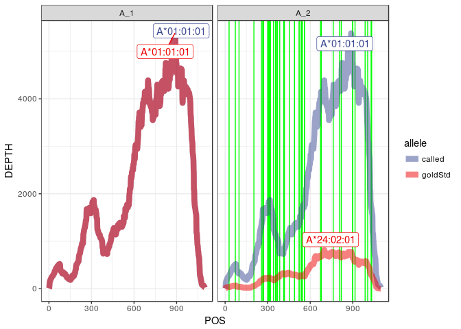

#### Depth at mismatch positions

    # A tibble: 86 x 7
       subject   kgp_id  locus call   allele            POS DEPTH
       <chr>     <chr>   <chr> <chr>  <chr>           <int> <int>
     1 ERR188276 NA20758 A_2   called IMGT_A*01:01:01    28   280
     2 ERR188276 NA20758 A_2   called IMGT_A*01:01:01    72   515
     3 ERR188276 NA20758 A_2   called IMGT_A*01:01:01    98   335
     4 ERR188276 NA20758 A_2   called IMGT_A*01:01:01   203   551
     5 ERR188276 NA20758 A_2   called IMGT_A*01:01:01   256  1345
     6 ERR188276 NA20758 A_2   called IMGT_A*01:01:01   265  1616
     7 ERR188276 NA20758 A_2   called IMGT_A*01:01:01   270  1612
     8 ERR188276 NA20758 A_2   called IMGT_A*01:01:01   271  1621
     9 ERR188276 NA20758 A_2   called IMGT_A*01:01:01   299  1634
    10 ERR188276 NA20758 A_2   called IMGT_A*01:01:01   307  1820
    # ... with 76 more rows

#### Mismatches to 1000G haplotypes

##### Called

    # A tibble: 2 x 6
      subject   kgp_id  locus allele       hap diffs
      <chr>     <chr>   <chr> <chr>      <int> <int>
    1 ERR188276 NA20758 HLA-A A*01:01:01     1    86
    2 ERR188276 NA20758 HLA-A A*01:01:01     2     2

##### Gold

    # A tibble: 4 x 6
      subject   kgp_id  locus allele       hap diffs
      <chr>     <chr>   <chr> <chr>      <int> <int>
    1 ERR188276 NA20758 HLA-A A*01:01:01     1    43
    2 ERR188276 NA20758 HLA-A A*01:01:01     2     1
    3 ERR188276 NA20758 HLA-A A*24:02:01     1     1
    4 ERR188276 NA20758 HLA-A A*24:02:01     2    43

#### Final quantifications with called or gold standard genotypes:

##### Called

    # A tibble: 0 x 5
    # ... with 5 variables: subject <chr>, kgp_id <chr>, locus <chr>,
    #   allele <chr>, est_counts <dbl>

##### Gold

    # A tibble: 0 x 5
    # ... with 5 variables: subject <chr>, kgp_id <chr>, locus <chr>,
    #   allele <chr>, est_counts <dbl>

NA20805
-------

#### Mismatch C\*05

#### Depth at mismatch positions

    # A tibble: 2 x 7
      subject   kgp_id  locus call    allele            POS DEPTH
      <chr>     <chr>   <chr> <chr>   <chr>           <int> <int>
    1 ERR188286 NA20805 C_1   called  IMGT_C*05:37      650  1111
    2 ERR188286 NA20805 C_1   goldStd IMGT_C*05:01:01   650   283

#### Mismatches to 1000G haplotypes

##### Called

    # A tibble: 4 x 6
      subject   kgp_id  locus allele       hap diffs
      <chr>     <chr>   <chr> <chr>      <int> <int>
    1 ERR188286 NA20805 HLA-C C*05:37        1     1
    2 ERR188286 NA20805 HLA-C C*05:37        2    16
    3 ERR188286 NA20805 HLA-C C*16:04:01     1    14
    4 ERR188286 NA20805 HLA-C C*16:04:01     2     2

##### Gold

    # A tibble: 4 x 6
      subject   kgp_id  locus allele       hap diffs
      <chr>     <chr>   <chr> <chr>      <int> <int>
    1 ERR188286 NA20805 HLA-C C*05:01:01     1     2
    2 ERR188286 NA20805 HLA-C C*05:01:01     2    15
    3 ERR188286 NA20805 HLA-C C*16:04:01     1    14
    4 ERR188286 NA20805 HLA-C C*16:04:01     2     2

#### Final quantifications with called or gold standard genotypes:

##### Called

    # A tibble: 0 x 5
    # ... with 5 variables: subject <chr>, kgp_id <chr>, locus <chr>,
    #   allele <chr>, est_counts <dbl>

##### Gold

    # A tibble: 0 x 5
    # ... with 5 variables: subject <chr>, kgp_id <chr>, locus <chr>,
    #   allele <chr>, est_counts <dbl>

NA11994
-------

#### Mismatch at A\*11 and C\*15

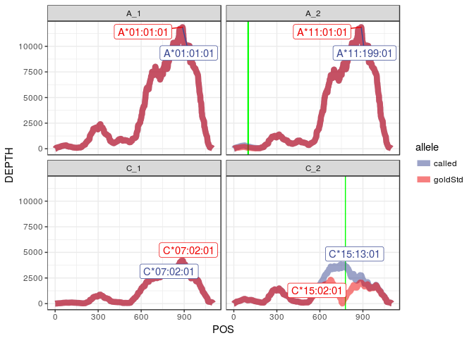

#### Depth at mismatch positions

    # A tibble: 6 x 7
      subject   kgp_id  locus call    allele             POS DEPTH
      <chr>     <chr>   <chr> <chr>   <chr>            <int> <int>
    1 ERR188301 NA11994 A_2   called  IMGT_A*11:199:01    98   214
    2 ERR188301 NA11994 A_2   called  IMGT_A*11:199:01   102   214
    3 ERR188301 NA11994 A_2   goldStd IMGT_A*11:01:01     98    97
    4 ERR188301 NA11994 A_2   goldStd IMGT_A*11:01:01    102    94
    5 ERR188301 NA11994 C_2   called  IMGT_C*15:13:01    778  3640
    6 ERR188301 NA11994 C_2   goldStd IMGT_C*15:02:01    778   561

#### Mismatches to 1000G haplotypes

##### Called

    # A tibble: 8 x 6
      subject   kgp_id  locus allele        hap diffs
      <chr>     <chr>   <chr> <chr>       <int> <int>
    1 ERR188301 NA11994 HLA-A A*01:01:01      1     3
    2 ERR188301 NA11994 HLA-A A*01:01:01      2    10
    3 ERR188301 NA11994 HLA-A A*11:199:01     1    11
    4 ERR188301 NA11994 HLA-A A*11:199:01     2     3
    5 ERR188301 NA11994 HLA-C C*07:02:01      1     0
    6 ERR188301 NA11994 HLA-C C*07:02:01      2    38
    7 ERR188301 NA11994 HLA-C C*15:13:01      1    38
    8 ERR188301 NA11994 HLA-C C*15:13:01      2     4

##### Gold

    # A tibble: 8 x 6
      subject   kgp_id  locus allele       hap diffs
      <chr>     <chr>   <chr> <chr>      <int> <int>
    1 ERR188301 NA11994 HLA-A A*01:01:01     1     3
    2 ERR188301 NA11994 HLA-A A*01:01:01     2    10
    3 ERR188301 NA11994 HLA-A A*11:01:01     1    13
    4 ERR188301 NA11994 HLA-A A*11:01:01     2     1
    5 ERR188301 NA11994 HLA-C C*07:02:01     1     0
    6 ERR188301 NA11994 HLA-C C*07:02:01     2    38
    7 ERR188301 NA11994 HLA-C C*15:02:01     1    37
    8 ERR188301 NA11994 HLA-C C*15:02:01     2     5

#### Final quantifications with called or gold standard genotypes:

##### Called

    # A tibble: 0 x 5
    # ... with 5 variables: subject <chr>, kgp_id <chr>, locus <chr>,
    #   allele <chr>, est_counts <dbl>

##### Gold

    # A tibble: 0 x 5
    # ... with 5 variables: subject <chr>, kgp_id <chr>, locus <chr>,
    #   allele <chr>, est_counts <dbl>

HG00380
-------

#### Mismatch B\*42-B\*07

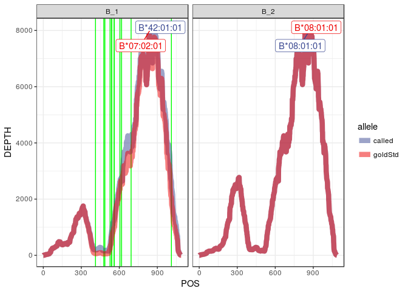

#### Depth at mismatch positions

    # A tibble: 26 x 7
       subject   kgp_id  locus call   allele            POS DEPTH
       <chr>     <chr>   <chr> <chr>  <chr>           <int> <int>
     1 ERR188314 HG00380 B_1   called IMGT_B*42:01:01   412   197
     2 ERR188314 HG00380 B_1   called IMGT_B*42:01:01   477   161
     3 ERR188314 HG00380 B_1   called IMGT_B*42:01:01   486   163
     4 ERR188314 HG00380 B_1   called IMGT_B*42:01:01   527   334
     5 ERR188314 HG00380 B_1   called IMGT_B*42:01:01   538   803
     6 ERR188314 HG00380 B_1   called IMGT_B*42:01:01   539   828
     7 ERR188314 HG00380 B_1   called IMGT_B*42:01:01   540   872
     8 ERR188314 HG00380 B_1   called IMGT_B*42:01:01   559  1255
     9 ERR188314 HG00380 B_1   called IMGT_B*42:01:01   560  1290
    10 ERR188314 HG00380 B_1   called IMGT_B*42:01:01   605  2557
    # ... with 16 more rows

#### Mismatches to 1000G haplotypes

##### Called

    # A tibble: 4 x 6
      subject   kgp_id  locus allele       hap diffs
      <chr>     <chr>   <chr> <chr>      <int> <int>
    1 ERR188314 HG00380 HLA-B B*08:01:01     1    23
    2 ERR188314 HG00380 HLA-B B*08:01:01     2     1
    3 ERR188314 HG00380 HLA-B B*42:01:01     1    14
    4 ERR188314 HG00380 HLA-B B*42:01:01     2     8

##### Gold

    # A tibble: 4 x 6
      subject   kgp_id  locus allele       hap diffs
      <chr>     <chr>   <chr> <chr>      <int> <int>
    1 ERR188314 HG00380 HLA-B B*07:02:01     1     1
    2 ERR188314 HG00380 HLA-B B*07:02:01     2    21
    3 ERR188314 HG00380 HLA-B B*08:01:01     1    23
    4 ERR188314 HG00380 HLA-B B*08:01:01     2     1

#### Final quantifications with called or gold standard genotypes:

##### Called

    # A tibble: 0 x 5
    # ... with 5 variables: subject <chr>, kgp_id <chr>, locus <chr>,
    #   allele <chr>, est_counts <dbl>

##### Gold

    # A tibble: 0 x 5
    # ... with 5 variables: subject <chr>, kgp_id <chr>, locus <chr>,
    #   allele <chr>, est_counts <dbl>

HG00109
-------

#### We call a false A\*02 homozygote

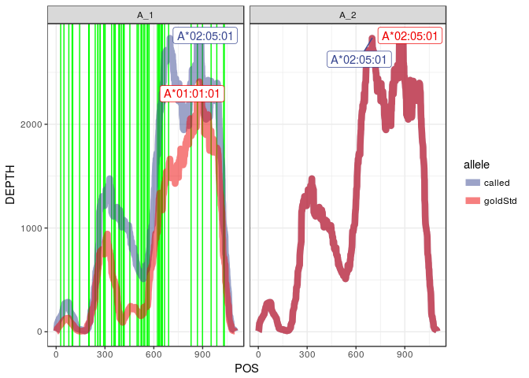

#### Depth at mismatch positions

    # A tibble: 106 x 7
       subject   kgp_id  locus call   allele            POS DEPTH
       <chr>     <chr>   <chr> <chr>  <chr>           <int> <int>
     1 ERR188328 HG00109 A_1   called IMGT_A*02:05:01    28   149
     2 ERR188328 HG00109 A_1   called IMGT_A*02:05:01    48   242
     3 ERR188328 HG00109 A_1   called IMGT_A*02:05:01    78   275
     4 ERR188328 HG00109 A_1   called IMGT_A*02:05:01    98   167
     5 ERR188328 HG00109 A_1   called IMGT_A*02:05:01   102   151
     6 ERR188328 HG00109 A_1   called IMGT_A*02:05:01   144    22
     7 ERR188328 HG00109 A_1   called IMGT_A*02:05:01   200    69
     8 ERR188328 HG00109 A_1   called IMGT_A*02:05:01   203    81
     9 ERR188328 HG00109 A_1   called IMGT_A*02:05:01   240   453
    10 ERR188328 HG00109 A_1   called IMGT_A*02:05:01   256   760
    # ... with 96 more rows

#### Mismatches to 1000G haplotypes

##### Called

    # A tibble: 2 x 6
      subject   kgp_id  locus allele       hap diffs
      <chr>     <chr>   <chr> <chr>      <int> <int>
    1 ERR188328 HG00109 HLA-A A*02:05:01     1    10
    2 ERR188328 HG00109 HLA-A A*02:05:01     2    86

##### Gold

    # A tibble: 4 x 6
      subject   kgp_id  locus allele       hap diffs
      <chr>     <chr>   <chr> <chr>      <int> <int>
    1 ERR188328 HG00109 HLA-A A*01:01:01     1    39
    2 ERR188328 HG00109 HLA-A A*01:01:01     2     4
    3 ERR188328 HG00109 HLA-A A*02:05:01     1     5
    4 ERR188328 HG00109 HLA-A A*02:05:01     2    43

#### Final quantifications with called or gold standard genotypes:

##### Called

    # A tibble: 0 x 5
    # ... with 5 variables: subject <chr>, kgp_id <chr>, locus <chr>,
    #   allele <chr>, est_counts <dbl>

##### Gold

    # A tibble: 0 x 5
    # ... with 5 variables: subject <chr>, kgp_id <chr>, locus <chr>,
    #   allele <chr>, est_counts <dbl>

NA20586
-------

#### Mismatch at A\*11

#### Depth at mismatch positions

    # A tibble: 12 x 7
       subject   kgp_id  locus call    allele            POS DEPTH
       <chr>     <chr>   <chr> <chr>   <chr>           <int> <int>
     1 ERR188353 NA20586 A_1   called  IMGT_A*11:235Q    120     0
     2 ERR188353 NA20586 A_1   called  IMGT_A*11:235Q    121     0
     3 ERR188353 NA20586 A_1   called  IMGT_A*11:235Q    122     0
     4 ERR188353 NA20586 A_1   called  IMGT_A*11:235Q    123     0
     5 ERR188353 NA20586 A_1   called  IMGT_A*11:235Q    124     1
     6 ERR188353 NA20586 A_1   called  IMGT_A*11:235Q    125     2
     7 ERR188353 NA20586 A_1   goldStd IMGT_A*11:01:01   120    69
     8 ERR188353 NA20586 A_1   goldStd IMGT_A*11:01:01   121    70
     9 ERR188353 NA20586 A_1   goldStd IMGT_A*11:01:01   122    68
    10 ERR188353 NA20586 A_1   goldStd IMGT_A*11:01:01   123    67
    11 ERR188353 NA20586 A_1   goldStd IMGT_A*11:01:01   124    65
    12 ERR188353 NA20586 A_1   goldStd IMGT_A*11:01:01   125    58

#### Mismatches to 1000G haplotypes

##### Called

    # A tibble: 4 x 6
      subject   kgp_id  locus allele       hap diffs
      <chr>     <chr>   <chr> <chr>      <int> <int>
    1 ERR188353 NA20586 HLA-A A*11:235Q      1     3
    2 ERR188353 NA20586 HLA-A A*11:235Q      2    26
    3 ERR188353 NA20586 HLA-A A*25:01:01     1    24
    4 ERR188353 NA20586 HLA-A A*25:01:01     2     1

##### Gold

    # A tibble: 4 x 6
      subject   kgp_id  locus allele       hap diffs
      <chr>     <chr>   <chr> <chr>      <int> <int>
    1 ERR188353 NA20586 HLA-A A*11:01:01     1     1
    2 ERR188353 NA20586 HLA-A A*11:01:01     2    33
    3 ERR188353 NA20586 HLA-A A*25:01:01     1    33
    4 ERR188353 NA20586 HLA-A A*25:01:01     2     3

#### Final quantifications with called or gold standard genotypes:

##### Called

    # A tibble: 0 x 5
    # ... with 5 variables: subject <chr>, kgp_id <chr>, locus <chr>,
    #   allele <chr>, est_counts <dbl>

##### Gold

    # A tibble: 0 x 5
    # ... with 5 variables: subject <chr>, kgp_id <chr>, locus <chr>,
    #   allele <chr>, est_counts <dbl>

NA11920
-------

#### Mismatch at DRB1\*14

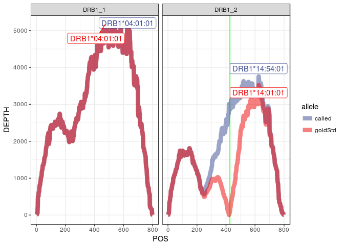

#### Depth at mismatch positions

    # A tibble: 2 x 7
      subject   kgp_id  locus  call    allele               POS DEPTH
      <chr>     <chr>   <chr>  <chr>   <chr>              <int> <int>
    1 ERR188371 NA11920 DRB1_2 called  IMGT_DRB1*14:54:01   427  2852
    2 ERR188371 NA11920 DRB1_2 goldStd IMGT_DRB1*14:01:01   427   102

#### Mismatches to 1000G haplotypes

##### Called

    # A tibble: 4 x 6
      subject   kgp_id  locus    allele          hap diffs
      <chr>     <chr>   <chr>    <chr>         <int> <int>
    1 ERR188371 NA11920 HLA-DRB1 DRB1*04:01:01     1     1
    2 ERR188371 NA11920 HLA-DRB1 DRB1*04:01:01     2     9
    3 ERR188371 NA11920 HLA-DRB1 DRB1*14:54:01     1    10
    4 ERR188371 NA11920 HLA-DRB1 DRB1*14:54:01     2     2

##### Gold

    # A tibble: 4 x 6
      subject   kgp_id  locus    allele          hap diffs
      <chr>     <chr>   <chr>    <chr>         <int> <int>
    1 ERR188371 NA11920 HLA-DRB1 DRB1*04:01:01     1     1
    2 ERR188371 NA11920 HLA-DRB1 DRB1*04:01:01     2     9
    3 ERR188371 NA11920 HLA-DRB1 DRB1*14:01:01     1    10
    4 ERR188371 NA11920 HLA-DRB1 DRB1*14:01:01     2     2

#### Final quantifications with called or gold standard genotypes:

##### Called

    # A tibble: 0 x 5
    # ... with 5 variables: subject <chr>, kgp_id <chr>, locus <chr>,
    #   allele <chr>, est_counts <dbl>

##### Gold

    # A tibble: 0 x 5
    # ... with 5 variables: subject <chr>, kgp_id <chr>, locus <chr>,
    #   allele <chr>, est_counts <dbl>

HG00260
-------

#### We call a false A\*02 homozygote, also mismatch at B\*39

#### Depth at mismatch positions

    # A tibble: 98 x 7
       subject   kgp_id  locus call   allele            POS DEPTH
       <chr>     <chr>   <chr> <chr>  <chr>           <int> <int>
     1 ERR188374 HG00360 A_2   called IMGT_A*02:01:01    48   126
     2 ERR188374 HG00360 A_2   called IMGT_A*02:01:01    72   145
     3 ERR188374 HG00360 A_2   called IMGT_A*02:01:01    78   143
     4 ERR188374 HG00360 A_2   called IMGT_A*02:01:01    98    89
     5 ERR188374 HG00360 A_2   called IMGT_A*02:01:01   144    30
     6 ERR188374 HG00360 A_2   called IMGT_A*02:01:01   240   329
     7 ERR188374 HG00360 A_2   called IMGT_A*02:01:01   257   603
     8 ERR188374 HG00360 A_2   called IMGT_A*02:01:01   265   799
     9 ERR188374 HG00360 A_2   called IMGT_A*02:01:01   292   949
    10 ERR188374 HG00360 A_2   called IMGT_A*02:01:01   299   962
    # ... with 88 more rows

#### Mismatches to 1000G haplotypes

##### Called

    # A tibble: 6 x 6
      subject   kgp_id  locus allele          hap diffs
      <chr>     <chr>   <chr> <chr>         <int> <int>
    1 ERR188374 HG00360 HLA-A A*02:01:01        1    72
    2 ERR188374 HG00360 HLA-A A*02:01:01        2    10
    3 ERR188374 HG00360 HLA-B B*39:01:24        1     1
    4 ERR188374 HG00360 HLA-B B*39:01:24        2    28
    5 ERR188374 HG00360 HLA-B B*44:02:01:01     1    40
    6 ERR188374 HG00360 HLA-B B*44:02:01:01     2    20

##### Gold

    # A tibble: 8 x 6
      subject   kgp_id  locus allele          hap diffs
      <chr>     <chr>   <chr> <chr>         <int> <int>
    1 ERR188374 HG00360 HLA-A A*02:01:01        1    36
    2 ERR188374 HG00360 HLA-A A*02:01:01        2     5
    3 ERR188374 HG00360 HLA-A A*24:02:01        1     1
    4 ERR188374 HG00360 HLA-A A*24:02:01        2    33
    5 ERR188374 HG00360 HLA-B B*39:01:01        1     1
    6 ERR188374 HG00360 HLA-B B*39:01:01        2    28
    7 ERR188374 HG00360 HLA-B B*44:02:01:01     1    40
    8 ERR188374 HG00360 HLA-B B*44:02:01:01     2    20

#### Final quantifications with called or gold standard genotypes:

##### Called

    # A tibble: 0 x 5
    # ... with 5 variables: subject <chr>, kgp_id <chr>, locus <chr>,
    #   allele <chr>, est_counts <dbl>

##### Gold

    # A tibble: 0 x 5
    # ... with 5 variables: subject <chr>, kgp_id <chr>, locus <chr>,
    #   allele <chr>, est_counts <dbl>

NA12045
-------

#### Mismatch at DRB1\*14

#### Depth at mismatch positions

    # A tibble: 2 x 7
      subject   kgp_id  locus  call    allele               POS DEPTH
      <chr>     <chr>   <chr>  <chr>   <chr>              <int> <int>
    1 ERR188377 NA12045 DRB1_2 called  IMGT_DRB1*14:54:01   427  1420
    2 ERR188377 NA12045 DRB1_2 goldStd IMGT_DRB1*14:01:01   427    70

#### Mismatches to 1000G haplotypes

##### Called

    # A tibble: 4 x 6
      subject   kgp_id  locus    allele          hap diffs
      <chr>     <chr>   <chr>    <chr>         <int> <int>
    1 ERR188377 NA12045 HLA-DRB1 DRB1*13:01:01     1     8
    2 ERR188377 NA12045 HLA-DRB1 DRB1*13:01:01     2     6
    3 ERR188377 NA12045 HLA-DRB1 DRB1*14:54:01     1     3
    4 ERR188377 NA12045 HLA-DRB1 DRB1*14:54:01     2    11

##### Gold

    # A tibble: 4 x 6
      subject   kgp_id  locus    allele          hap diffs
      <chr>     <chr>   <chr>    <chr>         <int> <int>
    1 ERR188377 NA12045 HLA-DRB1 DRB1*13:01:01     1     8
    2 ERR188377 NA12045 HLA-DRB1 DRB1*13:01:01     2     6
    3 ERR188377 NA12045 HLA-DRB1 DRB1*14:01:01     1     3
    4 ERR188377 NA12045 HLA-DRB1 DRB1*14:01:01     2    11

#### Final quantifications with called or gold standard genotypes:

##### Called

    # A tibble: 0 x 5
    # ... with 5 variables: subject <chr>, kgp_id <chr>, locus <chr>,
    #   allele <chr>, est_counts <dbl>

##### Gold

    # A tibble: 0 x 5
    # ... with 5 variables: subject <chr>, kgp_id <chr>, locus <chr>,
    #   allele <chr>, est_counts <dbl>

NA12156
-------

#### Mismatch at C\*06 and DQB1\*02

#### Depth at mismatch positions

    # A tibble: 4 x 7
      subject   kgp_id  locus  call    allele               POS DEPTH
      <chr>     <chr>   <chr>  <chr>   <chr>              <int> <int>
    1 ERR188410 NA12156 C_1    called  IMGT_C*06:06         559  1825
    2 ERR188410 NA12156 C_1    goldStd IMGT_C*06:02:01      559   712
    3 ERR188410 NA12156 DQB1_1 called  IMGT_DQB1*02:02:01   500   934
    4 ERR188410 NA12156 DQB1_1 goldStd IMGT_DQB1*02:01:01   500     1

#### Mismatches to 1000G haplotypes

##### Called

    # A tibble: 8 x 6
      subject   kgp_id  locus    allele          hap diffs
      <chr>     <chr>   <chr>    <chr>         <int> <int>
    1 ERR188410 NA12156 HLA-C    C*06:06           1    14
    2 ERR188410 NA12156 HLA-C    C*06:06           2     7
    3 ERR188410 NA12156 HLA-C    C*15:02:01        1     3
    4 ERR188410 NA12156 HLA-C    C*15:02:01        2    22
    5 ERR188410 NA12156 HLA-DQB1 DQB1*02:02:01     1    20
    6 ERR188410 NA12156 HLA-DQB1 DQB1*02:02:01     2     4
    7 ERR188410 NA12156 HLA-DQB1 DQB1*03:01:01     1     5
    8 ERR188410 NA12156 HLA-DQB1 DQB1*03:01:01     2    15

###### Gold

    # A tibble: 8 x 6
      subject   kgp_id  locus    allele          hap diffs
      <chr>     <chr>   <chr>    <chr>         <int> <int>
    1 ERR188410 NA12156 HLA-C    C*06:02:01        1    15
    2 ERR188410 NA12156 HLA-C    C*06:02:01        2     8
    3 ERR188410 NA12156 HLA-C    C*15:02:01        1     3
    4 ERR188410 NA12156 HLA-C    C*15:02:01        2    22
    5 ERR188410 NA12156 HLA-DQB1 DQB1*02:01:01     1    19
    6 ERR188410 NA12156 HLA-DQB1 DQB1*02:01:01     2     5
    7 ERR188410 NA12156 HLA-DQB1 DQB1*03:01:01     1     5
    8 ERR188410 NA12156 HLA-DQB1 DQB1*03:01:01     2    15

#### Final quantifications with called or gold standard genotypes:

##### Called

    # A tibble: 0 x 5
    # ... with 5 variables: subject <chr>, kgp_id <chr>, locus <chr>,
    #   allele <chr>, est_counts <dbl>

##### Gold

    # A tibble: 0 x 5
    # ... with 5 variables: subject <chr>, kgp_id <chr>, locus <chr>,
    #   allele <chr>, est_counts <dbl>

NA12058
-------

#### Gold standard is homozygote for B and C, but we call heterozygote

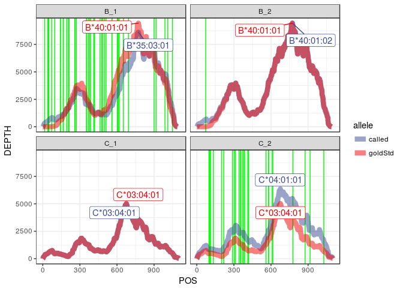

#### Depth at mismatch positions

    # A tibble: 142 x 7
       subject   kgp_id  locus call   allele            POS DEPTH
       <chr>     <chr>   <chr> <chr>  <chr>           <int> <int>
     1 ERR188415 NA12058 B_1   called IMGT_B*35:03:01    15   296
     2 ERR188415 NA12058 B_1   called IMGT_B*35:03:01    41   528
     3 ERR188415 NA12058 B_1   called IMGT_B*35:03:01    44   559
     4 ERR188415 NA12058 B_1   called IMGT_B*35:03:01    48   586
     5 ERR188415 NA12058 B_1   called IMGT_B*35:03:01    49   595
     6 ERR188415 NA12058 B_1   called IMGT_B*35:03:01    72   813
     7 ERR188415 NA12058 B_1   called IMGT_B*35:03:01    97   624
     8 ERR188415 NA12058 B_1   called IMGT_B*35:03:01   142   956
     9 ERR188415 NA12058 B_1   called IMGT_B*35:03:01   144   980
    10 ERR188415 NA12058 B_1   called IMGT_B*35:03:01   165  1155
    # ... with 132 more rows

#### Mismatches to 1000G haplotypes

##### Called

    # A tibble: 8 x 6
      subject   kgp_id  locus allele       hap diffs
      <chr>     <chr>   <chr> <chr>      <int> <int>
    1 ERR188415 NA12058 HLA-B B*35:03:01     1    39
    2 ERR188415 NA12058 HLA-B B*35:03:01     2     6
    3 ERR188415 NA12058 HLA-B B*40:01:02     1     1
    4 ERR188415 NA12058 HLA-B B*40:01:02     2    36
    5 ERR188415 NA12058 HLA-C C*03:04:01     1     1
    6 ERR188415 NA12058 HLA-C C*03:04:01     2    27
    7 ERR188415 NA12058 HLA-C C*04:01:01     1    23
    8 ERR188415 NA12058 HLA-C C*04:01:01     2     3

##### Gold

    # A tibble: 6 x 6
      subject   kgp_id  locus allele       hap diffs
      <chr>     <chr>   <chr> <chr>      <int> <int>
    1 ERR188415 NA12058 HLA-B B*40:01:01     1     2
    2 ERR188415 NA12058 HLA-B B*40:01:01     2    37
    3 ERR188415 NA12058 HLA-B B*40:01:02     1     1
    4 ERR188415 NA12058 HLA-B B*40:01:02     2    36
    5 ERR188415 NA12058 HLA-C C*03:04:01     1     2
    6 ERR188415 NA12058 HLA-C C*03:04:01     2    54

#### Final quantifications with called or gold standard genotypes:

##### Called

    # A tibble: 0 x 5
    # ... with 5 variables: subject <chr>, kgp_id <chr>, locus <chr>,
    #   allele <chr>, est_counts <dbl>

##### Gold

    # A tibble: 0 x 5
    # ... with 5 variables: subject <chr>, kgp_id <chr>, locus <chr>,
    #   allele <chr>, est_counts <dbl>

HG00102
-------

#### Mismatch at all alleles at A, B and C

#### Depth at mismatch positions

    # A tibble: 28 x 7
       subject   kgp_id  locus call    allele            POS DEPTH
       <chr>     <chr>   <chr> <chr>   <chr>           <int> <int>
     1 ERR188416 HG00102 A_1   called  IMGT_A*01:01:37   105     1
     2 ERR188416 HG00102 A_1   goldStd IMGT_A*01:01:01   105    15
     3 ERR188416 HG00102 A_2   called  IMGT_A*01:09:01   171     1
     4 ERR188416 HG00102 A_2   goldStd IMGT_A*01:01:01   171     1
     5 ERR188416 HG00102 B_1   called  IMGT_B*07:08:01   272   884
     6 ERR188416 HG00102 B_1   called  IMGT_B*07:08:01   277   949
     7 ERR188416 HG00102 B_1   called  IMGT_B*07:08:01   280   958
     8 ERR188416 HG00102 B_1   called  IMGT_B*07:08:01   282   958
     9 ERR188416 HG00102 B_1   called  IMGT_B*07:08:01   283   961
    10 ERR188416 HG00102 B_1   goldStd IMGT_B*07:02:01   272   274
    # ... with 18 more rows

#### Mismatches to 1000G haplotypes

##### Called

    # A tibble: 12 x 6
       subject   kgp_id  locus allele       hap diffs
       <chr>     <chr>   <chr> <chr>      <int> <int>
     1 ERR188416 HG00102 HLA-A A*01:01:37     1     1
     2 ERR188416 HG00102 HLA-A A*01:01:37     2     3
     3 ERR188416 HG00102 HLA-A A*01:09:01     1     1
     4 ERR188416 HG00102 HLA-A A*01:09:01     2     3
     5 ERR188416 HG00102 HLA-B B*07:08:01     1     5
     6 ERR188416 HG00102 HLA-B B*07:08:01     2    15
     7 ERR188416 HG00102 HLA-B B*08:58        1    21
     8 ERR188416 HG00102 HLA-B B*08:58        2     1
     9 ERR188416 HG00102 HLA-C C*07:175       1     0
    10 ERR188416 HG00102 HLA-C C*07:175       2     2
    11 ERR188416 HG00102 HLA-C C*07:83        1     2
    12 ERR188416 HG00102 HLA-C C*07:83        2     0

##### Gold

    # A tibble: 10 x 6
       subject   kgp_id  locus allele       hap diffs
       <chr>     <chr>   <chr> <chr>      <int> <int>
     1 ERR188416 HG00102 HLA-A A*01:01:01     1     2
     2 ERR188416 HG00102 HLA-A A*01:01:01     2     8
     3 ERR188416 HG00102 HLA-B B*07:02:01     1     0
     4 ERR188416 HG00102 HLA-B B*07:02:01     2    22
     5 ERR188416 HG00102 HLA-B B*08:01:01     1    22
     6 ERR188416 HG00102 HLA-B B*08:01:01     2     0
     7 ERR188416 HG00102 HLA-C C*07:01:01     1     2
     8 ERR188416 HG00102 HLA-C C*07:01:01     2     0
     9 ERR188416 HG00102 HLA-C C*07:02:01     1     0
    10 ERR188416 HG00102 HLA-C C*07:02:01     2     2

#### Final quantifications with called or gold standard genotypes:

##### Called

    # A tibble: 0 x 5
    # ... with 5 variables: subject <chr>, kgp_id <chr>, locus <chr>,
    #   allele <chr>, est_counts <dbl>

##### Gold

    # A tibble: 0 x 5
    # ... with 5 variables: subject <chr>, kgp_id <chr>, locus <chr>,
    #   allele <chr>, est_counts <dbl>

HG00327
-------

#### We call a false C\*05 heterozygote

#### Depth at mismatch positions

    # A tibble: 88 x 7
       subject   kgp_id  locus call    allele            POS DEPTH
       <chr>     <chr>   <chr> <chr>   <chr>           <int> <int>
     1 ERR188417 HG00327 C_1   called  IMGT_C*05:29:01   176     0
     2 ERR188417 HG00327 C_1   goldStd IMGT_C*05:01:01   176     1
     3 ERR188417 HG00327 C_2   called  IMGT_C*05:29:01    22    24
     4 ERR188417 HG00327 C_2   called  IMGT_C*05:29:01    28    29
     5 ERR188417 HG00327 C_2   called  IMGT_C*05:29:01    47    44
     6 ERR188417 HG00327 C_2   called  IMGT_C*05:29:01    97    35
     7 ERR188417 HG00327 C_2   called  IMGT_C*05:29:01   142     4
     8 ERR188417 HG00327 C_2   called  IMGT_C*05:29:01   201     4
     9 ERR188417 HG00327 C_2   called  IMGT_C*05:29:01   270   506
    10 ERR188417 HG00327 C_2   called  IMGT_C*05:29:01   289   591
    # ... with 78 more rows

#### Mismatches to 1000G haplotypes

##### Called

    # A tibble: 2 x 6
      subject   kgp_id  locus allele       hap diffs
      <chr>     <chr>   <chr> <chr>      <int> <int>
    1 ERR188417 HG00327 HLA-C C*05:29:01     1    70
    2 ERR188417 HG00327 HLA-C C*05:29:01     2     6

##### Gold

    # A tibble: 4 x 6
      subject   kgp_id  locus allele       hap diffs
      <chr>     <chr>   <chr> <chr>      <int> <int>
    1 ERR188417 HG00327 HLA-C C*05:01:01     1    36
    2 ERR188417 HG00327 HLA-C C*05:01:01     2     2
    3 ERR188417 HG00327 HLA-C C*07:01:01     1     1
    4 ERR188417 HG00327 HLA-C C*07:01:01     2    35

#### Final quantifications with called or gold standard genotypes:

##### Called

    # A tibble: 0 x 5
    # ... with 5 variables: subject <chr>, kgp_id <chr>, locus <chr>,
    #   allele <chr>, est_counts <dbl>

##### Gold

    # A tibble: 0 x 5
    # ... with 5 variables: subject <chr>, kgp_id <chr>, locus <chr>,
    #   allele <chr>, est_counts <dbl>

NA11830
-------

#### Mismatch at DQB1\*02

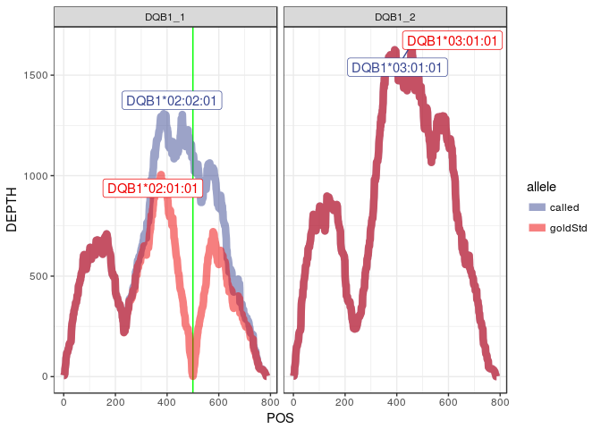

#### Depth at mismatch positions

    # A tibble: 2 x 7
      subject   kgp_id  locus  call    allele               POS DEPTH
      <chr>     <chr>   <chr>  <chr>   <chr>              <int> <int>
    1 ERR188435 NA11830 DQB1_1 called  IMGT_DQB1*02:02:01   500  1105
    2 ERR188435 NA11830 DQB1_1 goldStd IMGT_DQB1*02:01:01   500     2

#### Mismatches to 1000G haplotypes

##### Called

    # A tibble: 4 x 6
      subject   kgp_id  locus    allele          hap diffs
      <chr>     <chr>   <chr>    <chr>         <int> <int>
    1 ERR188435 NA11830 HLA-DQB1 DQB1*02:02:01     1    16
    2 ERR188435 NA11830 HLA-DQB1 DQB1*02:02:01     2     8
    3 ERR188435 NA11830 HLA-DQB1 DQB1*03:01:01     1     3
    4 ERR188435 NA11830 HLA-DQB1 DQB1*03:01:01     2    11

##### Gold

    # A tibble: 4 x 6
      subject   kgp_id  locus    allele          hap diffs
      <chr>     <chr>   <chr>    <chr>         <int> <int>
    1 ERR188435 NA11830 HLA-DQB1 DQB1*02:01:01     1    15
    2 ERR188435 NA11830 HLA-DQB1 DQB1*02:01:01     2     9
    3 ERR188435 NA11830 HLA-DQB1 DQB1*03:01:01     1     3
    4 ERR188435 NA11830 HLA-DQB1 DQB1*03:01:01     2    11

#### Final quantifications with called or gold standard genotypes:

##### Called

    # A tibble: 0 x 5
    # ... with 5 variables: subject <chr>, kgp_id <chr>, locus <chr>,
    #   allele <chr>, est_counts <dbl>

##### Gold

    # A tibble: 0 x 5
    # ... with 5 variables: subject <chr>, kgp_id <chr>, locus <chr>,
    #   allele <chr>, est_counts <dbl>

NA12272
-------

#### Mismatch at A\*02, false heterozygote in our call for B, and mismatch at DRB1\*14

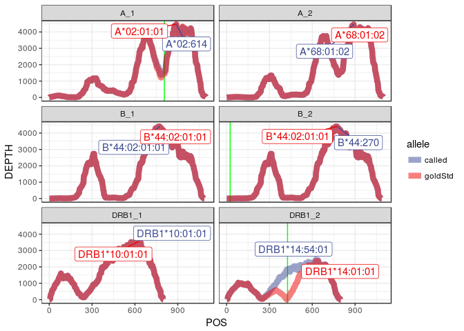

#### Depth at mismatch positions

    # A tibble: 6 x 7
      subject   kgp_id  locus  call    allele               POS DEPTH
      <chr>     <chr>   <chr>  <chr>   <chr>              <int> <int>
    1 ERR188438 NA12272 A_1    called  IMGT_A*02:614        806  1560
    2 ERR188438 NA12272 A_1    goldStd IMGT_A*02:01:01      806  1442
    3 ERR188438 NA12272 B_2    called  IMGT_B*44:270         25     0
    4 ERR188438 NA12272 B_2    goldStd IMGT_B*44:02:01:01    25     7
    5 ERR188438 NA12272 DRB1_2 called  IMGT_DRB1*14:54:01   427  1743
    6 ERR188438 NA12272 DRB1_2 goldStd IMGT_DRB1*14:01:01   427    74

#### Mismatches to 1000G haplotypes

##### Called

    # A tibble: 12 x 6
       subject   kgp_id  locus    allele          hap diffs
       <chr>     <chr>   <chr>    <chr>         <int> <int>
     1 ERR188438 NA12272 HLA-A    A*02:614          1     4
     2 ERR188438 NA12272 HLA-A    A*02:614          2    20
     3 ERR188438 NA12272 HLA-A    A*68:01:02        1    20
     4 ERR188438 NA12272 HLA-A    A*68:01:02        2     4
     5 ERR188438 NA12272 HLA-B    B*44:02:01:01     1     2
     6 ERR188438 NA12272 HLA-B    B*44:02:01:01     2     4
     7 ERR188438 NA12272 HLA-B    B*44:270          1     3
     8 ERR188438 NA12272 HLA-B    B*44:270          2     5
     9 ERR188438 NA12272 HLA-DRB1 DRB1*10:01:01     1     5
    10 ERR188438 NA12272 HLA-DRB1 DRB1*10:01:01     2     8
    11 ERR188438 NA12272 HLA-DRB1 DRB1*14:54:01     1    10
    12 ERR188438 NA12272 HLA-DRB1 DRB1*14:54:01     2     3

##### Gold

    # A tibble: 10 x 6
       subject   kgp_id  locus    allele          hap diffs
       <chr>     <chr>   <chr>    <chr>         <int> <int>
     1 ERR188438 NA12272 HLA-A    A*02:01:01        1     4
     2 ERR188438 NA12272 HLA-A    A*02:01:01        2    21
     3 ERR188438 NA12272 HLA-A    A*68:01:02        1    21
     4 ERR188438 NA12272 HLA-A    A*68:01:02        2     4
     5 ERR188438 NA12272 HLA-B    B*44:02:01:01     1     4
     6 ERR188438 NA12272 HLA-B    B*44:02:01:01     2     8
     7 ERR188438 NA12272 HLA-DRB1 DRB1*10:01:01     1     5
     8 ERR188438 NA12272 HLA-DRB1 DRB1*10:01:01     2     8
     9 ERR188438 NA12272 HLA-DRB1 DRB1*14:01:01     1    10
    10 ERR188438 NA12272 HLA-DRB1 DRB1*14:01:01     2     3

#### Final quantifications with called or gold standard genotypes:

##### Called

    # A tibble: 0 x 5
    # ... with 5 variables: subject <chr>, kgp_id <chr>, locus <chr>,
    #   allele <chr>, est_counts <dbl>

##### Gold

    # A tibble: 0 x 5
    # ... with 5 variables: subject <chr>, kgp_id <chr>, locus <chr>,
    #   allele <chr>, est_counts <dbl>

NA12286
-------

#### Mismatch at DQB1\*02

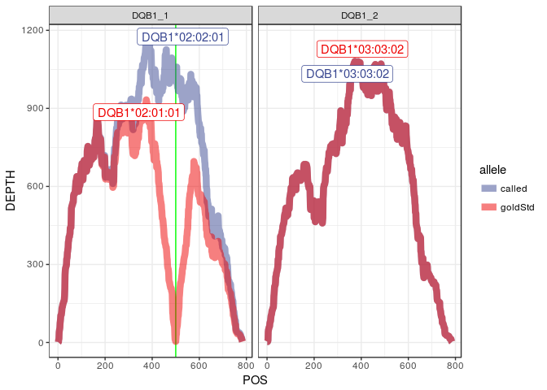

#### Depth at mismatch positions

    # A tibble: 2 x 7
      subject   kgp_id  locus  call    allele               POS DEPTH
      <chr>     <chr>   <chr>  <chr>   <chr>              <int> <int>
    1 ERR188467 NA12286 DQB1_1 called  IMGT_DQB1*02:02:01   500  1034
    2 ERR188467 NA12286 DQB1_1 goldStd IMGT_DQB1*02:01:01   500     4

#### Mismatches to 1000G haplotypes

##### Called

    # A tibble: 4 x 6
      subject   kgp_id  locus    allele          hap diffs
      <chr>     <chr>   <chr>    <chr>         <int> <int>
    1 ERR188467 NA12286 HLA-DQB1 DQB1*02:02:01     1    10
    2 ERR188467 NA12286 HLA-DQB1 DQB1*02:02:01     2    20
    3 ERR188467 NA12286 HLA-DQB1 DQB1*03:03:02     1    16
    4 ERR188467 NA12286 HLA-DQB1 DQB1*03:03:02     2     0

##### Gold

    # A tibble: 4 x 6
      subject   kgp_id  locus    allele          hap diffs
      <chr>     <chr>   <chr>    <chr>         <int> <int>
    1 ERR188467 NA12286 HLA-DQB1 DQB1*02:01:01     1    11
    2 ERR188467 NA12286 HLA-DQB1 DQB1*02:01:01     2    19
    3 ERR188467 NA12286 HLA-DQB1 DQB1*03:03:02     1    16
    4 ERR188467 NA12286 HLA-DQB1 DQB1*03:03:02     2     0

#### Final quantifications with called or gold standard genotypes:

##### Called

    # A tibble: 0 x 5
    # ... with 5 variables: subject <chr>, kgp_id <chr>, locus <chr>,
    #   allele <chr>, est_counts <dbl>

##### Gold

    # A tibble: 0 x 5
    # ... with 5 variables: subject <chr>, kgp_id <chr>, locus <chr>,
    #   allele <chr>, est_counts <dbl>
