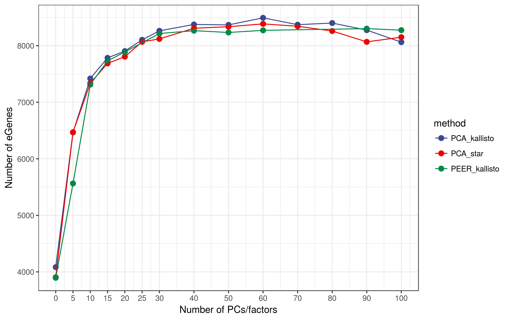
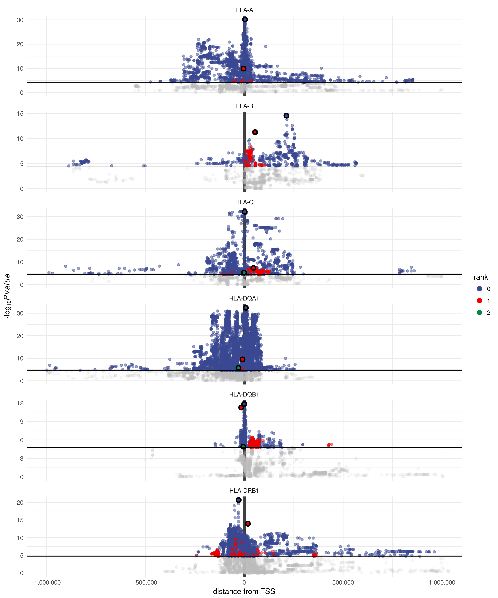
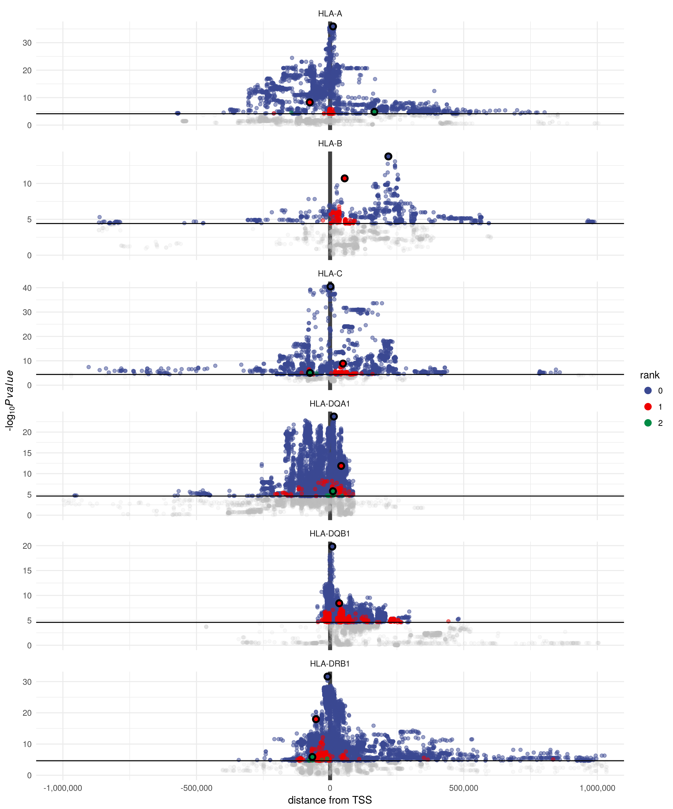

Report
================

eQTLs
=====

**All analyses were carried out using European individuals only**

PCA of genotypes
----------------

Number of eGenes according to method of phenotype correction
------------------------------------------------------------

Distribution of eQTLs around the TSS
------------------------------------

### kallisto

### STAR

HLA lineages
------------

RTC
===

Geuvadis
--------

Some of our eQTLs seem to mark the same biological signal as the eQTLs found by Geuvadis (RTC &gt; 0.9)

| gene     | variant     |  rank| geuvadis\_gene    | geuvadis\_variant |    rtc|
|:---------|:------------|-----:|:------------------|:------------------|------:|
| HLA-A    | rs16896724  |     0| HLA-A             | rs114565353       |  0.628|
| HLA-A    | rs2517827   |     1| HLA-A             | rs114565353       |  0.867|
| HLA-B    | rs9264803   |     1| HLA-C             | rs115899777       |  0.301|
| HLA-C    | rs41561715  |     0| HLA-C             | rs115899777       |  0.956|
| HLA-C    | rs35093133  |     1| HLA-C             | rs115899777       |  0.794|
| HLA-C    | rs9265951   |     2| HLA-C             | rs115899777       |  0.621|
| HLA-DQA1 | rs373884000 |     0| HLA-DRB1          | rs116405062       |  0.969|
| HLA-DQA1 | rs9274722   |     1| HLA-DQA1/HLA-DQB1 | rs9274660         |  0.922|
| HLA-DQA1 | rs373801706 |     2| HLA-DRB1          | rs116405062       |  0.170|
| HLA-DQB1 | rs1770      |     0| HLA-DQA1/HLA-DQB1 | rs9274660         |  0.984|
| HLA-DQB1 | rs9272209   |     1| HLA-DRB1          | rs116405062       |  0.786|
| HLA-DRB1 | rs9270698   |     0| HLA-DQA1/HLA-DQB1 | rs9274660         |  0.920|
| HLA-DRB1 | rs1048372   |     1| HLA-DQA1/HLA-DQB1 | rs9274660         |  0.710|
| HLA-DRB1 | rs145607970 |     2| HLA-DQA1/HLA-DQB1 | rs9274660         |  0.929|

Association with GWAS traits
----------------------------

| gene     |  rank| variant     | gwas\_variant |   rtc| trait                                                                                                                                                  | studies                                                                                                                                                                                                                                                                                                                                                                                                                                                                                                                                                                                                                                                                                                                                                                                                                                                                                                                                                                                                                                                                                                                                                                                                                                                                                                                                                                                                                                                                                                                                                                                                                                                                                                                                                                                                                                                                                                                                                                                                                                                                       |
|:---------|-----:|:------------|:--------------|-----:|:-------------------------------------------------------------------------------------------------------------------------------------------------------|:------------------------------------------------------------------------------------------------------------------------------------------------------------------------------------------------------------------------------------------------------------------------------------------------------------------------------------------------------------------------------------------------------------------------------------------------------------------------------------------------------------------------------------------------------------------------------------------------------------------------------------------------------------------------------------------------------------------------------------------------------------------------------------------------------------------------------------------------------------------------------------------------------------------------------------------------------------------------------------------------------------------------------------------------------------------------------------------------------------------------------------------------------------------------------------------------------------------------------------------------------------------------------------------------------------------------------------------------------------------------------------------------------------------------------------------------------------------------------------------------------------------------------------------------------------------------------------------------------------------------------------------------------------------------------------------------------------------------------------------------------------------------------------------------------------------------------------------------------------------------------------------------------------------------------------------------------------------------------------------------------------------------------------------------------------------------------|
| HLA-A    |     0| rs16896724  | rs2571391     |  0.99| serum IgE measurement                                                                                                                                  | www.ncbi.nlm.nih.gov/pubmed/22075330                                                                                                                                                                                                                                                                                                                                                                                                                                                                                                                                                                                                                                                                                                                                                                                                                                                                                                                                                                                                                                                                                                                                                                                                                                                                                                                                                                                                                                                                                                                                                                                                                                                                                                                                                                                                                                                                                                                                                                                                                                          |
| HLA-A    |     1| rs2517827   | rs3095267     |  0.95| migraine disorder                                                                                                                                      | www.ncbi.nlm.nih.gov/pubmed/23793025                                                                                                                                                                                                                                                                                                                                                                                                                                                                                                                                                                                                                                                                                                                                                                                                                                                                                                                                                                                                                                                                                                                                                                                                                                                                                                                                                                                                                                                                                                                                                                                                                                                                                                                                                                                                                                                                                                                                                                                                                                          |
| HLA-B    |     0| rs1265094   | rs3130573     |  0.92| systemic scleroderma                                                                                                                                   | www.ncbi.nlm.nih.gov/pubmed/21750679                                                                                                                                                                                                                                                                                                                                                                                                                                                                                                                                                                                                                                                                                                                                                                                                                                                                                                                                                                                                                                                                                                                                                                                                                                                                                                                                                                                                                                                                                                                                                                                                                                                                                                                                                                                                                                                                                                                                                                                                                                          |
| HLA-B    |     1| rs9264803   | rs9264942     |  1.00| Crohn's disease/HIV-1 infection/inflammatory bowel disease                                                                                             | www.ncbi.nlm.nih.gov/pubmed/21051598 www.ncbi.nlm.nih.gov/pubmed/20041166 www.ncbi.nlm.nih.gov/pubmed/23128233 www.ncbi.nlm.nih.gov/pubmed/26192919 www.ncbi.nlm.nih.gov/pubmed/21051598 www.ncbi.nlm.nih.gov/pubmed/20041166 www.ncbi.nlm.nih.gov/pubmed/23128233 www.ncbi.nlm.nih.gov/pubmed/26192919 www.ncbi.nlm.nih.gov/pubmed/21051598 www.ncbi.nlm.nih.gov/pubmed/20041166 www.ncbi.nlm.nih.gov/pubmed/23128233 www.ncbi.nlm.nih.gov/pubmed/26192919                                                                                                                                                                                                                                                                                                                                                                                                                                                                                                                                                                                                                                                                                                                                                                                                                                                                                                                                                                                                                                                                                                                                                                                                                                                                                                                                                                                                                                                                                                                                                                                                                   |
| HLA-C    |     0| rs41561715  | rs9263963     |  0.97| serum IgG glycosylation measurement                                                                                                                    | www.ncbi.nlm.nih.gov/pubmed/23382691                                                                                                                                                                                                                                                                                                                                                                                                                                                                                                                                                                                                                                                                                                                                                                                                                                                                                                                                                                                                                                                                                                                                                                                                                                                                                                                                                                                                                                                                                                                                                                                                                                                                                                                                                                                                                                                                                                                                                                                                                                          |
| HLA-C    |     1| rs35093133  | rs1265159     |  1.00| membranous glomerulonephritis                                                                                                                          | www.ncbi.nlm.nih.gov/pubmed/21323541                                                                                                                                                                                                                                                                                                                                                                                                                                                                                                                                                                                                                                                                                                                                                                                                                                                                                                                                                                                                                                                                                                                                                                                                                                                                                                                                                                                                                                                                                                                                                                                                                                                                                                                                                                                                                                                                                                                                                                                                                                          |
| HLA-C    |     2| rs9265951   | rs9264942     |  0.97| Crohn's disease/HIV-1 infection/inflammatory bowel disease                                                                                             | www.ncbi.nlm.nih.gov/pubmed/21051598 www.ncbi.nlm.nih.gov/pubmed/20041166 www.ncbi.nlm.nih.gov/pubmed/23128233 www.ncbi.nlm.nih.gov/pubmed/26192919 www.ncbi.nlm.nih.gov/pubmed/21051598 www.ncbi.nlm.nih.gov/pubmed/20041166 www.ncbi.nlm.nih.gov/pubmed/23128233 www.ncbi.nlm.nih.gov/pubmed/26192919 www.ncbi.nlm.nih.gov/pubmed/21051598 www.ncbi.nlm.nih.gov/pubmed/20041166 www.ncbi.nlm.nih.gov/pubmed/23128233 www.ncbi.nlm.nih.gov/pubmed/26192919                                                                                                                                                                                                                                                                                                                                                                                                                                                                                                                                                                                                                                                                                                                                                                                                                                                                                                                                                                                                                                                                                                                                                                                                                                                                                                                                                                                                                                                                                                                                                                                                                   |
| HLA-DQA1 |     0| rs373884000 | rs2395185     |  0.98| antinuclear antibody measurement/Hodgkins lymphoma/lung carcinoma/ulcerative colitis                                                                   | www.ncbi.nlm.nih.gov/pubmed/19122664 www.ncbi.nlm.nih.gov/pubmed/22286212 www.ncbi.nlm.nih.gov/pubmed/19915573 www.ncbi.nlm.nih.gov/pubmed/23143601 www.ncbi.nlm.nih.gov/pubmed/25186300 www.ncbi.nlm.nih.gov/pubmed/20228799 www.ncbi.nlm.nih.gov/pubmed/19122664 www.ncbi.nlm.nih.gov/pubmed/22286212 www.ncbi.nlm.nih.gov/pubmed/19915573 www.ncbi.nlm.nih.gov/pubmed/23143601 www.ncbi.nlm.nih.gov/pubmed/25186300 www.ncbi.nlm.nih.gov/pubmed/20228799 www.ncbi.nlm.nih.gov/pubmed/19122664 www.ncbi.nlm.nih.gov/pubmed/22286212 www.ncbi.nlm.nih.gov/pubmed/19915573 www.ncbi.nlm.nih.gov/pubmed/23143601 www.ncbi.nlm.nih.gov/pubmed/25186300 www.ncbi.nlm.nih.gov/pubmed/20228799 www.ncbi.nlm.nih.gov/pubmed/19122664 www.ncbi.nlm.nih.gov/pubmed/22286212 www.ncbi.nlm.nih.gov/pubmed/19915573 www.ncbi.nlm.nih.gov/pubmed/23143601 www.ncbi.nlm.nih.gov/pubmed/25186300 www.ncbi.nlm.nih.gov/pubmed/20228799                                                                                                                                                                                                                                                                                                                                                                                                                                                                                                                                                                                                                                                                                                                                                                                                                                                                                                                                                                                                                                                                                                                                                       |
| HLA-DQA1 |     0| rs373884000 | rs9268853     |  0.98| lymphoma/ulcerative colitis                                                                                                                            | www.ncbi.nlm.nih.gov/pubmed/21297633 www.ncbi.nlm.nih.gov/pubmed/23349640 www.ncbi.nlm.nih.gov/pubmed/23511034 www.ncbi.nlm.nih.gov/pubmed/21297633 www.ncbi.nlm.nih.gov/pubmed/23349640 www.ncbi.nlm.nih.gov/pubmed/23511034                                                                                                                                                                                                                                                                                                                                                                                                                                                                                                                                                                                                                                                                                                                                                                                                                                                                                                                                                                                                                                                                                                                                                                                                                                                                                                                                                                                                                                                                                                                                                                                                                                                                                                                                                                                                                                                 |
| HLA-DQA1 |     0| rs373884000 | rs9268905     |  0.98| Cystic fibrosis                                                                                                                                        | www.ncbi.nlm.nih.gov/pubmed/21602797                                                                                                                                                                                                                                                                                                                                                                                                                                                                                                                                                                                                                                                                                                                                                                                                                                                                                                                                                                                                                                                                                                                                                                                                                                                                                                                                                                                                                                                                                                                                                                                                                                                                                                                                                                                                                                                                                                                                                                                                                                          |
| HLA-DQA1 |     0| rs373884000 | rs9268923     |  0.98| ulcerative colitis/NA                                                                                                                                  | www.ncbi.nlm.nih.gov/pubmed/20228798 www.ncbi.nlm.nih.gov/pubmed/26819262 www.ncbi.nlm.nih.gov/pubmed/20228798 www.ncbi.nlm.nih.gov/pubmed/26819262                                                                                                                                                                                                                                                                                                                                                                                                                                                                                                                                                                                                                                                                                                                                                                                                                                                                                                                                                                                                                                                                                                                                                                                                                                                                                                                                                                                                                                                                                                                                                                                                                                                                                                                                                                                                                                                                                                                           |
| HLA-DQA1 |     1| rs9274722   | rs4321864     |  1.00| Staphylococcus aureus infection                                                                                                                        | www.ncbi.nlm.nih.gov/pubmed/26450422                                                                                                                                                                                                                                                                                                                                                                                                                                                                                                                                                                                                                                                                                                                                                                                                                                                                                                                                                                                                                                                                                                                                                                                                                                                                                                                                                                                                                                                                                                                                                                                                                                                                                                                                                                                                                                                                                                                                                                                                                                          |
| HLA-DQA1 |     2| rs373801706 | rs3135363     |  0.98| hepatitis C induced liver cirrhosis/response to vaccine                                                                                                | www.ncbi.nlm.nih.gov/pubmed/21764829 www.ncbi.nlm.nih.gov/pubmed/24282030 www.ncbi.nlm.nih.gov/pubmed/23321320 www.ncbi.nlm.nih.gov/pubmed/21764829 www.ncbi.nlm.nih.gov/pubmed/24282030 www.ncbi.nlm.nih.gov/pubmed/23321320                                                                                                                                                                                                                                                                                                                                                                                                                                                                                                                                                                                                                                                                                                                                                                                                                                                                                                                                                                                                                                                                                                                                                                                                                                                                                                                                                                                                                                                                                                                                                                                                                                                                                                                                                                                                                                                 |
| HLA-DQB1 |     0| rs1770      | rs6927022     |  1.00| ulcerative colitis                                                                                                                                     | www.ncbi.nlm.nih.gov/pubmed/23128233                                                                                                                                                                                                                                                                                                                                                                                                                                                                                                                                                                                                                                                                                                                                                                                                                                                                                                                                                                                                                                                                                                                                                                                                                                                                                                                                                                                                                                                                                                                                                                                                                                                                                                                                                                                                                                                                                                                                                                                                                                          |
| HLA-DQB1 |     1| rs9272209   | rs2187668     |  1.00| autoimmune hepatits type 1/celiac disease/cutaneous lupus erythematosus/membranous glomerulonephritis/protein measurement/systemic lupus erythematosus | www.ncbi.nlm.nih.gov/pubmed/17558408 www.ncbi.nlm.nih.gov/pubmed/18204098 www.ncbi.nlm.nih.gov/pubmed/20694011 www.ncbi.nlm.nih.gov/pubmed/21408207 www.ncbi.nlm.nih.gov/pubmed/20190752 www.ncbi.nlm.nih.gov/pubmed/24768677 www.ncbi.nlm.nih.gov/pubmed/21323541 www.ncbi.nlm.nih.gov/pubmed/25827949 www.ncbi.nlm.nih.gov/pubmed/26316170 www.ncbi.nlm.nih.gov/pubmed/17558408 www.ncbi.nlm.nih.gov/pubmed/18204098 www.ncbi.nlm.nih.gov/pubmed/20694011 www.ncbi.nlm.nih.gov/pubmed/21408207 www.ncbi.nlm.nih.gov/pubmed/20190752 www.ncbi.nlm.nih.gov/pubmed/24768677 www.ncbi.nlm.nih.gov/pubmed/21323541 www.ncbi.nlm.nih.gov/pubmed/25827949 www.ncbi.nlm.nih.gov/pubmed/26316170 www.ncbi.nlm.nih.gov/pubmed/17558408 www.ncbi.nlm.nih.gov/pubmed/18204098 www.ncbi.nlm.nih.gov/pubmed/20694011 www.ncbi.nlm.nih.gov/pubmed/21408207 www.ncbi.nlm.nih.gov/pubmed/20190752 www.ncbi.nlm.nih.gov/pubmed/24768677 www.ncbi.nlm.nih.gov/pubmed/21323541 www.ncbi.nlm.nih.gov/pubmed/25827949 www.ncbi.nlm.nih.gov/pubmed/26316170 www.ncbi.nlm.nih.gov/pubmed/17558408 www.ncbi.nlm.nih.gov/pubmed/18204098 www.ncbi.nlm.nih.gov/pubmed/20694011 www.ncbi.nlm.nih.gov/pubmed/21408207 www.ncbi.nlm.nih.gov/pubmed/20190752 www.ncbi.nlm.nih.gov/pubmed/24768677 www.ncbi.nlm.nih.gov/pubmed/21323541 www.ncbi.nlm.nih.gov/pubmed/25827949 www.ncbi.nlm.nih.gov/pubmed/26316170 www.ncbi.nlm.nih.gov/pubmed/17558408 www.ncbi.nlm.nih.gov/pubmed/18204098 www.ncbi.nlm.nih.gov/pubmed/20694011 www.ncbi.nlm.nih.gov/pubmed/21408207 www.ncbi.nlm.nih.gov/pubmed/20190752 www.ncbi.nlm.nih.gov/pubmed/24768677 www.ncbi.nlm.nih.gov/pubmed/21323541 www.ncbi.nlm.nih.gov/pubmed/25827949 www.ncbi.nlm.nih.gov/pubmed/26316170 www.ncbi.nlm.nih.gov/pubmed/17558408 www.ncbi.nlm.nih.gov/pubmed/18204098 www.ncbi.nlm.nih.gov/pubmed/20694011 www.ncbi.nlm.nih.gov/pubmed/21408207 www.ncbi.nlm.nih.gov/pubmed/20190752 www.ncbi.nlm.nih.gov/pubmed/24768677 www.ncbi.nlm.nih.gov/pubmed/21323541 www.ncbi.nlm.nih.gov/pubmed/25827949 www.ncbi.nlm.nih.gov/pubmed/26316170 |
| HLA-DRB1 |     0| rs9270698   | rs9271060     |  0.99| Crohn's disease                                                                                                                                        | www.ncbi.nlm.nih.gov/pubmed/26891255                                                                                                                                                                                                                                                                                                                                                                                                                                                                                                                                                                                                                                                                                                                                                                                                                                                                                                                                                                                                                                                                                                                                                                                                                                                                                                                                                                                                                                                                                                                                                                                                                                                                                                                                                                                                                                                                                                                                                                                                                                          |
| HLA-DRB1 |     0| rs9270698   | rs9271100     |  0.99| leprosy/systemic lupus erythematosus/ulcerative colitis                                                                                                | www.ncbi.nlm.nih.gov/pubmed/19838193 www.ncbi.nlm.nih.gov/pubmed/25642632 www.ncbi.nlm.nih.gov/pubmed/26192919 www.ncbi.nlm.nih.gov/pubmed/19838193 www.ncbi.nlm.nih.gov/pubmed/25642632 www.ncbi.nlm.nih.gov/pubmed/26192919 www.ncbi.nlm.nih.gov/pubmed/19838193 www.ncbi.nlm.nih.gov/pubmed/25642632 www.ncbi.nlm.nih.gov/pubmed/26192919                                                                                                                                                                                                                                                                                                                                                                                                                                                                                                                                                                                                                                                                                                                                                                                                                                                                                                                                                                                                                                                                                                                                                                                                                                                                                                                                                                                                                                                                                                                                                                                                                                                                                                                                  |
| HLA-DRB1 |     0| rs9270698   | rs9271192     |  0.99| Alzheimers disease                                                                                                                                     | www.ncbi.nlm.nih.gov/pubmed/24162737                                                                                                                                                                                                                                                                                                                                                                                                                                                                                                                                                                                                                                                                                                                                                                                                                                                                                                                                                                                                                                                                                                                                                                                                                                                                                                                                                                                                                                                                                                                                                                                                                                                                                                                                                                                                                                                                                                                                                                                                                                          |
| HLA-DRB1 |     1| rs1048372   | rs9271348     |  1.00| rheumatoid arthritis                                                                                                                                   | www.ncbi.nlm.nih.gov/pubmed/24532677                                                                                                                                                                                                                                                                                                                                                                                                                                                                                                                                                                                                                                                                                                                                                                                                                                                                                                                                                                                                                                                                                                                                                                                                                                                                                                                                                                                                                                                                                                                                                                                                                                                                                                                                                                                                                                                                                                                                                                                                                                          |
| HLA-DRB1 |     2| rs145607970 | rs35597309    |  1.00| esophageal squamous cell carcinoma                                                                                                                     | www.ncbi.nlm.nih.gov/pubmed/25129146                                                                                                                                                                                                                                                                                                                                                                                                                                                                                                                                                                                                                                                                                                                                                                                                                                                                                                                                                                                                                                                                                                                                                                                                                                                                                                                                                                                                                                                                                                                                                                                                                                                                                                                                                                                                                                                                                                                                                                                                                                          |

Comparison of slope and p-value with Geuvadis
=============================================

| gene     | variant     | geuvadis\_variant |  slope| geuvadis\_slope |  pvalue| geuvadis\_pvalue |
|:---------|:------------|:------------------|------:|:----------------|-------:|:-----------------|
| HLA-A    | rs16896724  | rs114565353       |   0.88| -0.45           |   35.93| 19.4             |
| HLA-C    | rs41561715  | rs115899777       |   1.36| 0.58            |   40.50| 34.33            |
| HLA-B    | rs1265094   | rs137939159       |   0.57| -0.37           |   13.76| 13.08            |
| HLA-DRB1 | rs9270698   | rs116405062       |   0.79| -0.6            |   31.61| 36.49            |
| HLA-DQA1 | rs373884000 | rs9274660         |   0.68| -0.7            |   23.75| 55.76            |
| HLA-DQB1 | rs1770      | rs9274660         |  -0.65| -0.72           |   19.82| 60.56            |

Trans-eQTLs
===========

-   Approximate pass as described on QTLtools website

| gene\_name | variant\_id |  variant\_chr|  variant\_pos|  log10\_nom\_pval|
|:-----------|:------------|-------------:|-------------:|-----------------:|
| HLA-DQA1   | rs3997880   |             2|     178431654|          31.33361|
| HLA-DQA1   | rs145339215 |             2|     178431521|          30.93705|
| HLA-DQA1   | rs3997878   |             2|     178431899|          27.94147|
| HLA-DQA1   | rs141354030 |             2|     178451007|          21.29585|
