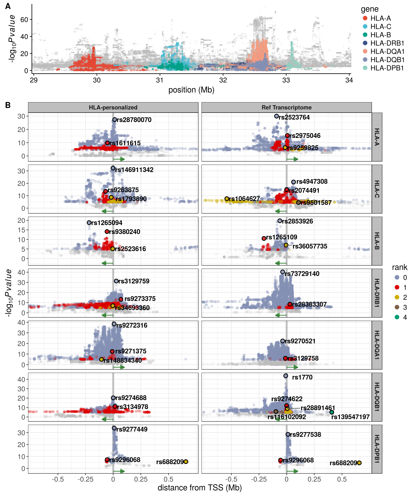

Report
================

eQTLs
=====

\*Analysis were carried out using European individuals only

PCA of genotypes
----------------

Number of eGenes according to method of phenotype correction
------------------------------------------------------------

Distribution of eQTLs around the TSS
------------------------------------

HLA lineages
------------

RTC
===

Geuvadis
--------

Some of our eQTLs seem to mark the same biological signal as the eQTLs found by Geuvadis (RTC &gt; 0.9)

| gene     | variant     |  rank| geuvadis\_gene    | geuvadis\_variant |    rtc|
|:---------|:------------|-----:|:------------------|:------------------|------:|
| HLA-A    | rs3823342   |     0| HLA-A             | rs114565353       |  0.360|
| HLA-A    | rs1655924   |     1| HLA-A             | rs114565353       |  0.998|
| HLA-B    | rs1265081   |     0| HLA-C             | rs115899777       |  0.988|
| HLA-B    | rs9264803   |     1| HLA-C             | rs115899777       |  0.463|
| HLA-C    | rs146911342 |     0| HLA-C             | rs115899777       |  0.966|
| HLA-C    | rs4098923   |     1| HLA-B             | rs137939159       |  0.962|
| HLA-C    | rs2249741   |     2| HLA-B             | rs137939159       |  0.556|
| HLA-DQA1 | rs9272316   |     0| HLA-DRB1          | rs116405062       |  0.974|
| HLA-DQA1 | rs9271375   |     1| HLA-DQA1/HLA-DQB1 | rs9274660         |  0.835|
| HLA-DQA1 | rs115808351 |     2| HLA-DQA1/HLA-DQB1 | rs9274660         |  0.779|
| HLA-DQB1 | rs9274688   |     0| HLA-DRB1          | rs116405062       |  0.926|
| HLA-DQB1 | rs3134977   |     1| HLA-DQA1/HLA-DQB1 | rs9274660         |  0.710|
| HLA-DRB1 | rs9270698   |     0| HLA-DQA1/HLA-DQB1 | rs9274660         |  0.920|
| HLA-DRB1 | rs1048372   |     1| HLA-DQA1/HLA-DQB1 | rs9274660         |  0.707|
| HLA-DRB1 | rs145607970 |     2| HLA-DQA1/HLA-DQB1 | rs9274660         |  0.919|

Association with GWAS traits
----------------------------

| gene     |  rank| variant     | gwas\_variant |    rtc| trait                                           | studies                                                                                                                                                                                                                       |
|:---------|-----:|:------------|:--------------|------:|:------------------------------------------------|:------------------------------------------------------------------------------------------------------------------------------------------------------------------------------------------------------------------------------|
| HLA-A    |     0| rs3823342   | rs2517713     |  0.985| nasopharyngeal neoplasm                         | www.ncbi.nlm.nih.gov/pubmed/19664746                                                                                                                                                                                          |
| HLA-A    |     1| rs1655924   | rs2523809     |  0.933| serum IgE measurement                           | www.ncbi.nlm.nih.gov/pubmed/22075330                                                                                                                                                                                          |
| HLA-B    |     0| rs1265081   | rs1265112     |  0.997| response to reverse transcriptase inhibitor     | www.ncbi.nlm.nih.gov/pubmed/21810746                                                                                                                                                                                          |
| HLA-B    |     1| rs9264803   | rs9264942     |  0.999| Crohn's disease                                 | www.ncbi.nlm.nih.gov/pubmed/21051598 www.ncbi.nlm.nih.gov/pubmed/20041166 www.ncbi.nlm.nih.gov/pubmed/23128233 www.ncbi.nlm.nih.gov/pubmed/26192919                                                                           |
| HLA-B    |     1| rs9264803   | rs9264942     |  0.999| HIV-1 infection                                 | www.ncbi.nlm.nih.gov/pubmed/21051598 www.ncbi.nlm.nih.gov/pubmed/20041166 www.ncbi.nlm.nih.gov/pubmed/23128233 www.ncbi.nlm.nih.gov/pubmed/26192919                                                                           |
| HLA-B    |     1| rs9264803   | rs9264942     |  0.999| inflammatory bowel disease                      | www.ncbi.nlm.nih.gov/pubmed/21051598 www.ncbi.nlm.nih.gov/pubmed/20041166 www.ncbi.nlm.nih.gov/pubmed/23128233 www.ncbi.nlm.nih.gov/pubmed/26192919                                                                           |
| HLA-C    |     0| rs146911342 | rs9263963     |  0.973| serum IgG glycosylation measurement             | www.ncbi.nlm.nih.gov/pubmed/23382691                                                                                                                                                                                          |
| HLA-C    |     1| rs4098923   | rs3869109     |  0.996| coronary heart disease                          | www.ncbi.nlm.nih.gov/pubmed/22319020                                                                                                                                                                                          |
| HLA-C    |     2| rs2249741   | rs9264638     |  0.997| beta-2 microglobulin measurement                | www.ncbi.nlm.nih.gov/pubmed/23417110                                                                                                                                                                                          |
| HLA-DQA1 |     0| rs9272316   | rs2395185     |  0.983| antinuclear antibody measurement                | www.ncbi.nlm.nih.gov/pubmed/19122664 www.ncbi.nlm.nih.gov/pubmed/22286212 www.ncbi.nlm.nih.gov/pubmed/19915573 www.ncbi.nlm.nih.gov/pubmed/23143601 www.ncbi.nlm.nih.gov/pubmed/25186300 www.ncbi.nlm.nih.gov/pubmed/20228799 |
| HLA-DQA1 |     0| rs9272316   | rs2395185     |  0.983| Hodgkins lymphoma                               | www.ncbi.nlm.nih.gov/pubmed/19122664 www.ncbi.nlm.nih.gov/pubmed/22286212 www.ncbi.nlm.nih.gov/pubmed/19915573 www.ncbi.nlm.nih.gov/pubmed/23143601 www.ncbi.nlm.nih.gov/pubmed/25186300 www.ncbi.nlm.nih.gov/pubmed/20228799 |
| HLA-DQA1 |     0| rs9272316   | rs2395185     |  0.983| lung carcinoma                                  | www.ncbi.nlm.nih.gov/pubmed/19122664 www.ncbi.nlm.nih.gov/pubmed/22286212 www.ncbi.nlm.nih.gov/pubmed/19915573 www.ncbi.nlm.nih.gov/pubmed/23143601 www.ncbi.nlm.nih.gov/pubmed/25186300 www.ncbi.nlm.nih.gov/pubmed/20228799 |
| HLA-DQA1 |     0| rs9272316   | rs2395185     |  0.983| ulcerative colitis                              | www.ncbi.nlm.nih.gov/pubmed/19122664 www.ncbi.nlm.nih.gov/pubmed/22286212 www.ncbi.nlm.nih.gov/pubmed/19915573 www.ncbi.nlm.nih.gov/pubmed/23143601 www.ncbi.nlm.nih.gov/pubmed/25186300 www.ncbi.nlm.nih.gov/pubmed/20228799 |
| HLA-DQA1 |     0| rs9272316   | rs9268853     |  0.983| lymphoma                                        | www.ncbi.nlm.nih.gov/pubmed/21297633 www.ncbi.nlm.nih.gov/pubmed/23349640 www.ncbi.nlm.nih.gov/pubmed/23511034                                                                                                                |
| HLA-DQA1 |     0| rs9272316   | rs9268853     |  0.983| ulcerative colitis                              | www.ncbi.nlm.nih.gov/pubmed/21297633 www.ncbi.nlm.nih.gov/pubmed/23349640 www.ncbi.nlm.nih.gov/pubmed/23511034                                                                                                                |
| HLA-DQA1 |     0| rs9272316   | rs9268905     |  0.983| Cystic fibrosis                                 | www.ncbi.nlm.nih.gov/pubmed/21602797                                                                                                                                                                                          |
| HLA-DQA1 |     0| rs9272316   | rs9268923     |  0.983| ulcerative colitis                              | www.ncbi.nlm.nih.gov/pubmed/20228798 www.ncbi.nlm.nih.gov/pubmed/26819262                                                                                                                                                     |
| HLA-DQA1 |     0| rs9272316   | rs9268923     |  0.983| NA                                              | www.ncbi.nlm.nih.gov/pubmed/20228798 www.ncbi.nlm.nih.gov/pubmed/26819262                                                                                                                                                     |
| HLA-DQA1 |     1| rs9271375   | rs3135338     |  0.985| multiple sclerosis                              | www.ncbi.nlm.nih.gov/pubmed/20159113                                                                                                                                                                                          |
| HLA-DQA1 |     2| rs115808351 | rs9461776     |  1.000| cryoglobulinemia, Chronic Hepatitis C infection | www.ncbi.nlm.nih.gov/pubmed/25030430                                                                                                                                                                                          |
| HLA-DQB1 |     0| rs9274688   | rs2647045     |  0.996| lymphoma                                        | www.ncbi.nlm.nih.gov/pubmed/23349640                                                                                                                                                                                          |
| HLA-DQB1 |     1| rs3134977   | rs2647044     |  0.999| pulmonary function measurement, FEV/FEC ratio   | www.ncbi.nlm.nih.gov/pubmed/17632545 www.ncbi.nlm.nih.gov/pubmed/21946350                                                                                                                                                     |
| HLA-DQB1 |     1| rs3134977   | rs2647044     |  0.999| type I diabetes mellitus                        | www.ncbi.nlm.nih.gov/pubmed/17632545 www.ncbi.nlm.nih.gov/pubmed/21946350                                                                                                                                                     |
| HLA-DQB1 |     1| rs3134977   | rs3129716     |  0.999| systemic lupus erythematosus                    | www.ncbi.nlm.nih.gov/pubmed/26316170                                                                                                                                                                                          |
| HLA-DRB1 |     0| rs9270698   | rs9271060     |  0.992| Crohn's disease                                 | www.ncbi.nlm.nih.gov/pubmed/26891255                                                                                                                                                                                          |
| HLA-DRB1 |     0| rs9270698   | rs9271100     |  0.992| leprosy                                         | www.ncbi.nlm.nih.gov/pubmed/19838193 www.ncbi.nlm.nih.gov/pubmed/25642632 www.ncbi.nlm.nih.gov/pubmed/26192919                                                                                                                |
| HLA-DRB1 |     0| rs9270698   | rs9271100     |  0.992| systemic lupus erythematosus                    | www.ncbi.nlm.nih.gov/pubmed/19838193 www.ncbi.nlm.nih.gov/pubmed/25642632 www.ncbi.nlm.nih.gov/pubmed/26192919                                                                                                                |
| HLA-DRB1 |     0| rs9270698   | rs9271100     |  0.992| ulcerative colitis                              | www.ncbi.nlm.nih.gov/pubmed/19838193 www.ncbi.nlm.nih.gov/pubmed/25642632 www.ncbi.nlm.nih.gov/pubmed/26192919                                                                                                                |
| HLA-DRB1 |     0| rs9270698   | rs9271192     |  0.992| Alzheimers disease                              | www.ncbi.nlm.nih.gov/pubmed/24162737                                                                                                                                                                                          |
| HLA-DRB1 |     1| rs1048372   | rs9271348     |  1.000| rheumatoid arthritis                            | www.ncbi.nlm.nih.gov/pubmed/24532677                                                                                                                                                                                          |
| HLA-DRB1 |     2| rs145607970 | rs35597309    |  0.998| esophageal squamous cell carcinoma              | www.ncbi.nlm.nih.gov/pubmed/25129146                                                                                                                                                                                          |
