```{r setup, include=FALSE}
knitr::opts_chunk$set(echo = FALSE, message = FALSE, warning = FALSE, comment = "")
```

```{r pkgs, echo = FALSE}
library(knitr)
library(tidyverse)
```

**All analyses were carried out using European individuals only (N = 358)**

# Typing accuracies

\*Concordance: the proportion of the called alleles that are concordant with the
Gourraud et al (2014) typings

```{r}
kallisto_typing <-
    read_tsv("./expression/kallisto/supplemented/genotyping_accuracies_2.tsv") %>%
    select(locus, kallisto = accuracy)

star_typing <-
    read_tsv("./expression/star/main_pipeline/genotyping_accuracies_final.tsv") %>%
    select(locus, star = accuracy)

left_join(star_typing, kallisto_typing, by = "locus") %>%
    mutate_at(vars(star, kallisto), function(x) x*100) %>%
    kable(digits = 2)
```

# Expression estimates

```{r}
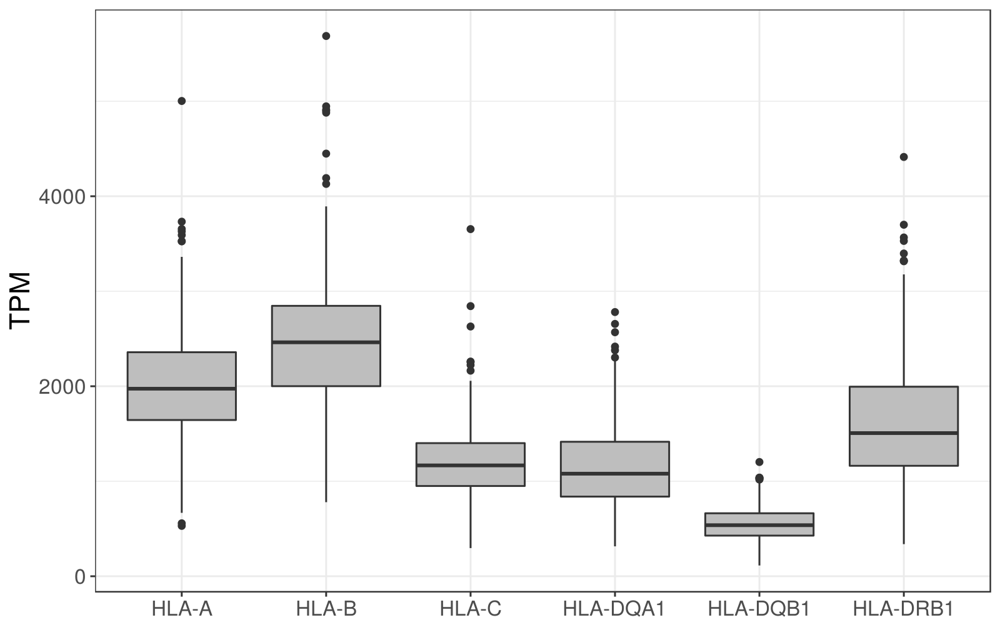
```

## HLA diversity vs reference transcriptome

```{r}
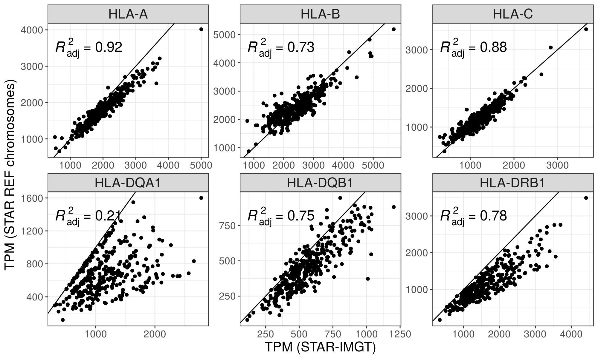
```

## STAR-Salmon vs kallisto

```{r}
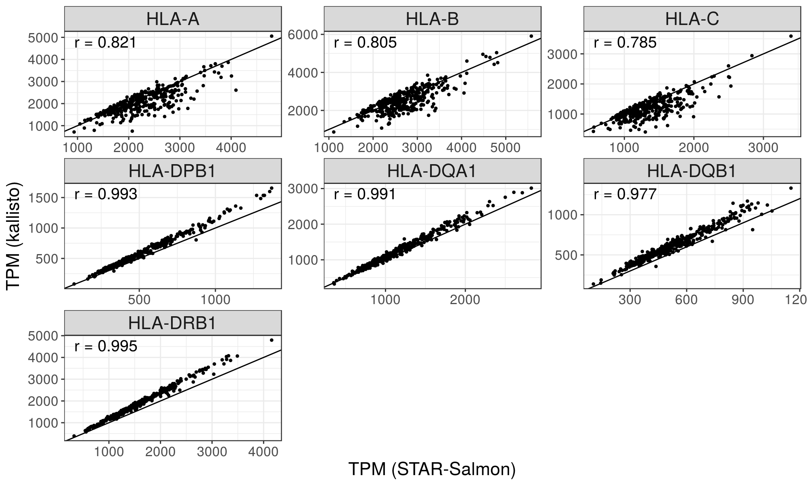
```

## Distribution of TPM values

```{r}
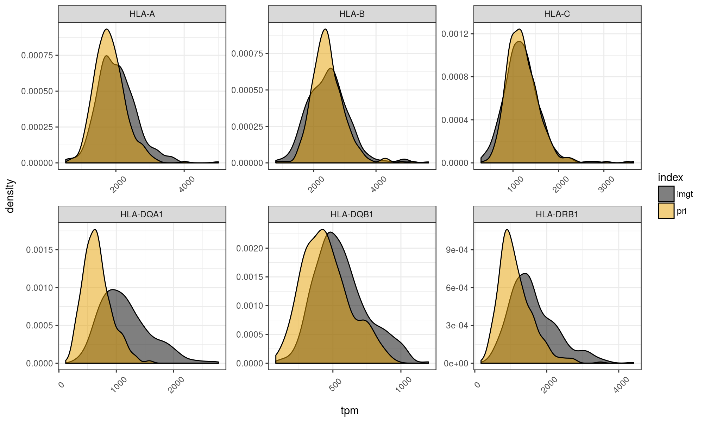
```

## ASE 

```{r}
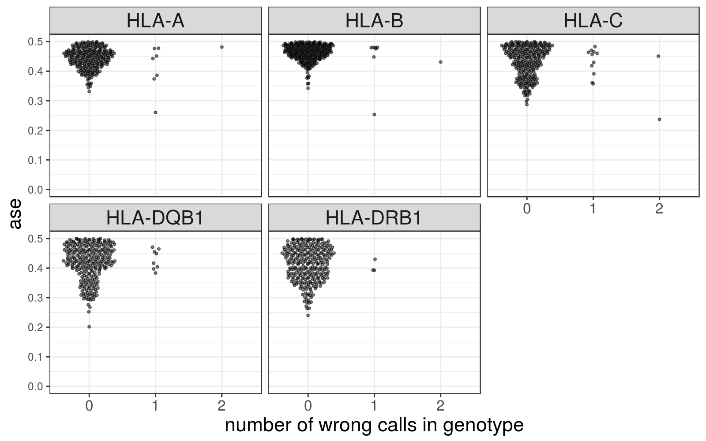
```

### ASE distribution

```{r}
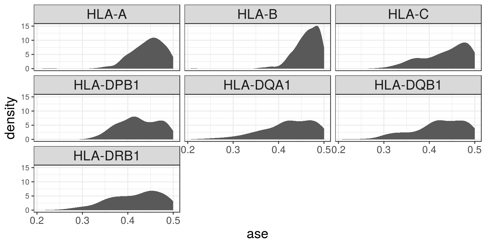
```

## Correlation of expression

```{r}
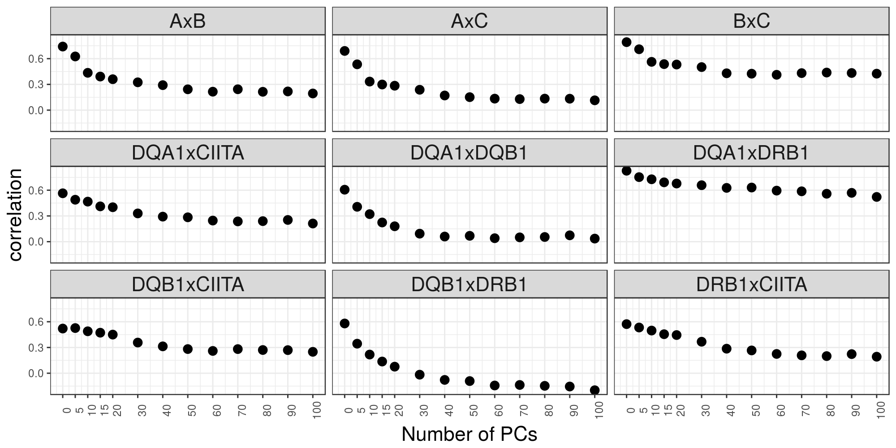
```

### Among the HLA genes

```{r}
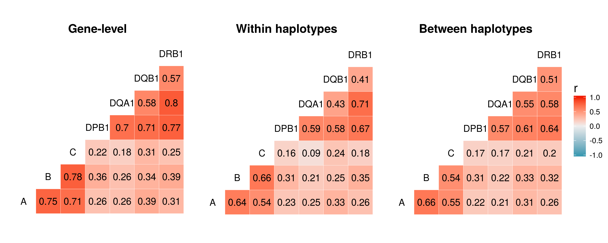
```


### CRDs

*CRDs are defined in http://dx.doi.org/10.1101/171694* 

```{r}
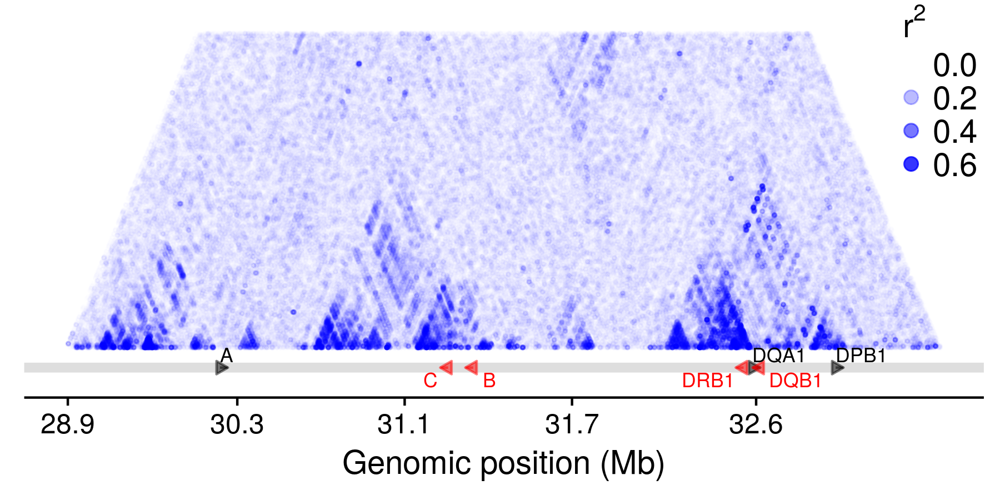
```


### Between Class II genes and CIITA

```{r}
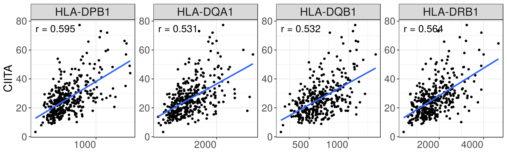
```


# eQTLs

## PCA of genotypes

```{r}
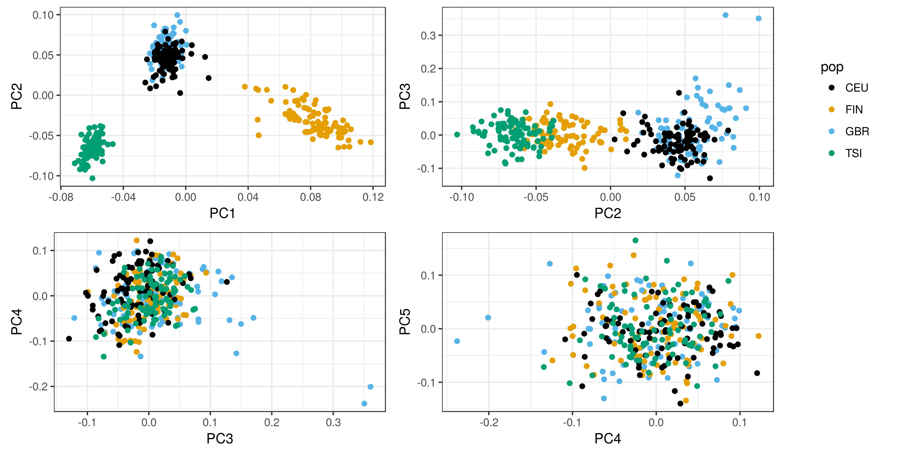
```

## Number of eGenes according to index

```{r}
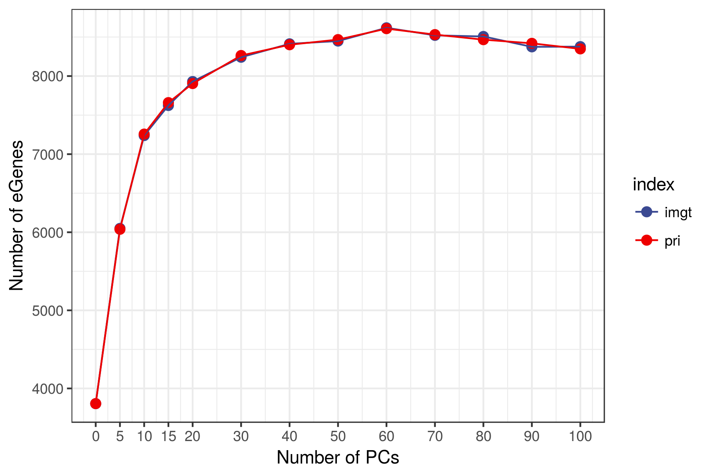
```

## Distribution of eQTLs around the TSS

```{r}
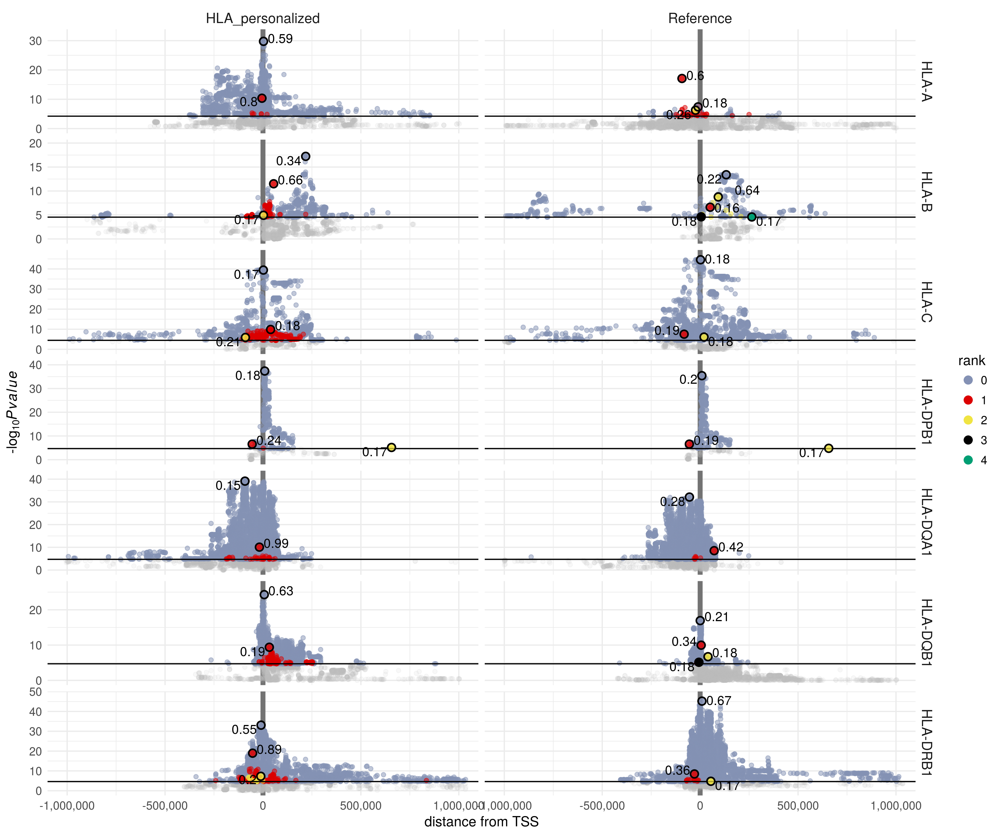
```

## Spread of rank 0 eQTLs around the TSS

```{r}
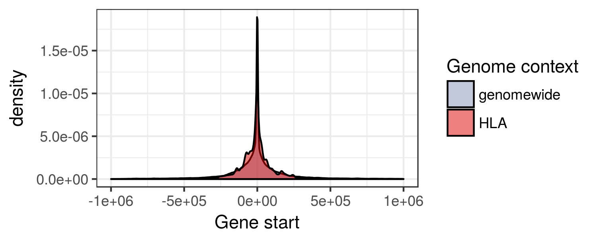
```

## Investigating bias

```{r}
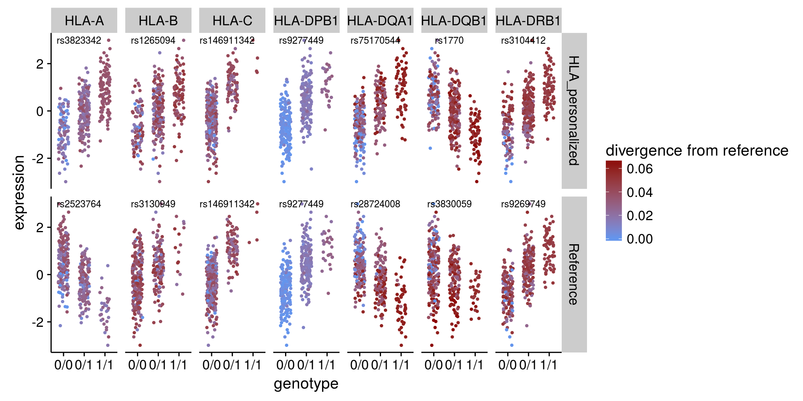
```


The last column is the partial correlation cor(expression ~ divergence | controlling for genotype).
The idea here is that once we control for the genotype effect, the divergence of
the HLA allele from the reference would not explain much of the variation in 
expression.

```{r}
read_tsv("./investigate_bias/correlations.tsv") %>%
    kable(digits = 2)
```


## Intersect with Encode Elements

### HLA-personalized index

```{r}
"./qtls/star/main_pipeline/supplemented/functional_features/results.tsv" %>%
    read_tsv()%>%
    kable(digits = 2)
```

### Reference transcriptome index

```{r}
"./qtls/star/main_pipeline/transcriptome/functional_features/results.tsv" %>%
    read_tsv() %>%
    kable(digits = 2)
```


## RTC between IMGT and Ref Transcriptome eQTLs

Variants with RTC > 0.95 likely mark the same biological signal.

```{r}
read_tsv("./qtls/star/main_pipeline/supplemented/rtc/pri_eqtls/results.tsv") %>%
    kable(digits = 2)
```

## RTC with previous eQTLs

```{r, eval}
read_tsv("./qtls/star/supplemented/rtc/previous_qtls/results.tsv") %>%
    kable(digits = 2)
```

## Association with GWAS traits

```{r}
read_tsv("./qtls/star/main_pipeline/supplemented/rtc/gwas/results.tsv") %>%
    kable()
```

## HLA lineages

```{r}
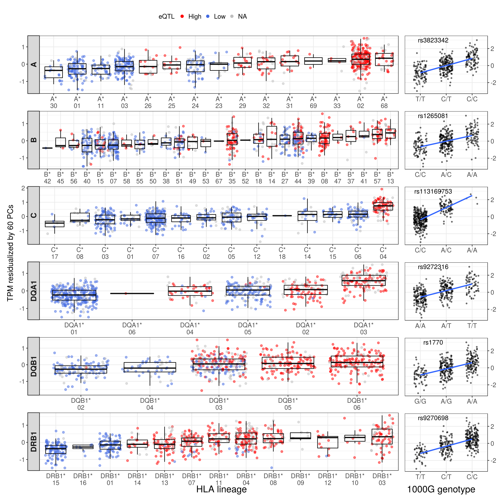
```

### F-test: is there a difference between lineages?

#### traditional ANOVA

```{r}
read_tsv("./qtls/f_test_lineages.tsv") %>%
    mutate(p.value = format(p.value, digits = 3)) %>%
    select(locus, df, F, p.value) %>%
    kable(digits = 3)
```

#### Welch ANOVA

```{r}
read_tsv("./qtls/f_onewaytest_lineages.tsv") %>%
    mutate(p.value = format(p.value, digits = 3)) %>%
    kable(digits = 3)
```

