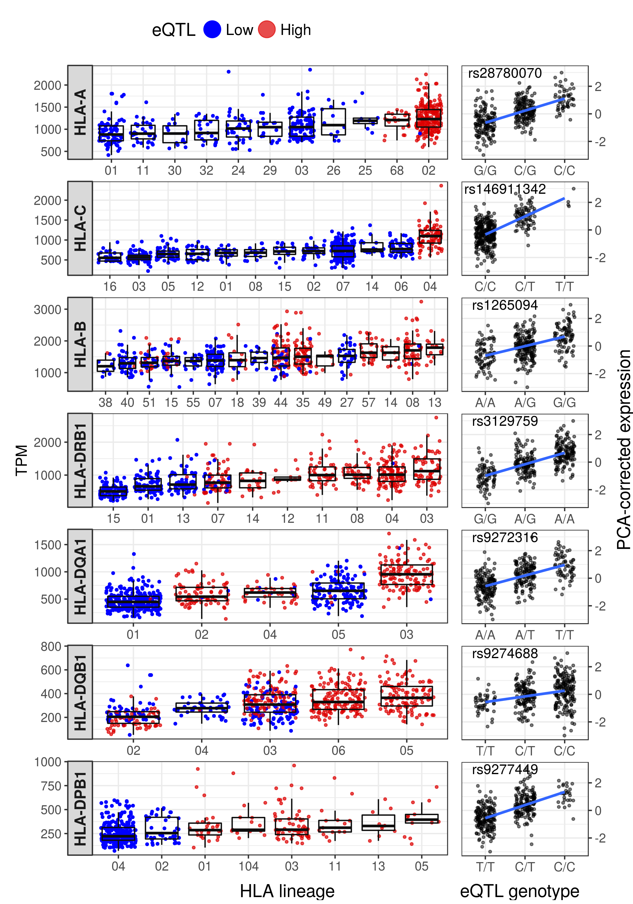

```{r setup, include=FALSE}
knitr::opts_chunk$set(echo = FALSE, message = FALSE, warning = FALSE, comment = "")
```

```{r pkgs, echo = FALSE}
library(knitr)
library(tidyverse)
```

# Typing accuracies

\*Concordance: the proportion of the called alleles that are concordant with the
Gourraud et al (2014) typings

```{r}
kallisto_typing <-
    read_tsv("./expression/kallisto/genotyping_accuracies_2.tsv") %>%
    select(locus, kallisto = accuracy)

star_typing <-
    read_tsv("./expression/star/genotyping_accuracies_2.tsv") %>%
    select(locus, star = accuracy)

left_join(star_typing, kallisto_typing, by = "locus") %>%
    mutate_at(vars(star, kallisto), function(x) x*100) %>%
    kable(digits = 2)
```

# Expression estimates

## kallisto vs STAR-Salmon

### TPM

```{r}
include_graphics("./expression/plots/star_vs_kallisto_TPM.png")
```

### PCA-corrected

```{r}
include_graphics("./expression/plots/star_vs_kallisto_PCA.png")
```

## HLA diversity vs reference chromosomes only

### TPM

#### STAR

```{r}
include_graphics("./expression/plots/star_imgt_vs_pri_TPM.png")
```

#### kallisto

```{r}
include_graphics("./expression/plots/kallisto_imgt_vs_pri_TPM.png")
```

### PCA-corrected

#### STAR

```{r}
include_graphics("./expression/plots/star_imgt_vs_pri_PCA.png")
```

#### kallisto

```{r}
include_graphics("./expression/plots/kallisto_imgt_vs_pri_PCA.png")
```

## Distribution of TPM values

```{r}
include_graphics("./expression/plots/tpm_distributions.png")
```

## ASE 

### ASE by number of genotyping errors

\*Each point represents a heterozygous genotype in the intersect with Gourraud
data.

```{r}
include_graphics("./expression/plots/ase.png")
```

### ASE distribution

```{r}
include_graphics("./expression/plots/ase_histogram.png")
```

## Correlation of expression

```{r}
include_graphics("./expression/plots/correlation_decrease.png")
```

### Among the HLA genes

```{r}
include_graphics("./expression/plots/hlacorrelations.png")
```

### Between Class II genes and CIITA

```{r}
include_graphics("./expression/plots/trans_activ_corrs.png")
```

### Between pairs of HLA genes on the same vs on different haplotypes

#### HLA-A vs HLA-B

```{r}
include_graphics("./expression/plots/a_vs_b.png")
```

#### HLA-A vs HLA-C

```{r}
include_graphics("./expression/plots/a_vs_c.png")
```

#### HLA-B vs HLA-C

```{r}
include_graphics("./expression/plots/b_vs_c.png")
```

#### HLA-DQA1 vs HLA-DQB1

```{r}
include_graphics("./expression/plots/dqa_vs_dqb.png")
```

#### HLA-DQA1 vs HLA-DRB1

```{r}
include_graphics("./expression/plots/dqa_vs_drb.png")
```

# eQTLs

**All analyses were carried out using European individuals only**

## PCA of genotypes

```{r}
include_graphics("./qtls/plots/genotype_pca.png")
```

## Number of eGenes according to index

**coming soon**

```{r eval=FALSE}
include_graphics("./qtls/plots/n_of_egenes.png")
```

## Distribution of eQTLs around the TSS

### IMGT index

```{r}
include_graphics("./qtls/plots/qtls_landscape_imgt.png")
```

### Reference transcriptome

**coming soon**

```{r eval=FALSE}
include_graphics("./qtls/plots/qtls_landscape_pri.png")
```

## HLA lineages

```{r}

```

## Comparison with Geuvadis

### RTC

Some of our eQTLs seem to mark the same biological signal as the eQTLs found by
Geuvadis (RTC > 0.9)

**coming soon**

```{r eval=FALSE}
"./qtls/qtls_star/rtc/geuvadis_eqtls/results.tsv" %>%
    read_tsv() %>%
    kable()
```

### LD between our best SNP (STAR) and Geuvadis best SNP

**coming soon**

```{r eval=FALSE}
read_tsv("./qtls/qtls_star/rtc/geuvadis_eqtls/ld_star_geuvadis_bestSNPs.tsv") %>%
    unite("Geuvadis_STAR", c("allele_geuvadis", "allele_star"), sep = "_") %>%
    rename(f_allele_geuv = f_geuvadis, f_allele_star = f_star) %>%
    kable(digits = 2)
```

### slope and p-value

**coming soon**

```{r eval=FALSE}
geuvadis_qtls <- 
    read_tsv("./qtls/qtls_star/rtc/geuvadis_eqtls/catalog.tsv",
             col_names = c("variant", "info")) %>%
    select(-variant) %>%
    separate(info, c("geuvadis_variant", "geuvadis_gene", "geuvadis_slope",
                     "geuvadis_pvalue"), sep = ":")

star_qtls <- read_tsv("./qtls/plots/eqtls.tsv") %>%
    select(gene = phen_id, rank, variant = var_id, slope, pvalue = nom_pval) %>%
    mutate_at(vars(slope, pvalue), function(x) round(x, digits = 2))

pval_df <-
    star_qtls %>%
    filter(rank == 0L) %>%
    left_join(geuvadis_qtls, by = c("gene" = "geuvadis_gene")) %>%
    select(gene, variant, geuvadis_variant, slope, geuvadis_slope, 
           pvalue, geuvadis_pvalue)

kable(pval_df)
```

# Association to GWAS traits

**coming soon**

```{r eval=FALSE}
read_tsv("./qtls/qtls_star/rtc/gwas/results.tsv") %>%
    select(gene, rank, variant, gwas_variant, rtc, trait, studies = link) %>%
    group_by(gene, rank, variant, gwas_variant, rtc) %>%
    summarize(trait = paste(trait, collapse = "/"), 
              studies = paste(studies, collapse = " ")) %>%
    kable(digits = 2)
```

# Trans-eQTLs

- Approximate pass as described on QTLtools website

**coming soon**

```{r eval=FALSE}
read_tsv("./qtls/qtls_star/trans/trans_results.tsv") %>%
    kable()
```
