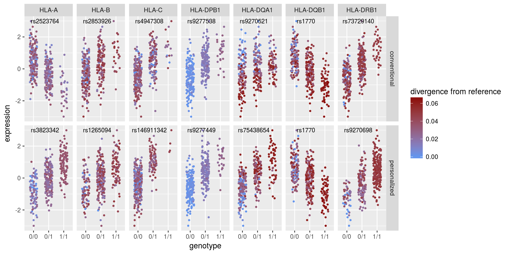

```{r setup, include=FALSE}
knitr::opts_chunk$set(echo = FALSE, message = FALSE, warning = FALSE, comment = "")
```

```{r pkgs, echo = FALSE}
library(knitr)
library(tidyverse)
```

**All analyses were carried out using European individuals only (N = 358)**

# Typing accuracies

\*Concordance: the proportion of the called alleles that are concordant with the
Gourraud et al (2014) typings

```{r}
kallisto_typing <-
    read_tsv("./expression/kallisto/supplemented/genotyping_accuracies_2.tsv") %>%
    select(locus, kallisto = accuracy)

star_typing <-
    read_tsv("./expression/star/supplemented/genotyping_accuracies_2.tsv") %>%
    select(locus, star = accuracy)

left_join(star_typing, kallisto_typing, by = "locus") %>%
    mutate_at(vars(star, kallisto), function(x) x*100) %>%
    kable(digits = 2)
```

# Expression estimates

```{r}
include_graphics("./expression/plots/expression_boxplot.png")
```

## STAR-Salmon vs kallisto

### TPM

```{r}
include_graphics("./expression/plots/star_vs_kallisto_TPM.png")
```

### PCA

```{r}
include_graphics("./expression/plots/star_vs_kallisto_PCA.png")
```

## HLA diversity vs reference transcriptome

### TPM

```{r}
include_graphics("./expression/plots/star_imgt_vs_pri_TPM.png")
```

### PCA-corrected

```{r}
include_graphics("./expression/plots/star_imgt_vs_pri_PCA.png")
```

## Distribution of TPM values

```{r}
include_graphics("./expression/plots/tpm_distributions.png")
```

## ASE 

```{r}
include_graphics("./expression/plots/ase.png")
```

### Genotyping errors impacting ASE:

\*Each point represents a heterozygous genotype in the intersect with Gourraud
data.

```{r}
include_graphics("./expression/plots/ase_genot_errors.png")
```

### ASE distribution

```{r}
include_graphics("./expression/plots/ase_histogram.png")
```

## Correlation of expression

```{r}
include_graphics("./expression/plots/correlation_decrease.png")
```

### Among the HLA genes

*CRDs are defined in http://dx.doi.org/10.1101/171694* 

```{r}
include_graphics("./expression/plots/correlations.png")
```

### Between Class II genes and CIITA

```{r}
include_graphics("./expression/plots/trans_activ_corrs.png")
```


# eQTLs

## PCA of genotypes

```{r}
include_graphics("./qtls/plots/genotype_pca.png")
```

## Number of eGenes according to index

```{r}
include_graphics("./qtls/plots/n_of_egenes.png")
```

## Distribution of eQTLs around the TSS

```{r}
include_graphics("./qtls/plots/qtls_landscape.png")
```

## Spread of rank 0 eQTLs around the TSS

```{r}
include_graphics("./qtls/plots/qtls_density_geneStart.png")
```

## Investigating bias

```{r}

```

```{r}
read_tsv("./investigate_bias/correlations.tsv") %>%
    kable(digits = 2)
```


## Intersect with Encode Elements

### HLA-personalized index

```{r}
"./qtls/star/supplemented/encode_TF_Seq_DNase/hla.qtl.functional.elements.tsv" %>%
    read_tsv()%>%
    kable(digits = 2)
```

### Reference transcriptome index

```{r}
"./qtls/star/transcriptome/encode_TF_Seq_DNase/hla.qtl.functional.elements.tsv" %>%
    read_tsv() %>%
    kable(digits = 2)
```


## RTC between IMGT and Ref Transcriptome eQTLs

Variants with RTC > 0.95 likely mark the same biological signal.

```{r}
read_tsv("./qtls/star/supplemented/rtc/pri_eqtls/results.tsv") %>%
    kable(digits = 2)
```

## RTC with previous eQTLs

```{r, eval}
read_tsv("./qtls/star/supplemented/rtc/previous_qtls/results.tsv") %>%
    kable(digits = 2)
```

## Association with GWAS traits

```{r}
read_tsv("./qtls/star/supplemented/rtc/gwas/results.tsv") %>%
    mutate(info = ifelse(is.na(gwas_var), NA, paste0(trait, " (", gwas_var, ")"))) %>%
    group_by(gene, variant, rank) %>%
    summarise(info = paste(info, collapse = "; ")) %>%
    ungroup() %>%
    arrange(gene, rank) %>%
    kable()
```

## HLA lineages

```{r}
include_graphics("./qtls/plots/lineage_and_effects.png")
```

### F-test: is there a difference between lineages?

#### traditional ANOVA

```{r}
read_tsv("./qtls/f_test_lineages.tsv") %>%
    mutate(p.value = format(p.value, digits = 3)) %>%
    select(locus, df, F, p.value) %>%
    kable(digits = 3)
```

#### Welch ANOVA

```{r}
read_tsv("./qtls/f_onewaytest_lineages.tsv") %>%
    mutate(p.value = format(p.value, digits = 3)) %>%
    kable(digits = 3)
```

