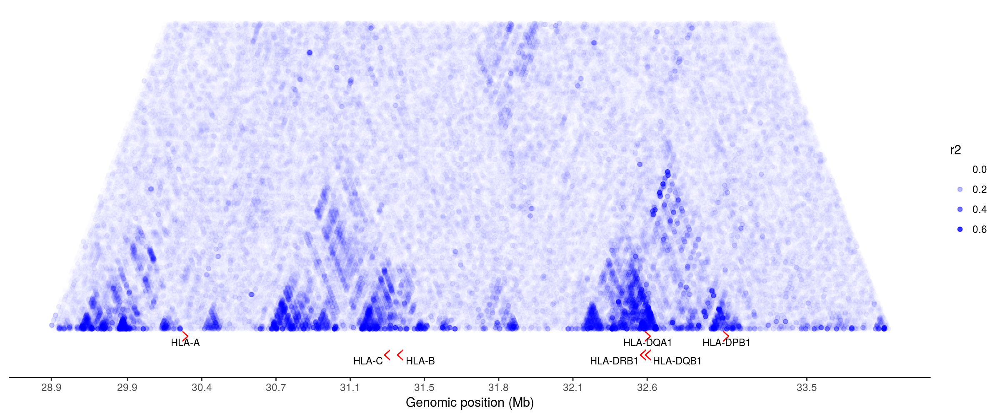

```{r setup, include=FALSE}
knitr::opts_chunk$set(echo = FALSE, message = FALSE, warning = FALSE, comment = "")
```

```{r pkgs, echo = FALSE}
library(knitr)
library(tidyverse)
```

**All analyses were carried out using European individuals only (N = 358)**

# Typing accuracies

\*Concordance: the proportion of the called alleles that are concordant with the
Gourraud et al (2014) typings

```{r}
kallisto_typing <-
    read_tsv("./expression/kallisto/imgt/genotyping_accuracies_2.tsv") %>%
    select(locus, kallisto = accuracy)

star_typing <-
    read_tsv("./expression/star/imgt/genotyping_accuracies_2.tsv") %>%
    select(locus, star = accuracy)

left_join(star_typing, kallisto_typing, by = "locus") %>%
    mutate_at(vars(star, kallisto), function(x) x*100) %>%
    kable(digits = 2)
```

# Expression estimates

```{r}
include_graphics("./expression/plots/expression_boxplot.png")
```

## kallisto vs STAR-Salmon

### TPM

```{r}
include_graphics("./expression/plots/star_vs_kallisto_TPM.png")
```

### PCA

```{r}
include_graphics("./expression/plots/star_vs_kallisto_PCA.png")
```

## HLA diversity vs reference transcriptome

### TPM

#### STAR

```{r}
include_graphics("./expression/plots/star_imgt_vs_pri_TPM.png")
```

#### kallisto

```{r}
include_graphics("./expression/plots/kallisto_imgt_vs_pri_TPM.png")
```

### PCA-corrected

#### STAR

```{r}
include_graphics("./expression/plots/star_imgt_vs_pri_PCA.png")
```

#### kallisto

```{r}
include_graphics("./expression/plots/kallisto_imgt_vs_pri_PCA.png")
```

## Distribution of TPM values

```{r}
include_graphics("./expression/plots/tpm_distributions.png")
```

## ASE 

```{r}
include_graphics("./expression/plots/ase.png")
```

### Genotyping errors impacting ASE:

\*Each point represents a heterozygous genotype in the intersect with Gourraud
data.

```{r}
include_graphics("./expression/plots/ase_genot_errors.png")
```

### ASE distribution

```{r}
include_graphics("./expression/plots/ase_histogram.png")
```

## Correlation of expression

```{r}
include_graphics("./expression/plots/correlation_decrease.png")
```

### Among the HLA genes

```{r}
include_graphics("./expression/plots/hlacorrelations.png")
```

### Between Class II genes and CIITA

```{r}
include_graphics("./expression/plots/trans_activ_corrs.png")
```

### Between pairs of HLA genes on the same vs on different haplotypes

```{r}
include_graphics("./expression/plots/within_vs_between_haps.png")
```

# eQTLs

## PCA of genotypes

```{r}
include_graphics("./qtls/plots/genotype_pca.png")
```

## Number of eGenes according to index

```{r}
include_graphics("./qtls/plots/n_of_egenes.png")
```

## Distribution of eQTLs around the TSS

### IMGT index

```{r}
include_graphics("./qtls/plots/qtls_landscape_imgt.png")
```

### Reference transcriptome

```{r eval=FALSE}
include_graphics("./qtls/plots/qtls_landscape_pri.png")
```

### Spread of rank 0 eQTLs around the gene starts

```{r}
include_graphics("./qtls/plots/qtls_density_geneStart.png")
```

### Location of HLA genes and CRDs

*CRDs are defined in http://dx.doi.org/10.1101/171694* 
*Coordinates are in hg19*

```{r}

```

## RTC between IMGT and Ref Transcriptome eQTLs

Variants with RTC > 0.95 likely mark the same biological signal.

```{r}
read_tsv("./qtls/star/imgt/rtc/pri_eqtls/results.tsv") %>%
    kable(digits = 2)
```

## Comparison with previous eQTLs

### eQTLs in regulomeDB

```{r}
read_tsv("./qtls/star/imgt/haploreg/regulomeDB_results.tsv") %>%
    select(gene, rank, rsid, score, qtl) %>%
    mutate(qtl = gsub("\\|", "_", qtl),
	   qtl = sub(";NA$", "", qtl)) %>%
    kable()
```

### eQTLs in HaploReg

```{r}
read_tsv("./qtls/star/imgt/haploreg/haploreg_results.tsv") %>%
    select(gene, rank, rsid, study, tissue, pvalue) %>%
    kable()
```

### eQTLs in GRASP (via HaploReg)

```{r}
read_tsv("./qtls/star/imgt/haploreg/grasp_results.tsv") %>%
    kable()
```

### RTC

Here we can see that, when our eQTLs were not previously described in the 
databases, they tag some eQTL in the database.

Most of them are tagging an eQTL from regulomeDB. I believe that's because, for
all sources not regulomeDB, I selected only the top variant for each tissue and 
gene. For regulomeDB that's no possible beucase the p-value is not directly 
available, so there are more variants per gene, which increases the chance that
some of these variants will have high RTC with one of our eQTLs.

```{r, eval}
read_tsv("./qtls/star/imgt/rtc/previous_qtls/results.tsv") %>%
    kable(digits = 2)
```

## Association with GWAS traits

```{r}
read_tsv("./qtls/star/imgt/rtc/gwas/results.tsv") %>%
    select(gene, rank, variant, gwas_var, rtc, trait, studies = link) %>%
    group_by(gene, rank, variant, gwas_var, rtc) %>%
    summarize(trait = paste(trait, collapse = "/"), 
              studies = paste(studies, collapse = " ")) %>%
    kable(digits = 2)
```


```{r, eval=FALSE}
# Trans-eQTLs

#- Approximate pass as described on QTLtools website
read_tsv("./qtls/star/imgt/trans/trans_results.tsv") %>%
    kable(digits = 2)
```

## HLA lineages

```{r}
include_graphics("./qtls/plots/lineage_and_effects.png")
```

### F-test: is there a difference between lineages?

#### traditional ANOVA

```{r}
read_tsv("./qtls/f_test_lineages.tsv") %>%
    mutate(p.value = format(p.value, digits = 3)) %>%
    select(locus, df, F, p.value) %>%
    kable(digits = 3)
```

#### Welch ANOVA

```{r}
read_tsv("./qtls/f_onewaytest_lineages.tsv") %>%
    mutate(p.value = format(p.value, digits = 3)) %>%
    kable(digits = 3)
```

