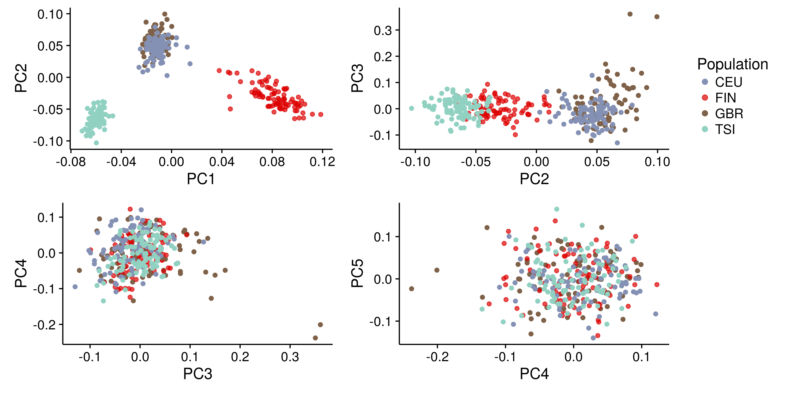

```{r setup, include=FALSE}
knitr::opts_chunk$set(echo = FALSE, message = FALSE, warning = FALSE, comment = "")
```

```{r pkgs, echo = FALSE}
library(knitr)
library(tidyverse)
```

# Typing accuracies

\*Concordance: the proportion of the called alleles that are concordant with the
Gourraud et al (2014) typings

```{r}
kallisto_typing <-
    read_tsv("./expression/kallisto/genotyping_accuracies_2.tsv") %>%
    select(locus, kallisto = accuracy)

star_typing <-
    read_tsv("./expression/star/genotyping_accuracies_2.tsv") %>%
    select(locus, star = accuracy)

left_join(star_typing, kallisto_typing, by = "locus") %>%
    mutate_at(vars(star, kallisto), function(x) x*100) %>%
    kable(digits = 2)
```

# Expression estimates

```{r}
include_graphics("./expression/plots/expression_boxplot.png")
```

## kallisto vs STAR-Salmon

### TPM

```{r}
include_graphics("./expression/plots/star_vs_kallisto_TPM.png")
```

### PCA-corrected

```{r}
include_graphics("./expression/plots/star_vs_kallisto_PCA.png")
```

## HLA diversity vs reference chromosomes only

### TPM

#### STAR

```{r}
include_graphics("./expression/plots/star_imgt_vs_pri_TPM.png")
```

#### kallisto

```{r}
include_graphics("./expression/plots/kallisto_imgt_vs_pri_TPM.png")
```

### PCA-corrected

#### STAR

```{r}
include_graphics("./expression/plots/star_imgt_vs_pri_PCA.png")
```

#### kallisto

```{r}
include_graphics("./expression/plots/kallisto_imgt_vs_pri_PCA.png")
```

## Distribution of TPM values

```{r}
include_graphics("./expression/plots/tpm_distributions.png")
```

## ASE 

### ASE by number of genotyping errors

\*Each point represents a heterozygous genotype in the intersect with Gourraud
data.

```{r}
include_graphics("./expression/plots/ase.png")
```

### ASE distribution

```{r}
include_graphics("./expression/plots/ase_histogram.png")
```

## Correlation of expression

```{r}
include_graphics("./expression/plots/correlation_decrease.png")
```

### Among the HLA genes

```{r}
include_graphics("./expression/plots/hlacorrelations.png")
```

### Between Class II genes and CIITA

```{r}
include_graphics("./expression/plots/trans_activ_corrs.png")
```

### Between pairs of HLA genes on the same vs on different haplotypes

#### HLA-A vs HLA-B

```{r}
include_graphics("./expression/plots/a_vs_b.png")
```

#### HLA-A vs HLA-C

```{r}
include_graphics("./expression/plots/a_vs_c.png")
```

#### HLA-B vs HLA-C

```{r}
include_graphics("./expression/plots/b_vs_c.png")
```

#### HLA-DQA1 vs HLA-DQB1

```{r}
include_graphics("./expression/plots/dqa_vs_dqb.png")
```

#### HLA-DQA1 vs HLA-DRB1

```{r}
include_graphics("./expression/plots/dqa_vs_drb.png")
```

# eQTLs

**All analyses were carried out using European individuals only**

## PCA of genotypes

```{r}

```

## Number of eGenes according to index

```{r}
include_graphics("./qtls/plots/n_of_egenes.png")
```

## Distribution of eQTLs around the TSS

### IMGT index

```{r}
include_graphics("./qtls/plots/qtls_landscape_imgt.png")
```

### Reference transcriptome

```{r}
include_graphics("./qtls/plots/qtls_landscape_pri.png")
```

## RegulomeDB score

```{r}
read_tsv("./qtls/qtls_with_regulome_score.tsv") %>%
    kable()
```

## RTC between IMGT and Ref Transcriptome eQTLs

Variants with RTC > 0.9 likely mark the same biological signal.

```{r}
read_tsv("./qtls/qtls_star/imgt/rtc/pri_eqtls/results.tsv") %>%
    kable(digits = 2)
```

## Comparison with previous eQTLs

### RTC

```{r}
read_tsv("./qtls/qtls_star/imgt/rtc/previous_qtls/results.tsv") %>%
    kable(digits = 2)
```

### comparison of slope and p-value with Geuvadis

```{r}
geuvadis_qtls <- "./data/previous_qtls/geuvadis_eqtl_slope_pvals.tsv" %>%
    read_tsv() %>%
    select(geuvadis_gene = phenotype, geuvadis_variant = variant,
	   geuvadis_slope = slope, geuvadis_pvalue = pval)
    
star_qtls <- read_tsv("./qtls/plots/eqtl.tsv") %>%
    select(gene = phen_id, rank, variant = var_id, slope, pvalue = nom_pval) %>%
    mutate_at(vars(slope, pvalue), function(x) round(x, digits = 2))

pval_df <-
    star_qtls %>%
    filter(rank == 0L) %>%
    left_join(geuvadis_qtls, by = c("gene" = "geuvadis_gene")) %>%
    select(gene, variant, geuvadis_variant, slope, geuvadis_slope, 
           pvalue, geuvadis_pvalue)

kable(pval_df)
```

### RTC with variants in Delaneau et al (2017)

[Delaneau et al.
(2017)](https://www.biorxiv.org/content/early/2017/08/03/171694) mapped eQTLs,
chromatin QTLs (cQTLs), CRD QTLs (variants associated with activity or
structure of cis-regulatory domains (CRDs)). The authors found that most of the
QTLs affect both CRD activity and gene expression and therefore likely tag the
same causal variants.

Our eQTLs tag eQTLs, cQTLs, aCRD-QTLs and sCRD-QTLs in that study.

```{r}
read_tsv("./qtls/qtls_star/imgt/rtc/crd/results.tsv")
```

## Association with GWAS traits

```{r}
read_tsv("./qtls/qtls_star/imgt/rtc/gwas/results.tsv") %>%
    select(gene, rank, variant, gwas_variant, rtc, trait, studies = link) %>%
    group_by(gene, rank, variant, gwas_variant, rtc) %>%
    summarize(trait = paste(trait, collapse = "/"), 
              studies = paste(studies, collapse = " ")) %>%
    kable(digits = 2)
```

# Trans-eQTLs

- Approximate pass as described on QTLtools website

```{r}
read_tsv("./qtls/qtls_star/imgt/trans/trans_results.tsv") %>%
    kable(digits = 2)
```

## HLA lineages

```{r}
include_graphics("./qtls/plots/lineage_and_effects.png")
```

### F-test: is there a difference between lineages?

#### traditional ANOVA

```{r}
read_tsv("./qtls/f_test_lineages.tsv") %>%
    mutate(p.value = format(p.value, digits = 3)) %>%
    select(locus, df, F, p.value) %>%
    kable(digits = 3)
```

#### Welch ANOVA

```{r}
read_tsv("./qtls/f_onewaytest_lineages.tsv") %>%
    mutate(p.value = format(p.value, digits = 3)) %>%
    kable(digits = 3)
```

