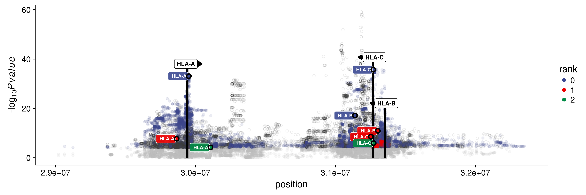
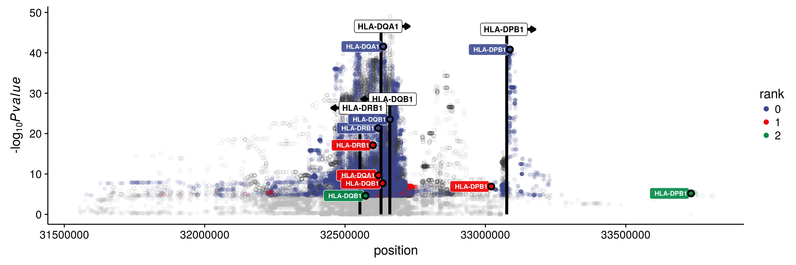

Report
================

Typing accuracies
=================

\*Concordance: the proportion of the called alleles that are concordant with the Gourraud et al (2014) typings

| locus |   star|  kallisto|
|:------|------:|---------:|
| A     |  97.55|     97.06|
| B     |  98.04|     97.55|
| C     |  96.90|     95.92|
| DQB1  |  98.37|     98.53|
| DRB1  |  99.51|     99.51|

Expression estimates
====================

kallisto vs STAR-Salmon
-----------------------

### TPM

### PCA-corrected

HLA diversity vs reference chromosomes only
-------------------------------------------

### TPM

#### STAR

#### kallisto

### PCA-corrected

#### STAR

#### kallisto

Distribution of TPM values
--------------------------

ASE
---

### ASE by number of genotyping errors

\*Each point represents a heterozygous genotype in the intersect with Gourraud data.

### ASE distribution

Correlation of expression
-------------------------

### Among the HLA genes

### Between Class II genes and CIITA

### Between pairs of HLA genes on the same vs on different haplotypes

#### HLA-A vs HLA-B

#### HLA-A vs HLA-C

#### HLA-B vs HLA-C

#### HLA-DQA1 vs HLA-DQB1

#### HLA-DQA1 vs HLA-DRB1

eQTLs
=====

**All analyses were carried out using European individuals only**

PCA of genotypes
----------------

Number of eGenes according to index
-----------------------------------

Distribution of eQTLs around the TSS
------------------------------------

### IMGT index

### Reference transcriptome

RegulomeDB score
----------------

| gene\_name |  rank| index | var\_id     | score |
|:-----------|-----:|:------|:------------|:------|
| HLA-A      |     0| imgt  | rs16896724  | 5     |
| HLA-A      |     0| pri   | rs28724990  | 6     |
| HLA-A      |     1| imgt  | rs2517827   | 7     |
| HLA-A      |     1| pri   | rs2916818   | 5     |
| HLA-A      |     2| imgt  | rs7383537   | 6     |
| HLA-A      |     2| pri   | rs2248162   | 4     |
| HLA-B      |     0| imgt  | rs1265094   | 4     |
| HLA-B      |     0| pri   | rs1265159   | 4     |
| HLA-B      |     1| imgt  | rs9264803   | 6     |
| HLA-B      |     1| pri   | rs2844623   | 6     |
| HLA-B      |     2| pri   | rs72443738  | 5     |
| HLA-B      |     3| pri   | rs28380929  | 4     |
| HLA-C      |     0| imgt  | rs41561715  | 4     |
| HLA-C      |     0| pri   | rs9468965   | 6     |
| HLA-C      |     1| imgt  | rs2394941   | 5     |
| HLA-C      |     1| pri   | rs2074491   | 4     |
| HLA-C      |     2| imgt  | rs2249741   | 1f    |
| HLA-C      |     2| pri   | rs2394941   | 5     |
| HLA-DPB1   |     0| imgt  | rs9277538   | 4     |
| HLA-DPB1   |     0| pri   | rs9277538   | 4     |
| HLA-DPB1   |     1| imgt  | rs9296068   | 6     |
| HLA-DPB1   |     1| pri   | rs9296068   | 6     |
| HLA-DPB1   |     2| imgt  | rs688209    | 4     |
| HLA-DQA1   |     0| imgt  | rs9272316   | 6     |
| HLA-DQA1   |     0| pri   | rs144150162 | NA    |
| HLA-DQA1   |     1| imgt  | rs9271375   | 7     |
| HLA-DQA1   |     1| pri   | rs35407265  | 3a    |
| HLA-DQB1   |     0| imgt  | rs1770      | 1f    |
| HLA-DQB1   |     0| pri   | rs28746846  | 3a    |
| HLA-DQB1   |     1| imgt  | rs9272209   | 3a    |
| HLA-DQB1   |     1| pri   | rs9273595   | 5     |
| HLA-DQB1   |     2| imgt  | rs9269386   | 7     |
| HLA-DQB1   |     2| pri   | rs114969562 | 5     |
| HLA-DQB1   |     3| pri   | rs3134988   | 7     |
| HLA-DRB1   |     0| imgt  | rs3104412   | 6     |
| HLA-DRB1   |     0| pri   | rs9269749   | 5     |
| HLA-DRB1   |     1| imgt  | rs9270700   | 5     |
| HLA-DRB1   |     1| pri   | rs9271365   | 7     |
| HLA-DRB1   |     2| pri   | rs182670197 | 7     |

Entire region
-------------

### Class I

### Class II

RTC between IMGT and Ref Transcriptome eQTLs
--------------------------------------------

Variants with RTC &gt; 0.9 likely mark the same biological signal.

| gene\_imgt | variant\_imgt |  rank\_imgt| gene\_pri | variant\_pri |  rank\_pri|    rtc|
|:-----------|:--------------|-----------:|:----------|:-------------|----------:|------:|
| HLA-B      | rs9264803     |           1| HLA-B     | rs2844623    |          1|  0.985|
| HLA-C      | rs41561715    |           0| HLA-C     | rs9468965    |          0|  0.991|
| HLA-C      | rs2394941     |           1| HLA-B     | rs1265159    |          0|  0.993|
| HLA-C      | rs2394941     |           1| HLA-C     | rs2394941    |          2|  1.000|
| HLA-C      | rs2249741     |           2| HLA-B     | rs2844623    |          1|  0.936|
| HLA-C      | rs2249741     |           2| HLA-C     | rs2074491    |          1|  0.982|
| HLA-DPB1   | rs9277538     |           0| HLA-DPB1  | rs9277538    |          0|  1.000|
| HLA-DPB1   | rs9296068     |           1| HLA-DPB1  | rs9296068    |          1|  1.000|
| HLA-DQA1   | rs9272316     |           0| HLA-DQA1  | rs144150162  |          0|  0.976|
| HLA-DQA1   | rs9272316     |           0| HLA-DQB1  | rs28746846   |          0|  0.902|
| HLA-DQA1   | rs9271375     |           1| HLA-DRB1  | rs9271365    |          1|  1.000|
| HLA-DQA1   | rs9271375     |           1| HLA-DQB1  | rs114969562  |          2|  0.926|
| HLA-DQB1   | rs1770        |           0| HLA-DQB1  | rs28746846   |          0|  0.994|
| HLA-DQB1   | rs9272209     |           1| HLA-DQB1  | rs9273595    |          1|  0.969|
| HLA-DQB1   | rs9272209     |           1| HLA-DQB1  | rs114969562  |          2|  0.982|
| HLA-DQB1   | rs9269386     |           2| HLA-DRB1  | rs182670197  |          2|  0.957|
| HLA-DRB1   | rs3104412     |           0| HLA-DRB1  | rs9271365    |          1|  1.000|
| HLA-DRB1   | rs3104412     |           0| HLA-DQB1  | rs3134988    |          3|  0.941|

Comparison with previous eQTLs
------------------------------

### RTC

| gene     | variant    |  rank| qtl\_previous |    rtc| study                                                     |
|:---------|:-----------|-----:|:--------------|------:|:----------------------------------------------------------|
| HLA-B    | rs9264803  |     1| rs9264942     |  0.999| HLA-C: Thomas (2009)                                      |
| HLA-B    | rs9264803  |     1| rs67384697    |  0.998| HLA-C: Kulkarni (2011)                                    |
| HLA-B    | rs9264803  |     1| rs1050118     |  0.995| HLA-B: Nedelec (2016)                                     |
| HLA-C    | rs41561715 |     0| rs9265628     |  0.967| HLA-C: Lappalainen (2013)                                 |
| HLA-C    | rs2394941  |     1| rs2853922     |  0.960| HLA-B: Battle (2014)                                      |
| HLA-C    | rs2394941  |     1| rs9266216     |  0.934| HLA-B: Lappalainen (2013)                                 |
| HLA-C    | rs2394941  |     1| rs6931332     |  0.932| HLA-C: Battle (2014)                                      |
| HLA-C    | rs2249741  |     2| rs2395471     |  0.999| HLA-C: Vince (2016)                                       |
| HLA-C    | rs2249741  |     2| rs67384697    |  0.999| HLA-C: Kulkarni (2011)                                    |
| HLA-C    | rs2249741  |     2| rs1050118     |  0.998| HLA-B: Nedelec (2016)                                     |
| HLA-C    | rs2249741  |     2| rs9264942     |  0.997| HLA-C: Thomas (2009)                                      |
| HLA-DQA1 | rs9272316  |     0| rs28366302    |  0.976| HLA-DRB1: Battle (2014)                                   |
| HLA-DQA1 | rs9272316  |     0| rs35957722    |  0.973| HLA-DRB1: Lappalainen (2013)                              |
| HLA-DQA1 | rs9271375  |     1| rs72844177    |  0.977| HLA-DRB1: Nedelec (2016)                                  |
| HLA-DQB1 | rs1770     |     0| rs9274660     |  0.984| HLA-DQA1: Lappalainen (2013)/HLA-DQB1: Lappalainen (2013) |
| HLA-DQB1 | rs1770     |     0| rs9273584     |  0.960| HLA-DQA1: Nedelec (2016)                                  |
| HLA-DRB1 | rs3104412  |     0| rs9274660     |  0.998| HLA-DQA1: Lappalainen (2013)/HLA-DQB1: Lappalainen (2013) |
| HLA-DRB1 | rs3104412  |     0| rs9273584     |  0.965| HLA-DQA1: Nedelec (2016)                                  |

### comparison of slope and p-value with Geuvadis

| gene     | variant    | geuvadis\_variant |  slope|  geuvadis\_slope|  pvalue|  geuvadis\_pvalue|
|:---------|:-----------|:------------------|------:|----------------:|-------:|-----------------:|
| HLA-A    | rs16896724 | rs2734971         |   0.85|       -0.4516518|   33.06|          19.40016|
| HLA-C    | rs41561715 | rs9265628         |   1.30|        0.5814953|   35.71|          34.33122|
| HLA-B    | rs1265094  | rs9266216         |   0.63|       -0.3738578|   17.10|          13.08181|
| HLA-DRB1 | rs3104412  | rs35957722        |   0.68|       -0.5963285|   21.35|          36.48896|
| HLA-DQA1 | rs9272316  | rs9274660         |   0.86|       -0.7020240|   41.56|          55.76189|
| HLA-DQB1 | rs1770     | rs9274660         |  -0.70|       -0.7226485|   23.53|          60.55591|
| HLA-DPB1 | rs9277538  | NA                |   1.01|               NA|   40.81|                NA|

Association with GWAS traits
----------------------------

| gene     |  rank| variant    | gwas\_variant |   rtc| trait                                                                                                                                                  | studies                                                                                                                                                                                                                                                                                                                                                                                                                                                                                                                                                                                                                                                                                                                                                                                                                                                                                                                                                                                                                                                                                                                                                                                                                                                                                                                                                                                                                                                                                                                                                                                                                                                                                                                                                                                                                                                                                                                                                                                                                                                                       |
|:---------|-----:|:-----------|:--------------|-----:|:-------------------------------------------------------------------------------------------------------------------------------------------------------|:------------------------------------------------------------------------------------------------------------------------------------------------------------------------------------------------------------------------------------------------------------------------------------------------------------------------------------------------------------------------------------------------------------------------------------------------------------------------------------------------------------------------------------------------------------------------------------------------------------------------------------------------------------------------------------------------------------------------------------------------------------------------------------------------------------------------------------------------------------------------------------------------------------------------------------------------------------------------------------------------------------------------------------------------------------------------------------------------------------------------------------------------------------------------------------------------------------------------------------------------------------------------------------------------------------------------------------------------------------------------------------------------------------------------------------------------------------------------------------------------------------------------------------------------------------------------------------------------------------------------------------------------------------------------------------------------------------------------------------------------------------------------------------------------------------------------------------------------------------------------------------------------------------------------------------------------------------------------------------------------------------------------------------------------------------------------------|
| HLA-A    |     0| rs16896724 | rs2571391     |  0.99| serum IgE measurement                                                                                                                                  | www.ncbi.nlm.nih.gov/pubmed/22075330                                                                                                                                                                                                                                                                                                                                                                                                                                                                                                                                                                                                                                                                                                                                                                                                                                                                                                                                                                                                                                                                                                                                                                                                                                                                                                                                                                                                                                                                                                                                                                                                                                                                                                                                                                                                                                                                                                                                                                                                                                          |
| HLA-A    |     1| rs2517827  | rs3095267     |  0.95| migraine disorder                                                                                                                                      | www.ncbi.nlm.nih.gov/pubmed/23793025                                                                                                                                                                                                                                                                                                                                                                                                                                                                                                                                                                                                                                                                                                                                                                                                                                                                                                                                                                                                                                                                                                                                                                                                                                                                                                                                                                                                                                                                                                                                                                                                                                                                                                                                                                                                                                                                                                                                                                                                                                          |
| HLA-B    |     0| rs1265094  | rs3130573     |  0.92| systemic scleroderma                                                                                                                                   | www.ncbi.nlm.nih.gov/pubmed/21750679                                                                                                                                                                                                                                                                                                                                                                                                                                                                                                                                                                                                                                                                                                                                                                                                                                                                                                                                                                                                                                                                                                                                                                                                                                                                                                                                                                                                                                                                                                                                                                                                                                                                                                                                                                                                                                                                                                                                                                                                                                          |
| HLA-B    |     1| rs9264803  | rs9264942     |  1.00| Crohn's disease/HIV-1 infection/inflammatory bowel disease                                                                                             | www.ncbi.nlm.nih.gov/pubmed/21051598 www.ncbi.nlm.nih.gov/pubmed/20041166 www.ncbi.nlm.nih.gov/pubmed/23128233 www.ncbi.nlm.nih.gov/pubmed/26192919 www.ncbi.nlm.nih.gov/pubmed/21051598 www.ncbi.nlm.nih.gov/pubmed/20041166 www.ncbi.nlm.nih.gov/pubmed/23128233 www.ncbi.nlm.nih.gov/pubmed/26192919 www.ncbi.nlm.nih.gov/pubmed/21051598 www.ncbi.nlm.nih.gov/pubmed/20041166 www.ncbi.nlm.nih.gov/pubmed/23128233 www.ncbi.nlm.nih.gov/pubmed/26192919                                                                                                                                                                                                                                                                                                                                                                                                                                                                                                                                                                                                                                                                                                                                                                                                                                                                                                                                                                                                                                                                                                                                                                                                                                                                                                                                                                                                                                                                                                                                                                                                                   |
| HLA-C    |     0| rs41561715 | rs9263963     |  0.97| serum IgG glycosylation measurement                                                                                                                    | www.ncbi.nlm.nih.gov/pubmed/23382691                                                                                                                                                                                                                                                                                                                                                                                                                                                                                                                                                                                                                                                                                                                                                                                                                                                                                                                                                                                                                                                                                                                                                                                                                                                                                                                                                                                                                                                                                                                                                                                                                                                                                                                                                                                                                                                                                                                                                                                                                                          |
| HLA-C    |     1| rs2394941  | rs1265159     |  0.99| membranous glomerulonephritis                                                                                                                          | www.ncbi.nlm.nih.gov/pubmed/21323541                                                                                                                                                                                                                                                                                                                                                                                                                                                                                                                                                                                                                                                                                                                                                                                                                                                                                                                                                                                                                                                                                                                                                                                                                                                                                                                                                                                                                                                                                                                                                                                                                                                                                                                                                                                                                                                                                                                                                                                                                                          |
| HLA-C    |     2| rs2249741  | rs9264942     |  1.00| Crohn's disease/HIV-1 infection/inflammatory bowel disease                                                                                             | www.ncbi.nlm.nih.gov/pubmed/21051598 www.ncbi.nlm.nih.gov/pubmed/20041166 www.ncbi.nlm.nih.gov/pubmed/23128233 www.ncbi.nlm.nih.gov/pubmed/26192919 www.ncbi.nlm.nih.gov/pubmed/21051598 www.ncbi.nlm.nih.gov/pubmed/20041166 www.ncbi.nlm.nih.gov/pubmed/23128233 www.ncbi.nlm.nih.gov/pubmed/26192919 www.ncbi.nlm.nih.gov/pubmed/21051598 www.ncbi.nlm.nih.gov/pubmed/20041166 www.ncbi.nlm.nih.gov/pubmed/23128233 www.ncbi.nlm.nih.gov/pubmed/26192919                                                                                                                                                                                                                                                                                                                                                                                                                                                                                                                                                                                                                                                                                                                                                                                                                                                                                                                                                                                                                                                                                                                                                                                                                                                                                                                                                                                                                                                                                                                                                                                                                   |
| HLA-DPB1 |     2| rs688209   | rs4711350     |  0.95| schizophrenia                                                                                                                                          | www.ncbi.nlm.nih.gov/pubmed/26198764                                                                                                                                                                                                                                                                                                                                                                                                                                                                                                                                                                                                                                                                                                                                                                                                                                                                                                                                                                                                                                                                                                                                                                                                                                                                                                                                                                                                                                                                                                                                                                                                                                                                                                                                                                                                                                                                                                                                                                                                                                          |
| HLA-DQA1 |     0| rs9272316  | rs2395185     |  0.98| antinuclear antibody measurement/Hodgkins lymphoma/lung carcinoma/ulcerative colitis                                                                   | www.ncbi.nlm.nih.gov/pubmed/19122664 www.ncbi.nlm.nih.gov/pubmed/22286212 www.ncbi.nlm.nih.gov/pubmed/19915573 www.ncbi.nlm.nih.gov/pubmed/23143601 www.ncbi.nlm.nih.gov/pubmed/25186300 www.ncbi.nlm.nih.gov/pubmed/20228799 www.ncbi.nlm.nih.gov/pubmed/19122664 www.ncbi.nlm.nih.gov/pubmed/22286212 www.ncbi.nlm.nih.gov/pubmed/19915573 www.ncbi.nlm.nih.gov/pubmed/23143601 www.ncbi.nlm.nih.gov/pubmed/25186300 www.ncbi.nlm.nih.gov/pubmed/20228799 www.ncbi.nlm.nih.gov/pubmed/19122664 www.ncbi.nlm.nih.gov/pubmed/22286212 www.ncbi.nlm.nih.gov/pubmed/19915573 www.ncbi.nlm.nih.gov/pubmed/23143601 www.ncbi.nlm.nih.gov/pubmed/25186300 www.ncbi.nlm.nih.gov/pubmed/20228799 www.ncbi.nlm.nih.gov/pubmed/19122664 www.ncbi.nlm.nih.gov/pubmed/22286212 www.ncbi.nlm.nih.gov/pubmed/19915573 www.ncbi.nlm.nih.gov/pubmed/23143601 www.ncbi.nlm.nih.gov/pubmed/25186300 www.ncbi.nlm.nih.gov/pubmed/20228799                                                                                                                                                                                                                                                                                                                                                                                                                                                                                                                                                                                                                                                                                                                                                                                                                                                                                                                                                                                                                                                                                                                                                       |
| HLA-DQA1 |     0| rs9272316  | rs9268853     |  0.98| lymphoma/ulcerative colitis                                                                                                                            | www.ncbi.nlm.nih.gov/pubmed/21297633 www.ncbi.nlm.nih.gov/pubmed/23349640 www.ncbi.nlm.nih.gov/pubmed/23511034 www.ncbi.nlm.nih.gov/pubmed/21297633 www.ncbi.nlm.nih.gov/pubmed/23349640 www.ncbi.nlm.nih.gov/pubmed/23511034                                                                                                                                                                                                                                                                                                                                                                                                                                                                                                                                                                                                                                                                                                                                                                                                                                                                                                                                                                                                                                                                                                                                                                                                                                                                                                                                                                                                                                                                                                                                                                                                                                                                                                                                                                                                                                                 |
| HLA-DQA1 |     0| rs9272316  | rs9268905     |  0.98| Cystic fibrosis                                                                                                                                        | www.ncbi.nlm.nih.gov/pubmed/21602797                                                                                                                                                                                                                                                                                                                                                                                                                                                                                                                                                                                                                                                                                                                                                                                                                                                                                                                                                                                                                                                                                                                                                                                                                                                                                                                                                                                                                                                                                                                                                                                                                                                                                                                                                                                                                                                                                                                                                                                                                                          |
| HLA-DQA1 |     0| rs9272316  | rs9268923     |  0.98| ulcerative colitis/NA                                                                                                                                  | www.ncbi.nlm.nih.gov/pubmed/20228798 www.ncbi.nlm.nih.gov/pubmed/26819262 www.ncbi.nlm.nih.gov/pubmed/20228798 www.ncbi.nlm.nih.gov/pubmed/26819262                                                                                                                                                                                                                                                                                                                                                                                                                                                                                                                                                                                                                                                                                                                                                                                                                                                                                                                                                                                                                                                                                                                                                                                                                                                                                                                                                                                                                                                                                                                                                                                                                                                                                                                                                                                                                                                                                                                           |
| HLA-DQA1 |     1| rs9271375  | rs4321864     |  0.99| Staphylococcus aureus infection                                                                                                                        | www.ncbi.nlm.nih.gov/pubmed/26450422                                                                                                                                                                                                                                                                                                                                                                                                                                                                                                                                                                                                                                                                                                                                                                                                                                                                                                                                                                                                                                                                                                                                                                                                                                                                                                                                                                                                                                                                                                                                                                                                                                                                                                                                                                                                                                                                                                                                                                                                                                          |
| HLA-DQB1 |     0| rs1770     | rs6927022     |  1.00| ulcerative colitis                                                                                                                                     | www.ncbi.nlm.nih.gov/pubmed/23128233                                                                                                                                                                                                                                                                                                                                                                                                                                                                                                                                                                                                                                                                                                                                                                                                                                                                                                                                                                                                                                                                                                                                                                                                                                                                                                                                                                                                                                                                                                                                                                                                                                                                                                                                                                                                                                                                                                                                                                                                                                          |
| HLA-DQB1 |     1| rs9272209  | rs2187668     |  1.00| autoimmune hepatits type 1/celiac disease/cutaneous lupus erythematosus/membranous glomerulonephritis/protein measurement/systemic lupus erythematosus | www.ncbi.nlm.nih.gov/pubmed/17558408 www.ncbi.nlm.nih.gov/pubmed/18204098 www.ncbi.nlm.nih.gov/pubmed/20694011 www.ncbi.nlm.nih.gov/pubmed/21408207 www.ncbi.nlm.nih.gov/pubmed/20190752 www.ncbi.nlm.nih.gov/pubmed/24768677 www.ncbi.nlm.nih.gov/pubmed/21323541 www.ncbi.nlm.nih.gov/pubmed/25827949 www.ncbi.nlm.nih.gov/pubmed/26316170 www.ncbi.nlm.nih.gov/pubmed/17558408 www.ncbi.nlm.nih.gov/pubmed/18204098 www.ncbi.nlm.nih.gov/pubmed/20694011 www.ncbi.nlm.nih.gov/pubmed/21408207 www.ncbi.nlm.nih.gov/pubmed/20190752 www.ncbi.nlm.nih.gov/pubmed/24768677 www.ncbi.nlm.nih.gov/pubmed/21323541 www.ncbi.nlm.nih.gov/pubmed/25827949 www.ncbi.nlm.nih.gov/pubmed/26316170 www.ncbi.nlm.nih.gov/pubmed/17558408 www.ncbi.nlm.nih.gov/pubmed/18204098 www.ncbi.nlm.nih.gov/pubmed/20694011 www.ncbi.nlm.nih.gov/pubmed/21408207 www.ncbi.nlm.nih.gov/pubmed/20190752 www.ncbi.nlm.nih.gov/pubmed/24768677 www.ncbi.nlm.nih.gov/pubmed/21323541 www.ncbi.nlm.nih.gov/pubmed/25827949 www.ncbi.nlm.nih.gov/pubmed/26316170 www.ncbi.nlm.nih.gov/pubmed/17558408 www.ncbi.nlm.nih.gov/pubmed/18204098 www.ncbi.nlm.nih.gov/pubmed/20694011 www.ncbi.nlm.nih.gov/pubmed/21408207 www.ncbi.nlm.nih.gov/pubmed/20190752 www.ncbi.nlm.nih.gov/pubmed/24768677 www.ncbi.nlm.nih.gov/pubmed/21323541 www.ncbi.nlm.nih.gov/pubmed/25827949 www.ncbi.nlm.nih.gov/pubmed/26316170 www.ncbi.nlm.nih.gov/pubmed/17558408 www.ncbi.nlm.nih.gov/pubmed/18204098 www.ncbi.nlm.nih.gov/pubmed/20694011 www.ncbi.nlm.nih.gov/pubmed/21408207 www.ncbi.nlm.nih.gov/pubmed/20190752 www.ncbi.nlm.nih.gov/pubmed/24768677 www.ncbi.nlm.nih.gov/pubmed/21323541 www.ncbi.nlm.nih.gov/pubmed/25827949 www.ncbi.nlm.nih.gov/pubmed/26316170 www.ncbi.nlm.nih.gov/pubmed/17558408 www.ncbi.nlm.nih.gov/pubmed/18204098 www.ncbi.nlm.nih.gov/pubmed/20694011 www.ncbi.nlm.nih.gov/pubmed/21408207 www.ncbi.nlm.nih.gov/pubmed/20190752 www.ncbi.nlm.nih.gov/pubmed/24768677 www.ncbi.nlm.nih.gov/pubmed/21323541 www.ncbi.nlm.nih.gov/pubmed/25827949 www.ncbi.nlm.nih.gov/pubmed/26316170 |
| HLA-DQB1 |     2| rs9269386  | rs3021304     |  1.00| Vogt-Koyanagi-Harada disease                                                                                                                           | www.ncbi.nlm.nih.gov/pubmed/25108386                                                                                                                                                                                                                                                                                                                                                                                                                                                                                                                                                                                                                                                                                                                                                                                                                                                                                                                                                                                                                                                                                                                                                                                                                                                                                                                                                                                                                                                                                                                                                                                                                                                                                                                                                                                                                                                                                                                                                                                                                                          |
| HLA-DRB1 |     0| rs3104412  | rs1063355     |  1.00| ulcerative colitis                                                                                                                                     | www.ncbi.nlm.nih.gov/pubmed/24837172                                                                                                                                                                                                                                                                                                                                                                                                                                                                                                                                                                                                                                                                                                                                                                                                                                                                                                                                                                                                                                                                                                                                                                                                                                                                                                                                                                                                                                                                                                                                                                                                                                                                                                                                                                                                                                                                                                                                                                                                                                          |
| HLA-DRB1 |     1| rs9270700  | rs9270984     |  1.00| systemic lupus erythematosus                                                                                                                           | www.ncbi.nlm.nih.gov/pubmed/23273568                                                                                                                                                                                                                                                                                                                                                                                                                                                                                                                                                                                                                                                                                                                                                                                                                                                                                                                                                                                                                                                                                                                                                                                                                                                                                                                                                                                                                                                                                                                                                                                                                                                                                                                                                                                                                                                                                                                                                                                                                                          |
| HLA-DRB1 |     1| rs9270700  | rs9270986     |  1.00| Myasthenia gravis                                                                                                                                      | www.ncbi.nlm.nih.gov/pubmed/25643325                                                                                                                                                                                                                                                                                                                                                                                                                                                                                                                                                                                                                                                                                                                                                                                                                                                                                                                                                                                                                                                                                                                                                                                                                                                                                                                                                                                                                                                                                                                                                                                                                                                                                                                                                                                                                                                                                                                                                                                                                                          |

Trans-eQTLs
===========

-   Approximate pass as described on QTLtools website

| gene\_name | variant\_id |  variant\_chr|  variant\_pos|  log10\_nom\_pval|
|:-----------|:------------|-------------:|-------------:|-----------------:|
| HLA-DQA1   | rs3997880   |             2|     178431654|             31.06|
| HLA-DQA1   | rs145339215 |             2|     178431521|             30.62|
| HLA-DQA1   | rs3997878   |             2|     178431899|             27.23|
| HLA-DQA1   | rs141354030 |             2|     178451007|             20.85|

HLA lineages
------------

### F-test: is there a difference between lineages?

#### traditional ANOVA

| locus |   df|        F| p.value  |
|:------|----:|--------:|:---------|
| A     |   14|   10.523| 7.49e-22 |
| B     |   25|    4.859| 2.80e-13 |
| C     |   13|   27.398| 2.62e-54 |
| DPB1  |   21|    7.950| 8.72e-22 |
| DQA1  |    5|  107.821| 1.16e-84 |
| DQB1  |    4|   37.589| 1.52e-28 |
| DRB1  |   12|   27.992| 4.05e-52 |

#### Welch ANOVA

| locus |  num.df|  denom.df|        F| p.value  |
|:------|-------:|---------:|--------:|:---------|
| A     |      14|    55.246|   10.936| 2.53e-11 |
| B     |      23|    63.121|    6.118| 5.29e-09 |
| C     |      12|    98.242|   19.612| 4.86e-21 |
| DPB1  |      18|    35.687|    5.332| 1.06e-05 |
| DQA1  |       4|   213.228|  105.181| 2.54e-49 |
| DQB1  |       4|   257.192|   42.934| 1.43e-27 |
| DRB1  |      12|   100.543|   43.054| 3.61e-34 |
