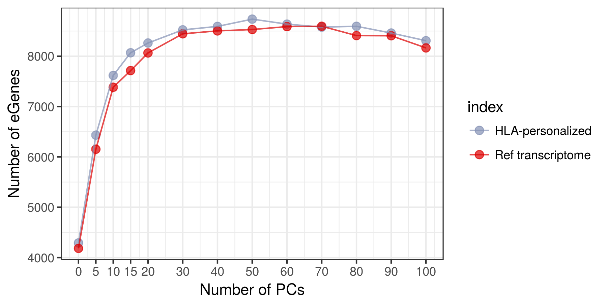
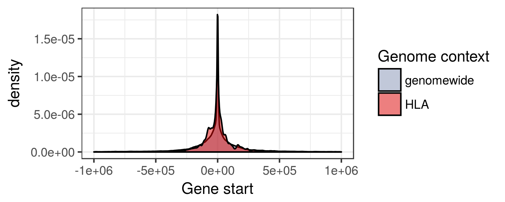

Report
================

**All analyses were carried out using European individuals only (N = 358)**

Typing accuracies
=================

\*Concordance: the proportion of the called alleles that are concordant with the Gourraud et al (2014) typings

| locus |   star|  kallisto|
|:------|------:|---------:|
| A     |  97.71|     97.06|
| B     |  98.20|     97.55|
| C     |  97.06|     95.92|
| DQB1  |  98.37|     98.53|
| DRB1  |  99.51|     99.51|

Expression estimates
====================

kallisto vs STAR-Salmon
-----------------------

HLA diversity vs reference transcriptome
----------------------------------------

### TPM

#### STAR

#### kallisto

### PCA-corrected

#### STAR

#### kallisto

Distribution of TPM values
--------------------------

ASE
---

### ASE by number of genotyping errors

\*Each point represents a heterozygous genotype in the intersect with Gourraud data.

### ASE distribution

Correlation of expression
-------------------------

### Among the HLA genes

### Between Class II genes and CIITA

### Between pairs of HLA genes on the same vs on different haplotypes

eQTLs
=====

PCA of genotypes
----------------

Number of eGenes according to index
-----------------------------------

Distribution of eQTLs around the TSS
------------------------------------

### IMGT index

### Reference transcriptome

### Spread of rank 0 eQTLs around the gene starts

### Location of HLA genes and CRDs

*CRDs are defined in <http://dx.doi.org/10.1101/171694*> *Coordinates are in hg19\*

RTC between IMGT and Ref Transcriptome eQTLs
--------------------------------------------

Variants with RTC &gt; 0.95 likely mark the same biological signal.

| gene\_imgt | variant\_imgt |  rank\_imgt| gene\_pri | variant\_pri |  rank\_pri|  d\_prime|   rtc|
|:-----------|:--------------|-----------:|:----------|:-------------|----------:|---------:|-----:|
| HLA-B      | rs1265094     |           0| HLA-B     | rs3130949    |          0|      0.93|  0.98|
| HLA-B      | rs9264803     |           1| HLA-B     | rs2844623    |          2|      0.95|  0.97|
| HLA-C      | rs146911342   |           0| HLA-C     | rs146911342  |          0|      1.00|  1.00|
| HLA-C      | rs146911342   |           0| HLA-B     | rs67565791   |          4|      0.90|  0.98|
| HLA-C      | rs3134776     |           1| HLA-B     | rs3130949    |          0|      1.00|  0.99|
| HLA-C      | rs3134776     |           1| HLA-C     | rs9264185    |          2|      0.80|  0.99|
| HLA-C      | rs9266301     |           2| HLA-C     | rs1058067    |          1|      0.37|  0.98|
| HLA-DPB1   | rs9277449     |           0| HLA-DPB1  | rs9277449    |          0|      1.00|  1.00|
| HLA-DPB1   | rs9296068     |           1| HLA-DPB1  | rs9296068    |          1|      1.00|  1.00|
| HLA-DPB1   | rs688209      |           2| HLA-DPB1  | rs688209     |          2|      1.00|  1.00|
| HLA-DQA1   | rs75170544    |           0| HLA-DQA1  | rs28724008   |          0|      0.58|  0.97|
| HLA-DQA1   | rs9271375     |           1| HLA-DRB1  | rs9271365    |          1|      0.92|  1.00|
| HLA-DQB1   | rs1770        |           0| HLA-DQB1  | rs3830059    |          0|      0.95|  0.99|
| HLA-DQB1   | rs9272209     |           1| HLA-DQB1  | rs9273595    |          1|      0.92|  0.96|
| HLA-DQB1   | rs9272209     |           1| HLA-DQB1  | rs114969562  |          2|      0.76|  0.98|
| HLA-DRB1   | rs1048372     |           1| HLA-DRB1  | rs9271365    |          1|      0.92|  0.98|

Comparison with previous eQTLs
------------------------------

### eQTLs in regulomeDB

| gene     |  rank| rsid        | score | qtl                       |
|:---------|-----:|:------------|:------|:--------------------------|
| HLA-A    |     0| rs3823342   | 4     | NA                        |
| HLA-A    |     1| rs1655924   | 6     | NA                        |
| HLA-B    |     0| rs1265094   | 4     | NA                        |
| HLA-B    |     1| rs9264803   | 6     | NA                        |
| HLA-B    |     2| rs2308655   | 4     | NA                        |
| HLA-C    |     0| rs146911342 | 3a    | NA                        |
| HLA-C    |     1| rs3134776   | 7     | NA                        |
| HLA-C    |     2| rs9266301   | 7     | NA                        |
| HLA-DPB1 |     0| rs9277449   | 7     | NA                        |
| HLA-DPB1 |     1| rs9296068   | 6     | HLA-DPB1\_eQTL\_Monocytes |
| HLA-DPB1 |     2| rs688209    | 4     | NA                        |
| HLA-DQA1 |     0| rs75170544  | 7     | NA                        |
| HLA-DQA1 |     1| rs9271375   | 7     | NA                        |
| HLA-DQB1 |     0| rs1770      | 1f    | dsQTL\_Lymphoblastoid     |
| HLA-DQB1 |     1| rs9272209   | 3a    | NA                        |
| HLA-DRB1 |     0| rs9270698   | 5     | NA                        |
| HLA-DRB1 |     1| rs1048372   | 3a    | NA                        |
| HLA-DRB1 |     2| rs11752186  | 7     | NA                        |

### eQTLs in HaploReg

| gene     |  rank| rsid        | study           | tissue                                    |      pvalue|
|:---------|-----:|:------------|:----------------|:------------------------------------------|-----------:|
| HLA-A    |     0| rs3823342   | GTEx2015\_v6    | Artery\_Tibial                            |   37.160462|
| HLA-A    |     0| rs3823342   | GTEx2015\_v6    | Esophagus\_Muscularis                     |   31.324834|
| HLA-A    |     0| rs3823342   | GTEx2015\_v6    | Thyroid                                   |   28.071066|
| HLA-A    |     0| rs3823342   | GTEx2015\_v6    | Artery\_Aorta                             |   27.889381|
| HLA-A    |     0| rs3823342   | GTEx2015\_v6    | Heart\_Left\_Ventricle                    |   25.848964|
| HLA-A    |     0| rs3823342   | GTEx2015\_v6    | Muscle\_Skeletal                          |   25.797001|
| HLA-A    |     0| rs3823342   | GTEx2015\_v6    | Cells\_Transformed\_fibroblasts           |   24.165491|
| HLA-A    |     0| rs3823342   | GTEx2015\_v6    | Nerve\_Tibial                             |   21.774090|
| HLA-A    |     0| rs3823342   | GTEx2015\_v6    | Testis                                    |   18.796549|
| HLA-A    |     0| rs3823342   | GTEx2015\_v6    | Heart\_Atrial\_Appendage                  |   18.413261|
| HLA-A    |     0| rs3823342   | GTEx2015\_v6    | Adipose\_Subcutaneous                     |   17.832222|
| HLA-A    |     0| rs3823342   | GTEx2015\_v6    | Lung                                      |   16.289919|
| HLA-A    |     0| rs3823342   | GTEx2015\_v6    | Stomach                                   |   16.081359|
| HLA-A    |     0| rs3823342   | GTEx2015\_v6    | Esophagus\_Gastroesophageal\_Junction     |   14.967574|
| HLA-A    |     0| rs3823342   | GTEx2015\_v6    | Pancreas                                  |   14.897320|
| HLA-A    |     0| rs3823342   | GTEx2015\_v6    | Ovary                                     |   13.302768|
| HLA-A    |     0| rs3823342   | GTEx2015\_v6    | Skin\_Sun\_Exposed\_Lower\_leg            |   11.052995|
| HLA-A    |     0| rs3823342   | GTEx2015\_v6    | Artery\_Coronary                          |   10.838112|
| HLA-A    |     0| rs3823342   | GTEx2015\_v6    | Colon\_Sigmoid                            |   10.021048|
| HLA-A    |     0| rs3823342   | GTEx2015\_v6    | Brain\_Cerebellum                         |    8.983477|
| HLA-A    |     0| rs3823342   | GTEx2015\_v6    | Breast\_Mammary\_Tissue                   |    8.232740|
| HLA-A    |     0| rs3823342   | GTEx2015\_v6    | Brain\_Cortex                             |    8.007748|
| HLA-A    |     0| rs3823342   | GTEx2015\_v6    | Adipose\_Visceral\_Omentum                |    7.982755|
| HLA-A    |     0| rs3823342   | GTEx2015\_v6    | Whole\_Blood                              |    7.237071|
| HLA-A    |     0| rs3823342   | GTEx2015\_v6    | Brain\_Hypothalamus                       |    7.085953|
| HLA-A    |     0| rs3823342   | GTEx2015\_v6    | Brain\_Cerebellar\_Hemisphere             |    6.641821|
| HLA-A    |     0| rs3823342   | GTEx2015\_v6    | Colon\_Transverse                         |    6.576385|
| HLA-A    |     0| rs3823342   | GTEx2015\_v6    | Adrenal\_Gland                            |    5.826259|
| HLA-A    |     0| rs3823342   | GTEx2015\_v6    | Esophagus\_Mucosa                         |    5.816426|
| HLA-A    |     0| rs3823342   | GTEx2015\_v6    | Cells\_EBV-transformed\_lymphocytes       |    5.448074|
| HLA-A    |     0| rs3823342   | GTEx2015\_v6    | Spleen                                    |    5.427713|
| HLA-A    |     0| rs3823342   | GTEx2015\_v6    | Brain\_Nucleus\_accumbens\_basal\_ganglia |    5.426233|
| HLA-A    |     1| rs1655924   | GTEx2015\_v6    | Skin\_Sun\_Exposed\_Lower\_leg            |   14.970513|
| HLA-A    |     1| rs1655924   | GTEx2015\_v6    | Muscle\_Skeletal                          |   11.496183|
| HLA-A    |     1| rs1655924   | GTEx2015\_v6    | Adipose\_Subcutaneous                     |   10.764696|
| HLA-A    |     1| rs1655924   | GTEx2015\_v6    | Whole\_Blood                              |   10.465773|
| HLA-A    |     1| rs1655924   | GTEx2015\_v6    | Skin\_Not\_Sun\_Exposed\_Suprapubic       |   10.088175|
| HLA-A    |     1| rs1655924   | GTEx2015\_v6    | Esophagus\_Mucosa                         |    9.781676|
| HLA-A    |     1| rs1655924   | GTEx2015\_v6    | Lung                                      |    6.734666|
| HLA-A    |     1| rs1655924   | GTEx2015\_v6    | Breast\_Mammary\_Tissue                   |    5.882214|
| HLA-A    |     1| rs1655924   | GTEx2015\_v6    | Colon\_Transverse                         |    5.809962|
| HLA-A    |     1| rs1655924   | GTEx2015\_v6    | Adipose\_Visceral\_Omentum                |    5.202065|
| HLA-B    |     0| rs1265094   | Lappalainen2013 | Lymphoblastoid\_EUR\_exonlevel            |   15.356583|
| HLA-B    |     1| rs9264803   | NA              | NA                                        |          NA|
| HLA-B    |     2| rs2308655   | Lappalainen2013 | Lymphoblastoid\_EUR\_exonlevel            |   34.554269|
| HLA-B    |     2| rs2308655   | GTEx2015\_v6    | Thyroid                                   |   13.539009|
| HLA-B    |     2| rs2308655   | GTEx2015\_v6    | Artery\_Aorta                             |   12.263747|
| HLA-B    |     2| rs2308655   | GTEx2015\_v6    | Artery\_Tibial                            |   11.289337|
| HLA-B    |     2| rs2308655   | GTEx2015\_v6    | Adipose\_Subcutaneous                     |   10.267092|
| HLA-B    |     2| rs2308655   | GTEx2015\_v6    | Nerve\_Tibial                             |   10.261690|
| HLA-B    |     2| rs2308655   | Lappalainen2013 | Lymphoblastoid\_YRI\_exonlevel            |    9.911208|
| HLA-B    |     2| rs2308655   | GTEx2015\_v6    | Heart\_Atrial\_Appendage                  |    9.737958|
| HLA-B    |     2| rs2308655   | GTEx2015\_v6    | Cells\_EBV-transformed\_lymphocytes       |    9.609978|
| HLA-B    |     2| rs2308655   | GTEx2015\_v6    | Lung                                      |    9.345788|
| HLA-B    |     2| rs2308655   | GTEx2015\_v6    | Adipose\_Visceral\_Omentum                |    8.824837|
| HLA-B    |     2| rs2308655   | GTEx2015\_v6    | Esophagus\_Muscularis                     |    8.713438|
| HLA-B    |     2| rs2308655   | GTEx2015\_v6    | Stomach                                   |    8.676353|
| HLA-B    |     2| rs2308655   | GTEx2015\_v6    | Muscle\_Skeletal                          |    8.127106|
| HLA-B    |     2| rs2308655   | GTEx2015\_v6    | Skin\_Sun\_Exposed\_Lower\_leg            |    8.100612|
| HLA-B    |     2| rs2308655   | GTEx2015\_v6    | Breast\_Mammary\_Tissue                   |    7.582386|
| HLA-B    |     2| rs2308655   | GTEx2015\_v6    | Spleen                                    |    7.572468|
| HLA-B    |     2| rs2308655   | GTEx2015\_v6    | Esophagus\_Mucosa                         |    7.284404|
| HLA-B    |     2| rs2308655   | GTEx2015\_v6    | Esophagus\_Gastroesophageal\_Junction     |    7.035226|
| HLA-B    |     2| rs2308655   | GTEx2015\_v6    | Pancreas                                  |    6.987691|
| HLA-B    |     2| rs2308655   | GTEx2015\_v6    | Cells\_Transformed\_fibroblasts           |    6.639965|
| HLA-B    |     2| rs2308655   | GTEx2015\_v6    | Skin\_Not\_Sun\_Exposed\_Suprapubic       |    6.427284|
| HLA-B    |     2| rs2308655   | GTEx2015\_v6    | Heart\_Left\_Ventricle                    |    6.070171|
| HLA-B    |     2| rs2308655   | GTEx2015\_v6    | Brain\_Cerebellum                         |    5.292821|
| HLA-C    |     0| rs146911342 | Lappalainen2013 | Lymphoblastoid\_EUR\_exonlevel            |   26.172432|
| HLA-C    |     0| rs146911342 | Lappalainen2013 | Lymphoblastoid\_EUR\_genelevel            |   24.114388|
| HLA-C    |     0| rs146911342 | Lappalainen2013 | Lymphoblastoid\_YRI\_exonlevel            |   13.646580|
| HLA-C    |     0| rs146911342 | Lappalainen2013 | Lymphoblastoid\_YRI\_genelevel            |   13.500277|
| HLA-C    |     1| rs3134776   | NA              | NA                                        |          NA|
| HLA-C    |     2| rs9266301   | Lappalainen2013 | Lymphoblastoid\_EUR\_exonlevel            |    7.057405|
| HLA-C    |     2| rs9266301   | GTEx2015\_v6    | Whole\_Blood                              |    5.478280|
| HLA-C    |     2| rs9266301   | GTEx2015\_v6    | Thyroid                                   |    5.443079|
| HLA-DPB1 |     0| rs9277449   | NA              | NA                                        |          NA|
| HLA-DPB1 |     1| rs9296068   | Westra2013      | Whole\_Blood                              |  105.585393|
| HLA-DPB1 |     2| rs688209    | NA              | NA                                        |          NA|
| HLA-DQA1 |     0| rs75170544  | GTEx2015\_v6    | Artery\_Tibial                            |   12.616043|
| HLA-DQA1 |     0| rs75170544  | GTEx2015\_v6    | Skin\_Sun\_Exposed\_Lower\_leg            |   12.380524|
| HLA-DQA1 |     0| rs75170544  | GTEx2015\_v6    | Lung                                      |   10.330563|
| HLA-DQA1 |     0| rs75170544  | GTEx2015\_v6    | Nerve\_Tibial                             |   10.279550|
| HLA-DQA1 |     0| rs75170544  | GTEx2015\_v6    | Esophagus\_Mucosa                         |    9.313875|
| HLA-DQA1 |     0| rs75170544  | GTEx2015\_v6    | Muscle\_Skeletal                          |    9.096291|
| HLA-DQA1 |     0| rs75170544  | GTEx2015\_v6    | Skin\_Not\_Sun\_Exposed\_Suprapubic       |    8.475181|
| HLA-DQA1 |     0| rs75170544  | GTEx2015\_v6    | Whole\_Blood                              |    8.289689|
| HLA-DQA1 |     0| rs75170544  | GTEx2015\_v6    | Thyroid                                   |    7.903424|
| HLA-DQA1 |     0| rs75170544  | GTEx2015\_v6    | Adipose\_Subcutaneous                     |    7.481591|
| HLA-DQA1 |     0| rs75170544  | GTEx2015\_v6    | Artery\_Aorta                             |    7.033566|
| HLA-DQA1 |     0| rs75170544  | GTEx2015\_v6    | Esophagus\_Muscularis                     |    6.562930|
| HLA-DQA1 |     0| rs75170544  | GTEx2015\_v6    | Cells\_EBV-transformed\_lymphocytes       |    6.152849|
| HLA-DQA1 |     0| rs75170544  | GTEx2015\_v6    | Brain\_Caudate\_basal\_ganglia            |    6.059230|
| HLA-DQA1 |     0| rs75170544  | GTEx2015\_v6    | Brain\_Cortex                             |    6.053462|
| HLA-DQA1 |     0| rs75170544  | GTEx2015\_v6    | Colon\_Transverse                         |    5.832055|
| HLA-DQA1 |     1| rs9271375   | GTEx2015\_v6    | Muscle\_Skeletal                          |   22.685239|
| HLA-DQA1 |     1| rs9271375   | GTEx2015\_v6    | Skin\_Sun\_Exposed\_Lower\_leg            |   21.250407|
| HLA-DQA1 |     1| rs9271375   | GTEx2015\_v6    | Whole\_Blood                              |   19.123646|
| HLA-DQA1 |     1| rs9271375   | GTEx2015\_v6    | Adipose\_Subcutaneous                     |   16.239829|
| HLA-DQA1 |     1| rs9271375   | GTEx2015\_v6    | Thyroid                                   |   13.239817|
| HLA-DQA1 |     1| rs9271375   | GTEx2015\_v6    | Artery\_Tibial                            |   12.612294|
| HLA-DQA1 |     1| rs9271375   | GTEx2015\_v6    | Adipose\_Visceral\_Omentum                |   11.676662|
| HLA-DQA1 |     1| rs9271375   | GTEx2015\_v6    | Esophagus\_Mucosa                         |   11.184226|
| HLA-DQA1 |     1| rs9271375   | GTEx2015\_v6    | Skin\_Not\_Sun\_Exposed\_Suprapubic       |   11.056696|
| HLA-DQA1 |     1| rs9271375   | GTEx2015\_v6    | Breast\_Mammary\_Tissue                   |   10.589586|
| HLA-DQA1 |     1| rs9271375   | GTEx2015\_v6    | Lung                                      |    9.999028|
| HLA-DQA1 |     1| rs9271375   | GTEx2015\_v6    | Testis                                    |    9.669677|
| HLA-DQA1 |     1| rs9271375   | GTEx2015\_v6    | Esophagus\_Muscularis                     |    9.531619|
| HLA-DQA1 |     1| rs9271375   | GTEx2015\_v6    | Stomach                                   |    9.509276|
| HLA-DQA1 |     1| rs9271375   | GTEx2015\_v6    | Nerve\_Tibial                             |    9.084250|
| HLA-DQA1 |     1| rs9271375   | GTEx2015\_v6    | Esophagus\_Gastroesophageal\_Junction     |    8.904301|
| HLA-DQA1 |     1| rs9271375   | GTEx2015\_v6    | Heart\_Atrial\_Appendage                  |    8.895583|
| HLA-DQA1 |     1| rs9271375   | GTEx2015\_v6    | Artery\_Aorta                             |    8.814401|
| HLA-DQA1 |     1| rs9271375   | GTEx2015\_v6    | Colon\_Transverse                         |    8.038032|
| HLA-DQA1 |     1| rs9271375   | GTEx2015\_v6    | Pituitary                                 |    7.233891|
| HLA-DQA1 |     1| rs9271375   | GTEx2015\_v6    | Colon\_Sigmoid                            |    6.512684|
| HLA-DQA1 |     1| rs9271375   | GTEx2015\_v6    | Heart\_Left\_Ventricle                    |    6.444339|
| HLA-DQA1 |     1| rs9271375   | GTEx2015\_v6    | Adrenal\_Gland                            |    5.820496|
| HLA-DQB1 |     0| rs1770      | Lappalainen2013 | Lymphoblastoid\_EUR\_exonlevel            |   68.288868|
| HLA-DQB1 |     0| rs1770      | Lappalainen2013 | Lymphoblastoid\_EUR\_genelevel            |   43.432284|
| HLA-DQB1 |     0| rs1770      | GTEx2015\_v6    | Skin\_Sun\_Exposed\_Lower\_leg            |   34.498779|
| HLA-DQB1 |     0| rs1770      | GTEx2015\_v6    | Whole\_Blood                              |   31.304094|
| HLA-DQB1 |     0| rs1770      | GTEx2015\_v6    | Muscle\_Skeletal                          |   28.954606|
| HLA-DQB1 |     0| rs1770      | GTEx2015\_v6    | Nerve\_Tibial                             |   28.028577|
| HLA-DQB1 |     0| rs1770      | GTEx2015\_v6    | Adipose\_Subcutaneous                     |   25.596807|
| HLA-DQB1 |     0| rs1770      | GTEx2015\_v6    | Lung                                      |   25.364010|
| HLA-DQB1 |     0| rs1770      | GTEx2015\_v6    | Thyroid                                   |   25.003063|
| HLA-DQB1 |     0| rs1770      | GTEx2015\_v6    | Esophagus\_Mucosa                         |   24.650149|
| HLA-DQB1 |     0| rs1770      | GTEx2015\_v6    | Skin\_Not\_Sun\_Exposed\_Suprapubic       |   22.520603|
| HLA-DQB1 |     0| rs1770      | GTEx2015\_v6    | Artery\_Tibial                            |   22.468819|
| HLA-DQB1 |     0| rs1770      | GTEx2015\_v6    | Heart\_Left\_Ventricle                    |   19.023305|
| HLA-DQB1 |     0| rs1770      | GTEx2015\_v6    | Stomach                                   |   18.008471|
| HLA-DQB1 |     0| rs1770      | Lappalainen2013 | Lymphoblastoid\_YRI\_exonlevel            |   16.284500|
| HLA-DQB1 |     0| rs1770      | GTEx2015\_v6    | Breast\_Mammary\_Tissue                   |   16.187618|
| HLA-DQB1 |     0| rs1770      | GTEx2015\_v6    | Esophagus\_Muscularis                     |   15.281161|
| HLA-DQB1 |     0| rs1770      | Lappalainen2013 | Lymphoblastoid\_YRI\_genelevel            |   15.001735|
| HLA-DQB1 |     0| rs1770      | GTEx2015\_v6    | Adipose\_Visceral\_Omentum                |   14.436470|
| HLA-DQB1 |     0| rs1770      | GTEx2015\_v6    | Colon\_Transverse                         |   13.656355|
| HLA-DQB1 |     0| rs1770      | GTEx2015\_v6    | Artery\_Aorta                             |   13.526991|
| HLA-DQB1 |     0| rs1770      | GTEx2015\_v6    | Heart\_Atrial\_Appendage                  |   12.665867|
| HLA-DQB1 |     0| rs1770      | GTEx2015\_v6    | Cells\_EBV-transformed\_lymphocytes       |   12.537449|
| HLA-DQB1 |     0| rs1770      | GTEx2015\_v6    | Pancreas                                  |   11.924593|
| HLA-DQB1 |     0| rs1770      | GTEx2015\_v6    | Esophagus\_Gastroesophageal\_Junction     |   11.575731|
| HLA-DQB1 |     0| rs1770      | GTEx2015\_v6    | Liver                                     |   10.861057|
| HLA-DQB1 |     0| rs1770      | GTEx2015\_v6    | Brain\_Frontal\_Cortex\_BA9               |   10.810076|
| HLA-DQB1 |     0| rs1770      | GTEx2015\_v6    | Artery\_Coronary                          |   10.801265|
| HLA-DQB1 |     0| rs1770      | GTEx2015\_v6    | Spleen                                    |    9.632579|
| HLA-DQB1 |     0| rs1770      | GTEx2015\_v6    | Brain\_Caudate\_basal\_ganglia            |    9.274431|
| HLA-DQB1 |     0| rs1770      | GTEx2015\_v6    | Colon\_Sigmoid                            |    9.260475|
| HLA-DQB1 |     0| rs1770      | GTEx2015\_v6    | Brain\_Anterior\_cingulate\_cortex\_BA24  |    9.235356|
| HLA-DQB1 |     0| rs1770      | GTEx2015\_v6    | Vagina                                    |    9.228642|
| HLA-DQB1 |     0| rs1770      | GTEx2015\_v6    | Testis                                    |    9.157207|
| HLA-DQB1 |     0| rs1770      | GTEx2015\_v6    | Small\_Intestine\_Terminal\_Ileum         |    8.479718|
| HLA-DQB1 |     0| rs1770      | GTEx2015\_v6    | Brain\_Hypothalamus                       |    7.969335|
| HLA-DQB1 |     0| rs1770      | GTEx2015\_v6    | Brain\_Cerebellar\_Hemisphere             |    7.931159|
| HLA-DQB1 |     0| rs1770      | GTEx2015\_v6    | Adrenal\_Gland                            |    7.767512|
| HLA-DQB1 |     0| rs1770      | GTEx2015\_v6    | Uterus                                    |    7.651149|
| HLA-DQB1 |     0| rs1770      | GTEx2015\_v6    | Pituitary                                 |    7.455304|
| HLA-DQB1 |     0| rs1770      | GTEx2015\_v6    | Ovary                                     |    7.169072|
| HLA-DQB1 |     0| rs1770      | GTEx2015\_v6    | Brain\_Putamen\_basal\_ganglia            |    6.676998|
| HLA-DQB1 |     0| rs1770      | GTEx2015\_v6    | Brain\_Cortex                             |    6.582086|
| HLA-DQB1 |     0| rs1770      | GTEx2015\_v6    | Brain\_Nucleus\_accumbens\_basal\_ganglia |    6.021652|
| HLA-DQB1 |     1| rs9272209   | GTEx2015\_v6    | Esophagus\_Mucosa                         |    5.467033|
| HLA-DQB1 |     1| rs9272209   | GTEx2015\_v6    | Muscle\_Skeletal                          |    5.375633|
| HLA-DRB1 |     0| rs9270698   | NA              | NA                                        |          NA|
| HLA-DRB1 |     1| rs1048372   | GTEx2015\_v6    | Whole\_Blood                              |   18.139176|
| HLA-DRB1 |     1| rs1048372   | GTEx2015\_v6    | Muscle\_Skeletal                          |   13.517041|
| HLA-DRB1 |     1| rs1048372   | Lappalainen2013 | Lymphoblastoid\_EUR\_exonlevel            |   13.447426|
| HLA-DRB1 |     1| rs1048372   | GTEx2015\_v6    | Thyroid                                   |   11.553994|
| HLA-DRB1 |     1| rs1048372   | GTEx2015\_v6    | Skin\_Sun\_Exposed\_Lower\_leg            |   11.012948|
| HLA-DRB1 |     1| rs1048372   | GTEx2015\_v6    | Adipose\_Subcutaneous                     |   10.036969|
| HLA-DRB1 |     1| rs1048372   | GTEx2015\_v6    | Nerve\_Tibial                             |    9.670598|
| HLA-DRB1 |     1| rs1048372   | GTEx2015\_v6    | Esophagus\_Mucosa                         |    9.657580|
| HLA-DRB1 |     1| rs1048372   | GTEx2015\_v6    | Artery\_Tibial                            |    9.167171|
| HLA-DRB1 |     1| rs1048372   | GTEx2015\_v6    | Adipose\_Visceral\_Omentum                |    7.992163|
| HLA-DRB1 |     1| rs1048372   | GTEx2015\_v6    | Testis                                    |    7.739939|
| HLA-DRB1 |     1| rs1048372   | GTEx2015\_v6    | Artery\_Aorta                             |    7.649790|
| HLA-DRB1 |     1| rs1048372   | GTEx2015\_v6    | Colon\_Transverse                         |    7.627585|
| HLA-DRB1 |     1| rs1048372   | GTEx2015\_v6    | Skin\_Not\_Sun\_Exposed\_Suprapubic       |    7.148335|
| HLA-DRB1 |     1| rs1048372   | GTEx2015\_v6    | Brain\_Caudate\_basal\_ganglia            |    7.100001|
| HLA-DRB1 |     1| rs1048372   | GTEx2015\_v6    | Lung                                      |    6.904489|
| HLA-DRB1 |     1| rs1048372   | GTEx2015\_v6    | Brain\_Anterior\_cingulate\_cortex\_BA24  |    6.688939|
| HLA-DRB1 |     1| rs1048372   | GTEx2015\_v6    | Esophagus\_Muscularis                     |    5.640169|
| HLA-DRB1 |     2| rs11752186  | GTEx2015\_v6    | Adipose\_Subcutaneous                     |    5.305351|

### eQTLs in GRASP (via HaploReg)

| gene     |  rank| rsid      | phenotype                                                                                       |     pvalue| study                                |
|:---------|-----:|:----------|:------------------------------------------------------------------------------------------------|----------:|:-------------------------------------|
| HLA-A    |     0| rs3823342 | Methylation levels at chr6:30051380-30051430 \[hg18 coord probe cg23244913\] in Caudal pons     |  13.427128| www.ncbi.nlm.nih.gov/pubmed/20485568 |
| HLA-A    |     0| rs3823342 | Methylation levels at chr6:30051393-30051443 \[hg18 coord probe cg04623837\] in Frontal cortex  |  11.525784| www.ncbi.nlm.nih.gov/pubmed/20485568 |
| HLA-A    |     0| rs3823342 | Methylation levels at chr6:30051380-30051430 \[hg18 coord probe cg23244913\] in Temporal cortex |  11.425969| www.ncbi.nlm.nih.gov/pubmed/20485568 |
| HLA-A    |     0| rs3823342 | Methylation levels at chr6:30051380-30051430 \[hg18 coord probe cg23244913\] in Frontal cortex  |  11.164309| www.ncbi.nlm.nih.gov/pubmed/20485568 |
| HLA-A    |     0| rs3823342 | Methylation levels at chr6:30051393-30051443 \[hg18 coord probe cg04623837\] in Caudal pons     |  10.627088| www.ncbi.nlm.nih.gov/pubmed/20485568 |
| HLA-A    |     0| rs3823342 | Methylation levels at chr6:30051393-30051443 \[hg18 coord probe cg04623837\] in Temporal cortex |   9.617983| www.ncbi.nlm.nih.gov/pubmed/20485568 |
| HLA-B    |     0| rs1265094 | Gene expression of HCG22 \[probe 1560767\_at\] in lymphoblastoid cell lines                     |  16.823909| www.ncbi.nlm.nih.gov/pubmed/17873877 |
| HLA-B    |     0| rs1265094 | Gene expression of HCG22 in lymphoblastoid cell lines                                           |  15.792999| www.ncbi.nlm.nih.gov/pubmed/17873877 |
| HLA-B    |     0| rs1265094 | Gene expression of TCF19 \[probe 223274\_at\] in lymphoblastoid cell lines                      |  10.522879| www.ncbi.nlm.nih.gov/pubmed/17873877 |
| HLA-B    |     0| rs1265094 | Gene expression of HCG27 \[probe 1559050\_at\] in lymphoblastoid cell lines                     |  10.161151| www.ncbi.nlm.nih.gov/pubmed/17873877 |
| HLA-B    |     0| rs1265094 | Gene expression of TCF19 in lymphoblastoid cell lines                                           |   9.591999| www.ncbi.nlm.nih.gov/pubmed/17873877 |
| HLA-B    |     0| rs1265094 | Gene expression of HCG27 in lymphoblastoid cell lines                                           |   9.241000| www.ncbi.nlm.nih.gov/pubmed/17873877 |
| HLA-B    |     0| rs1265094 | Gene expression of HLA-C \[probe 216526\_x\_at\] in lymphoblastoid cell lines                   |   9.086186| www.ncbi.nlm.nih.gov/pubmed/17873877 |
| HLA-B    |     0| rs1265094 | Gene expression of CCHCR1 in normal prepouch ileum                                              |   4.823275| www.ncbi.nlm.nih.gov/pubmed/23474282 |
| HLA-DPB1 |     1| rs9296068 | Gene expression of HLA-DPB1 in blood                                                            |  39.207608| www.ncbi.nlm.nih.gov/pubmed/21829388 |
| HLA-DPB1 |     1| rs9296068 | Gene expression of HLA-DPB1 in peripheral blood monocytes                                       |  14.341989| www.ncbi.nlm.nih.gov/pubmed/20502693 |
| HLA-DPB1 |     1| rs9296068 | Gene expression of HLA-DOA in blood                                                             |   6.619789| www.ncbi.nlm.nih.gov/pubmed/21829388 |
| HLA-DPB1 |     1| rs9296068 | Gene expression of HLA-DPA1 in blood                                                            |   6.214670| www.ncbi.nlm.nih.gov/pubmed/21829388 |
| HLA-DPB1 |     1| rs9296068 | Gene expression of PSMB9 in blood                                                               |   3.585027| www.ncbi.nlm.nih.gov/pubmed/21829388 |
| HLA-DPB1 |     1| rs9296068 | Gene expression of HLA-DOB in blood                                                             |   3.000000| www.ncbi.nlm.nih.gov/pubmed/21829388 |
| HLA-DPB1 |     2| rs688209  | Gene expression of ITPR3 in peripheral blood monocytes                                          |   8.454693| www.ncbi.nlm.nih.gov/pubmed/20502693 |
| HLA-DPB1 |     2| rs688209  | Gene expression of DEFB125 in peripheral blood monocytes                                        |   5.892790| www.ncbi.nlm.nih.gov/pubmed/20502693 |
| HLA-DPB1 |     2| rs688209  | Gene expression of TAC3 in peripheral blood monocytes                                           |   5.754487| www.ncbi.nlm.nih.gov/pubmed/20502693 |
| HLA-DPB1 |     2| rs688209  | Gene expression of OR3A4 in peripheral blood monocytes                                          |   5.669586| www.ncbi.nlm.nih.gov/pubmed/20502693 |

### RTC

Here we can see that, when our eQTLs were not previously described in the databases, they tag some eQTL in the database.

Most of them are tagging an eQTL from regulomeDB. I believe that's because, for all sources not regulomeDB, I selected only the top variant for each tissue and gene. For regulomeDB that's no possible beucase the p-value is not directly available, so there are more variants per gene, which increases the chance that some of these variants will have high RTC with one of our eQTLs.

Association with GWAS traits
----------------------------

| gene     |  rank| variant     | gwas\_var  |   rtc| trait                                                                                                                                                  | studies                                                                                                                                                                                                                                                                                                                                                                                                                                                                                                                                                                                                                                                                                                                                                                                                                                                                                                                                                                                                                                                                                                                                                                                                                                                                                                                                                                                                                                                                                                                                                                                                                                                                                                                                                                                                                                                                                                                                                                                                                                                                       |
|:---------|-----:|:------------|:-----------|-----:|:-------------------------------------------------------------------------------------------------------------------------------------------------------|:------------------------------------------------------------------------------------------------------------------------------------------------------------------------------------------------------------------------------------------------------------------------------------------------------------------------------------------------------------------------------------------------------------------------------------------------------------------------------------------------------------------------------------------------------------------------------------------------------------------------------------------------------------------------------------------------------------------------------------------------------------------------------------------------------------------------------------------------------------------------------------------------------------------------------------------------------------------------------------------------------------------------------------------------------------------------------------------------------------------------------------------------------------------------------------------------------------------------------------------------------------------------------------------------------------------------------------------------------------------------------------------------------------------------------------------------------------------------------------------------------------------------------------------------------------------------------------------------------------------------------------------------------------------------------------------------------------------------------------------------------------------------------------------------------------------------------------------------------------------------------------------------------------------------------------------------------------------------------------------------------------------------------------------------------------------------------|
| HLA-A    |     0| rs3823342   | rs16896742 |  0.97| age at menarche                                                                                                                                        | www.ncbi.nlm.nih.gov/pubmed/25231870                                                                                                                                                                                                                                                                                                                                                                                                                                                                                                                                                                                                                                                                                                                                                                                                                                                                                                                                                                                                                                                                                                                                                                                                                                                                                                                                                                                                                                                                                                                                                                                                                                                                                                                                                                                                                                                                                                                                                                                                                                          |
| HLA-A    |     0| rs3823342   | rs2517713  |  0.98| nasopharyngeal neoplasm                                                                                                                                | www.ncbi.nlm.nih.gov/pubmed/19664746                                                                                                                                                                                                                                                                                                                                                                                                                                                                                                                                                                                                                                                                                                                                                                                                                                                                                                                                                                                                                                                                                                                                                                                                                                                                                                                                                                                                                                                                                                                                                                                                                                                                                                                                                                                                                                                                                                                                                                                                                                          |
| HLA-A    |     0| rs3823342   | rs2523393  |  0.98| multiple sclerosis                                                                                                                                     | www.ncbi.nlm.nih.gov/pubmed/19525953                                                                                                                                                                                                                                                                                                                                                                                                                                                                                                                                                                                                                                                                                                                                                                                                                                                                                                                                                                                                                                                                                                                                                                                                                                                                                                                                                                                                                                                                                                                                                                                                                                                                                                                                                                                                                                                                                                                                                                                                                                          |
| HLA-A    |     0| rs3823342   | rs2523946  |  0.99| IGA glomerulonephritis                                                                                                                                 | www.ncbi.nlm.nih.gov/pubmed/22197929 www.ncbi.nlm.nih.gov/pubmed/26028593                                                                                                                                                                                                                                                                                                                                                                                                                                                                                                                                                                                                                                                                                                                                                                                                                                                                                                                                                                                                                                                                                                                                                                                                                                                                                                                                                                                                                                                                                                                                                                                                                                                                                                                                                                                                                                                                                                                                                                                                     |
| HLA-A    |     0| rs3823342   | rs9260489  |  0.98| beta-2 microglobulin measurement/multiple sclerosis                                                                                                    | www.ncbi.nlm.nih.gov/pubmed/22190364 www.ncbi.nlm.nih.gov/pubmed/23417110 www.ncbi.nlm.nih.gov/pubmed/22190364 www.ncbi.nlm.nih.gov/pubmed/23417110                                                                                                                                                                                                                                                                                                                                                                                                                                                                                                                                                                                                                                                                                                                                                                                                                                                                                                                                                                                                                                                                                                                                                                                                                                                                                                                                                                                                                                                                                                                                                                                                                                                                                                                                                                                                                                                                                                                           |
| HLA-A    |     1| rs1655924   | NA         |    NA| NA                                                                                                                                                     | NA                                                                                                                                                                                                                                                                                                                                                                                                                                                                                                                                                                                                                                                                                                                                                                                                                                                                                                                                                                                                                                                                                                                                                                                                                                                                                                                                                                                                                                                                                                                                                                                                                                                                                                                                                                                                                                                                                                                                                                                                                                                                            |
| HLA-B    |     0| rs1265094   | rs1265112  |  1.00| response to reverse transcriptase inhibitor                                                                                                            | www.ncbi.nlm.nih.gov/pubmed/21810746                                                                                                                                                                                                                                                                                                                                                                                                                                                                                                                                                                                                                                                                                                                                                                                                                                                                                                                                                                                                                                                                                                                                                                                                                                                                                                                                                                                                                                                                                                                                                                                                                                                                                                                                                                                                                                                                                                                                                                                                                                          |
| HLA-B    |     0| rs1265094   | rs1265159  |  0.98| membranous glomerulonephritis                                                                                                                          | www.ncbi.nlm.nih.gov/pubmed/21323541                                                                                                                                                                                                                                                                                                                                                                                                                                                                                                                                                                                                                                                                                                                                                                                                                                                                                                                                                                                                                                                                                                                                                                                                                                                                                                                                                                                                                                                                                                                                                                                                                                                                                                                                                                                                                                                                                                                                                                                                                                          |
| HLA-B    |     0| rs1265094   | rs1265181  |  0.98| psoriasis                                                                                                                                              | www.ncbi.nlm.nih.gov/pubmed/19169255                                                                                                                                                                                                                                                                                                                                                                                                                                                                                                                                                                                                                                                                                                                                                                                                                                                                                                                                                                                                                                                                                                                                                                                                                                                                                                                                                                                                                                                                                                                                                                                                                                                                                                                                                                                                                                                                                                                                                                                                                                          |
| HLA-B    |     0| rs1265094   | rs3096697  |  0.96| membranous glomerulonephritis                                                                                                                          | www.ncbi.nlm.nih.gov/pubmed/21323541                                                                                                                                                                                                                                                                                                                                                                                                                                                                                                                                                                                                                                                                                                                                                                                                                                                                                                                                                                                                                                                                                                                                                                                                                                                                                                                                                                                                                                                                                                                                                                                                                                                                                                                                                                                                                                                                                                                                                                                                                                          |
| HLA-B    |     0| rs1265094   | rs3134945  |  0.96| membranous glomerulonephritis                                                                                                                          | www.ncbi.nlm.nih.gov/pubmed/21323541                                                                                                                                                                                                                                                                                                                                                                                                                                                                                                                                                                                                                                                                                                                                                                                                                                                                                                                                                                                                                                                                                                                                                                                                                                                                                                                                                                                                                                                                                                                                                                                                                                                                                                                                                                                                                                                                                                                                                                                                                                          |
| HLA-B    |     0| rs1265094   | rs6457327  |  0.99| neoplasm of mature B-cells                                                                                                                             | www.ncbi.nlm.nih.gov/pubmed/19620980 www.ncbi.nlm.nih.gov/pubmed/20639881                                                                                                                                                                                                                                                                                                                                                                                                                                                                                                                                                                                                                                                                                                                                                                                                                                                                                                                                                                                                                                                                                                                                                                                                                                                                                                                                                                                                                                                                                                                                                                                                                                                                                                                                                                                                                                                                                                                                                                                                     |
| HLA-B    |     1| rs9264803   | rs10484554 |  0.98| cutaneous psoriasis measurement, psoriasis/psoriasis                                                                                                   | www.ncbi.nlm.nih.gov/pubmed/18369459 www.ncbi.nlm.nih.gov/pubmed/19115949 www.ncbi.nlm.nih.gov/pubmed/20953190 www.ncbi.nlm.nih.gov/pubmed/26626624 www.ncbi.nlm.nih.gov/pubmed/18369459 www.ncbi.nlm.nih.gov/pubmed/19115949 www.ncbi.nlm.nih.gov/pubmed/20953190 www.ncbi.nlm.nih.gov/pubmed/26626624                                                                                                                                                                                                                                                                                                                                                                                                                                                                                                                                                                                                                                                                                                                                                                                                                                                                                                                                                                                                                                                                                                                                                                                                                                                                                                                                                                                                                                                                                                                                                                                                                                                                                                                                                                       |
| HLA-B    |     1| rs9264803   | rs12191877 |  0.98| psoriasis/psoriatic arthritis                                                                                                                          | www.ncbi.nlm.nih.gov/pubmed/19169254 www.ncbi.nlm.nih.gov/pubmed/20953188 www.ncbi.nlm.nih.gov/pubmed/26626624 www.ncbi.nlm.nih.gov/pubmed/19169254 www.ncbi.nlm.nih.gov/pubmed/20953188 www.ncbi.nlm.nih.gov/pubmed/26626624                                                                                                                                                                                                                                                                                                                                                                                                                                                                                                                                                                                                                                                                                                                                                                                                                                                                                                                                                                                                                                                                                                                                                                                                                                                                                                                                                                                                                                                                                                                                                                                                                                                                                                                                                                                                                                                 |
| HLA-B    |     1| rs9264803   | rs13191343 |  0.98| psoriatic arthritis                                                                                                                                    | www.ncbi.nlm.nih.gov/pubmed/20953186                                                                                                                                                                                                                                                                                                                                                                                                                                                                                                                                                                                                                                                                                                                                                                                                                                                                                                                                                                                                                                                                                                                                                                                                                                                                                                                                                                                                                                                                                                                                                                                                                                                                                                                                                                                                                                                                                                                                                                                                                                          |
| HLA-B    |     1| rs9264803   | rs2524079  |  0.99| lymphocyte count                                                                                                                                       | www.ncbi.nlm.nih.gov/pubmed/21738480                                                                                                                                                                                                                                                                                                                                                                                                                                                                                                                                                                                                                                                                                                                                                                                                                                                                                                                                                                                                                                                                                                                                                                                                                                                                                                                                                                                                                                                                                                                                                                                                                                                                                                                                                                                                                                                                                                                                                                                                                                          |
| HLA-B    |     1| rs9264803   | rs4406273  |  0.96| psoriasis vulgaris                                                                                                                                     | www.ncbi.nlm.nih.gov/pubmed/26626624                                                                                                                                                                                                                                                                                                                                                                                                                                                                                                                                                                                                                                                                                                                                                                                                                                                                                                                                                                                                                                                                                                                                                                                                                                                                                                                                                                                                                                                                                                                                                                                                                                                                                                                                                                                                                                                                                                                                                                                                                                          |
| HLA-B    |     1| rs9264803   | rs4418214  |  0.96| HIV-1 infection                                                                                                                                        | www.ncbi.nlm.nih.gov/pubmed/21051598 www.ncbi.nlm.nih.gov/pubmed/23935489                                                                                                                                                                                                                                                                                                                                                                                                                                                                                                                                                                                                                                                                                                                                                                                                                                                                                                                                                                                                                                                                                                                                                                                                                                                                                                                                                                                                                                                                                                                                                                                                                                                                                                                                                                                                                                                                                                                                                                                                     |
| HLA-B    |     1| rs9264803   | rs9264942  |  1.00| Crohn's disease/HIV-1 infection/inflammatory bowel disease                                                                                             | www.ncbi.nlm.nih.gov/pubmed/21051598 www.ncbi.nlm.nih.gov/pubmed/20041166 www.ncbi.nlm.nih.gov/pubmed/23128233 www.ncbi.nlm.nih.gov/pubmed/26192919 www.ncbi.nlm.nih.gov/pubmed/21051598 www.ncbi.nlm.nih.gov/pubmed/20041166 www.ncbi.nlm.nih.gov/pubmed/23128233 www.ncbi.nlm.nih.gov/pubmed/26192919 www.ncbi.nlm.nih.gov/pubmed/21051598 www.ncbi.nlm.nih.gov/pubmed/20041166 www.ncbi.nlm.nih.gov/pubmed/23128233 www.ncbi.nlm.nih.gov/pubmed/26192919                                                                                                                                                                                                                                                                                                                                                                                                                                                                                                                                                                                                                                                                                                                                                                                                                                                                                                                                                                                                                                                                                                                                                                                                                                                                                                                                                                                                                                                                                                                                                                                                                   |
| HLA-B    |     2| rs2308655   | rs1265159  |  0.96| membranous glomerulonephritis                                                                                                                          | www.ncbi.nlm.nih.gov/pubmed/21323541                                                                                                                                                                                                                                                                                                                                                                                                                                                                                                                                                                                                                                                                                                                                                                                                                                                                                                                                                                                                                                                                                                                                                                                                                                                                                                                                                                                                                                                                                                                                                                                                                                                                                                                                                                                                                                                                                                                                                                                                                                          |
| HLA-B    |     2| rs2308655   | rs1265181  |  0.98| psoriasis                                                                                                                                              | www.ncbi.nlm.nih.gov/pubmed/19169255                                                                                                                                                                                                                                                                                                                                                                                                                                                                                                                                                                                                                                                                                                                                                                                                                                                                                                                                                                                                                                                                                                                                                                                                                                                                                                                                                                                                                                                                                                                                                                                                                                                                                                                                                                                                                                                                                                                                                                                                                                          |
| HLA-B    |     2| rs2308655   | rs2247056  |  0.99| body height/triglyceride measurement                                                                                                                   | www.ncbi.nlm.nih.gov/pubmed/20686565 www.ncbi.nlm.nih.gov/pubmed/23563607 www.ncbi.nlm.nih.gov/pubmed/20686565 www.ncbi.nlm.nih.gov/pubmed/23563607                                                                                                                                                                                                                                                                                                                                                                                                                                                                                                                                                                                                                                                                                                                                                                                                                                                                                                                                                                                                                                                                                                                                                                                                                                                                                                                                                                                                                                                                                                                                                                                                                                                                                                                                                                                                                                                                                                                           |
| HLA-B    |     2| rs2308655   | rs2256183  |  1.00| body height                                                                                                                                            | www.ncbi.nlm.nih.gov/pubmed/20881960                                                                                                                                                                                                                                                                                                                                                                                                                                                                                                                                                                                                                                                                                                                                                                                                                                                                                                                                                                                                                                                                                                                                                                                                                                                                                                                                                                                                                                                                                                                                                                                                                                                                                                                                                                                                                                                                                                                                                                                                                                          |
| HLA-B    |     2| rs2308655   | rs2516448  |  1.00| cervical carcinoma                                                                                                                                     | www.ncbi.nlm.nih.gov/pubmed/23482656                                                                                                                                                                                                                                                                                                                                                                                                                                                                                                                                                                                                                                                                                                                                                                                                                                                                                                                                                                                                                                                                                                                                                                                                                                                                                                                                                                                                                                                                                                                                                                                                                                                                                                                                                                                                                                                                                                                                                                                                                                          |
| HLA-B    |     2| rs2308655   | rs2523607  |  0.98| diffuse large B-cell lymphoma                                                                                                                          | www.ncbi.nlm.nih.gov/pubmed/25261932                                                                                                                                                                                                                                                                                                                                                                                                                                                                                                                                                                                                                                                                                                                                                                                                                                                                                                                                                                                                                                                                                                                                                                                                                                                                                                                                                                                                                                                                                                                                                                                                                                                                                                                                                                                                                                                                                                                                                                                                                                          |
| HLA-B    |     2| rs2308655   | rs2524054  |  0.98| CD4:CD8 lymphocyte ratio                                                                                                                               | www.ncbi.nlm.nih.gov/pubmed/20045101                                                                                                                                                                                                                                                                                                                                                                                                                                                                                                                                                                                                                                                                                                                                                                                                                                                                                                                                                                                                                                                                                                                                                                                                                                                                                                                                                                                                                                                                                                                                                                                                                                                                                                                                                                                                                                                                                                                                                                                                                                          |
| HLA-B    |     2| rs2308655   | rs2596500  |  0.96| schizophrenia                                                                                                                                          | www.ncbi.nlm.nih.gov/pubmed/26198764                                                                                                                                                                                                                                                                                                                                                                                                                                                                                                                                                                                                                                                                                                                                                                                                                                                                                                                                                                                                                                                                                                                                                                                                                                                                                                                                                                                                                                                                                                                                                                                                                                                                                                                                                                                                                                                                                                                                                                                                                                          |
| HLA-B    |     2| rs2308655   | rs2596565  |  0.97| rheumatoid arthritis                                                                                                                                   | www.ncbi.nlm.nih.gov/pubmed/24532677                                                                                                                                                                                                                                                                                                                                                                                                                                                                                                                                                                                                                                                                                                                                                                                                                                                                                                                                                                                                                                                                                                                                                                                                                                                                                                                                                                                                                                                                                                                                                                                                                                                                                                                                                                                                                                                                                                                                                                                                                                          |
| HLA-B    |     2| rs2308655   | rs2922994  |  0.98| marginal zone B-cell lymphoma                                                                                                                          | www.ncbi.nlm.nih.gov/pubmed/25569183                                                                                                                                                                                                                                                                                                                                                                                                                                                                                                                                                                                                                                                                                                                                                                                                                                                                                                                                                                                                                                                                                                                                                                                                                                                                                                                                                                                                                                                                                                                                                                                                                                                                                                                                                                                                                                                                                                                                                                                                                                          |
| HLA-B    |     2| rs2308655   | rs3130544  |  0.97| immune system disease/membranous glomerulonephritis                                                                                                    | www.ncbi.nlm.nih.gov/pubmed/23055271 www.ncbi.nlm.nih.gov/pubmed/23263863 www.ncbi.nlm.nih.gov/pubmed/21323541 www.ncbi.nlm.nih.gov/pubmed/23055271 www.ncbi.nlm.nih.gov/pubmed/23263863 www.ncbi.nlm.nih.gov/pubmed/21323541                                                                                                                                                                                                                                                                                                                                                                                                                                                                                                                                                                                                                                                                                                                                                                                                                                                                                                                                                                                                                                                                                                                                                                                                                                                                                                                                                                                                                                                                                                                                                                                                                                                                                                                                                                                                                                                 |
| HLA-B    |     2| rs2308655   | rs3130564  |  0.97| cutaneous lupus erythematosus/membranous glomerulonephritis                                                                                            | www.ncbi.nlm.nih.gov/pubmed/21323541 www.ncbi.nlm.nih.gov/pubmed/25827949 www.ncbi.nlm.nih.gov/pubmed/21323541 www.ncbi.nlm.nih.gov/pubmed/25827949                                                                                                                                                                                                                                                                                                                                                                                                                                                                                                                                                                                                                                                                                                                                                                                                                                                                                                                                                                                                                                                                                                                                                                                                                                                                                                                                                                                                                                                                                                                                                                                                                                                                                                                                                                                                                                                                                                                           |
| HLA-B    |     2| rs2308655   | rs3131060  |  0.96| cutaneous lupus erythematosus                                                                                                                          | www.ncbi.nlm.nih.gov/pubmed/25827949                                                                                                                                                                                                                                                                                                                                                                                                                                                                                                                                                                                                                                                                                                                                                                                                                                                                                                                                                                                                                                                                                                                                                                                                                                                                                                                                                                                                                                                                                                                                                                                                                                                                                                                                                                                                                                                                                                                                                                                                                                          |
| HLA-B    |     2| rs2308655   | rs3134792  |  0.97| membranous glomerulonephritis/psoriasis                                                                                                                | www.ncbi.nlm.nih.gov/pubmed/18364390 www.ncbi.nlm.nih.gov/pubmed/21323541 www.ncbi.nlm.nih.gov/pubmed/18364390 www.ncbi.nlm.nih.gov/pubmed/21323541                                                                                                                                                                                                                                                                                                                                                                                                                                                                                                                                                                                                                                                                                                                                                                                                                                                                                                                                                                                                                                                                                                                                                                                                                                                                                                                                                                                                                                                                                                                                                                                                                                                                                                                                                                                                                                                                                                                           |
| HLA-B    |     2| rs2308655   | rs6457374  |  0.99| body height                                                                                                                                            | www.ncbi.nlm.nih.gov/pubmed/25282103                                                                                                                                                                                                                                                                                                                                                                                                                                                                                                                                                                                                                                                                                                                                                                                                                                                                                                                                                                                                                                                                                                                                                                                                                                                                                                                                                                                                                                                                                                                                                                                                                                                                                                                                                                                                                                                                                                                                                                                                                                          |
| HLA-B    |     2| rs2308655   | rs7750641  |  0.96| membranous glomerulonephritis                                                                                                                          | www.ncbi.nlm.nih.gov/pubmed/21323541                                                                                                                                                                                                                                                                                                                                                                                                                                                                                                                                                                                                                                                                                                                                                                                                                                                                                                                                                                                                                                                                                                                                                                                                                                                                                                                                                                                                                                                                                                                                                                                                                                                                                                                                                                                                                                                                                                                                                                                                                                          |
| HLA-B    |     2| rs2308655   | rs886424   |  0.97| autoimmune thyroid disease, type I diabetes mellitus                                                                                                   | www.ncbi.nlm.nih.gov/pubmed/22688191 www.ncbi.nlm.nih.gov/pubmed/25936594                                                                                                                                                                                                                                                                                                                                                                                                                                                                                                                                                                                                                                                                                                                                                                                                                                                                                                                                                                                                                                                                                                                                                                                                                                                                                                                                                                                                                                                                                                                                                                                                                                                                                                                                                                                                                                                                                                                                                                                                     |
| HLA-C    |     0| rs146911342 | rs1265097  |  0.98| body height                                                                                                                                            | www.ncbi.nlm.nih.gov/pubmed/25282103                                                                                                                                                                                                                                                                                                                                                                                                                                                                                                                                                                                                                                                                                                                                                                                                                                                                                                                                                                                                                                                                                                                                                                                                                                                                                                                                                                                                                                                                                                                                                                                                                                                                                                                                                                                                                                                                                                                                                                                                                                          |
| HLA-C    |     1| rs3134776   | rs10484554 |  0.96| cutaneous psoriasis measurement, psoriasis/psoriasis                                                                                                   | www.ncbi.nlm.nih.gov/pubmed/18369459 www.ncbi.nlm.nih.gov/pubmed/19115949 www.ncbi.nlm.nih.gov/pubmed/20953190 www.ncbi.nlm.nih.gov/pubmed/26626624 www.ncbi.nlm.nih.gov/pubmed/18369459 www.ncbi.nlm.nih.gov/pubmed/19115949 www.ncbi.nlm.nih.gov/pubmed/20953190 www.ncbi.nlm.nih.gov/pubmed/26626624                                                                                                                                                                                                                                                                                                                                                                                                                                                                                                                                                                                                                                                                                                                                                                                                                                                                                                                                                                                                                                                                                                                                                                                                                                                                                                                                                                                                                                                                                                                                                                                                                                                                                                                                                                       |
| HLA-C    |     1| rs3134776   | rs12191877 |  0.96| psoriasis/psoriatic arthritis                                                                                                                          | www.ncbi.nlm.nih.gov/pubmed/19169254 www.ncbi.nlm.nih.gov/pubmed/20953188 www.ncbi.nlm.nih.gov/pubmed/26626624 www.ncbi.nlm.nih.gov/pubmed/19169254 www.ncbi.nlm.nih.gov/pubmed/20953188 www.ncbi.nlm.nih.gov/pubmed/26626624                                                                                                                                                                                                                                                                                                                                                                                                                                                                                                                                                                                                                                                                                                                                                                                                                                                                                                                                                                                                                                                                                                                                                                                                                                                                                                                                                                                                                                                                                                                                                                                                                                                                                                                                                                                                                                                 |
| HLA-C    |     1| rs3134776   | rs1265112  |  0.98| response to reverse transcriptase inhibitor                                                                                                            | www.ncbi.nlm.nih.gov/pubmed/21810746                                                                                                                                                                                                                                                                                                                                                                                                                                                                                                                                                                                                                                                                                                                                                                                                                                                                                                                                                                                                                                                                                                                                                                                                                                                                                                                                                                                                                                                                                                                                                                                                                                                                                                                                                                                                                                                                                                                                                                                                                                          |
| HLA-C    |     1| rs3134776   | rs1265159  |  0.99| membranous glomerulonephritis                                                                                                                          | www.ncbi.nlm.nih.gov/pubmed/21323541                                                                                                                                                                                                                                                                                                                                                                                                                                                                                                                                                                                                                                                                                                                                                                                                                                                                                                                                                                                                                                                                                                                                                                                                                                                                                                                                                                                                                                                                                                                                                                                                                                                                                                                                                                                                                                                                                                                                                                                                                                          |
| HLA-C    |     1| rs3134776   | rs1265181  |  0.99| psoriasis                                                                                                                                              | www.ncbi.nlm.nih.gov/pubmed/19169255                                                                                                                                                                                                                                                                                                                                                                                                                                                                                                                                                                                                                                                                                                                                                                                                                                                                                                                                                                                                                                                                                                                                                                                                                                                                                                                                                                                                                                                                                                                                                                                                                                                                                                                                                                                                                                                                                                                                                                                                                                          |
| HLA-C    |     1| rs3134776   | rs13191343 |  0.96| psoriatic arthritis                                                                                                                                    | www.ncbi.nlm.nih.gov/pubmed/20953186                                                                                                                                                                                                                                                                                                                                                                                                                                                                                                                                                                                                                                                                                                                                                                                                                                                                                                                                                                                                                                                                                                                                                                                                                                                                                                                                                                                                                                                                                                                                                                                                                                                                                                                                                                                                                                                                                                                                                                                                                                          |
| HLA-C    |     1| rs3134776   | rs176095   |  0.96| atopic eczema                                                                                                                                          | www.ncbi.nlm.nih.gov/pubmed/23042114 www.ncbi.nlm.nih.gov/pubmed/25574825                                                                                                                                                                                                                                                                                                                                                                                                                                                                                                                                                                                                                                                                                                                                                                                                                                                                                                                                                                                                                                                                                                                                                                                                                                                                                                                                                                                                                                                                                                                                                                                                                                                                                                                                                                                                                                                                                                                                                                                                     |
| HLA-C    |     1| rs3134776   | rs1800625  |  0.97| cancer, response to pazopanib, serum alanine aminotransferase measurement                                                                              | www.ncbi.nlm.nih.gov/pubmed/26546620                                                                                                                                                                                                                                                                                                                                                                                                                                                                                                                                                                                                                                                                                                                                                                                                                                                                                                                                                                                                                                                                                                                                                                                                                                                                                                                                                                                                                                                                                                                                                                                                                                                                                                                                                                                                                                                                                                                                                                                                                                          |
| HLA-C    |     1| rs3134776   | rs2071278  |  0.96| complement C4 measurement                                                                                                                              | www.ncbi.nlm.nih.gov/pubmed/23028341                                                                                                                                                                                                                                                                                                                                                                                                                                                                                                                                                                                                                                                                                                                                                                                                                                                                                                                                                                                                                                                                                                                                                                                                                                                                                                                                                                                                                                                                                                                                                                                                                                                                                                                                                                                                                                                                                                                                                                                                                                          |
| HLA-C    |     1| rs3134776   | rs2233956  |  0.98| membranous glomerulonephritis                                                                                                                          | www.ncbi.nlm.nih.gov/pubmed/21323541                                                                                                                                                                                                                                                                                                                                                                                                                                                                                                                                                                                                                                                                                                                                                                                                                                                                                                                                                                                                                                                                                                                                                                                                                                                                                                                                                                                                                                                                                                                                                                                                                                                                                                                                                                                                                                                                                                                                                                                                                                          |
| HLA-C    |     1| rs3134776   | rs2853953  |  0.98| chronic hepatitis B infection                                                                                                                          | www.ncbi.nlm.nih.gov/pubmed/25802187                                                                                                                                                                                                                                                                                                                                                                                                                                                                                                                                                                                                                                                                                                                                                                                                                                                                                                                                                                                                                                                                                                                                                                                                                                                                                                                                                                                                                                                                                                                                                                                                                                                                                                                                                                                                                                                                                                                                                                                                                                          |
| HLA-C    |     1| rs3134776   | rs3130573  |  0.97| systemic scleroderma                                                                                                                                   | www.ncbi.nlm.nih.gov/pubmed/21750679                                                                                                                                                                                                                                                                                                                                                                                                                                                                                                                                                                                                                                                                                                                                                                                                                                                                                                                                                                                                                                                                                                                                                                                                                                                                                                                                                                                                                                                                                                                                                                                                                                                                                                                                                                                                                                                                                                                                                                                                                                          |
| HLA-C    |     1| rs3134776   | rs3131296  |  0.95| schizophrenia                                                                                                                                          | www.ncbi.nlm.nih.gov/pubmed/19571808                                                                                                                                                                                                                                                                                                                                                                                                                                                                                                                                                                                                                                                                                                                                                                                                                                                                                                                                                                                                                                                                                                                                                                                                                                                                                                                                                                                                                                                                                                                                                                                                                                                                                                                                                                                                                                                                                                                                                                                                                                          |
| HLA-C    |     1| rs3134776   | rs3869109  |  0.97| coronary heart disease                                                                                                                                 | www.ncbi.nlm.nih.gov/pubmed/22319020                                                                                                                                                                                                                                                                                                                                                                                                                                                                                                                                                                                                                                                                                                                                                                                                                                                                                                                                                                                                                                                                                                                                                                                                                                                                                                                                                                                                                                                                                                                                                                                                                                                                                                                                                                                                                                                                                                                                                                                                                                          |
| HLA-C    |     1| rs3134776   | rs4406273  |  0.98| psoriasis vulgaris                                                                                                                                     | www.ncbi.nlm.nih.gov/pubmed/26626624                                                                                                                                                                                                                                                                                                                                                                                                                                                                                                                                                                                                                                                                                                                                                                                                                                                                                                                                                                                                                                                                                                                                                                                                                                                                                                                                                                                                                                                                                                                                                                                                                                                                                                                                                                                                                                                                                                                                                                                                                                          |
| HLA-C    |     2| rs9266301   | rs2074488  |  0.99| chronic obstructive pulmonary disease, surfactant protein D measurement                                                                                | www.ncbi.nlm.nih.gov/pubmed/23144326                                                                                                                                                                                                                                                                                                                                                                                                                                                                                                                                                                                                                                                                                                                                                                                                                                                                                                                                                                                                                                                                                                                                                                                                                                                                                                                                                                                                                                                                                                                                                                                                                                                                                                                                                                                                                                                                                                                                                                                                                                          |
| HLA-C    |     2| rs9266301   | rs3130559  |  0.97| chronic obstructive pulmonary disease, surfactant protein D measurement                                                                                | www.ncbi.nlm.nih.gov/pubmed/23144326                                                                                                                                                                                                                                                                                                                                                                                                                                                                                                                                                                                                                                                                                                                                                                                                                                                                                                                                                                                                                                                                                                                                                                                                                                                                                                                                                                                                                                                                                                                                                                                                                                                                                                                                                                                                                                                                                                                                                                                                                                          |
| HLA-C    |     2| rs9266301   | rs4248154  |  0.98| Graves disease                                                                                                                                         | www.ncbi.nlm.nih.gov/pubmed/21900946                                                                                                                                                                                                                                                                                                                                                                                                                                                                                                                                                                                                                                                                                                                                                                                                                                                                                                                                                                                                                                                                                                                                                                                                                                                                                                                                                                                                                                                                                                                                                                                                                                                                                                                                                                                                                                                                                                                                                                                                                                          |
| HLA-C    |     2| rs9266301   | rs9266629  |  0.99| chronic obstructive pulmonary disease, surfactant protein D measurement                                                                                | www.ncbi.nlm.nih.gov/pubmed/23144326                                                                                                                                                                                                                                                                                                                                                                                                                                                                                                                                                                                                                                                                                                                                                                                                                                                                                                                                                                                                                                                                                                                                                                                                                                                                                                                                                                                                                                                                                                                                                                                                                                                                                                                                                                                                                                                                                                                                                                                                                                          |
| HLA-DPB1 |     0| rs9277449   | NA         |    NA| NA                                                                                                                                                     | NA                                                                                                                                                                                                                                                                                                                                                                                                                                                                                                                                                                                                                                                                                                                                                                                                                                                                                                                                                                                                                                                                                                                                                                                                                                                                                                                                                                                                                                                                                                                                                                                                                                                                                                                                                                                                                                                                                                                                                                                                                                                                            |
| HLA-DPB1 |     1| rs9296068   | rs4530903  |  0.95| lymphoma                                                                                                                                               | www.ncbi.nlm.nih.gov/pubmed/23349640 www.ncbi.nlm.nih.gov/pubmed/23212062                                                                                                                                                                                                                                                                                                                                                                                                                                                                                                                                                                                                                                                                                                                                                                                                                                                                                                                                                                                                                                                                                                                                                                                                                                                                                                                                                                                                                                                                                                                                                                                                                                                                                                                                                                                                                                                                                                                                                                                                     |
| HLA-DPB1 |     2| rs688209    | NA         |    NA| NA                                                                                                                                                     | NA                                                                                                                                                                                                                                                                                                                                                                                                                                                                                                                                                                                                                                                                                                                                                                                                                                                                                                                                                                                                                                                                                                                                                                                                                                                                                                                                                                                                                                                                                                                                                                                                                                                                                                                                                                                                                                                                                                                                                                                                                                                                            |
| HLA-DQA1 |     0| rs75170544  | rs2395185  |  0.99| antinuclear antibody measurement/Hodgkins lymphoma/lung carcinoma/ulcerative colitis                                                                   | www.ncbi.nlm.nih.gov/pubmed/19122664 www.ncbi.nlm.nih.gov/pubmed/22286212 www.ncbi.nlm.nih.gov/pubmed/19915573 www.ncbi.nlm.nih.gov/pubmed/23143601 www.ncbi.nlm.nih.gov/pubmed/25186300 www.ncbi.nlm.nih.gov/pubmed/20228799 www.ncbi.nlm.nih.gov/pubmed/19122664 www.ncbi.nlm.nih.gov/pubmed/22286212 www.ncbi.nlm.nih.gov/pubmed/19915573 www.ncbi.nlm.nih.gov/pubmed/23143601 www.ncbi.nlm.nih.gov/pubmed/25186300 www.ncbi.nlm.nih.gov/pubmed/20228799 www.ncbi.nlm.nih.gov/pubmed/19122664 www.ncbi.nlm.nih.gov/pubmed/22286212 www.ncbi.nlm.nih.gov/pubmed/19915573 www.ncbi.nlm.nih.gov/pubmed/23143601 www.ncbi.nlm.nih.gov/pubmed/25186300 www.ncbi.nlm.nih.gov/pubmed/20228799 www.ncbi.nlm.nih.gov/pubmed/19122664 www.ncbi.nlm.nih.gov/pubmed/22286212 www.ncbi.nlm.nih.gov/pubmed/19915573 www.ncbi.nlm.nih.gov/pubmed/23143601 www.ncbi.nlm.nih.gov/pubmed/25186300 www.ncbi.nlm.nih.gov/pubmed/20228799                                                                                                                                                                                                                                                                                                                                                                                                                                                                                                                                                                                                                                                                                                                                                                                                                                                                                                                                                                                                                                                                                                                                                       |
| HLA-DQA1 |     0| rs75170544  | rs477515   |  0.97| antibody measurement, Epstein-Barr virus infection/inflammatory bowel disease/response to vaccine                                                      | www.ncbi.nlm.nih.gov/pubmed/18758464 www.ncbi.nlm.nih.gov/pubmed/23326239 www.ncbi.nlm.nih.gov/pubmed/24282030 www.ncbi.nlm.nih.gov/pubmed/18758464 www.ncbi.nlm.nih.gov/pubmed/23326239 www.ncbi.nlm.nih.gov/pubmed/24282030 www.ncbi.nlm.nih.gov/pubmed/18758464 www.ncbi.nlm.nih.gov/pubmed/23326239 www.ncbi.nlm.nih.gov/pubmed/24282030                                                                                                                                                                                                                                                                                                                                                                                                                                                                                                                                                                                                                                                                                                                                                                                                                                                                                                                                                                                                                                                                                                                                                                                                                                                                                                                                                                                                                                                                                                                                                                                                                                                                                                                                  |
| HLA-DQA1 |     0| rs75170544  | rs9268838  |  0.96| Vogt-Koyanagi-Harada disease                                                                                                                           | www.ncbi.nlm.nih.gov/pubmed/25108386                                                                                                                                                                                                                                                                                                                                                                                                                                                                                                                                                                                                                                                                                                                                                                                                                                                                                                                                                                                                                                                                                                                                                                                                                                                                                                                                                                                                                                                                                                                                                                                                                                                                                                                                                                                                                                                                                                                                                                                                                                          |
| HLA-DQA1 |     0| rs75170544  | rs9268853  |  0.99| lymphoma/ulcerative colitis                                                                                                                            | www.ncbi.nlm.nih.gov/pubmed/21297633 www.ncbi.nlm.nih.gov/pubmed/23349640 www.ncbi.nlm.nih.gov/pubmed/23511034 www.ncbi.nlm.nih.gov/pubmed/21297633 www.ncbi.nlm.nih.gov/pubmed/23349640 www.ncbi.nlm.nih.gov/pubmed/23511034                                                                                                                                                                                                                                                                                                                                                                                                                                                                                                                                                                                                                                                                                                                                                                                                                                                                                                                                                                                                                                                                                                                                                                                                                                                                                                                                                                                                                                                                                                                                                                                                                                                                                                                                                                                                                                                 |
| HLA-DQA1 |     0| rs75170544  | rs9268923  |  0.99| NA/ulcerative colitis                                                                                                                                  | www.ncbi.nlm.nih.gov/pubmed/20228798 www.ncbi.nlm.nih.gov/pubmed/26819262 www.ncbi.nlm.nih.gov/pubmed/20228798 www.ncbi.nlm.nih.gov/pubmed/26819262                                                                                                                                                                                                                                                                                                                                                                                                                                                                                                                                                                                                                                                                                                                                                                                                                                                                                                                                                                                                                                                                                                                                                                                                                                                                                                                                                                                                                                                                                                                                                                                                                                                                                                                                                                                                                                                                                                                           |
| HLA-DQA1 |     0| rs75170544  | rs9268947  |  0.97| Cystic fibrosis, lung disease severity measurement                                                                                                     | www.ncbi.nlm.nih.gov/pubmed/26417704                                                                                                                                                                                                                                                                                                                                                                                                                                                                                                                                                                                                                                                                                                                                                                                                                                                                                                                                                                                                                                                                                                                                                                                                                                                                                                                                                                                                                                                                                                                                                                                                                                                                                                                                                                                                                                                                                                                                                                                                                                          |
| HLA-DQA1 |     1| rs9271375   | rs2273017  |  0.97| Graves disease                                                                                                                                         | www.ncbi.nlm.nih.gov/pubmed/21900946                                                                                                                                                                                                                                                                                                                                                                                                                                                                                                                                                                                                                                                                                                                                                                                                                                                                                                                                                                                                                                                                                                                                                                                                                                                                                                                                                                                                                                                                                                                                                                                                                                                                                                                                                                                                                                                                                                                                                                                                                                          |
| HLA-DQA1 |     1| rs9271375   | rs3129763  |  0.96| systemic scleroderma                                                                                                                                   | www.ncbi.nlm.nih.gov/pubmed/21779181                                                                                                                                                                                                                                                                                                                                                                                                                                                                                                                                                                                                                                                                                                                                                                                                                                                                                                                                                                                                                                                                                                                                                                                                                                                                                                                                                                                                                                                                                                                                                                                                                                                                                                                                                                                                                                                                                                                                                                                                                                          |
| HLA-DQA1 |     1| rs9271375   | rs3135338  |  0.98| multiple sclerosis                                                                                                                                     | www.ncbi.nlm.nih.gov/pubmed/20159113                                                                                                                                                                                                                                                                                                                                                                                                                                                                                                                                                                                                                                                                                                                                                                                                                                                                                                                                                                                                                                                                                                                                                                                                                                                                                                                                                                                                                                                                                                                                                                                                                                                                                                                                                                                                                                                                                                                                                                                                                                          |
| HLA-DQA1 |     1| rs9271375   | rs3828840  |  0.98| multiple sclerosis, oligoclonal band measurement                                                                                                       | www.ncbi.nlm.nih.gov/pubmed/23472185                                                                                                                                                                                                                                                                                                                                                                                                                                                                                                                                                                                                                                                                                                                                                                                                                                                                                                                                                                                                                                                                                                                                                                                                                                                                                                                                                                                                                                                                                                                                                                                                                                                                                                                                                                                                                                                                                                                                                                                                                                          |
| HLA-DQA1 |     1| rs9271375   | rs9268645  |  0.99| type I diabetes mellitus                                                                                                                               | www.ncbi.nlm.nih.gov/pubmed/19430480                                                                                                                                                                                                                                                                                                                                                                                                                                                                                                                                                                                                                                                                                                                                                                                                                                                                                                                                                                                                                                                                                                                                                                                                                                                                                                                                                                                                                                                                                                                                                                                                                                                                                                                                                                                                                                                                                                                                                                                                                                          |
| HLA-DQA1 |     1| rs9271375   | rs9271060  |  0.95| Crohn's disease                                                                                                                                        | www.ncbi.nlm.nih.gov/pubmed/26891255                                                                                                                                                                                                                                                                                                                                                                                                                                                                                                                                                                                                                                                                                                                                                                                                                                                                                                                                                                                                                                                                                                                                                                                                                                                                                                                                                                                                                                                                                                                                                                                                                                                                                                                                                                                                                                                                                                                                                                                                                                          |
| HLA-DQA1 |     1| rs9271375   | rs9271100  |  0.95| leprosy/systemic lupus erythematosus/ulcerative colitis                                                                                                | www.ncbi.nlm.nih.gov/pubmed/19838193 www.ncbi.nlm.nih.gov/pubmed/25642632 www.ncbi.nlm.nih.gov/pubmed/26192919 www.ncbi.nlm.nih.gov/pubmed/19838193 www.ncbi.nlm.nih.gov/pubmed/25642632 www.ncbi.nlm.nih.gov/pubmed/26192919 www.ncbi.nlm.nih.gov/pubmed/19838193 www.ncbi.nlm.nih.gov/pubmed/25642632 www.ncbi.nlm.nih.gov/pubmed/26192919                                                                                                                                                                                                                                                                                                                                                                                                                                                                                                                                                                                                                                                                                                                                                                                                                                                                                                                                                                                                                                                                                                                                                                                                                                                                                                                                                                                                                                                                                                                                                                                                                                                                                                                                  |
| HLA-DQA1 |     1| rs9271375   | rs9271192  |  0.95| Alzheimers disease                                                                                                                                     | www.ncbi.nlm.nih.gov/pubmed/24162737                                                                                                                                                                                                                                                                                                                                                                                                                                                                                                                                                                                                                                                                                                                                                                                                                                                                                                                                                                                                                                                                                                                                                                                                                                                                                                                                                                                                                                                                                                                                                                                                                                                                                                                                                                                                                                                                                                                                                                                                                                          |
| HLA-DQB1 |     0| rs1770      | rs2647045  |  0.99| lymphoma                                                                                                                                               | www.ncbi.nlm.nih.gov/pubmed/23349640                                                                                                                                                                                                                                                                                                                                                                                                                                                                                                                                                                                                                                                                                                                                                                                                                                                                                                                                                                                                                                                                                                                                                                                                                                                                                                                                                                                                                                                                                                                                                                                                                                                                                                                                                                                                                                                                                                                                                                                                                                          |
| HLA-DQB1 |     0| rs1770      | rs6927022  |  1.00| ulcerative colitis                                                                                                                                     | www.ncbi.nlm.nih.gov/pubmed/23128233                                                                                                                                                                                                                                                                                                                                                                                                                                                                                                                                                                                                                                                                                                                                                                                                                                                                                                                                                                                                                                                                                                                                                                                                                                                                                                                                                                                                                                                                                                                                                                                                                                                                                                                                                                                                                                                                                                                                                                                                                                          |
| HLA-DQB1 |     0| rs1770      | rs9268877  |  0.96| ulcerative colitis                                                                                                                                     | www.ncbi.nlm.nih.gov/pubmed/18836448 www.ncbi.nlm.nih.gov/pubmed/19915572                                                                                                                                                                                                                                                                                                                                                                                                                                                                                                                                                                                                                                                                                                                                                                                                                                                                                                                                                                                                                                                                                                                                                                                                                                                                                                                                                                                                                                                                                                                                                                                                                                                                                                                                                                                                                                                                                                                                                                                                     |
| HLA-DQB1 |     0| rs1770      | rs9272346  |  0.96| type I diabetes mellitus                                                                                                                               | www.ncbi.nlm.nih.gov/pubmed/17554300 www.ncbi.nlm.nih.gov/pubmed/18978792 www.ncbi.nlm.nih.gov/pubmed/23181788                                                                                                                                                                                                                                                                                                                                                                                                                                                                                                                                                                                                                                                                                                                                                                                                                                                                                                                                                                                                                                                                                                                                                                                                                                                                                                                                                                                                                                                                                                                                                                                                                                                                                                                                                                                                                                                                                                                                                                |
| HLA-DQB1 |     0| rs1770      | rs9273363  |  0.96| chronic lymphocytic leukemia/Crohn's disease/inflammatory bowel disease/ulcerative colitis                                                             | www.ncbi.nlm.nih.gov/pubmed/23770605 www.ncbi.nlm.nih.gov/pubmed/26192919 www.ncbi.nlm.nih.gov/pubmed/23770605 www.ncbi.nlm.nih.gov/pubmed/26192919 www.ncbi.nlm.nih.gov/pubmed/23770605 www.ncbi.nlm.nih.gov/pubmed/26192919 www.ncbi.nlm.nih.gov/pubmed/23770605 www.ncbi.nlm.nih.gov/pubmed/26192919                                                                                                                                                                                                                                                                                                                                                                                                                                                                                                                                                                                                                                                                                                                                                                                                                                                                                                                                                                                                                                                                                                                                                                                                                                                                                                                                                                                                                                                                                                                                                                                                                                                                                                                                                                       |
| HLA-DQB1 |     0| rs1770      | rs9273373  |  0.98| seasonal allergic rhinitis, asthma                                                                                                                     | www.ncbi.nlm.nih.gov/pubmed/24388013                                                                                                                                                                                                                                                                                                                                                                                                                                                                                                                                                                                                                                                                                                                                                                                                                                                                                                                                                                                                                                                                                                                                                                                                                                                                                                                                                                                                                                                                                                                                                                                                                                                                                                                                                                                                                                                                                                                                                                                                                                          |
| HLA-DQB1 |     1| rs9272209   | rs1150753  |  0.99| systemic lupus erythematosus                                                                                                                           | www.ncbi.nlm.nih.gov/pubmed/26316170                                                                                                                                                                                                                                                                                                                                                                                                                                                                                                                                                                                                                                                                                                                                                                                                                                                                                                                                                                                                                                                                                                                                                                                                                                                                                                                                                                                                                                                                                                                                                                                                                                                                                                                                                                                                                                                                                                                                                                                                                                          |
| HLA-DQB1 |     1| rs9272209   | rs1150757  |  0.99| systemic lupus erythematosus                                                                                                                           | www.ncbi.nlm.nih.gov/pubmed/26502338                                                                                                                                                                                                                                                                                                                                                                                                                                                                                                                                                                                                                                                                                                                                                                                                                                                                                                                                                                                                                                                                                                                                                                                                                                                                                                                                                                                                                                                                                                                                                                                                                                                                                                                                                                                                                                                                                                                                                                                                                                          |
| HLA-DQB1 |     1| rs9272209   | rs1270942  |  0.98| autoimmune thyroid disease, type I diabetes mellitus/systemic lupus erythematosus                                                                      | www.ncbi.nlm.nih.gov/pubmed/25936594 www.ncbi.nlm.nih.gov/pubmed/26502338 www.ncbi.nlm.nih.gov/pubmed/25936594 www.ncbi.nlm.nih.gov/pubmed/26502338                                                                                                                                                                                                                                                                                                                                                                                                                                                                                                                                                                                                                                                                                                                                                                                                                                                                                                                                                                                                                                                                                                                                                                                                                                                                                                                                                                                                                                                                                                                                                                                                                                                                                                                                                                                                                                                                                                                           |
| HLA-DQB1 |     1| rs9272209   | rs1480380  |  0.98| membranous glomerulonephritis                                                                                                                          | www.ncbi.nlm.nih.gov/pubmed/23453885 www.ncbi.nlm.nih.gov/pubmed/21323541                                                                                                                                                                                                                                                                                                                                                                                                                                                                                                                                                                                                                                                                                                                                                                                                                                                                                                                                                                                                                                                                                                                                                                                                                                                                                                                                                                                                                                                                                                                                                                                                                                                                                                                                                                                                                                                                                                                                                                                                     |
| HLA-DQB1 |     1| rs9272209   | rs1980493  |  0.99| autoimmune thyroid disease, type I diabetes mellitus/membranous glomerulonephritis                                                                     | www.ncbi.nlm.nih.gov/pubmed/19287509 www.ncbi.nlm.nih.gov/pubmed/21323541 www.ncbi.nlm.nih.gov/pubmed/25936594 www.ncbi.nlm.nih.gov/pubmed/19287509 www.ncbi.nlm.nih.gov/pubmed/21323541 www.ncbi.nlm.nih.gov/pubmed/25936594                                                                                                                                                                                                                                                                                                                                                                                                                                                                                                                                                                                                                                                                                                                                                                                                                                                                                                                                                                                                                                                                                                                                                                                                                                                                                                                                                                                                                                                                                                                                                                                                                                                                                                                                                                                                                                                 |
| HLA-DQB1 |     1| rs9272209   | rs2040406  |  0.98| multiple sclerosis                                                                                                                                     | www.ncbi.nlm.nih.gov/pubmed/20453840                                                                                                                                                                                                                                                                                                                                                                                                                                                                                                                                                                                                                                                                                                                                                                                                                                                                                                                                                                                                                                                                                                                                                                                                                                                                                                                                                                                                                                                                                                                                                                                                                                                                                                                                                                                                                                                                                                                                                                                                                                          |
| HLA-DQB1 |     1| rs9272209   | rs2187668  |  1.00| autoimmune hepatits type 1/celiac disease/cutaneous lupus erythematosus/membranous glomerulonephritis/protein measurement/systemic lupus erythematosus | www.ncbi.nlm.nih.gov/pubmed/17558408 www.ncbi.nlm.nih.gov/pubmed/18204098 www.ncbi.nlm.nih.gov/pubmed/20694011 www.ncbi.nlm.nih.gov/pubmed/21408207 www.ncbi.nlm.nih.gov/pubmed/20190752 www.ncbi.nlm.nih.gov/pubmed/24768677 www.ncbi.nlm.nih.gov/pubmed/21323541 www.ncbi.nlm.nih.gov/pubmed/25827949 www.ncbi.nlm.nih.gov/pubmed/26316170 www.ncbi.nlm.nih.gov/pubmed/17558408 www.ncbi.nlm.nih.gov/pubmed/18204098 www.ncbi.nlm.nih.gov/pubmed/20694011 www.ncbi.nlm.nih.gov/pubmed/21408207 www.ncbi.nlm.nih.gov/pubmed/20190752 www.ncbi.nlm.nih.gov/pubmed/24768677 www.ncbi.nlm.nih.gov/pubmed/21323541 www.ncbi.nlm.nih.gov/pubmed/25827949 www.ncbi.nlm.nih.gov/pubmed/26316170 www.ncbi.nlm.nih.gov/pubmed/17558408 www.ncbi.nlm.nih.gov/pubmed/18204098 www.ncbi.nlm.nih.gov/pubmed/20694011 www.ncbi.nlm.nih.gov/pubmed/21408207 www.ncbi.nlm.nih.gov/pubmed/20190752 www.ncbi.nlm.nih.gov/pubmed/24768677 www.ncbi.nlm.nih.gov/pubmed/21323541 www.ncbi.nlm.nih.gov/pubmed/25827949 www.ncbi.nlm.nih.gov/pubmed/26316170 www.ncbi.nlm.nih.gov/pubmed/17558408 www.ncbi.nlm.nih.gov/pubmed/18204098 www.ncbi.nlm.nih.gov/pubmed/20694011 www.ncbi.nlm.nih.gov/pubmed/21408207 www.ncbi.nlm.nih.gov/pubmed/20190752 www.ncbi.nlm.nih.gov/pubmed/24768677 www.ncbi.nlm.nih.gov/pubmed/21323541 www.ncbi.nlm.nih.gov/pubmed/25827949 www.ncbi.nlm.nih.gov/pubmed/26316170 www.ncbi.nlm.nih.gov/pubmed/17558408 www.ncbi.nlm.nih.gov/pubmed/18204098 www.ncbi.nlm.nih.gov/pubmed/20694011 www.ncbi.nlm.nih.gov/pubmed/21408207 www.ncbi.nlm.nih.gov/pubmed/20190752 www.ncbi.nlm.nih.gov/pubmed/24768677 www.ncbi.nlm.nih.gov/pubmed/21323541 www.ncbi.nlm.nih.gov/pubmed/25827949 www.ncbi.nlm.nih.gov/pubmed/26316170 www.ncbi.nlm.nih.gov/pubmed/17558408 www.ncbi.nlm.nih.gov/pubmed/18204098 www.ncbi.nlm.nih.gov/pubmed/20694011 www.ncbi.nlm.nih.gov/pubmed/21408207 www.ncbi.nlm.nih.gov/pubmed/20190752 www.ncbi.nlm.nih.gov/pubmed/24768677 www.ncbi.nlm.nih.gov/pubmed/21323541 www.ncbi.nlm.nih.gov/pubmed/25827949 www.ncbi.nlm.nih.gov/pubmed/26316170 |
| HLA-DQB1 |     1| rs9272209   | rs2647044  |  1.00| type I diabetes mellitus                                                                                                                               | www.ncbi.nlm.nih.gov/pubmed/17632545 www.ncbi.nlm.nih.gov/pubmed/21946350                                                                                                                                                                                                                                                                                                                                                                                                                                                                                                                                                                                                                                                                                                                                                                                                                                                                                                                                                                                                                                                                                                                                                                                                                                                                                                                                                                                                                                                                                                                                                                                                                                                                                                                                                                                                                                                                                                                                                                                                     |
| HLA-DQB1 |     1| rs9272209   | rs2854275  |  1.00| antibody measurement, Epstein-Barr virus infection                                                                                                     | www.ncbi.nlm.nih.gov/pubmed/23326239                                                                                                                                                                                                                                                                                                                                                                                                                                                                                                                                                                                                                                                                                                                                                                                                                                                                                                                                                                                                                                                                                                                                                                                                                                                                                                                                                                                                                                                                                                                                                                                                                                                                                                                                                                                                                                                                                                                                                                                                                                          |
| HLA-DQB1 |     1| rs9272209   | rs3129716  |  1.00| systemic lupus erythematosus                                                                                                                           | www.ncbi.nlm.nih.gov/pubmed/26316170                                                                                                                                                                                                                                                                                                                                                                                                                                                                                                                                                                                                                                                                                                                                                                                                                                                                                                                                                                                                                                                                                                                                                                                                                                                                                                                                                                                                                                                                                                                                                                                                                                                                                                                                                                                                                                                                                                                                                                                                                                          |
| HLA-DQB1 |     1| rs9272209   | rs3129763  |  0.99| systemic scleroderma                                                                                                                                   | www.ncbi.nlm.nih.gov/pubmed/21779181                                                                                                                                                                                                                                                                                                                                                                                                                                                                                                                                                                                                                                                                                                                                                                                                                                                                                                                                                                                                                                                                                                                                                                                                                                                                                                                                                                                                                                                                                                                                                                                                                                                                                                                                                                                                                                                                                                                                                                                                                                          |
| HLA-DQB1 |     1| rs9272209   | rs3130618  |  0.95| membranous glomerulonephritis                                                                                                                          | www.ncbi.nlm.nih.gov/pubmed/21323541 www.ncbi.nlm.nih.gov/pubmed/25344690                                                                                                                                                                                                                                                                                                                                                                                                                                                                                                                                                                                                                                                                                                                                                                                                                                                                                                                                                                                                                                                                                                                                                                                                                                                                                                                                                                                                                                                                                                                                                                                                                                                                                                                                                                                                                                                                                                                                                                                                     |
| HLA-DQB1 |     1| rs9272209   | rs3131296  |  0.96| schizophrenia                                                                                                                                          | www.ncbi.nlm.nih.gov/pubmed/19571808                                                                                                                                                                                                                                                                                                                                                                                                                                                                                                                                                                                                                                                                                                                                                                                                                                                                                                                                                                                                                                                                                                                                                                                                                                                                                                                                                                                                                                                                                                                                                                                                                                                                                                                                                                                                                                                                                                                                                                                                                                          |
| HLA-DQB1 |     1| rs9272209   | rs3131379  |  0.99| systemic lupus erythematosus                                                                                                                           | www.ncbi.nlm.nih.gov/pubmed/18204446 www.ncbi.nlm.nih.gov/pubmed/26316170                                                                                                                                                                                                                                                                                                                                                                                                                                                                                                                                                                                                                                                                                                                                                                                                                                                                                                                                                                                                                                                                                                                                                                                                                                                                                                                                                                                                                                                                                                                                                                                                                                                                                                                                                                                                                                                                                                                                                                                                     |
| HLA-DQB1 |     1| rs9272209   | rs3135363  |  0.95| hepatitis C induced liver cirrhosis/response to vaccine                                                                                                | www.ncbi.nlm.nih.gov/pubmed/21764829 www.ncbi.nlm.nih.gov/pubmed/24282030 www.ncbi.nlm.nih.gov/pubmed/23321320 www.ncbi.nlm.nih.gov/pubmed/21764829 www.ncbi.nlm.nih.gov/pubmed/24282030 www.ncbi.nlm.nih.gov/pubmed/23321320                                                                                                                                                                                                                                                                                                                                                                                                                                                                                                                                                                                                                                                                                                                                                                                                                                                                                                                                                                                                                                                                                                                                                                                                                                                                                                                                                                                                                                                                                                                                                                                                                                                                                                                                                                                                                                                 |
| HLA-DQB1 |     1| rs9272209   | rs389884   |  0.99| membranous glomerulonephritis                                                                                                                          | www.ncbi.nlm.nih.gov/pubmed/23263863 www.ncbi.nlm.nih.gov/pubmed/21323541                                                                                                                                                                                                                                                                                                                                                                                                                                                                                                                                                                                                                                                                                                                                                                                                                                                                                                                                                                                                                                                                                                                                                                                                                                                                                                                                                                                                                                                                                                                                                                                                                                                                                                                                                                                                                                                                                                                                                                                                     |
| HLA-DQB1 |     1| rs9272209   | rs3957147  |  0.98| systemic lupus erythematosus                                                                                                                           | www.ncbi.nlm.nih.gov/pubmed/26502338                                                                                                                                                                                                                                                                                                                                                                                                                                                                                                                                                                                                                                                                                                                                                                                                                                                                                                                                                                                                                                                                                                                                                                                                                                                                                                                                                                                                                                                                                                                                                                                                                                                                                                                                                                                                                                                                                                                                                                                                                                          |
| HLA-DQB1 |     1| rs9272209   | rs558702   |  0.99| rheumatoid arthritis                                                                                                                                   | www.ncbi.nlm.nih.gov/pubmed/24871463                                                                                                                                                                                                                                                                                                                                                                                                                                                                                                                                                                                                                                                                                                                                                                                                                                                                                                                                                                                                                                                                                                                                                                                                                                                                                                                                                                                                                                                                                                                                                                                                                                                                                                                                                                                                                                                                                                                                                                                                                                          |
| HLA-DQB1 |     1| rs9272209   | rs602875   |  0.99| leprosy                                                                                                                                                | www.ncbi.nlm.nih.gov/pubmed/20018961                                                                                                                                                                                                                                                                                                                                                                                                                                                                                                                                                                                                                                                                                                                                                                                                                                                                                                                                                                                                                                                                                                                                                                                                                                                                                                                                                                                                                                                                                                                                                                                                                                                                                                                                                                                                                                                                                                                                                                                                                                          |
| HLA-DQB1 |     1| rs9272209   | rs622076   |  0.96| schizophrenia                                                                                                                                          | www.ncbi.nlm.nih.gov/pubmed/26198764                                                                                                                                                                                                                                                                                                                                                                                                                                                                                                                                                                                                                                                                                                                                                                                                                                                                                                                                                                                                                                                                                                                                                                                                                                                                                                                                                                                                                                                                                                                                                                                                                                                                                                                                                                                                                                                                                                                                                                                                                                          |
| HLA-DQB1 |     1| rs9272209   | rs674313   |  0.99| chronic lymphocytic leukemia                                                                                                                           | www.ncbi.nlm.nih.gov/pubmed/21131588                                                                                                                                                                                                                                                                                                                                                                                                                                                                                                                                                                                                                                                                                                                                                                                                                                                                                                                                                                                                                                                                                                                                                                                                                                                                                                                                                                                                                                                                                                                                                                                                                                                                                                                                                                                                                                                                                                                                                                                                                                          |
| HLA-DQB1 |     1| rs9272209   | rs73396800 |  0.97| schizophrenia                                                                                                                                          | www.ncbi.nlm.nih.gov/pubmed/26198764                                                                                                                                                                                                                                                                                                                                                                                                                                                                                                                                                                                                                                                                                                                                                                                                                                                                                                                                                                                                                                                                                                                                                                                                                                                                                                                                                                                                                                                                                                                                                                                                                                                                                                                                                                                                                                                                                                                                                                                                                                          |
| HLA-DQB1 |     1| rs9272209   | rs7775397  |  0.99| membranous glomerulonephritis                                                                                                                          | www.ncbi.nlm.nih.gov/pubmed/21323541                                                                                                                                                                                                                                                                                                                                                                                                                                                                                                                                                                                                                                                                                                                                                                                                                                                                                                                                                                                                                                                                                                                                                                                                                                                                                                                                                                                                                                                                                                                                                                                                                                                                                                                                                                                                                                                                                                                                                                                                                                          |
| HLA-DQB1 |     1| rs9272209   | rs9267531  |  0.99| cutaneous lupus erythematosus                                                                                                                          | www.ncbi.nlm.nih.gov/pubmed/25827949 www.ncbi.nlm.nih.gov/pubmed/26316170                                                                                                                                                                                                                                                                                                                                                                                                                                                                                                                                                                                                                                                                                                                                                                                                                                                                                                                                                                                                                                                                                                                                                                                                                                                                                                                                                                                                                                                                                                                                                                                                                                                                                                                                                                                                                                                                                                                                                                                                     |
| HLA-DQB1 |     1| rs9272209   | rs9274623  |  0.97| schizophrenia                                                                                                                                          | www.ncbi.nlm.nih.gov/pubmed/26198764                                                                                                                                                                                                                                                                                                                                                                                                                                                                                                                                                                                                                                                                                                                                                                                                                                                                                                                                                                                                                                                                                                                                                                                                                                                                                                                                                                                                                                                                                                                                                                                                                                                                                                                                                                                                                                                                                                                                                                                                                                          |
| HLA-DRB1 |     0| rs9270698   | rs3828840  |  0.96| multiple sclerosis, oligoclonal band measurement                                                                                                       | www.ncbi.nlm.nih.gov/pubmed/23472185                                                                                                                                                                                                                                                                                                                                                                                                                                                                                                                                                                                                                                                                                                                                                                                                                                                                                                                                                                                                                                                                                                                                                                                                                                                                                                                                                                                                                                                                                                                                                                                                                                                                                                                                                                                                                                                                                                                                                                                                                                          |
| HLA-DRB1 |     0| rs9270698   | rs9271060  |  0.99| Crohn's disease                                                                                                                                        | www.ncbi.nlm.nih.gov/pubmed/26891255                                                                                                                                                                                                                                                                                                                                                                                                                                                                                                                                                                                                                                                                                                                                                                                                                                                                                                                                                                                                                                                                                                                                                                                                                                                                                                                                                                                                                                                                                                                                                                                                                                                                                                                                                                                                                                                                                                                                                                                                                                          |
| HLA-DRB1 |     0| rs9270698   | rs9271100  |  0.99| leprosy/systemic lupus erythematosus/ulcerative colitis                                                                                                | www.ncbi.nlm.nih.gov/pubmed/19838193 www.ncbi.nlm.nih.gov/pubmed/25642632 www.ncbi.nlm.nih.gov/pubmed/26192919 www.ncbi.nlm.nih.gov/pubmed/19838193 www.ncbi.nlm.nih.gov/pubmed/25642632 www.ncbi.nlm.nih.gov/pubmed/26192919 www.ncbi.nlm.nih.gov/pubmed/19838193 www.ncbi.nlm.nih.gov/pubmed/25642632 www.ncbi.nlm.nih.gov/pubmed/26192919                                                                                                                                                                                                                                                                                                                                                                                                                                                                                                                                                                                                                                                                                                                                                                                                                                                                                                                                                                                                                                                                                                                                                                                                                                                                                                                                                                                                                                                                                                                                                                                                                                                                                                                                  |
| HLA-DRB1 |     0| rs9270698   | rs9271117  |  0.95| narcolepsy with cataplexy                                                                                                                              | www.ncbi.nlm.nih.gov/pubmed/24204295                                                                                                                                                                                                                                                                                                                                                                                                                                                                                                                                                                                                                                                                                                                                                                                                                                                                                                                                                                                                                                                                                                                                                                                                                                                                                                                                                                                                                                                                                                                                                                                                                                                                                                                                                                                                                                                                                                                                                                                                                                          |
| HLA-DRB1 |     0| rs9270698   | rs9271192  |  0.99| Alzheimers disease                                                                                                                                     | www.ncbi.nlm.nih.gov/pubmed/24162737                                                                                                                                                                                                                                                                                                                                                                                                                                                                                                                                                                                                                                                                                                                                                                                                                                                                                                                                                                                                                                                                                                                                                                                                                                                                                                                                                                                                                                                                                                                                                                                                                                                                                                                                                                                                                                                                                                                                                                                                                                          |
| HLA-DRB1 |     0| rs9270698   | rs9271209  |  0.98| ulcerative colitis                                                                                                                                     | www.ncbi.nlm.nih.gov/pubmed/26192919                                                                                                                                                                                                                                                                                                                                                                                                                                                                                                                                                                                                                                                                                                                                                                                                                                                                                                                                                                                                                                                                                                                                                                                                                                                                                                                                                                                                                                                                                                                                                                                                                                                                                                                                                                                                                                                                                                                                                                                                                                          |
| HLA-DRB1 |     1| rs1048372   | rs3021304  |  1.00| Vogt-Koyanagi-Harada disease                                                                                                                           | www.ncbi.nlm.nih.gov/pubmed/25108386                                                                                                                                                                                                                                                                                                                                                                                                                                                                                                                                                                                                                                                                                                                                                                                                                                                                                                                                                                                                                                                                                                                                                                                                                                                                                                                                                                                                                                                                                                                                                                                                                                                                                                                                                                                                                                                                                                                                                                                                                                          |
| HLA-DRB1 |     1| rs1048372   | rs3129720  |  1.00| multiple sclerosis, oligoclonal band measurement                                                                                                       | www.ncbi.nlm.nih.gov/pubmed/22493691 www.ncbi.nlm.nih.gov/pubmed/23472185                                                                                                                                                                                                                                                                                                                                                                                                                                                                                                                                                                                                                                                                                                                                                                                                                                                                                                                                                                                                                                                                                                                                                                                                                                                                                                                                                                                                                                                                                                                                                                                                                                                                                                                                                                                                                                                                                                                                                                                                     |
| HLA-DRB1 |     1| rs1048372   | rs3129871  |  1.00| multiple sclerosis/multiple sclerosis, oligoclonal band measurement                                                                                    | www.ncbi.nlm.nih.gov/pubmed/23472185 www.ncbi.nlm.nih.gov/pubmed/23472185                                                                                                                                                                                                                                                                                                                                                                                                                                                                                                                                                                                                                                                                                                                                                                                                                                                                                                                                                                                                                                                                                                                                                                                                                                                                                                                                                                                                                                                                                                                                                                                                                                                                                                                                                                                                                                                                                                                                                                                                     |
| HLA-DRB1 |     1| rs1048372   | rs3135338  |  0.99| multiple sclerosis                                                                                                                                     | www.ncbi.nlm.nih.gov/pubmed/20159113                                                                                                                                                                                                                                                                                                                                                                                                                                                                                                                                                                                                                                                                                                                                                                                                                                                                                                                                                                                                                                                                                                                                                                                                                                                                                                                                                                                                                                                                                                                                                                                                                                                                                                                                                                                                                                                                                                                                                                                                                                          |
| HLA-DRB1 |     1| rs1048372   | rs4455710  |  1.00| squamous cell carcinoma                                                                                                                                | www.ncbi.nlm.nih.gov/pubmed/26829030                                                                                                                                                                                                                                                                                                                                                                                                                                                                                                                                                                                                                                                                                                                                                                                                                                                                                                                                                                                                                                                                                                                                                                                                                                                                                                                                                                                                                                                                                                                                                                                                                                                                                                                                                                                                                                                                                                                                                                                                                                          |
| HLA-DRB1 |     1| rs1048372   | rs4713555  |  0.97| atopic eczema                                                                                                                                          | www.ncbi.nlm.nih.gov/pubmed/26482879                                                                                                                                                                                                                                                                                                                                                                                                                                                                                                                                                                                                                                                                                                                                                                                                                                                                                                                                                                                                                                                                                                                                                                                                                                                                                                                                                                                                                                                                                                                                                                                                                                                                                                                                                                                                                                                                                                                                                                                                                                          |
| HLA-DRB1 |     1| rs1048372   | rs910049   |  0.99| hepatitis C induced liver cirrhosis                                                                                                                    | www.ncbi.nlm.nih.gov/pubmed/23321320                                                                                                                                                                                                                                                                                                                                                                                                                                                                                                                                                                                                                                                                                                                                                                                                                                                                                                                                                                                                                                                                                                                                                                                                                                                                                                                                                                                                                                                                                                                                                                                                                                                                                                                                                                                                                                                                                                                                                                                                                                          |
| HLA-DRB1 |     1| rs1048372   | rs9270984  |  0.96| systemic lupus erythematosus                                                                                                                           | www.ncbi.nlm.nih.gov/pubmed/23273568                                                                                                                                                                                                                                                                                                                                                                                                                                                                                                                                                                                                                                                                                                                                                                                                                                                                                                                                                                                                                                                                                                                                                                                                                                                                                                                                                                                                                                                                                                                                                                                                                                                                                                                                                                                                                                                                                                                                                                                                                                          |
| HLA-DRB1 |     1| rs1048372   | rs9271366  |  0.95| Crohn's disease/multiple sclerosis/protein measurement/ulcerative colitis/ulcerative colitis, Crohn's disease                                          | www.ncbi.nlm.nih.gov/pubmed/19525955 www.ncbi.nlm.nih.gov/pubmed/20598377 www.ncbi.nlm.nih.gov/pubmed/20694011 www.ncbi.nlm.nih.gov/pubmed/21699788 www.ncbi.nlm.nih.gov/pubmed/23850713 www.ncbi.nlm.nih.gov/pubmed/23511034 www.ncbi.nlm.nih.gov/pubmed/19525955 www.ncbi.nlm.nih.gov/pubmed/20598377 www.ncbi.nlm.nih.gov/pubmed/20694011 www.ncbi.nlm.nih.gov/pubmed/21699788 www.ncbi.nlm.nih.gov/pubmed/23850713 www.ncbi.nlm.nih.gov/pubmed/23511034 www.ncbi.nlm.nih.gov/pubmed/19525955 www.ncbi.nlm.nih.gov/pubmed/20598377 www.ncbi.nlm.nih.gov/pubmed/20694011 www.ncbi.nlm.nih.gov/pubmed/21699788 www.ncbi.nlm.nih.gov/pubmed/23850713 www.ncbi.nlm.nih.gov/pubmed/23511034 www.ncbi.nlm.nih.gov/pubmed/19525955 www.ncbi.nlm.nih.gov/pubmed/20598377 www.ncbi.nlm.nih.gov/pubmed/20694011 www.ncbi.nlm.nih.gov/pubmed/21699788 www.ncbi.nlm.nih.gov/pubmed/23850713 www.ncbi.nlm.nih.gov/pubmed/23511034 www.ncbi.nlm.nih.gov/pubmed/19525955 www.ncbi.nlm.nih.gov/pubmed/20598377 www.ncbi.nlm.nih.gov/pubmed/20694011 www.ncbi.nlm.nih.gov/pubmed/21699788 www.ncbi.nlm.nih.gov/pubmed/23850713 www.ncbi.nlm.nih.gov/pubmed/23511034                                                                                                                                                                                                                                                                                                                                                                                                                                                                                                                                                                                                                                                                                                                                                                                                                                                                                                                         |
| HLA-DRB1 |     1| rs1048372   | rs9272105  |  0.97| hepatocellular carcinoma/response to interferon beta                                                                                                   | www.ncbi.nlm.nih.gov/pubmed/21502966 www.ncbi.nlm.nih.gov/pubmed/22807686 www.ncbi.nlm.nih.gov/pubmed/21502966 www.ncbi.nlm.nih.gov/pubmed/22807686                                                                                                                                                                                                                                                                                                                                                                                                                                                                                                                                                                                                                                                                                                                                                                                                                                                                                                                                                                                                                                                                                                                                                                                                                                                                                                                                                                                                                                                                                                                                                                                                                                                                                                                                                                                                                                                                                                                           |
| HLA-DRB1 |     1| rs1048372   | rs9275224  |  0.96| IGA glomerulonephritis                                                                                                                                 | www.ncbi.nlm.nih.gov/pubmed/25305756                                                                                                                                                                                                                                                                                                                                                                                                                                                                                                                                                                                                                                                                                                                                                                                                                                                                                                                                                                                                                                                                                                                                                                                                                                                                                                                                                                                                                                                                                                                                                                                                                                                                                                                                                                                                                                                                                                                                                                                                                                          |
| HLA-DRB1 |     1| rs1048372   | rs9275390  |  0.98| systemic scleroderma                                                                                                                                   | www.ncbi.nlm.nih.gov/pubmed/21779181                                                                                                                                                                                                                                                                                                                                                                                                                                                                                                                                                                                                                                                                                                                                                                                                                                                                                                                                                                                                                                                                                                                                                                                                                                                                                                                                                                                                                                                                                                                                                                                                                                                                                                                                                                                                                                                                                                                                                                                                                                          |
| HLA-DRB1 |     1| rs1048372   | rs9275406  |  0.98| rheumatoid arthritis                                                                                                                                   | www.ncbi.nlm.nih.gov/pubmed/23918589                                                                                                                                                                                                                                                                                                                                                                                                                                                                                                                                                                                                                                                                                                                                                                                                                                                                                                                                                                                                                                                                                                                                                                                                                                                                                                                                                                                                                                                                                                                                                                                                                                                                                                                                                                                                                                                                                                                                                                                                                                          |
| HLA-DRB1 |     2| rs11752186  | rs3134945  |  0.95| membranous glomerulonephritis                                                                                                                          | www.ncbi.nlm.nih.gov/pubmed/21323541                                                                                                                                                                                                                                                                                                                                                                                                                                                                                                                                                                                                                                                                                                                                                                                                                                                                                                                                                                                                                                                                                                                                                                                                                                                                                                                                                                                                                                                                                                                                                                                                                                                                                                                                                                                                                                                                                                                                                                                                                                          |
| HLA-DRB1 |     2| rs11752186  | rs4455710  |  0.97| squamous cell carcinoma                                                                                                                                | www.ncbi.nlm.nih.gov/pubmed/26829030                                                                                                                                                                                                                                                                                                                                                                                                                                                                                                                                                                                                                                                                                                                                                                                                                                                                                                                                                                                                                                                                                                                                                                                                                                                                                                                                                                                                                                                                                                                                                                                                                                                                                                                                                                                                                                                                                                                                                                                                                                          |
| HLA-DRB1 |     2| rs11752186  | rs9273373  |  0.97| seasonal allergic rhinitis, asthma                                                                                                                     | www.ncbi.nlm.nih.gov/pubmed/24388013                                                                                                                                                                                                                                                                                                                                                                                                                                                                                                                                                                                                                                                                                                                                                                                                                                                                                                                                                                                                                                                                                                                                                                                                                                                                                                                                                                                                                                                                                                                                                                                                                                                                                                                                                                                                                                                                                                                                                                                                                                          |

HLA lineages
------------

### F-test: is there a difference between lineages?

#### traditional ANOVA

| locus |   df|        F| p.value  |
|:------|----:|--------:|:---------|
| A     |   14|    9.863| 2.54e-20 |
| B     |   25|    5.356| 3.70e-15 |
| C     |   13|   47.939| 8.12e-88 |
| DPB1  |   21|    7.435| 4.19e-20 |
| DQA1  |    5|  111.888| 3.86e-87 |
| DQB1  |    4|   47.712| 1.49e-35 |
| DRB1  |   12|   27.568| 2.17e-51 |

#### Welch ANOVA

| locus |  num.df|  denom.df|        F| p.value  |
|:------|-------:|---------:|--------:|:---------|
| A     |      14|    42.907|    8.736| 1.65e-08 |
| B     |      23|    59.266|    5.617| 4.30e-08 |
| C     |      12|    99.654|   45.631| 4.91e-35 |
| DPB1  |      18|    35.692|    5.243| 1.28e-05 |
| DQA1  |       4|   215.500|  107.458| 3.44e-50 |
| DQB1  |       4|   257.271|   54.278| 3.92e-33 |
| DRB1  |      12|    99.855|   39.211| 2.21e-32 |
