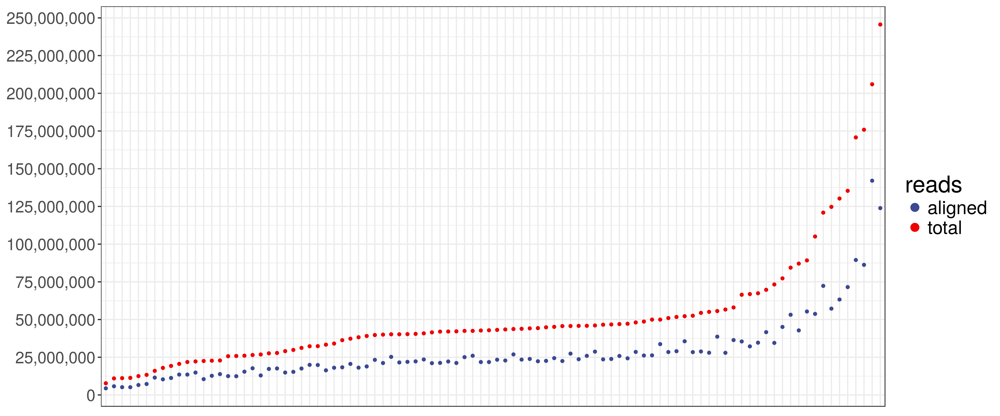
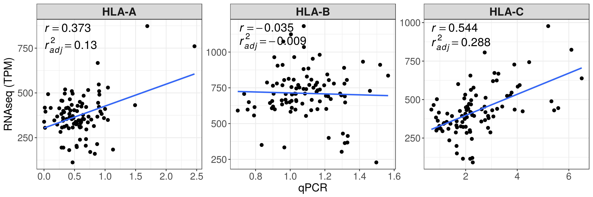
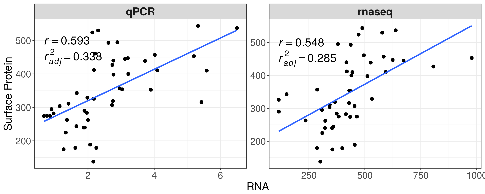
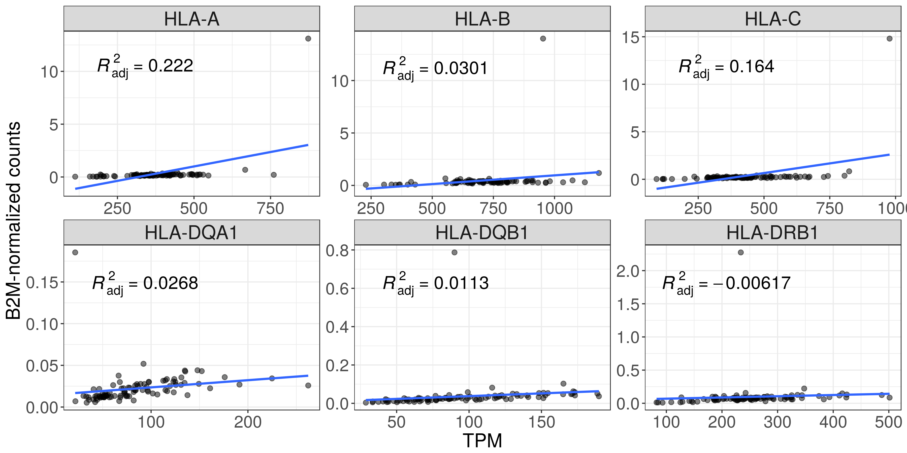
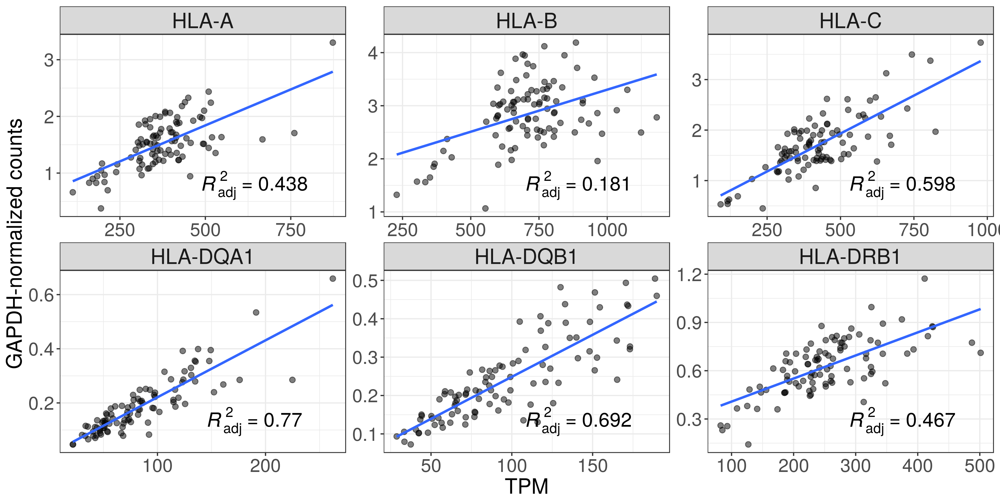
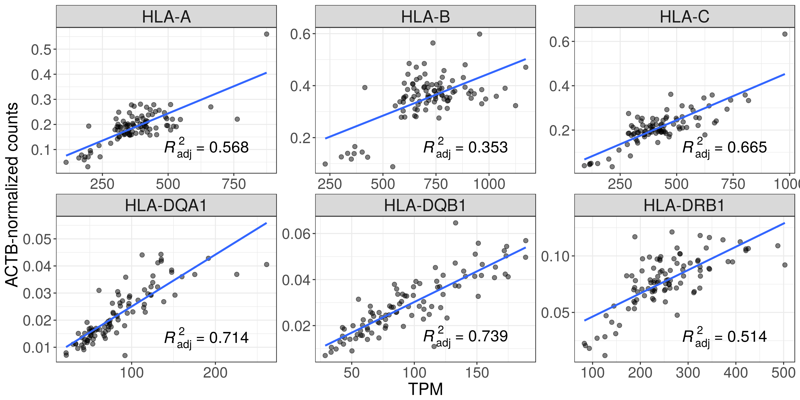
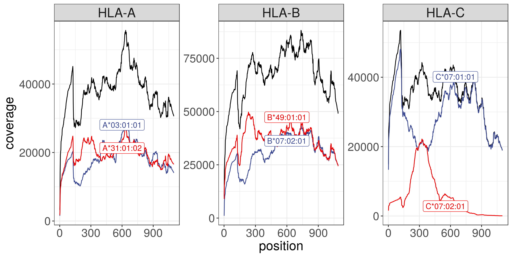
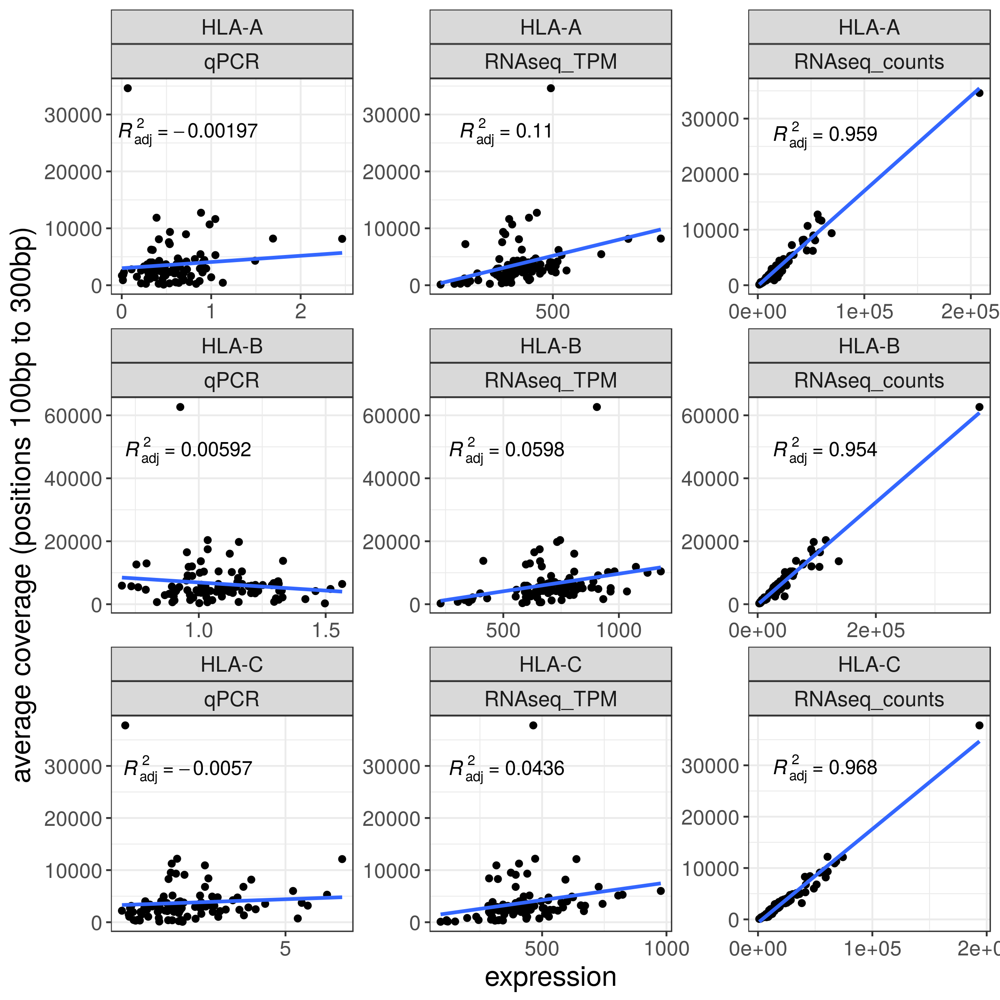
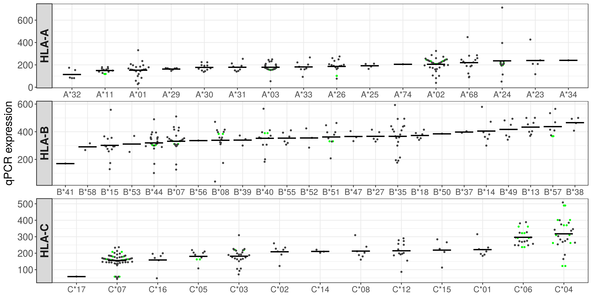
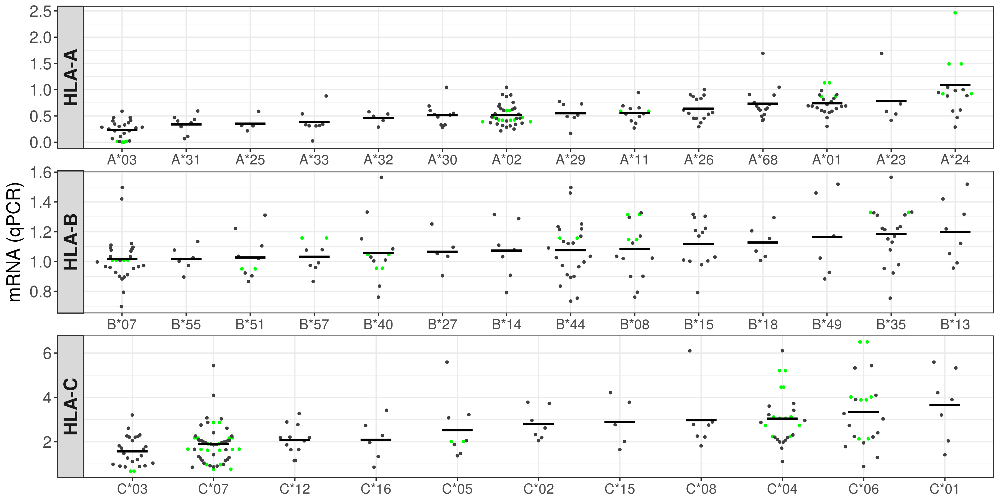

Report
================

Contrasting qPCR and RNAseq quantification of HLA class I expression
====================================================================

NCI-USP collaboration
---------------------

Document prepared by Vitor RC Aguiar and Diogo Meyer, May 26 2017
-----------------------------------------------------------------

The goal of this study was to compare two technologies used to estimate HLA expression through the quantification of mRNA. We performed an RNAseq assay on a set of 96 individuals for which qPCR expression estimates were available, and for a subset of which HLA-C antibody-based HLA cell surface expression was available.

The RNAseq assay was based on our two-step strategy, where we first virtually genotype each individual (using the full list of IMGT alleles) and then perform a second mapping where we only include the two alleles the individual carries in the aligner's index. This provides allele level expression estimates, which can be converted to locus level my summing the expression of both alleles.

Typing concordance with NCI genotyping
--------------------------------------

We first quantfied our ability to correctly genotype individuals based on the RNAseq data. Our method is quite simple, and in very general terms simply involves identifying which of the alleles in the IMGT database have more NGS reads aligning to it. The table below identifies the proportion of genotypes for which our RNAseq-based genotyping matched that reported by conventional HLA typing.

\*Concordance: the proportion of the called alleles that are concordant with the NCI typing

\*Allele calls were compared at the maximum resolution possible at each pair

| locus |  concordance|
|:------|------------:|
| HLA-A |         0.96|
| HLA-B |         0.96|
| HLA-C |         0.97|

Library Sizes
-------------

Correlation between qPCR and RNAseq expression estimates
--------------------------------------------------------

We then compared the expression level estimates between RNAseq and qPCR. There is no correlation for HLA-B, some for HLA-A, and the highest is seen for HLA-C.

HLA-C expression: RNA vs Antibody
---------------------------------

Both qPCR and RNAseq strategies have similarly low correlations with the antibody-base expression estimates.

RNAseq: TPM vs B2M-normalized counts
====================================

Sample 66K00755 has an abnormally low B2M expression

RNAseq: TPM vs GAPDH-normalized counts
======================================

RNAseq: TPM vs ACTB-normalized counts
=====================================

Coverage
========

The coverage measure is the gene-level coverage, which is the sum of the coverage at each position over the 2 alleles of a locus (black line in the plot below). It was necessary to use this measure because the allele-level coverage that comes out from kallisto is not really meaningful. For example, consider the allele C\*07:02:01 (red line in the plot below). Looking at this plot, one could say that the expression estimates from the 2 HLA-C alleles are very different, but they are actually almost the same. This allele has only 2 differences from C\*07:01:01 in exons 2 and 3. Reads aligning to the rest of the gene, where the 2 alleles are identical, are attributed to C\*07:01:01 as "primary alignment", which samtools uses to calculate coverage.

This behavior of kallisto is like the default behavior of STAR, i.e. from all alignments with the best score, choose one to be reported as primary. However, you can control this behavior in STAR, but not in kallisto.

It does not make sense to compare coverage with a normalized measure of expression, such as qPCR and TPM. For example, two samples with the same coverage at a given gene may have different TPM values, because TPM normalization depends on the mRNA composition of the sample.

On the other hand, coverage is very well correlated with kallisto's estimated counts.

RNAseq: expression estimates per lineage
----------------------------------------

Our approach also allows assigning expression level estimates to allelic lineages. We compare the lineage-level expression for RNAseq (first set of panels) and qPCR (second set of panels, using imputed expression by regression analysis as done in the NCI group papers).

RNAseq
------

qPCR
----

