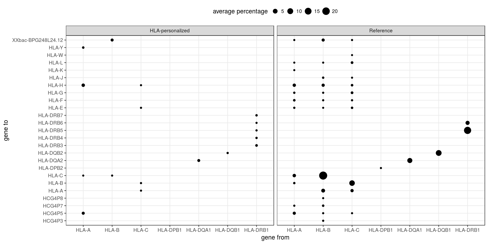
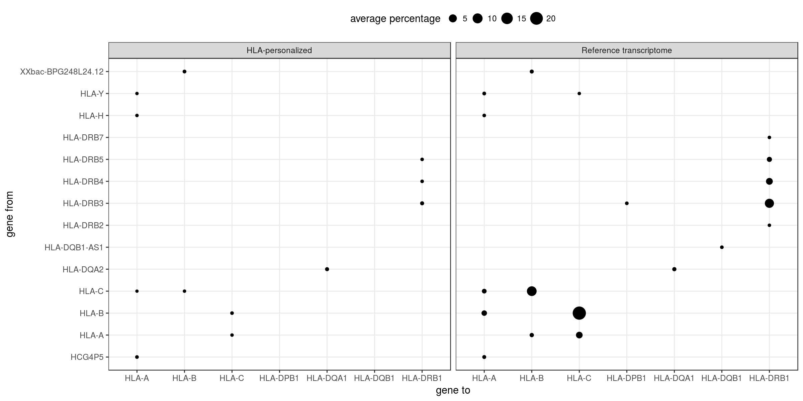

```{r setup, include=FALSE}
knitr::opts_chunk$set(echo = FALSE, message = FALSE, warning = FALSE, comment = '')
```

```{r pkgs}
library(tidyverse)
library(knitr)
```

# Notes:

Index nomenclature:

- pri: Primary assembly of the reference genome, containing the reference chromosomes and scaffolds (no alternate haplotypes)

- imgt: "pri" index supplemented with IMGT references


# kallisto

## Genotyping

```{r}
read_tsv("./PEreads_75bp/expression/kallisto/genotyping_accuracies_1.tsv") %>%
  filter(th == .05) %>%
  mutate(accuracy = accuracy * 100) %>%
  select(locus, `accuracy (%)` = accuracy) %>%
  kable(digits = 2)
```

## Expression

```{r}
include_graphics('./plots/kallisto_prop_mapped.png')
```

# STAR + Salmon

## Genotyping

```{r}
read_tsv("./PEreads_75bp/expression/star/genotyping_accuracies_1.tsv") %>%
  filter(th == .05) %>%
  mutate(accuracy = accuracy * 100) %>%
  select(locus, `accuracy (%)` = accuracy) %>%
  kable()
```

## Expression

```{r}
include_graphics("./plots/star_prop_mapped.png")
```

# Quality assessment 

## Percentage of simulated reads not aligned:

```{r}

sample_ids <- sprintf("sample_%02d", 1:50)

reads_not_aligned_imgt <- 
    file.path("./PEreads_75bp/expression/star/mappings_2",
	      sample_ids, "reads_not_aligned_hla.tsv") %>%
    setNames(sample_ids) %>%
    map_df(read_tsv, .id = "subject") %>%
    group_by(gene_from) %>%
    summarize(perc = mean(perc)) %>%
    ungroup()

reads_not_aligned_pri <- 
    file.path("./PEreads_75bp/expression/star/mappings_PRI",
	      sample_ids, "reads_not_aligned_hla.tsv") %>%
    setNames(sample_ids) %>%
    map_df(read_tsv, .id = "subject") %>%
    group_by(gene_from) %>%
    summarize(perc = mean(perc)) %>%
    ungroup()

left_join(reads_not_aligned_imgt, reads_not_aligned_pri, by = "gene_from",
	  suffix = c(".imgt", ".pri")) %>% 
kable(digits = 2)
```

## Percentage of aligned reads which map to a different gene:


```{r}

```


# Percentage of aligned reads gained by each HLA gene from other gene

```{r}

```


# Comparisons between indices and aligners

## kallisto vs STAR-Salmon; HLA-diversity index

### TPM

```{r}
include_graphics("./plots/kallisto_vs_star_TPM.png")
```

### PCA-corrected expression

```{r} 
include_graphics("./plots/kallisto_vs_star_10pc.png")
```

## kallisto vs STAR-Salmon; Reference chromosomes only

### TPM

```{r}
include_graphics("./plots/kallisto_vs_star_PRI_TPM.png")
```

### PCA-corrected expression

```{r} 
include_graphics("./plots/kallisto_vs_star_PRI_10pc.png")
```

## kallisto; HLA-diversity vs Reference chromosomes only

### TPM

```{r}
include_graphics("./plots/kallisto_imgt_vs_PRI_TPM.png")
```

### PCA-corrected expression

```{r}
include_graphics("./plots/kallisto_imgt_vs_PRI_10pc.png")
```

## STAR-Salmon; HLA-diversity vs Reference chromosomes only

### TPM 

```{r}
include_graphics("./plots/star_imgt_vs_PRI_TPM.png")
```

### PCA-corrected expression

```{r}
include_graphics("./plots/star_imgt_vs_PRI_10pc.png")
```
