```{r setup, include=FALSE}
knitr::opts_chunk$set(echo = FALSE, message = FALSE, warning = FALSE, comment = '')
```

```{r pkgs}
library(tidyverse)
library(knitr)
```

# kallisto

## Genotyping

```{r}
read_tsv("./expression/kallisto/genotyping_accuracies.tsv") %>%
  filter(th == .05) %>%
  mutate(accuracy = accuracy * 100) %>%
  select(locus, `accuracy (%)` = accuracy) %>%
  kable()
```

## Expression

```{r}
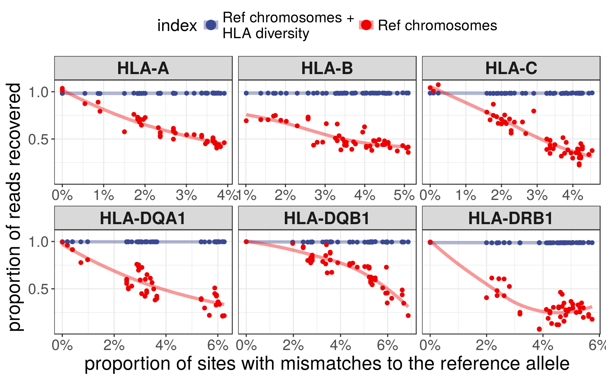
```

# STAR + Salmon

## Genotyping

```{r}
read_tsv("./expression/star/genotyping_accuracies.tsv") %>%
  filter(th == .05) %>%
  mutate(accuracy = accuracy * 100) %>%
  select(locus, `accuracy (%)` = accuracy) %>%
  kable()
```

## Expression

```{r}
include_graphics("./plots/star_prop_mapped.png")
```

# Quality assessment 

Percentage of simulated reads not aligned:

```{r}
read_tsv("./reads_not_aligned_hla.tsv") %>% kable()
```

Percentage of simulated reads from each HLA gene that aligned to a different reference:

```{r}
read_tsv("./reads_false_neg_hla.tsv") %>% kable()
```

Percentage of simulated reads gained by each HLA gene (reads simulated from other references)

```{r}
read_tsv("./reads_false_pos_hla.tsv") %>% kable()
```

# Comparisons between indices and aligners

## kallisto vs STAR-Salmon; HLA-diversity index

### Counts

```{r}
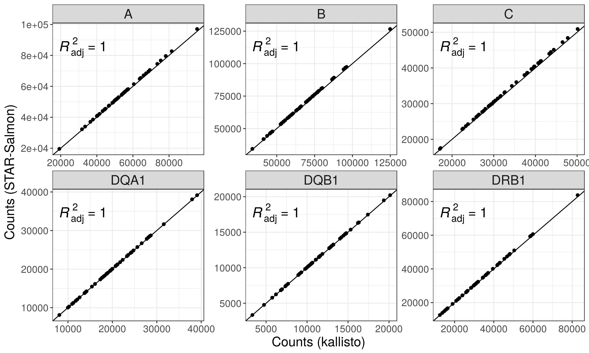
```

### TPM

```{r}
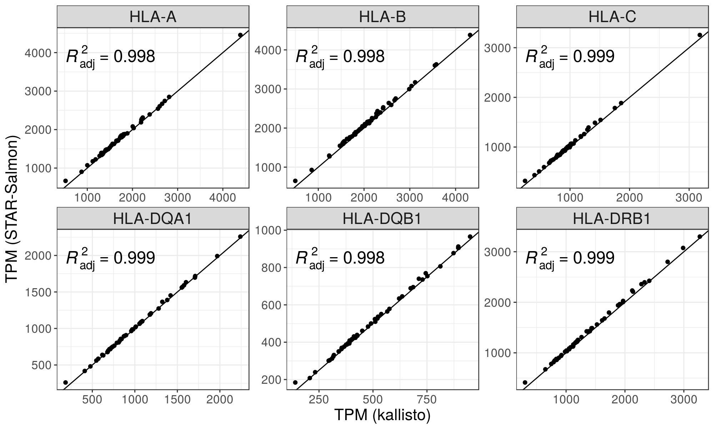
```

### PCA-corrected expression

```{r} 
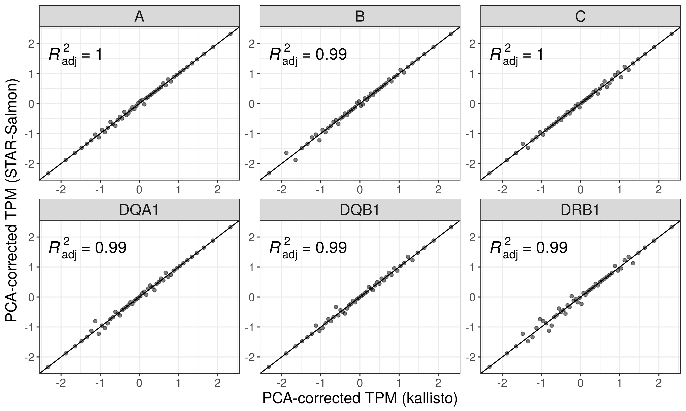
```

## kallisto vs STAR-Salmon; Reference chromosomes only

### Counts

```{r}
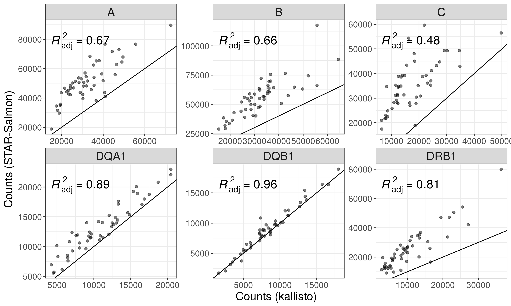
```

### TPM

```{r}
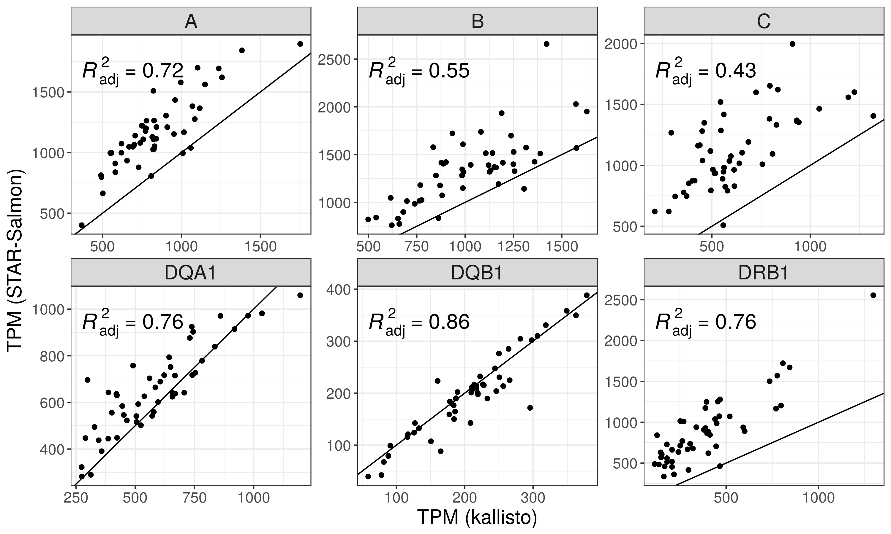
```

### PCA-corrected expression

```{r} 
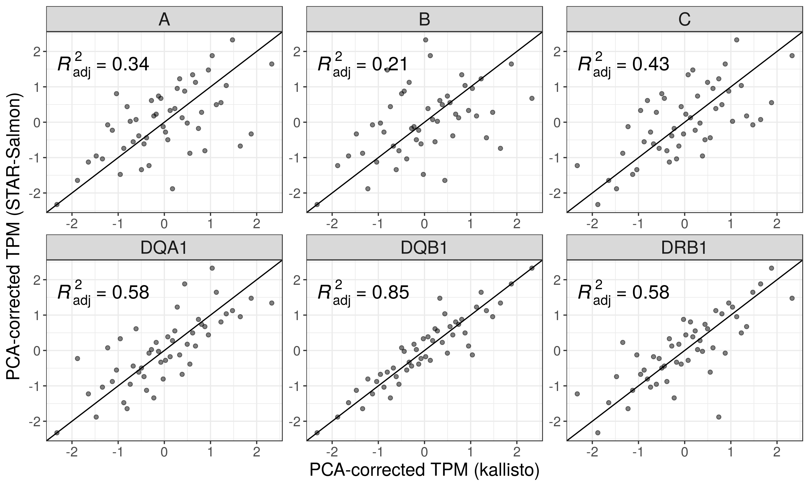
```

## kallisto; HLA-diversity vs Reference chromosomes only

### Counts

```{r}
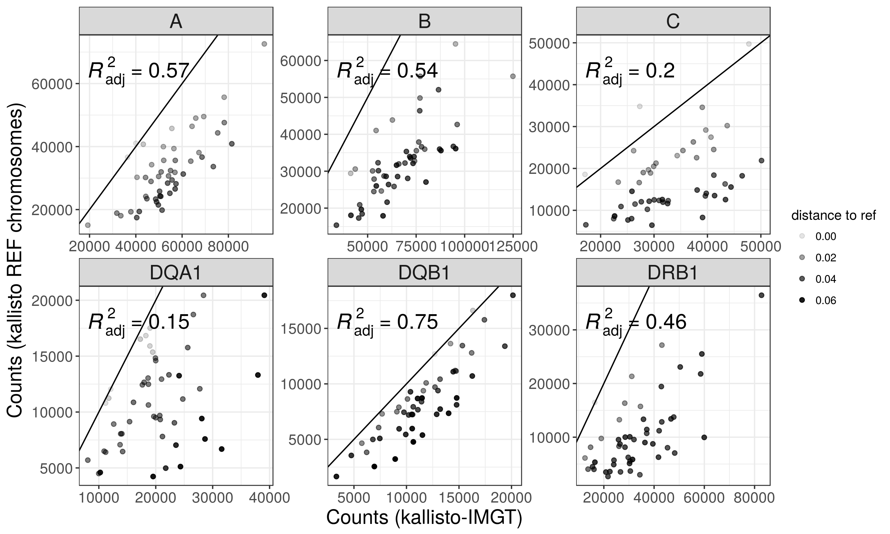
```

### TPM

```{r}
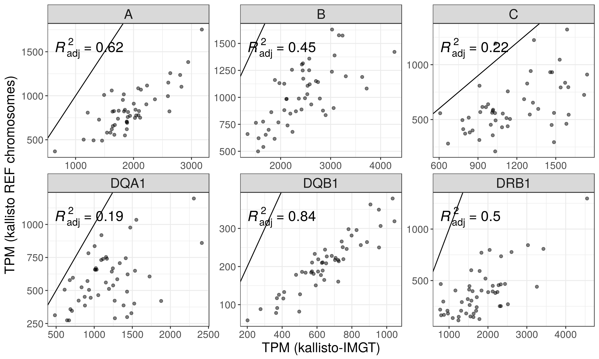
```

### PCA-corrected expression

```{r}
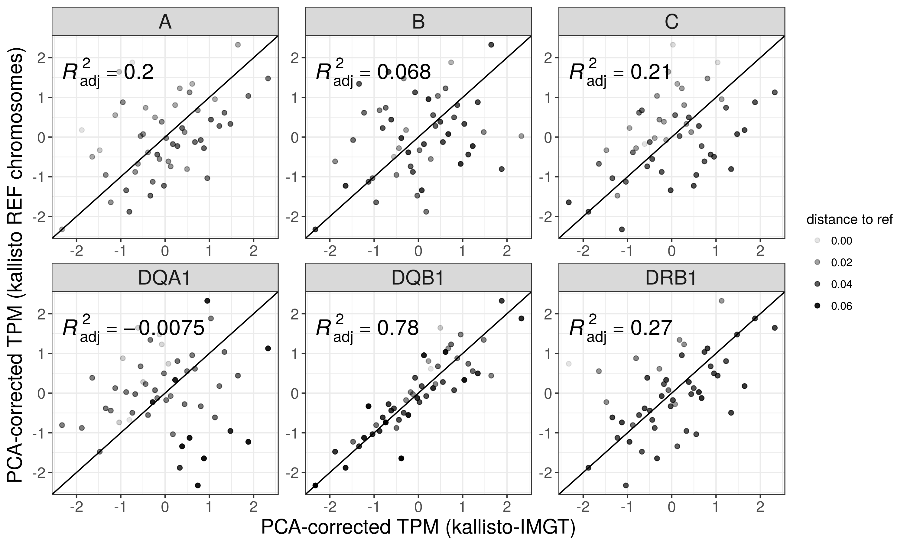
```

## STAR-Salmon; HLA-diversity vs Reference chromosomes only

### Counts

```{r}
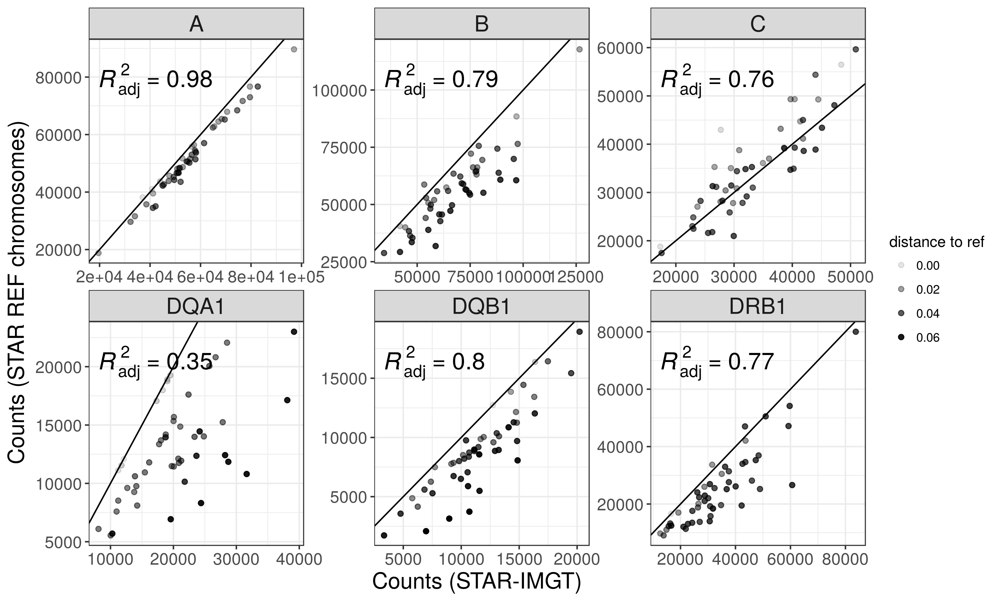
```

### TPM 

```{r}
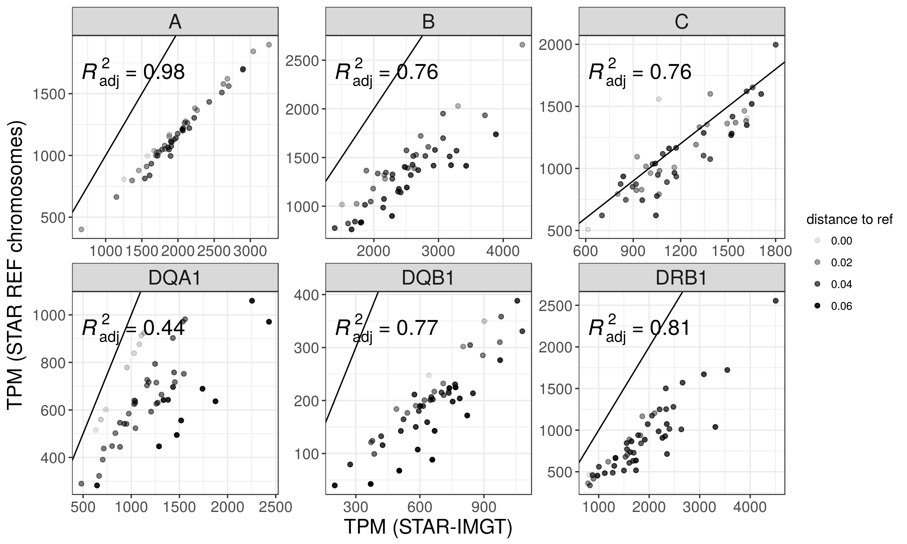
```

### PCA-corrected expression

```{r}
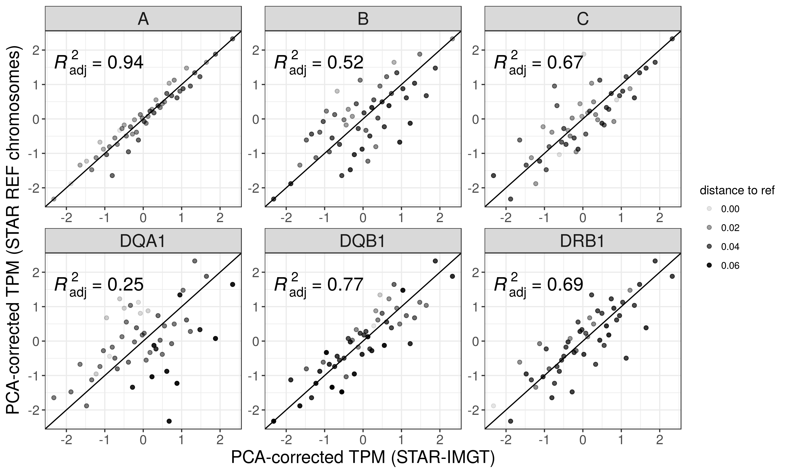
```

# Varying the mismatch threshold in the alignment to REF chromosomes

## TPM

```{r}
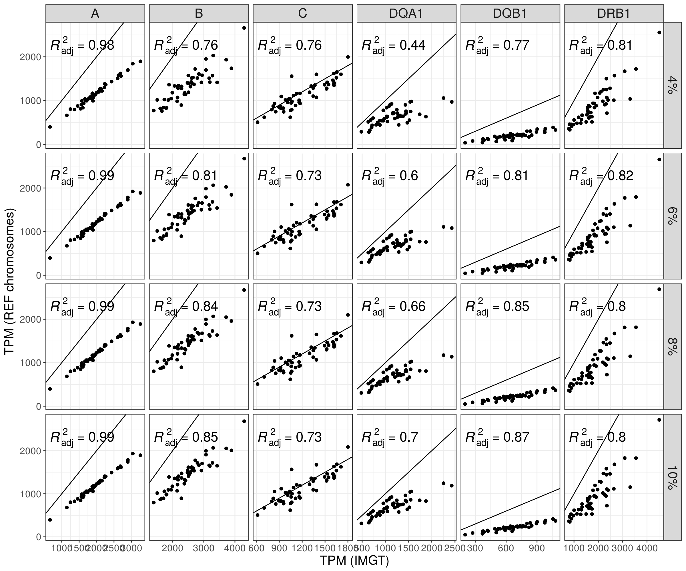
```

## PCA-corrected expression

```{r}
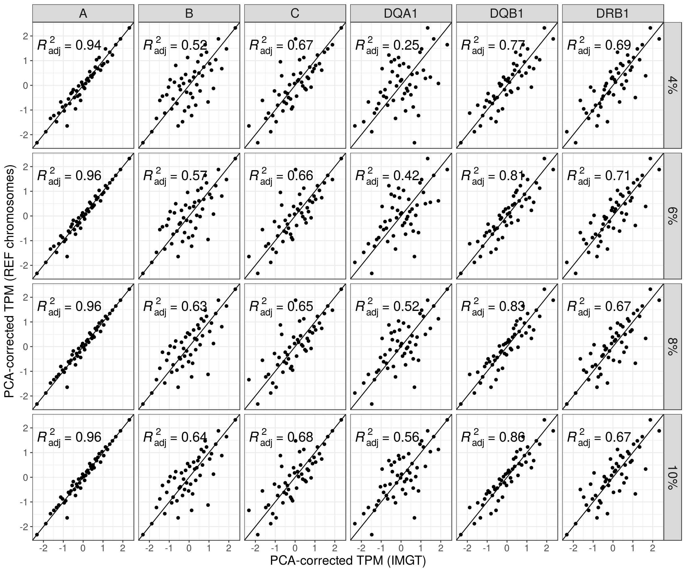
```

# Mean Absolute Relative Difference

Relative difference is =

- 0 if x~i~ = y~i~ = 0 

- |x~i~ - y~i~| / x~i~ + y~i~ otherwise

, where x~i~ and y~i~ are the true and estimated gene counts respectively.
Then I take the mean over all genes, obtaining a value of MRD for each sample.

```{r}
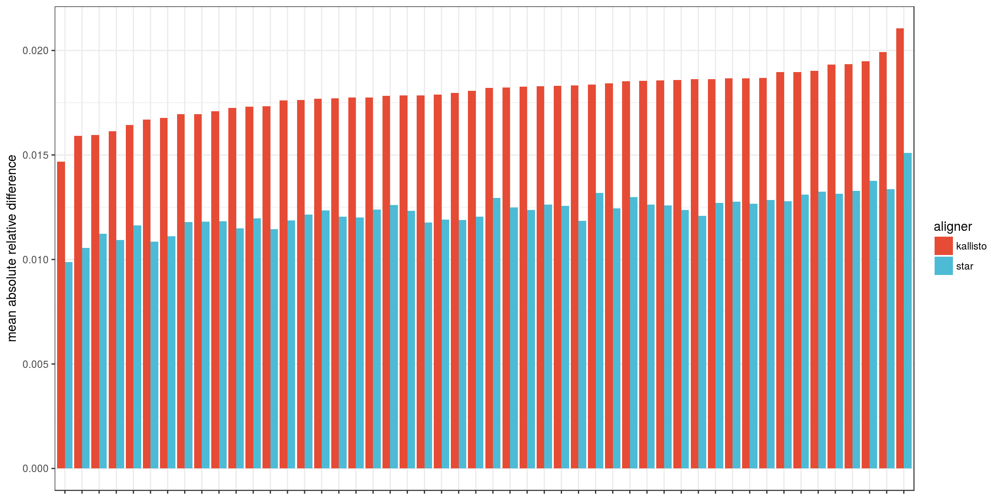
```

