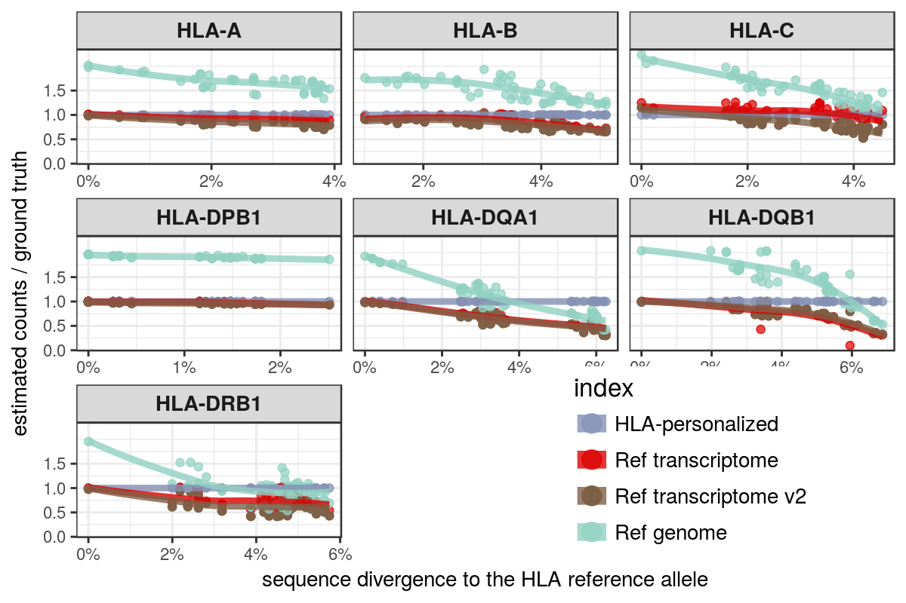
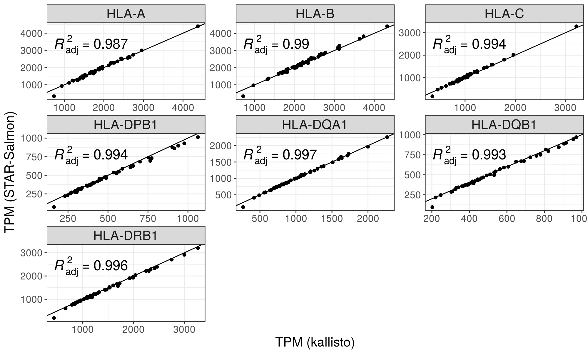
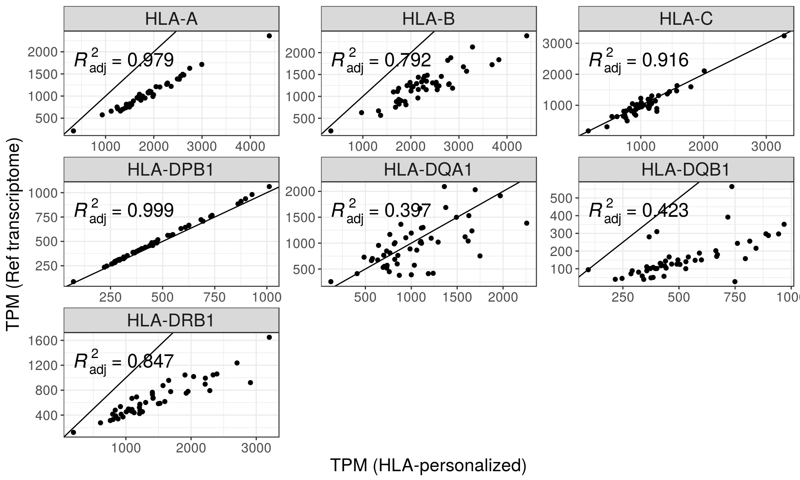

```{r setup, include=FALSE}
knitr::opts_chunk$set(echo = FALSE, message = FALSE, warning = FALSE, comment = '')
```

```{r pkgs}
library(tidyverse)
library(knitr)
```

# Genotyping


- Threshold of least expressed/most expressed = 0.05

```{r}
read_tsv("./PEreads_75bp/expression/star/supplemented/genotyping_accuracies_1.tsv") %>%
  filter(th == .05) %>%
  mutate(accuracy = accuracy * 100) %>%
  select(locus, `accuracy (%)` = accuracy) %>%
  kable()
```

There are 7 mistypings for HLA-DPB1. In all of them, the true allele was
DPB1\*04:01:01, but a DPB1\*126:01:01 was called instead. These 2 alleles are
different only at position 619 of the CDS (end of exon 3). We need to
investigate this issue.


# Expression

## Pipelines:

- Ref Genome: primary assembly of reference genome GRCh38; mapped with STAR --quantMode GeneCounts
- Ref transcriptome: reads mapped to Ref Genome with STAR, which creates alignments to transcripts given Gencode annotations; quantified with Salmon
- HLA-personalized: Rescue of MHC-mapped and unmapped reads from the Ref Genome, alignment to MHC transcriptome supplemented with IMGT to infer HLA types, and final round of quantification of the whole-transcriptome supplemented with IMGT using Salmon

```{r}

```

# Comparisons between indices and aligners

## kallisto vs STAR-Salmon; HLA-diversity index

```{r}

```

## STAR-Salmon; HLA-personalized vs Reference transcriptome

```{r}

```
