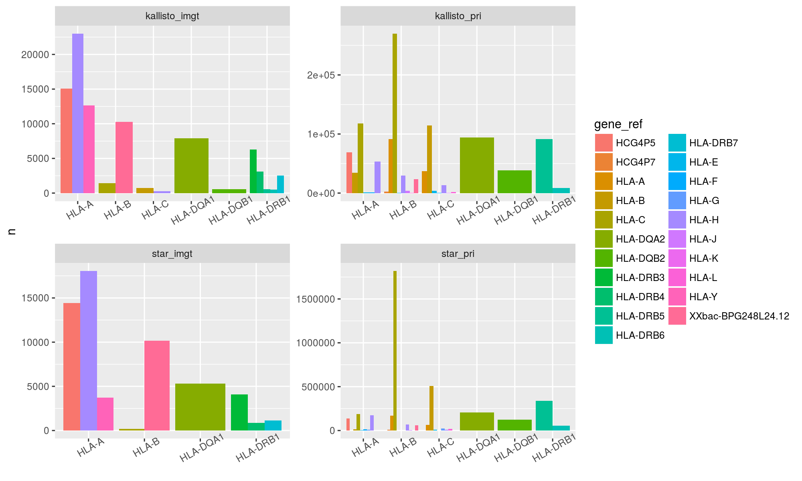
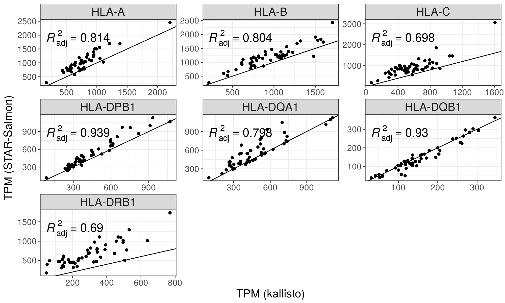
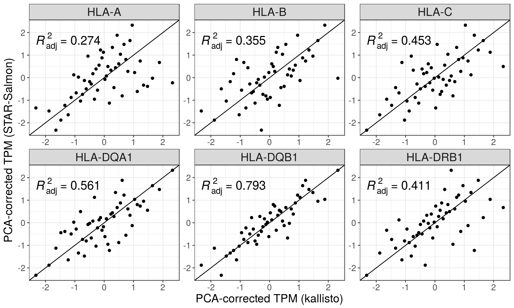
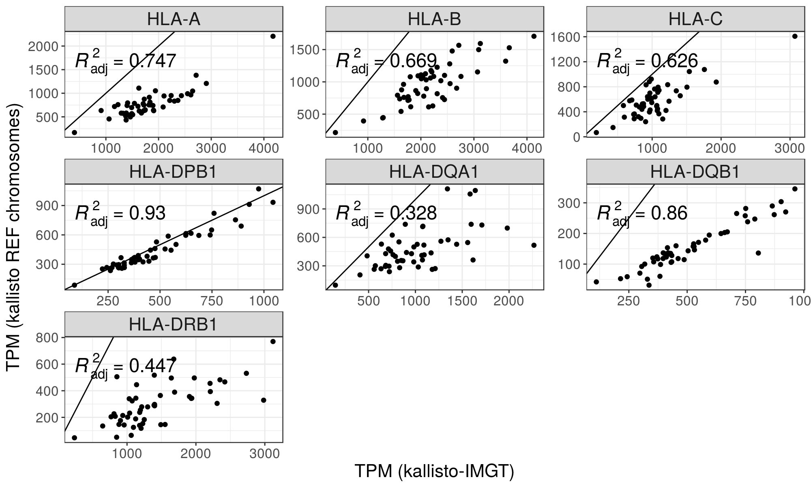
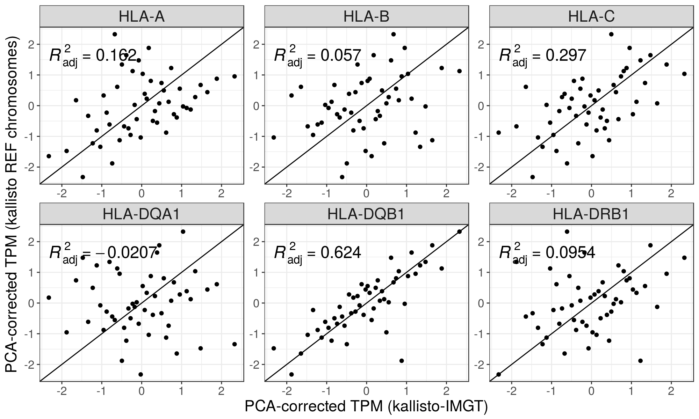
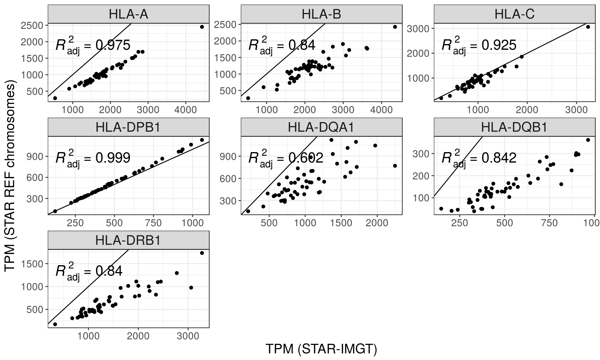
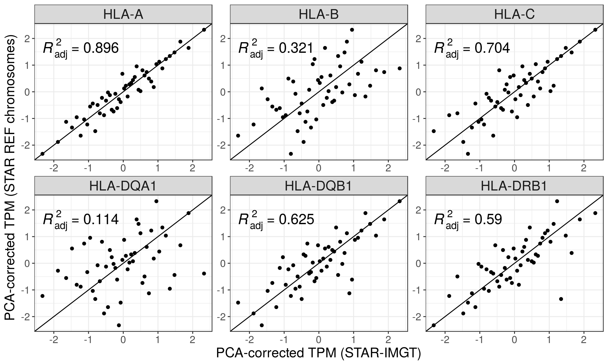

```{r setup, include=FALSE}
knitr::opts_chunk$set(echo = FALSE, message = FALSE, warning = FALSE, comment = '')
```

```{r pkgs}
library(tidyverse)
library(knitr)
```

# Notes:

Index nomenclature:

- pri: Primary assembly of the reference genome, containing the reference chromosomes and scaffolds (no alternate haplotypes)

- imgt: "pri" index supplemented with IMGT references


# kallisto

## Genotyping

```{r}
read_tsv("./expression/kallisto/genotyping_accuracies_1.tsv") %>%
  filter(th == .05) %>%
  mutate(accuracy = accuracy * 100) %>%
  select(locus, `accuracy (%)` = accuracy) %>%
  kable(digits = 2)
```

## Expression

```{r}
include_graphics('./plots/kallisto_prop_mapped.png')
```

# STAR + Salmon

## Genotyping

```{r}
read_tsv("./expression/star/genotyping_accuracies_1.tsv") %>%
  filter(th == .05) %>%
  mutate(accuracy = accuracy * 100) %>%
  select(locus, `accuracy (%)` = accuracy) %>%
  kable()
```

## Expression

```{r}
include_graphics("./plots/star_prop_mapped.png")
```

# Quality assessment 

Percentage of simulated reads not aligned:

```{r}
read_tsv("./expression/reads_not_aligned_hla.tsv") %>% kable(digits = 2)
```

Percentage of simulated reads from each HLA gene that aligned to a different
reference:

```{r}
read_tsv("./expression/reads_false_neg_hla.tsv") %>% kable(digits = 2)
```

The plot below shows where the reads simulated from a HLA gene (x-axis) are
mapped when they aligned to a different reference.

The dot diameters represent the average percentage of mappings across all 
individuals.


```{r}

```


Percentage of simulated reads gained by each HLA gene (reads simulated from
other references)

```{r}
read_tsv("./expression/reads_false_pos_hla.tsv") %>% kable(digits = 2)
```

# Comparisons between indices and aligners

## kallisto vs STAR-Salmon; HLA-diversity index

### TPM

```{r}
include_graphics("./plots/kallisto_vs_star_TPM.png")
```

### PCA-corrected expression

```{r} 
include_graphics("./plots/kallisto_vs_star_10pc.png")
```

## kallisto vs STAR-Salmon; Reference chromosomes only

### TPM

```{r}

```

### PCA-corrected expression

```{r} 

```

## kallisto; HLA-diversity vs Reference chromosomes only

### TPM

```{r}

```

### PCA-corrected expression

```{r}

```

## STAR-Salmon; HLA-diversity vs Reference chromosomes only

### TPM 

```{r}

```

### PCA-corrected expression

```{r}

```
