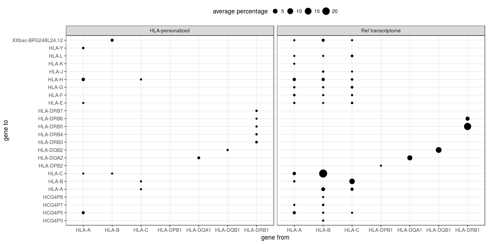
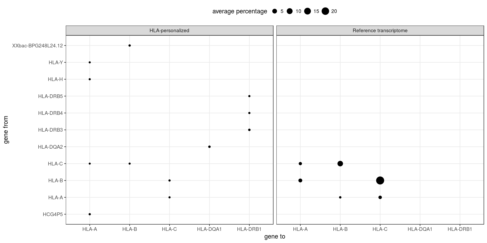

```{r setup, include=FALSE}
knitr::opts_chunk$set(echo = FALSE, message = FALSE, warning = FALSE, comment = '')
```

```{r pkgs}
library(tidyverse)
library(knitr)
```

# Genotyping

```{r}
read_tsv("./PEreads_75bp/expression/star/supplemented/genotyping_accuracies_1.tsv") %>%
  filter(th == .05) %>%
  mutate(accuracy = accuracy * 100) %>%
  select(locus, `accuracy (%)` = accuracy) %>%
  kable()
```

# Expression

## Pipelines:

- Ref Genome: primary assembly of reference genome GRCh38; mapped with STAR, quantified with QTLtools quan
- Ref transcriptome: transcripts from Ref Genome; mapped with STAR, quantified with Salmon
- Ref transcriptome v2: reads mapped to Ref Genome with STAR, which creates alignments to transcripts given Gencode annotations; quantified with Salmon
- HLA-personalized: Ref transcriptome where HLA transcripts were replace by IMGT CDS sequences; mapped with STAR, quantified with Salmon


```{r}
include_graphics("./plots/star_prop_mapped.png")
```

**Note 1**
To check: there is something strange about the genomic mappings above.

**Note 2**
I also tried an alternative to replace the inefficient and time-consuming 1st
round of the HLA-personalized pipeline. It consists in:

1. Map to the genome, and filter the reads mapping to HLA-A, -C, -B, -DRB1, -DQA1, -DQB1 and -DPB1, or unmapped. 
2. Map these reads to the IMGT portion only.
3. Quantify with Salmon.
4. Type the HLA.

It works OK if I only filter for reads mapping to the genes described in step 1.
However, if I filter reads mapping to all IMGT loci, step 2 fails for some
reason. I need time to explore more this issue.

If this alternative works, it would save a lot of time, and allow people to use
already existing BAM files.

The relevance of including all IMGT loci is that we could type and have better
quantifications for them all. Our current pipeline does that.


# Quality assessment 

## Percentage of simulated reads not aligned, aligned exclusively to a different reference, or aligned to original reference but as a multimap

```{r}
sample_ids <- sprintf("sample_%02d", 1:50)

read_summary_imgt <- 
    file.path("./PEreads_75bp/expression/star/supplemented/mappings_2",
	      sample_ids, "read_summary_hla.tsv") %>%
    setNames(sample_ids) %>%
    map_df(read_tsv, .id = "subject") %>%
    group_by(gene_from) %>%
    summarize_at(vars(perc_not_aligned:perc_aligned_to_original_uniquely), mean) %>%
    ungroup()

read_summary_pri <- 
    file.path("./PEreads_75bp/expression/star/transcriptome/mappings",
	      sample_ids, "read_summary_hla.tsv") %>%
    setNames(sample_ids) %>%
    map_df(read_tsv, .id = "subject") %>%
    group_by(gene_from) %>%
    summarize_at(vars(perc_not_aligned:perc_aligned_to_original_uniquely), mean) %>%
    ungroup()

list("HLA-personalized" = read_summary_imgt, 
     "Ref transcriptome" = read_summary_pri) %>%
bind_rows(.id = "index") %>%
arrange(gene_from, index) %>%
gather(category, value, -(1:2)) %>%
spread(index, value) %>%
mutate(category = recode(category, 
			 perc_aligned_to_original_multimap = "mapped to original gene as multimap",
			 perc_aligned_to_original_uniquely = "uniquely mapping",
			 perc_not_aligned = "unmapped",
			 perc_not_aligned_to_original =  "mapped but not to original gene")) %>%
rename(`reads (%)` = category) %>%
kable(digits = 2)
```

To further understand the read "loss" or "gain" we examined, for each HLA gene,
the percentage of alignments stratified by mapped or source gene, respectively.

The size of each point in the plots below represents the percentage of
alignments involving that gene pair.


### Percentage of aligments involving reads lost by an HLA gene in x to some other gene in y:

```{r}

```

### Percentage of alignments involving reads gained by an HLA gene in x from some other gene in y:

```{r}

```


# Comparisons between indices and aligners

## kallisto vs STAR-Salmon; HLA-diversity index

```{r}
include_graphics("./plots/kallisto_vs_star.png")
```

## STAR-Salmon; HLA-personalized vs Reference transcriptome

```{r}
include_graphics("./plots/star_HLA_vs_refTranscriptome.png")
```

# Isoforms

The simulation above is idealized in the sense that reads are generated from the
coding sequences and mapped back to them. However, real transcription occurs via
mRNA transcripts, containing UTRs and different combinations of exons.

In order to evaluate the performance of the HLA-supplemented index to map the
isoforms, we simulated reads from the hypothetical homozygote individual for the
reference HLA alleles at the 7 HLA loci. Ground truth isoform counts were based
on the estimated counts for the individual NA20508 quantified with the Ref
transcriptome index (protein coding transcripts only).

We see a reduction in expression in the TPM estimate for HLA-DQA1. 

```{r}
x <- read_tsv("./PEreads_75bp/isoforms/results.tsv")

kable(x, digits = 3)
```

I tested versions of the index (1) including the UTRs or (2) trimming the index 
to 750bp, but they do not solve the problem (data not shown).

The problem is likely caused by shorter isoforms. When they are abundant, there
is a underestimation of the gene TPMs, because normalization is done by a longer
length (CDS).

If I don't filter for protein coding transcripts only, I also see a reduction
for DQB1.
