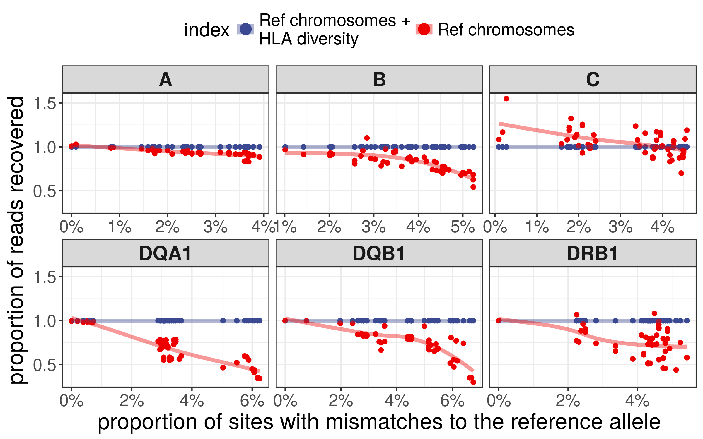

Report
================

kallisto
========

Genotyping
----------

| locus |  accuracy (%)|
|:------|-------------:|
| A     |           100|
| B     |           100|
| C     |           100|
| DQA1  |           100|
| DQB1  |           100|
| DRB1  |           100|

Expression
----------

STAR + Salmon
=============

Genotyping
----------

| locus    |  accuracy (%)|
|:---------|-------------:|
| HLA-A    |           100|
| HLA-B    |           100|
| HLA-C    |           100|
| HLA-DQA1 |           100|
| HLA-DQB1 |           100|
| HLA-DRB1 |           100|

Expression
----------

Quality assessment
==================

Percentage of simulated reads not aligned:

| gene\_read |  kallisto|  star|
|:-----------|---------:|-----:|
| HLA-A      |      2.44|     0|
| HLA-B      |      2.35|     0|
| HLA-C      |      2.47|     0|
| HLA-DQA1   |      1.23|     0|
| HLA-DQB1   |      1.41|     0|
| HLA-DRB1   |      2.11|     0|

Percentage of simulated reads from each HLA gene that aligned to a different reference:

| gene\_read |  kallisto|  star|
|:-----------|---------:|-----:|
| HLA-A      |      2.32|  1.66|
| HLA-B      |      0.32|  0.20|
| HLA-C      |      0.08|  0.01|
| HLA-DQA1   |      0.66|  0.40|
| HLA-DQB1   |      0.05|  0.01|
| HLA-DRB1   |      0.93|  0.41|

Percentage of simulated reads gained by each HLA gene (reads simulated from other references)

| gene\_ref |  kallisto|  star|
|:----------|---------:|-----:|
| HLA-A     |      0.03|  0.02|
| HLA-B     |      0.03|  0.01|
| HLA-C     |      0.11|  0.02|
| HLA-DQA1  |      0.04|  0.03|
| HLA-DQB1  |      0.00|  0.00|
| HLA-DRB1  |      0.10|  0.05|
