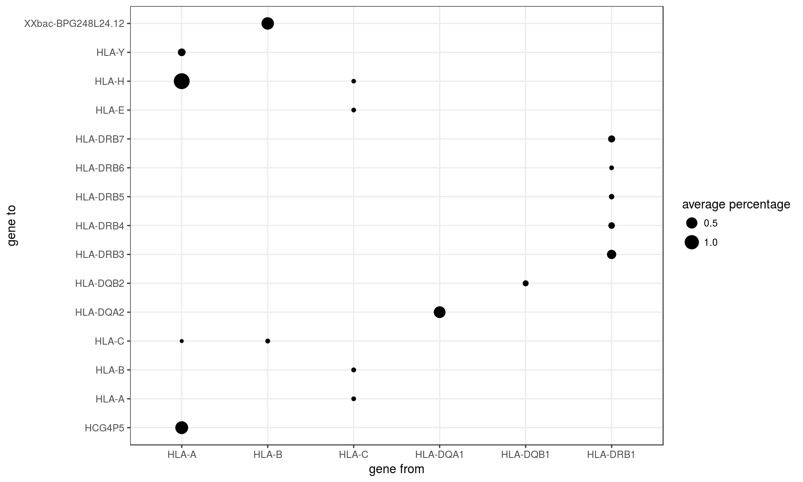
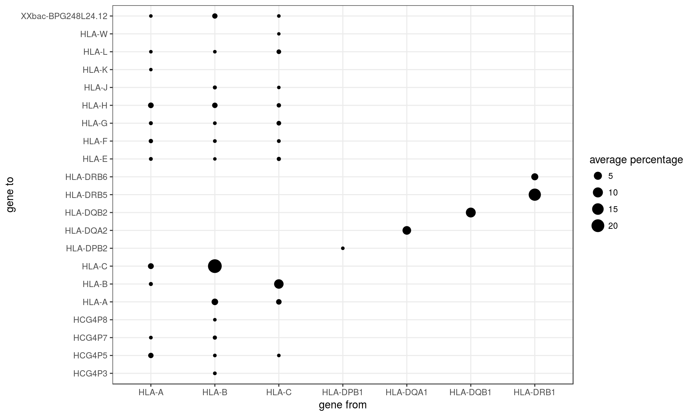
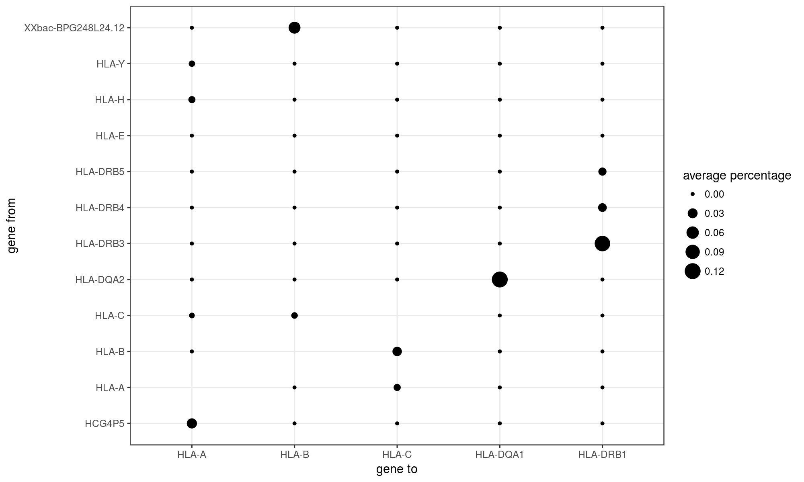
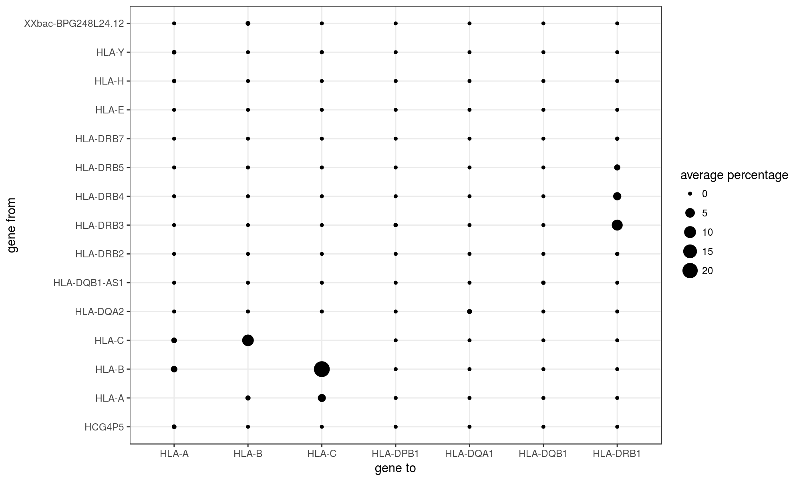

Report
================

Notes:
======

Index nomenclature:

-   pri: Primary assembly of the reference genome, containing the reference chromosomes and scaffolds (no alternate haplotypes)

-   imgt: "pri" index supplemented with IMGT references

kallisto
========

Genotyping
----------

| locus    |  accuracy (%)|
|:---------|-------------:|
| HLA-A    |           100|
| HLA-B    |           100|
| HLA-C    |           100|
| HLA-DPB1 |            91|
| HLA-DQA1 |           100|
| HLA-DQB1 |           100|
| HLA-DRB1 |           100|

Expression
----------

STAR + Salmon
=============

Genotyping
----------

| locus    |  accuracy (%)|
|:---------|-------------:|
| HLA-A    |           100|
| HLA-B    |           100|
| HLA-C    |           100|
| HLA-DPB1 |            92|
| HLA-DQA1 |           100|
| HLA-DQB1 |           100|
| HLA-DRB1 |           100|

Expression
----------

Quality assessment
==================

Percentage of simulated reads not aligned:
------------------------------------------

| gene\_from |  perc.imgt|  perc.pri|
|:-----------|----------:|---------:|
| HLA-A      |          0|      0.76|
| HLA-B      |          0|      3.55|
| HLA-C      |          0|      0.89|
| HLA-DPB1   |          0|      0.67|
| HLA-DQA1   |          0|      4.75|
| HLA-DQB1   |          0|      5.27|
| HLA-DRB1   |          0|      7.88|

Percentage of aligned reads which map to a different gene:
----------------------------------------------------------

### HLA-suplemented Index

### Reference transcriptome Index

Percentage of aligned reads gained by each HLA gene from other gene
===================================================================

### HLA-suplemented Index

### Reference transcriptome Index

Comparisons between indices and aligners
========================================

kallisto vs STAR-Salmon; HLA-diversity index
--------------------------------------------

### TPM

### PCA-corrected expression

kallisto vs STAR-Salmon; Reference chromosomes only
---------------------------------------------------

### TPM

### PCA-corrected expression

kallisto; HLA-diversity vs Reference chromosomes only
-----------------------------------------------------

### TPM

### PCA-corrected expression

STAR-Salmon; HLA-diversity vs Reference chromosomes only
--------------------------------------------------------

### TPM

### PCA-corrected expression

